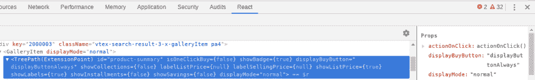
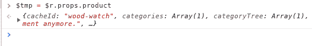
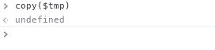

# 如何在 react 开发工具中复制道具

> 原文：<https://dev.to/fannyvieira/how-to-copy-props-in-react-dev-tools-7d7>

今天，当我在处理一个 bug 时，我发现自己需要复制一个 React 组件的道具，所以我意识到 react dev 工具没有这个功能，经过一些搜索，我找到了解决方案。

感谢尤金，react dev tools 有了一个[非常简单的解决方案](https://dev.to/karataev/comment/apgk)

1.  在浏览器中打开 [ReactDevTools](https://chrome.google.com/webstore/detail/react-developer-tools/fmkadmapgofadopljbjfkapdkoienihi?hl=en)
2.  选择包含道具的组件，因为你需要复制(当你这样做的时候，浏览器会创建一个变量来保存你点击的组件，通常名字是$r) 
3.  打开控制台，将道具保存在另一个变量
4.  使用复制法和“别担心，开心点！“像我一样的:D。

Cheers! 😗 😗 ❤️