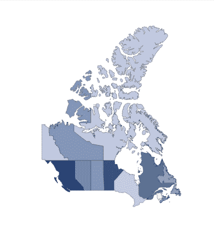

# 如何在 React 中创建 choropleth 地图或地理热图

> 原文：<https://dev.to/webdevraj/how-to-create-a-choropleth-map-or-geographic-heatmap-in-react-23bm>

 地图是一种专题地图，其中的区域根据地图上显示的统计变量(如人口密度或人均收入)的测量值按比例绘制阴影或图案。在本指南中，我们将创建加拿大的 Choropleth 地图，但它也可以用作创建任何国家的类似地图的指南。为此，我们将使用数据地图。我假设你熟悉 React。

1.  #### 使用 create-react-app 创建一个新项目

    `$ create-react-app map-example`

    进入项目文件夹并启动开发服务器-

    `$ cd map-example
    $ yarn start`
2.  #### 使用 yarn 或 npm 安装数据映射

    Datamaps 旨在提供一些基于地理数据的数据可视化。它是基于 SVG 的，可以扩展到任何屏幕尺寸，并且包括一个脚本文件中的所有内容。它严重依赖于令人惊叹的 D3.js 库。

    `$ yarn add datamaps`
3.  #### 获取需要创建地图的国家的 topoJson 文件

    topoJson 文件包含绘制国家地图的几何数据。要获取特定国家的 TopoJson 文件，请按照下列步骤操作:

    *   前往[https://github.com/markmarkoh/datamaps/tree/master/dist](https://github.com/markmarkoh/datamaps/tree/master/dist)
    *   找到数据地图。{xyz}。国家 xyz 的 js 文件。xyz 是任何国家的 3 字符代码。由于我们正在为加拿大创建地图，我们将在上面的存储库中找到名为 datamaps.can.js 的文件(“can”是加拿大的 3 个字符的代码)。
    *   复制文件内容并将其粘贴到浏览器控制台中(在浏览器中按 F12 可以打开控制台)。
    *   在浏览器中运行上述代码后，执行以下代码。

        `copy(Datamap.prototype.canTopo);`

        它会将 Datamap.prototype.canTopo 函数返回的数据复制到剪贴板。(如果您正在创建另一个国家的地图，您可以将“can”替换为任何其他国家代码)。

    *   在项目文件夹的 src/components 目录下创建一个名为 Canada.topo.json 的新文件。
    *   Paste the contents copied from the browser console. If the state codes contains dot(.) in the topo json, then you need to remove the dot from the code e.g, if your state code is CA.AL, remove CA. part to get 2-digit ISO code AL. If the states code are already in 2-digit ISO or do’t have dot(.) then don’t do any modification follow next steps. Objects country name in {xyz}.topo.json should be same as we have declared in the Datamap scope. e.g, for Canada, in canada.topo.json we have `{“type”:”Topology”,
        “objects”:{“can”:{“type”:”GeometryCollection”}}}`

        在下一步中，我们在地图组件中提供了“加拿大”范围。因此，canada.topo.json 中的“can”必须是“canada ”,即

        `{“type”:”Topology”,
        “objects”:{“canada”:{“type”:”GeometryCollection”}}}`
4.  #### 创建 ChoroplethMap 组件

    这将是在 DOM 中呈现 choropleth 地图(或地理热图)的组件。
    在项目文件夹的 src/components 目录下创建一个名为 ChoroplethMap.js 的新文件。
    文件的内容应该如下-