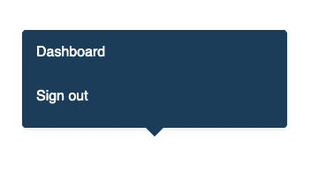
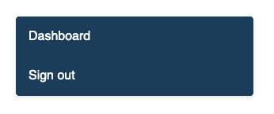
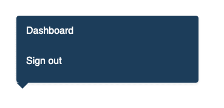
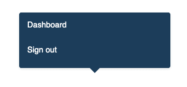
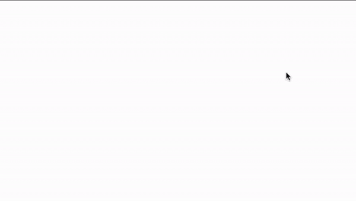

# 如何在 CSS 中创建对话框界面

> 原文：<https://dev.to/jakzaizzat/how-to-create-a-dialog-interface-in-css-2bdh>

[](https://res.cloudinary.com/practicaldev/image/fetch/s--14Oi_SYK--/c_limit%2Cf_auto%2Cfl_progressive%2Cq_auto%2Cw_880/https://jakzaizzat.com/wp-content/uploads/2019/05/Screenshot-2019-05-06-at-3.55.40-AM.png)

我们想创建一个有多个列表项的对话框界面。首先，我们先构建列表项，用一个带有类**对话框**的 div 包装它。

HTML

```
<div class="dialog">
    <ul>
        <li>
          <a href="#">Dashboard</a>
        </li>
        <li>
            <a href="#">Sign out</a>
        </li>
    </ul>
</div> 
```

让我们用 CSS 来设计元素的样式。更改背景颜色和文本颜色。

CSS

```
 .dialog {
        background-color: #1c3d5a;
        border-radius: .25rem;
        box-shadow: 0 2px 4px 0 rgba(0, 0, 0, .1);
        margin-left: .5rem;
        margin-right: .5rem;
        width: 300px;
        margin: 0 auto;
    } 
```

[](https://res.cloudinary.com/practicaldev/image/fetch/s--CJNXjw5R--/c_limit%2Cf_auto%2Cfl_progressive%2Cq_auto%2Cw_880/https://jakzaizzat.com/wp-content/uploads/2019/05/Screenshot-2019-05-06-at-3.59.24-AM.png)

我们应该在列表项中添加一些样式。因此，我们想改变颜色为白色，并删除子弹。

```
 .dialog ul {
        list-style: none;
    padding: 0;
    width: 100%;
}

.dialog li {
        padding-top: 1rem;
    padding-bottom: 1rem;
    padding-left: 1rem;
}

.topNav-dropdown li a {
    color: #fff;
} 
```

[](https://res.cloudinary.com/practicaldev/image/fetch/s--asSGQ6a3--/c_limit%2Cf_auto%2Cfl_progressive%2Cq_auto%2Cw_880/https://jakzaizzat.com/wp-content/uploads/2019/05/Screenshot-2019-05-06-at-4.02.42-AM-1.png)

似乎不错。现在，我们需要在底部添加一个小三角形，让它看起来像是从底部出来的。让我们添加另一个 div，在**中使用类**箭头**。对话框**元素，并添加一些 CSS 样式的新元素。

```
<div class="dialog">
    <ul>
        <li>
          <a href="#">Dashboard</a>
        </li>
        <li>
            <a href="#">Sign out</a>
        </li>
    </ul>
    <div class="arrow"></div>
</div> 
```

```
.arrow {
    width: 0;
    height: 0;
    border-left: 10px solid transparent;
    border-right: 10px solid transparent;
    border-top: 10px solid #1c3d5a;
    position: relative;
    top: .6rem;
} 
```

[](https://res.cloudinary.com/practicaldev/image/fetch/s--30msHRnX--/c_limit%2Cf_auto%2Cfl_progressive%2Cq_auto%2Cw_880/https://jakzaizzat.com/wp-content/uploads/2019/05/Screenshot-2019-05-06-at-4.06.43-AM.png)

嗯。现在我们可以看到底部的小三角形。我们需要将位置居中。因为，它被包裹在一个 div ( **)中。对话框**，让我们与 flexbox 的力量保持一致。在**中添加新规则。对话框**类。

```
 .dialog {
        background-color: #1c3d5a;
        border-radius: .25rem;
        box-shadow: 0 2px 4px 0 rgba(0, 0, 0, .1);
        margin-left: .5rem;
        margin-right: .5rem;
        width: 300px;
        margin: 0 auto;
        display: flex;
        flex-direction: column;
        align-items: center;
        justify-content: center;
    } 
```

[](https://res.cloudinary.com/practicaldev/image/fetch/s---2sqEFYs--/c_limit%2Cf_auto%2Cfl_progressive%2Cq_auto%2Cw_880/https://jakzaizzat.com/wp-content/uploads/2019/05/Screenshot-2019-05-06-at-4.08.53-AM.png)

似乎不错。让我们添加一些动画，使其弹出。在 CSS 中创建一个新的动画属性，并将其分配到**中。对话框**类。

```
@keyframes popout {
  from {
    transform: scale(0);
  }
  to {
    transform: scale(1);
  }
}
@-webkit-keyframes popout {
  from {
    -webkit-transform: scale(0);
  }
  to {
    -webkit-transform: scale(1);
  }
}

    .dialog {
        background-color: #1c3d5a;
        border-radius: .25rem;
        box-shadow: 0 2px 4px 0 rgba(0, 0, 0, .1);
        margin-left: .5rem;
        margin-right: .5rem;
        width: 300px;
        margin: 0 auto;
        display: flex;
        flex-direction: column;
        align-items: center;
        justify-content: center;
      animation: popout 0.7s ease;
    } 
```

[](https://res.cloudinary.com/practicaldev/image/fetch/s--odRUMUlO--/c_limit%2Cf_auto%2Cfl_progressive%2Cq_66%2Cw_880/https://jakzaizzat.com/wp-content/uploads/2019/05/ezgif.com-video-to-gif.gif)

希望你喜欢这个小教程。如果你想获得一个代码，请在我的 CodePen 上随意获取。

[https://codepen.io/jakzaizzat/embed/EzxQZy?height=600&default-tab=result&embed-version=2](https://codepen.io/jakzaizzat/embed/EzxQZy?height=600&default-tab=result&embed-version=2)

原文提交自[我的博客](https://jakzaizzat.com/how-to-create-a-dialog-css/)