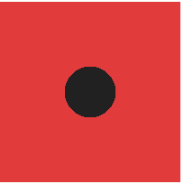
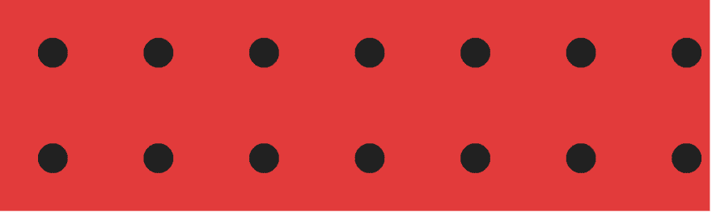

# 如何用 CSS 创建圆点背景

> 原文：<https://dev.to/clairecodes/how-to-create-a-polka-dot-background-with-css-23m0>

## [TL；博士](https://en.wiktionary.org/wiki/tl;dr)

这篇文章解释了如何使用 CSS 制作这个设计:

[](https://res.cloudinary.com/practicaldev/image/fetch/s--Qpc6G28h--/c_limit%2Cf_auto%2Cfl_progressive%2Cq_auto%2Cw_880/https://thepracticaldev.s3.amazonaws.com/i/qw8lywyj3cf0ge5cz5na.png)

它可以只用一个 HTML 标签和这些背景相关的 CSS 属性来创建:

```
body {
  background-image: radial-gradient(#212121 20%, transparent 20%),
      radial-gradient(#fafafa 20%, transparent 20%);
  background-color: #e53935;
  background-position: 0 0, 50px 50px;
  background-size: 100px 100px;
} 
```

以下是对其工作原理的解释，或者您可以直接在[这个 CodePen 示例](https://codepen.io/claireparker/pen/oMmPPZ)中试验代码:

[https://codepen.io/claireparker/embed/oMmPPZ?height=600&default-tab=result&embed-version=2](https://codepen.io/claireparker/embed/oMmPPZ?height=600&default-tab=result&embed-version=2)

## 第一步——画一个圆

让我们从使用 CSS 显示一个圆形开始。

使用[径向渐变](https://developer.mozilla.org/en-US/docs/Web/CSS/radial-gradient)作为背景图像，创建一个圆形。给渐变两种颜色相同的颜色停止值。色标在两种颜色之间创建清晰的边界，而不是褪色的渐变效果。颜色停止可以是 0%到 100%之间的百分比，其中 0 是渐变的中心，100%是边缘。

赋予容器元素相等的高度和宽度，以使圆显示得更好。如果元素不是正方形，那么圆看起来会扭曲。

在这个阶段，CSS 看起来会像这样:

```
body {
    background-image: radial-gradient(#212121 20%, #e53935 20%);
    height: 100px;
    width: 100px;
} 
```

结果:

[](https://res.cloudinary.com/practicaldev/image/fetch/s--zmJyWe11--/c_limit%2Cf_auto%2Cfl_progressive%2Cq_auto%2Cw_880/https://thepracticaldev.s3.amazonaws.com/i/9sr0os7q6wufh0u4nrxw.png)

*注意*:我使用 body 标签来应用样式，因为它是演示新网页效果的最简单的标签。这可能不适合您的用例，所以必要时用另一个 CSS 选择器替换`body`——只是不要忘记给它一个高度和宽度。

## 第二步——让圆圈重复

使用`background-position: 0 0`属性将圆形图像放置在背景的左上方。这两个值以像素为单位表示 x 和 y 坐标。我们可以省略`px`的值，因为在 CSS 中，0 像素(或者 ems，或者%等)等于说 0。

使用`background-size`属性将图像的大小设置为 100 像素乘 100 像素。

将主体容器的高度和宽度设置为大于背景尺寸，这样我们可以看到图像的重复效果。CSS 现在看起来像这样:

```
body {
  background-image: radial-gradient(#212121 20%, #e53935 20%);
  background-position: 0 0;
  background-size: 100px 100px;
  height: 200px;
  width: 100%;
} 
```

结果:

[](https://res.cloudinary.com/practicaldev/image/fetch/s--8pHX83R4--/c_limit%2Cf_auto%2Cfl_progressive%2Cq_auto%2Cw_880/https://thepracticaldev.s3.amazonaws.com/i/fnr853b14lci3gdel771.png)

此时你可能会问，为什么图像会重复？我们没有在 CSS 中显式设置任何属性来做到这一点。

还有一个与背景相关的属性叫做`background-repeat`。浏览器为该属性设置的默认值是`repeat`，这使得背景图像自动沿 x 和 y 轴重复，而无需我们设置它。由于包含元素(body 标签)现在比 100 像素乘 100 像素的圆形背景图像大，所以在剩余的空间中复制了圆形。

如果我们希望圆圈停止重复，我们可以将值改为`background-repeat: no-repeat`。

## 第三步-添加对角线行

给`background-image`属性添加第二个径向渐变，用逗号分隔。我给了第二个渐变的圆圈不同的颜色，使它突出。

将每个渐变的第二种颜色改为`transparent`，并显式设置元素的`background-color`。这是为了看到新的一排点，否则它会隐藏在第一排点的后面。

现在我们有两个梯度，我们可以给它们不同的`background-position`值，再次用逗号分隔。通过给定新的行值为背景大小的一半(50px ),我们创建了对角线间距效果。最终的 CSS 会是这样的:

```
body {
  background-image: radial-gradient(#212121 20%, transparent 20%),
     radial-gradient(#fafafa 20%, transparent 20%);
  background-color: #e53935;
  background-position: 0 0, 50px 50px;
  background-size: 100px 100px;
  height: 200px;
  width: 100%;
} 
```

最终结果:

[](https://res.cloudinary.com/practicaldev/image/fetch/s--Qpc6G28h--/c_limit%2Cf_auto%2Cfl_progressive%2Cq_auto%2Cw_880/https://thepracticaldev.s3.amazonaws.com/i/qw8lywyj3cf0ge5cz5na.png)

瞧，CSS 中的圆点。您可以更改圆圈的大小、颜色，甚至在不同的位置添加另一行来创建更复杂的效果。

### 关于`background`的一个注释和速记

`background` CSS 属性是多个`background-`前缀属性的简称。你可能用过其他的 CSS 简写，比如字体，边距或者边框。在这个例子中，我使用了单独的属性，比如`background-image`和`background-color`，而不是简写。这是因为:

*   更容易看到各个属性中发生了什么，而不是试图找出`background`中每个值的含义
*   当使用简写时，很容易意外地覆盖其他属性并导致错误，因为您没有显式地声明属性(因此我总是使用`background-color`而不是`background`)
*   当设置多个背景时，用简写会更容易，但并不总是可能做到

有时候简写会很有用，比如`margin: 10px 30px 20px 5px`，但是对于不太常用的，比如`font`和`background`，我建议使用单独的属性，这样你就可以确定代码中发生了什么。