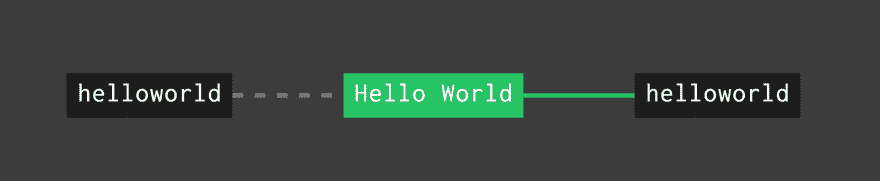
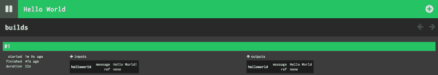

# 如何创建原始的 Concourse 资源

> 原文：<https://dev.to/yoshiyukikato/how-to-create-an-original-concourse-resource-13p7>

[Concourse CI](https://concourse-ci.org/) 是由 pivotal 开发的一款出色的 CI 工具。它提供了定义管道的简化方案和丰富的管道状态可视化。要在 Concourse 上构建一个管道，您可以使用现有的`Concourse Resource`来定义常见的任务，比如 git 操作和 slack 通知。此外，你不难[提供你原来的广场资源](https://concourse-ci.org/implementing-resources.html)。

concourse 资源是一个 docker 图像。它需要 3 种脚本:`check`、`in`和`out`。您可以通过实现这些脚本来创建自己的原始 concourse 资源，并将它们放在具有可执行权限的路径`/opt/resources`中。

每个脚本都需要以适当的格式输出 json 执行的结果，如下所示:

### 检查

json 版本信息列表。

```
[  {  "ref":  "a ref value",  "key":  "value"  }  ] 
```

### 在

*   `version`:一个版本信息 json。
*   `metadata`:元数据 json 列表
    *   **项目:**
        *   `name`:元数据的名称
        *   `value`:元数据的值

```
{  "version":  {  "ref":  "a ref value",  "key":  "value"  },  "metadata":  [  {  "name":  "metadata_name",  "value":  "metadata_value"  }  ]  } 
```

### 出局

*   `version`:一个版本信息 json。
*   `metadata`:元数据 json 列表
    *   **项目:**
        *   `name`:元数据的名称
        *   `value`:元数据的值

```
{  "version":  {  "ref":  "a ref value",  "key":  "value"  },  "metadata":  [  {  "name":  "metadata_name",  "value":  "metadata_value"  }  ]  } 
```

## 创建 Hello World 资源🌅

现在让我们创建一个超级简单的中央大厅资源， [`helloworld`](https://github.com/YoshiyukiKato/concourse-helloworld-resource) 。该资源的一个项目由 3 个 shell 脚本和一个 Dockerfile 文件组成。其结构是:

```
.
├── Dockerfile
└── assets
    ├── check
    ├── in
    └── out 
```

### 检查

```
#!/bin/bash
echo '[{ "ref": "none",  "message": "Hello World!" }]' 
```

### 在

```
#!/bin/bash
echo '{ "version": { "ref": "none", "message": "Hello World" }, "metadata": [{ "name": "message", "value": "Hello World" }] }' 
```

### 出局

```
#!/bin/bash
echo '{ "version": { "ref": "none", "message": "Hello World" }, "metadata": [{ "name": "message", "value": "Hello World" }] }' 
```

### Dockerfile

```
FROM alpine:3.7
RUN apk add --update --upgrade --no-cache bash
ADD assets /opt/resource
RUN chmod +x /opt/resource/*
WORKDIR /
ENTRYPOINT ["/bin/bash"] 
```

如您所知，将项目发布为 dockerhub repo 很容易。你只需要把项目放到你的 github repo 中，并从 dockerhub 设置 repo 的自动构建。

...出版？酷！然后，让我们在您的大厅上创建一个 hello world 管道。

```
# save this file as helloworld.yaml
resource_types:
- name: helloworld
  type: docker-image
  source:
    # set repo of your helloworld resource
    repository: {{YOUR_ACCOUNT/HELLOWORLD_RESOURCE}}
    ## or use my helloworld resource
    # repository: yoshiyuki/concourse-helloworld-resource

resources:
- name: helloworld
  type: helloworld

jobs:
- name: Hello World
  plan:
  - get: helloworld
  - put: helloworld 
```

```
$ fly -t ci set-pipeline helloworld -c helloworld.yaml 
```

[](https://res.cloudinary.com/practicaldev/image/fetch/s--tWF4ehAZ--/c_limit%2Cf_auto%2Cfl_progressive%2Cq_auto%2Cw_880/https://i.imgur.com/3arGMnE.png)
[T6】](https://res.cloudinary.com/practicaldev/image/fetch/s--jByDjfmY--/c_limit%2Cf_auto%2Cfl_progressive%2Cq_auto%2Cw_880/https://i.imgur.com/4fiJ9tO.png)

你好世界！尽情享受吧！😎