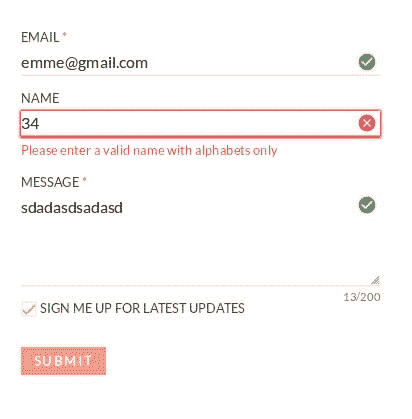

# 如何创建即时表单验证

> 原文：<https://dev.to/snowleo208/how-to-create-your-instant-form-validation-39ek>

使用 JavaScript 中的任何库来添加验证是很容易的，但是，您有没有想过表单验证是如何工作的？

让我们看看如何使用错误消息推出我们自己的表单验证！

我们今天要创造的:
[](https://res.cloudinary.com/practicaldev/image/fetch/s--VeE2At5h--/c_limit%2Cf_auto%2Cfl_progressive%2Cq_auto%2Cw_880/https://thepracticaldev.s3.amazonaws.com/i/soxmux2t9zcrcmdl97h2.jpg)

* * *

## 第一步:创建你的图案！

在过去的几天里，为了学习，我试着创建了自己的表单验证系统。首先我们可以做的是:创建基本的结构形式。

```
<form class="c-form" id="form">
    <label for="email"><span class="c-form-label">Email <abbr title="Required">*</abbr></span>
        <input class="c-form-input" id="form-email" type="email" name="email" required="required" pattern=".{3,}" />
        <span class="u-alert" id="form-email-error">Please enter a valid email format</span>
    </label>
    <label for="name"><span class="c-form-label">Name</span>
        <input class="c-form-input" id="form-name" type="text" name="name" pattern="^[A-Za-z ,.'-]+$" />
        <span class="u-alert" id="form-name-error">Please enter a valid name with alphabets only</span>
    </label>
    <label for="message"><span class="c-form-label">Message <abbr title="Required">*</abbr></span>
        <textarea class="c-form-input" id="form-message" minlength="10" maxlength="200" rows="4" name="message"
            required="required"></textarea><span class="c-form-input__length"><span id="form-message-length">0</span>/200</span>
        <span class="u-alert" id="form-message-error">Please enter at least 10 characters and less than 200 characters.</span>
    </label>
    <label class="c-form-group" for="signup">
        <input class="c-form-checkbox" id="form-signup" type="checkbox" name="signup" />
        <span class="c-form-label">Sign me up for latest updates</span>
    </label>
    <input class="c-form-submit" id="form-submit" type="submit" value="Submit" name="submit" />
    <span class="u-alert" id="form-submit-error">Please correct all information and try again.</span>
</form> 
```

这个代码片段中最重要的是所有输入元素中的`pattern`属性。模式中的神秘字符串是[正则表达式(RegEx)](https://developer.mozilla.org/en-US/docs/Web/JavaScript/Guide/Regular_Expressions) ，这意味着如果用户输入任何与模式不匹配的内容，它都将无效。

例如，有一家商店只卖苹果，他们有一个允许用户输入他们想要什么水果的表单。

可惜他们只有苹果，只能用`pattern="apple"`限制人进入苹果。因此，所有用户只能输入苹果，否则，表单无效。

当然没有店会这么做，只是打个比方:)

* * *

## 第二步:隐藏错误信息

现在，表单已经准备好了，但是错误消息总是出现在 input 元素下面。怎么才能修好？

我们可以使用 CSS 来控制这个元素的可见性。

```
.c-form-label {
  display: block;
  margin: 1em 0 0.2em 0;
  font-size: 0.8em;
  text-transform: uppercase;
  color: rgba(25, 25, 25, 0.8);
}

.c-form-label abbr {
  text-decoration: none;
}

.u-alert {
  display: block;
  height: 0;
  opacity: 0;
  height: 0;
  overflow: hidden;
  transition: ease 400ms;
  font-size: 0.8em;
}

.u-alert.invalid {
  color: red;
  opacity: 1;
  height: auto;
  max-height: none;
  margin-top: 0.3em;
} 
```

错误消息的基类是`u-alert`，默认为`opacity: 0`和`height: 0`。当然，需要添加`overflow: hidden`，否则它仍然会占用你的空间。

如果表单无效，我们将在这个错误消息中添加无效的类(稍后通过 JavaScript)。你可以看到，如果它添加无效的类，它的不透明度变成 1 和高度:自动。

你可能想知道为什么我们不在`u-alert`类中使用`display: none`，原因是**我们想要有效和无效状态**之间的转换。这就是为什么我在最后加上了`transition: ease 400ms`。

* * *

## 第三步:触发错误信息

在隐藏了我们的错误信息之后，现在是触发错误信息的时候了！
首先，我们需要使用`Array.prototype.slice.call(document.getElementsByTagName('input'))`获取页面中的所有输入。然后，浏览器会自动获取所有输入。

```
const inputList = Array.prototype.slice.call(document.getElementsByTagName('input')).filter(item => item.type !== 'submit' && item.type !== 'checkbox');
const input = inputList.concat(Array.prototype.slice.call(document.getElementsByTagName('textarea')));

//valid each item and set error message
  function isValid(input) {
    const target = input.id ? input.id : input.target.id;
    const valid = document.getElementById(target).validity.valid;
    if (valid) {
      document.getElementById(`${target}-error`).classList.remove('invalid');
      document.getElementById(`${target}-error`).removeAttribute('role');
      document.getElementById(target).setAttribute('aria-invalid', 'false');
    } else {
      document.getElementById(`${target}-error`).classList.add('invalid');
      document.getElementById(`${target}-error`).setAttribute('role', 'alert');
      document.getElementById(target).setAttribute('aria-invalid', 'true');
      console.log(document.getElementById(target));
    }

    if (document.getElementById('form-message').value.length !== length) {
      length = document.getElementById('form-message').value.length;
      document.getElementById('form-message-length').innerText = length;
    }

    return valid;
} 
```

> 提示:我在这里使用 slice 的原因是为了支持 IE11，因为 IE11 将 document . getelementsbytagname(' input ')视为节点列表，而不是数组。我们不能不转换到数组就直接使用 forEach。(嗯，我知道 IE11 不支持箭头功能。但这只是为了演示的目的。)

**魔法来了！**

```
input.forEach(item => {
  if (item.type !== 'submit' && item.type !== 'checkbox') {
    //add event listener for input
    item.addEventListener('input', function(e){
      isValid(e);
    })
} 
```

使用事件监听器“input”(它在所有浏览器中都得到很好的支持)，您可以检测用户输入时的有效性。

“更改”和“输入”之间区别在于，只有在用户停止键入且没有立即选择输入元素(焦点之外)之后，才会触发更改。当用户键入或选择某些内容时，输入是连续的响应。

* * *

## 第四步:即时验证来了！耶！

这里我们最不需要的是“isValid”函数。它使用浏览器中的验证(通过模式属性)，您可以使用`document.getElementById(<your-element>).validity.valid`获得有效状态，并返回布尔值 true 或 false。

然后添加这个 CSS 让它更好的工作:

```
.c-form-input {
  display: block;
  border-color: rgba(25, 25, 25, 0.1);
  border-width: 0 0 2px 0;
  padding: 0.2em 2em 0.2em 0;
  transition: border-color ease 300ms;
  background-repeat: no-repeat;
  background-size: 20px 20px;
  background-position: 99% 50%;
  width: 100%;
}

.c-form-input:focus {
  border-color: #03A9F4;
}

.c-form-input[aria-invalid="false"] {
  background-image: url("data:image/svg+xml;utf8,<path fill='%234CAF50' d='M9.984 17.016l9-9-1.406-1.453-7.594 7.594-3.563-3.563-1.406 1.406zM12 2.016c5.531 0 9.984 4.453 9.984 9.984s-4.453 9.984-9.984 9.984-9.984-4.453-9.984-9.984 4.453-9.984 9.984-9.984z'></path>");
  margin-bottom: 0;
}

.c-form-input[aria-invalid="true"] {
  background-image: url("data:image/svg+xml;utf8,<path fill='%23F44336' d='M17.016 15.609l-3.609-3.609 3.609-3.609-1.406-1.406-3.609 3.609-3.609-3.609-1.406 1.406 3.609 3.609-3.609 3.609 1.406 1.406 3.609-3.609 3.609 3.609zM12 2.016c5.531 0 9.984 4.453 9.984 9.984s-4.453 9.984-9.984 9.984-9.984-4.453-9.984-9.984 4.453-9.984 9.984-9.984z'></path>");
  border-color: red;
  margin-bottom: 0;
} 
```

> 小贴士:也可以用。c-form-input:无效且。c-form-input:valid 创建有效/无效的效果，但是即使表单为空，它也会一直显示。这意味着当用户第一次访问你的表单时，他们会看到很多红叉！

使用`aria-invalid`来设计输入元素的样式对可访问性和用户体验都有好处，因为用户第一次访问你的表单时不会看到很多红叉。

对于背景图像，我使用了内嵌 SVG，因为:

1.  我不想从我的 GitHub 页面链接 SVG
2.  如果浏览器不需要从 GitHub 获取 SVG，加载速度会更快

(图标来自材质图标并从 Icomoon 获取内嵌 SVG)

> 提示:提交时，需要创建一个新的函数& event listener，并在里面添加 preventDefault()，否则会显示默认的错误弹出！(不太好看)

* * *

## 结束

你可以在这里查看我完成的表单，样式和额外的技巧，如去抖功能和自动完成验证的自定义事件。

[https://codepen.io/snowleo208/embed/RErbNy?height=600&default-tab=result&embed-version=2](https://codepen.io/snowleo208/embed/RErbNy?height=600&default-tab=result&embed-version=2)

希望你了解更多关于表单验证的知识！你对表单验证有什么想法？你有更好的方法吗？随时让我知道！:)