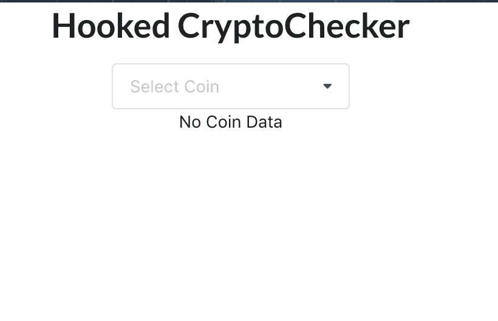
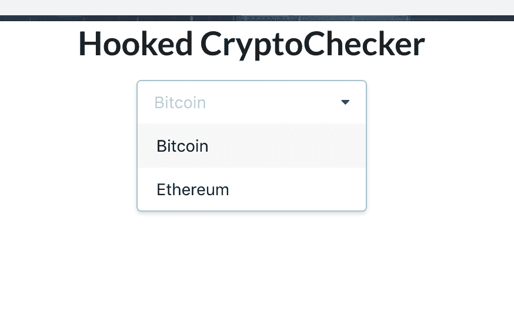
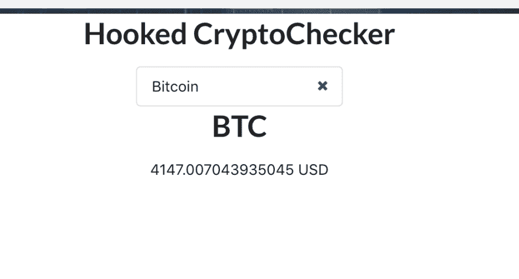

# 如何创建自己的 React 挂钩

> 原文：<https://dev.to/bnevilleoneill/how-to-create-your-own-react-hooks-2955>

[](https://res.cloudinary.com/practicaldev/image/fetch/s--muls2kFe--/c_limit%2Cf_auto%2Cfl_progressive%2Cq_auto%2Cw_880/https://cdn-images-1.medium.com/max/550/1%2A2y3LJ80oZRSFzUR0NLULqQ.jpeg)

### 挂钩概述

不久前，React 团队[发布了钩子](https://reactjs.org/blog/2019/02/06/react-v16.8.0.html)，这让开发者社区非常兴奋。但这有什么大惊小怪的？嗯，钩子开启了一种全新的编写功能组件的方式，它允许我们添加类组件可用的特性，比如有状态逻辑。

React 主要让您使用状态和效果挂钩来实现这一点。 [State(useState)](https://reactjs.org/docs/hooks-state.html) 钩子允许你定义一个状态对象和一个更新它的函数。[效果(useEffect)](https://reactjs.org/docs/hooks-effect.html) 钩子允许你在一个功能组件中执行副作用，把它想象成类组件中的生命周期事件。

自定义钩子是一个以单词“use”开头的函数，可能会调用其他钩子。“useWhatever”命名约定主要是为了让 linter 在这些钩子的使用中发现错误——在使用违背钩子规则的场景中。

[](https://logrocket.com/signup/)

### 规则的钩子

钩子的一般规则也适用于定制钩子。其中包括:

*   只调用顶层的钩子。不要在循环、条件或嵌套函数中调用钩子。
*   仅从 React 函数组件调用挂钩。不要从常规的 JavaScript 函数中调用钩子。(只有一个地方可以调用钩子——你自己的定制钩子。我们一会儿就会了解它们。)

如果您想知道为什么会有这些规则，那是因为 React 依赖于钩子被调用的顺序来将钩子与某个本地状态相关联。在条件中放置一个钩子可能会改变这个顺序，导致后续的钩子不能被调用，这很可能会导致错误。

这在 React 文档中用一个带有几个挂钩的表单进行了说明，如下所示:

```
function Form() {
  // 1\. Use the name state variable
  const [name, setName] = useState('Mary');
  // 2\. Use an effect for persisting the form
  useEffect(function persistForm() {
    localStorage.setItem('formData', name);
  });
  // 3\. Use the surname state variable
  const [surname, setSurname] = useState('Poppins');
  // 4\. Use an effect for updating the title
  useEffect(function updateTitle() {
    document.title = name + '  ' + surname;
  });
  // ...
} 
```

这些钩子在两次渲染中按以下顺序被调用:

```
// ------------
// First render
// ------------
useState('Mary')           // 1\. Initialize the name state variable with 'Mary'
useEffect(persistForm)     // 2\. Add an effect for persisting the form
useState('Poppins')        // 3\. Initialize the surname state variable with 'Poppins'
useEffect(updateTitle)     // 4\. Add an effect for updating the title
// -------------
// Second render
// -------------
useState('Mary')           // 1\. Read the name state variable (argument is ignored)
useEffect(persistForm)     // 2\. Replace the effect for persisting the form
useState('Poppins')        // 3\. Read the surname state variable (argument is ignored)
useEffect(updateTitle)     // 4\. Replace the effect for updating the title
// ... 
```

如果我们在一个条件中调用第二个钩子，只在数据输入时保存，如下所示，这将违背钩子规则:

```
if (name !== '') {
    useEffect(function persistForm() {
      localStorage.setItem('formData', name);
    });
  } 
```

结果是第三个和第四个钩子分别无法读取状态和应用期望的效果。幸运的是，这可以通过移动钩子内部的条件来修复:

```
useEffect(function persistForm() {
    // 👍 We're not breaking the first rule anymore
    if (name !== '') {
      localStorage.setItem('formData', name);
    }
  }); 
```

关于这一点的更多信息可以在 React 文档的[钩子规则部分找到。](https://reactjs.org/docs/hooks-rules.html)

### 创建我们的应用

让我们看看如何创建我们自己的钩子，为此我们将构建一个小应用程序，它利用我们将添加到它的自定义 React 钩子。我们的应用程序将是一个基本的加密货币检查器，允许我们检查一些流行的加密货币的美元价值。对于这个演示，我们将只检查以太坊和比特币，但可以按照相同的步骤添加其他硬币。

为了让它运行起来，我们将使用 [create-react-app](https://github.com/facebook/create-react-app) 为我们的应用程序和来自 [semantic-ui-react](https://react.semantic-ui.com/) 的下拉组件生成样板代码。

让我们开始吧，在你的控制台中运行下面的代码来引导你的应用:

```
create-react-app hooked-cryptochecker 
```

下一步是安装我们的两个依赖项，semantic-ui-react 和 [dotenv](https://github.com/motdotla/dotenv) 。在你的终端项目目录里面，运行下面的命令这样做:

```
yarn add semantic-ui-react dotenv 
```

我们将利用来自 [coinapi.io](https://www.coinapi.io/) 的 API 来获取 Etherium 和比特币的当前值。为此，我们需要从他们那里获得一个 API 密匙，幸运的是，他们免费提供这些。前往 [CoinAPI](https://www.coinapi.io) 获取您的。有了 API 密匙之后，在项目的根目录下创建一个. env 文件，并将 API 密匙粘贴到那里。

在 App.js 或 Index.js 内，粘贴以下代码以加载环境变量。

### **创建自定义钩子**

现在我们都设置好了，让我们进入应用程序的核心部分。在 components 目录下创建一个名为 CryptoChecker.jsx 的文件，并将以下代码放入其中:

```
import React, { useState, useEffect } from 'react'
import { Dropdown } from 'semantic-ui-react'

const coinAPIKey = process.env.REACT_APP_COIN_API_KEY

const CryptoChecker = () => {

  const [coinName, setCoinName] = useState(null)
  const coinUrl = `https://rest.coinapi.io/v1/exchangerate/${coinName}/USD`

  const useCryptoFetcher = () => {
    const [coinData, setCoinData] = useState(null)
    const [fetched, setFetched] = useState(false)
    const [loading, setLoading] = useState(false)

    useEffect(() => {
      setLoading(true)
      fetch(coinUrl,{
        headers: {
          "X-CoinAPI-Key": coinAPIKey
        }
      }).then(res => {
        if(!coinUrl){
          setFetched(false)
          return null
        }
        if(!res.ok){
          setFetched(false)
          return null
        }
        else {
          return res.json()
        }
      }).then( data => {
        setLoading(false)
        setFetched(true)
        setCoinData(data)
      }
      )
    }, [coinUrl])
   return ([coinData, loading, fetched])
  }

  const mapCoinData = () => {
    if(!fetched) return <div>No data fetched</div>
    if(loading) return <div>Loading...</div>
    if(!coinData){
      return <div>No Coin Data</div>
    } else {
      return (
        <div>
          <h1>{coinName}</h1>
          <div>{coinData.rate} USD</div>
        </div>
      )
    }
  }

  const [ coinData, loading, fetched ]  = useCryptoFetcher();
  const coinOptions = [
    {
      key: 'BTC',
      value: 'BTC',
      text: 'Bitcoin'
    },
    {
      key: 'ETH',
      value: 'ETH',
      text: 'Ethereum'
    }
  ]

  return(
    <div>
        <Dropdown
        placeholder='Select Coin'
        clearable
        selection
        options={coinOptions}
        onChange={ (e, {value}) => setCoinName(value)}
      />
      <br/>
      {mapCoinData()}
    </div>
  )
}

export default CryptoChecker; 
```

让我们检查一下我们的组件，看看它是如何工作的。CryptoChecker 是我们的功能组件，它返回一个下拉列表，允许我们选择要检查的硬币，在它下面，我们将显示硬币的名称及其美元价值。

我们已经使用了 state 钩子来初始化我们想要搜索的硬币的名称，并把它放在 state 中。然后，我们使用它来设置 URL，我们将点击该 URL 来获取我们的硬币数据。

接下来你会注意到一个叫做 useCryptofetcher 的函数，这是我们的自定义钩子。它返回硬币数据以及我们的 API 调用状态(加载或完成)以及一个名为 fetched 的布尔值，它告诉我们何时获取了任何数据。

我们的定制钩子利用了效果钩子和状态钩子。我们使用 state 挂钩将硬币数据放入 state 中，并更新 API 调用的状态，以了解数据何时加载以及调用何时完成。effect hook 用于触发对 coinAPI.io 的调用，以获取硬币的汇率值。我们通过向它传递第二个参数(一个包含 URL 的数组)来优化效果挂钩，这确保了只有当 URL 改变时才应用副作用，因此避免了不必要的重新呈现以及重复的 API 调用。

然后我们有一个名为 mapCoinDatathat 的函数，它利用我们的自定义钩子返回的数据，根据返回的值改变 DOM 中显示的内容。为了使这些值对 mapCoinData 可用，我们将从 useCryptoFetcher 对其进行重构，将其放在组件的一般范围内。

我们有一个名为 more options 的数组，它包含了下拉列表中的硬币名称，如果你想获取其他硬币的值，可以在这里提供更多的选项。

太好了，我们的组件已经可以使用了，并配有一个个性化的钩子来添加一些功能。让我们继续使用我们令人敬畏的新组件，编辑 App.js，将其添加到我们的应用程序中。它应该是这样的:

```
import React, { Component } from 'react';
import './App.css';
import CryptoChecker from './components/CryptoChecker';
require('dotenv').config()

class App extends Component {
  render() {
    return (
      <div className="App">
        <h1>Hooked CryptoChecker</h1>
        <CryptoChecker />
      </div>
    );
  }
}

export default App; 
```

现在是时候启动我们的应用程序来看看神奇之处了。在您的终端中运行*纱线启动*命令，并测试应用程序。

[](https://res.cloudinary.com/practicaldev/image/fetch/s--CuUbWQlP--/c_limit%2Cf_auto%2Cfl_progressive%2Cq_auto%2Cw_880/https://cdn-images-1.medium.com/max/820/0%2AFyrLVQ8rHCCUY01x)

<figcaption>app 初始加载</figcaption>

[](https://res.cloudinary.com/practicaldev/image/fetch/s--jcy6PRvo--/c_limit%2Cf_auto%2Cfl_progressive%2Cq_auto%2Cw_880/https://cdn-images-1.medium.com/max/874/0%2ASMQMHhMNzc_NgLFL) 

<figcaption>下拉选项</figcaption>

[](https://res.cloudinary.com/practicaldev/image/fetch/s--Z7mS0dcm--/c_limit%2Cf_auto%2Cfl_progressive%2Cq_auto%2Cw_880/https://cdn-images-1.medium.com/max/984/0%2Af8Lvr2WwwdWQ2mR8) 

<figcaption>带比特币的 App 选中</figcaption>

### **结论**

定制挂钩确实开辟了编写组件的新途径，允许您根据自己的喜好定制功能。总的来说，通过最小化对基于类的组件的需求，钩子为我们如何编写 React 应用程序增加了很多灵活性。钩子还允许我们通过消除基于类的组件的复杂性来编写更优化的组件，这是因为功能组件是纯组件，没有不必要的逻辑。

您可以使用 react 内置的一些[附加挂钩](https://reactjs.org/docs/hooks-reference.html)来扩展这些挂钩的功能，以创建您自己的更令人惊叹的挂钩。

* * *

### Plug: [LogRocket](https://logrocket.com/signup/) ，一款适用于网络应用的 DVR

[](https://logrocket.com/signup/)

<figcaption>[https://logrocket.com/signup/](https://logrocket.com/signup/)</figcaption>

LogRocket 是一个前端日志工具，可以让你回放问题，就像它们发生在你自己的浏览器中一样。LogRocket 不需要猜测错误发生的原因，也不需要向用户询问截图和日志转储，而是让您重放会话以快速了解哪里出错了。它可以与任何应用程序完美配合，不管是什么框架，并且有插件可以记录来自 Redux、Vuex 和@ngrx/store 的额外上下文。

除了记录 Redux 操作和状态，LogRocket 还记录控制台日志、JavaScript 错误、堆栈跟踪、带有头+正文的网络请求/响应、浏览器元数据和自定义日志。它还使用 DOM 来记录页面上的 HTML 和 CSS，甚至为最复杂的单页面应用程序重新创建像素级完美视频。

[免费试用](https://logrocket.com/signup/)。

* * *

帖子[如何创建你自己的 React 钩子](https://blog.logrocket.com/how-to-create-your-own-react-hooks-77b426ac0e26/)最先出现在[博客](https://blog.logrocket.com)上。