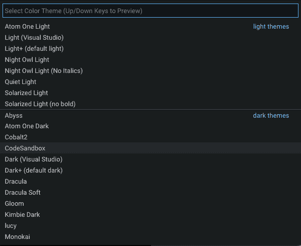
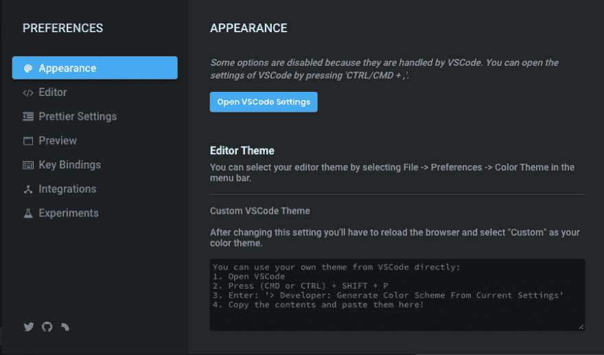
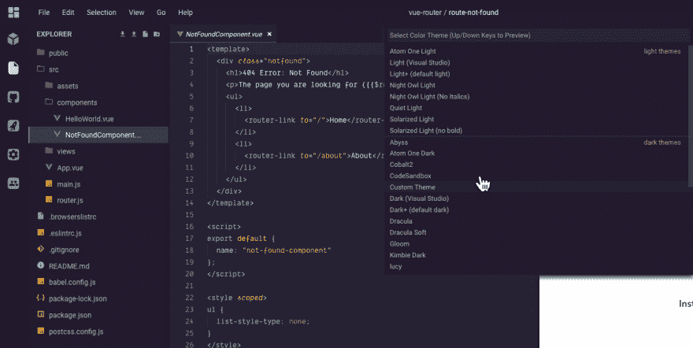

# 如何在 CodeSandbox 中自定义 VSCode 主题

> 原文：<https://dev.to/therealdanvega/how-to-customize-the-vscode-theme-in-codesandbox-3h13>

今天这将是一个简短的教程，但它是一个好东西。在我的[上一篇文章](https://www.danvega.dev/blog/2019/05/02/gridsome-codesandbox-plugin)中，我谈到了什么是 [CodeSandbox](https://codesandbox.io/) 以及我为什么如此热爱它。在本文中，我将向您提供一个关于如何在 CodeSandbox 中自定义 VSCode 主题的快速提示。

## Visual Studio 代码主题

我认为开发人员在开始使用 VSCode 时首先喜欢做的事情之一就是定制主题。VSCode 附带了很多很棒的内置主题，在扩展市场中还有更多。

如果你在推特上关注我，你可能已经知道了，但是对于那些不知道的人来说🤔我有一个新的最喜欢的 VSCode 主题，它叫做 [Synthwave 84](https://github.com/robb0wen/synthwave-vscode) 。

这是作者([罗布·欧文](https://github.com/robb0wen))灵感来源的快速描述

> 这种配色方案受到了现代 Synthwave 乐队的音乐和封面艺术的影响，如 FM-84、Timecop 1983 和 The Midnight。通过联想，这意味着我也受到了詹姆斯·怀特优秀的复古艺术作品的巨大影响。

我已经用了快 2 周了，我真的爱上了它。出于某种原因，它只是让我心情平静/好。下面是在这个主题下编辑我的博客的截图。

现在我所有的机器上都有了这个主题，是时候把它转移到 CodeSandbox 了。它使用 VSCode，所以应该可以工作，对吗？

## code sandbox 中的自定义 VSCode 主题

当我第一次开始使用 CodeSandbox 时，我认为我受限于编辑器中预装的任何主题。如果你在 CodeSandbox 中打开一个项目并进入`File > Preferences > Color Theme`，你会看到一个主题列表。

在滚动列表后，我很快发现我新喜欢的主题不可用。我该怎么办？没有它，我怎么能有效率呢？我当然是在开玩笑，但是我们开发人员喜欢在我们的开发环境中保持一致性。

在做了一些挖掘之后，我发现将 Synthwave 84 引入 CodeSandbox 是可能的，下面是如何做的。从编辑器转到`File > Preferences > CodeSandbox Settings`。您会注意到在编辑器主题下有使用自定义 VSCode 主题的说明。

如果从截图上看有点困难，这里有一些说明。您可以直接从 VSCode 中使用自己的主题:

1.  打开 VSCode
2.  按(CMD 或 CTRL) + SHIFT + P
3.  输入:`> Developer: Generate Color Scheme From Current Settings`
4.  复制内容并粘贴到此处。

完成后，你可以通过点击它的外部来关闭这个对话框。要激活主题，请返回到您的颜色主题列表`File > Preferences > Color Themes`并选择自定义主题。如果您没有看到`Custom Theme`选项，您可能需要刷新 CodeSandbox。

有了它，我最喜欢的新主题就在 CodeSandbox 中了，我可以重新成为一名半生产力的开发人员了！

## 结论

如果你还不知道，我现在真的很喜欢 CodeSandbox 的一切。我个人越来越多地使用它，我把它作为一种工具介绍给我们，我们可以在工作中利用它，整个团队都在参与。你在使用 CodeSandbox 吗？如果是，是为了什么？也请让我知道你最喜欢的一些主题是什么。一如既往...

快乐编码
丹

*这篇文章最初是在 https://www.danvega.dev/blog 的[发表在我的博客上的。如果你觉得这篇文章有趣，请考虑](https://www.danvega.dev/blog)[订阅我的时事通讯](https://www.danvega.dev/signup/)或者在 [Twitter](http://twitter.com/therealdanvega) 上关注我。*