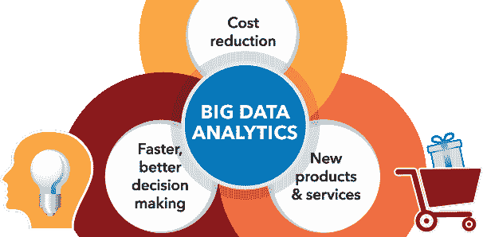
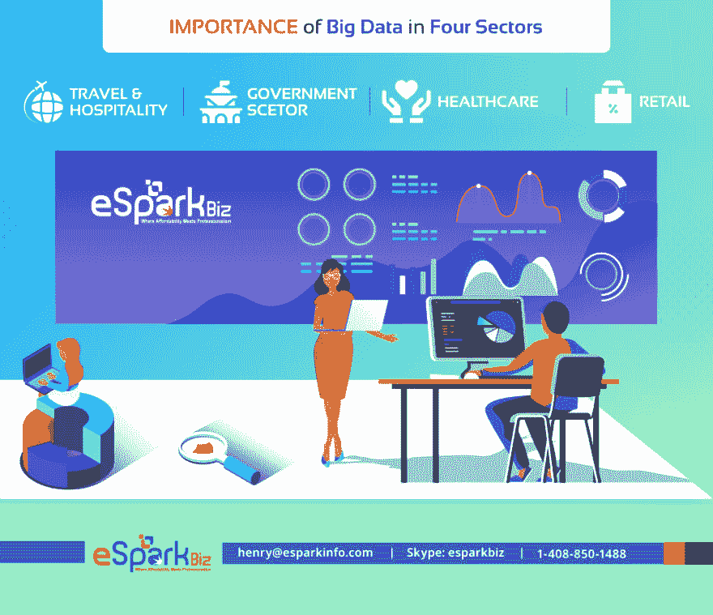
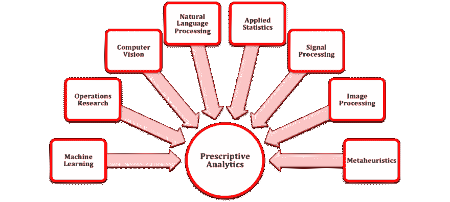
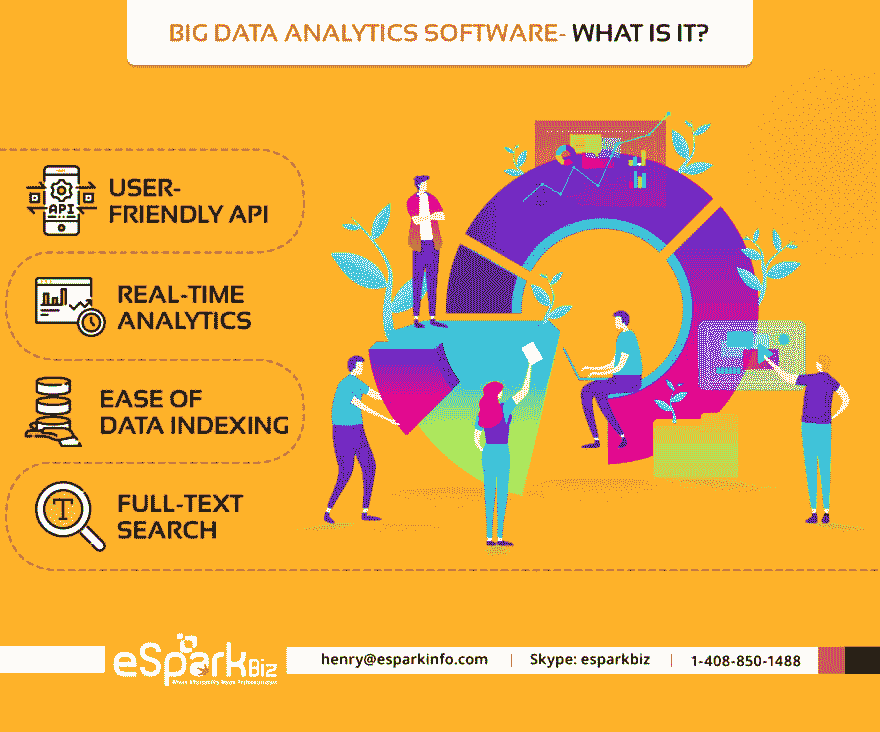

# 如何轻松应对大数据分析？

> 原文：<https://dev.to/esparkbiz/how-to-deal-with-big-data-analytics-easily-1cjf>

> *如果没有大数据，你会又瞎又聋，还在高速公路中间”
> –杰弗里·摩尔*

你认为大数据只是一种时尚吗？那么，让我告诉你它不是。数据革命仍处于初始阶段。

我确信这场革命将影响全球的每一个行业。然而，许多企业家仍然不知道他们的重要性。

不幸的是，这些业务将被名为“大数据”的压路机压垮。令人惊讶？那就准备好迎接更多惊喜吧。首先，让我们看看这些重要的数据(来源-福布斯):

*   到 2020 年，每秒将产生 1.7 兆字节的新信息
*   数据的数字世界将增长到 44 兆字节
*   目前，我们每秒进行 40，000 次搜索查询

##### ***大数据的重要性以及其他重要问题***

*   大数据的定义
*   大数据收集的优势
*   大数据在四个行业中的重要性
*   五大大数据分析趋势
*   大数据分析——是什么？
*   如何建立和维护大数据分析？

### **1。大数据的定义**

> *“大数据是高容量、高速度和/或高多样性的信息资产，需要经济高效、创新的信息处理形式，以增强洞察力、决策制定和流程自动化。”
> –高德纳*

大数据暗指海量信息。现有的传统应用程序无法处理这些信息。大数据的处理是从没有人积累的基础知识开始的。通常很难存储在单个 PC 的存储器中。

[大数据](https://www.oracle.com/in/big-data/guide/what-is-big-data.html)用于描绘大量信息。它让企业沉浸在日常生活中。大数据可用于分解体验，确保做出更好的选择。此外，大数据还会影响至关重要的商业决策。

> 克里斯·邦加德@克里斯 _ KDR通过区块链和 AI 改造大数据处理[bit.ly/2HOABZa](https://t.co/mJ934Icn7z)
> [# BigData](https://twitter.com/hashtag/BigData)[# BigData](https://twitter.com/hashtag/BigData)Analytics[#区块链](https://twitter.com/hashtag/Blockchain)[#区块链](https://twitter.com/hashtag/Blockchain)技术[#人工智能](https://twitter.com/hashtag/ArtificialIntelligence)

### **2。大数据收集的优势**

#### A .金融服务

信用卡组织、零售银行、私人财富委员会、保护公司、冒险储备和机构投机银行利用大量信息进行货币管理。

其中最常见的问题是对生活在各种不同框架中的多组织信息的广泛测量，这些信息可以通过大量的细节来解决。随后，我们可以多种方式利用大数据，例如:

*   客户分析
*   合规分析
*   欺诈分析
*   运营分析

#### B .沟通

获得新的支持者，保持客户，扩大现有的代言人基础是媒体传播专业组织的首要需求。这些困难的答案在于连接和检查大多数客户产生的信息和机器产生的信息的能力。

#### C .零售

不管你的情况如何，你必须更好地理解客户。这将使你能够更好地为他们服务。它需要分解所有不同信息来源的能力。这些来源可能包括:

*   [网络博客](https://www.esparkinfo.com/blog.html)
*   客户交换信息
*   基于互联网的生活
*   商店标记的收费卡信息
*   可靠性计划信息

### **3。大数据在四个行业的重要性**

#### A .旅游和招待

取悦客户对旅游和酒店业来说至关重要。然而，消费者忠诚度很难衡量——尤其是以一种方便的方式。举例来说，度假村和赌博俱乐部只有一个短暂的幸运机会来吸引客户，这种机会很快就会消失。

大数据分析使这些组织能够收集客户信息，进行调查，并快速识别潜在问题，以防不测。

#### B .政府部门

某些行政办公室面临着一个重大考验:在没有讨价还价的质量或盈利能力的情况下确定财务计划。这对于法律授权机构来说尤其麻烦。这些组织试图用适度稀有的资产来降低犯罪率。

更重要的是，这是许多组织利用大量信息调查的原因；这一创新简化了任务，同时使该办公室对犯罪活动有了逐步全面的了解。

#### C .医疗保健

大数据在[医疗保健](https://www.esparkinfo.com/chatbot-technology-in-healthcare.html)行业中非常重要。持久记录、福利设计、保护数据和不同种类的数据可能很难监管，但一旦分析连接起来，它们就会装载关键的知识。

这就是大数据分析技术对医疗保健如此重要的原因。通过快速检查大量数据——包括有组织的和无组织的——人类服务供应商可以非常迅速地给出救命的分析或治疗方案。

#### D .零售

客户满意度在过去相当长的一段时间里得到了发展。精通技术的顾客明白，零售商应该知道他们需要什么&何时需要。大数据解决方案使零售商能够满足他们的需求。

从可靠性计划、购买倾向和不同来源获得的无限量信息，不仅让零售商了解从上到下的客户，他们还可以预测模式，开出新的商品，并从中受益。

除了这些，还有很多行业，都需要大数据解决方案。可以肯定地说，每个行业都需要它。

### **4。五大大数据分析趋势**

#### 认知技术的兴起

对于大量信息来说，最令人振奋的变化之一是主观进步的发展。曾经只为人们设想的差事将从辨别外表到感知书法都实现自动化。

此外，机械化与智力有关，例如，安排、利用受限制的或有问题的数据和学习。

计算框架已经可以捕捉、移动和存储非结构化信息——而无需理解它。目前，心理学进步中的不断变化意味着，说实话，框架能够理解数据的含义。

#### 规定性分析的支配地位

分析框架也会工作得更好。为了让考试以任何方式发挥作用，这些框架需要使我们能够选择越来越有教育意义的选择，并使我们的活动逐渐可行。有了[预测分析](https://www.predictiveanalyticstoday.com/what-is-predictive-analytics/)，这就更简单了。

规定性分析包括在 2018 年为给定环境找到最佳策略，因为该领域正在改善；它将对海量信息产生重大影响。心理处理是利用创新将检查水平延伸到新的信息类别。

规范调查传达了在给定情况下的特权，即在适当的时间、适当的环境下给出正确的答案。通过加入预见性和表达性调查，商业人士将有能力利用他们所拥有的信息做出更明智的选择。

当分析得到有效利用时——结合算术、考试和实验——组织可以升级生成并增强客户接触。

利用调查并同时具备分解信息的能力可以更快、更全面地了解企业信息。沿着这些思路，例如，当你试图发现如何给你的在线商店带来更多的流量时，常规检查会使这一点变得不那么困难。

#### 机器学习技术的出现

我们制造的机器越多，它们的学习能力就越快。如今，创新发展迅速。这意味着这些机器很快就能。

*   分解和简化信息
*   简化复杂的数据分析
*   传达更快、更精确的结果

知识的巨大增长导致了这种发展，增强的计算和所有更具突破性的个人电脑设备。因此，个人、程序和物品都将以一种我们还无法想象的方式被简化。

从现在起的一年内，机器学习将比现在更快、更智能，并能提高对未来的预期。据说，例如，一些组织将在 2019 年实现自动招募。

#### 网络安全越来越强

在不需要人工监督的情况下获得未标记的信息后，大数据分析将得到改善。有了这个扩大的限制，AI 就会变成屏蔽信息的保护组件。

正如《哈佛商业评论》(Harvard Business Review)所指出的那样，人工智能将被用来保护数字基础免受攻击和黑客攻击——这对任何维持业务的人来说都将具有非凡的用途。

#### 物联网日益重要

IoT 或[物联网](https://www.esparkinfo.com/iot-app-development-company.html)将在 2019 年变成一个巨大的信息检查。随着越来越多的买家使用手机、平板电脑和不同的设备，越来越多的组织将向物联网投入资源。它将使客户能够收集他们需要的信息。

到目前为止，购物者和组织都已经从基于传感器的检查中获益。模型传感器可以跟踪商店中哪些部分的行人活动最频繁，并将根据需要在 2019 年变得越来越必要，主要是对零售而言。

### **5。大数据分析软件——是什么？**

大数据分析软件使组织能够从各种信息数据集中探索隐藏的模式、未知的联系、市场模式、客户、选择和其他有价值的数据。

无论何时您打算实现这样的软件，请确保您的软件具有所有这些特性:

#### 用户友好的 API

您的大数据分析软件必须由 API 驱动。任何活动都可以利用带有 JSON over HTTP 的基本 RESTful API 来执行。一些编程语言可以访问客户库。它有一个干净的和毫不费力的探索文档，扩展了你的舞台上自由制作的应用程序的质量和客户体验。

它应该与 Hadoop 兼容，以便快速查询结果。Klout 应该也能适应这个程序。

#### 实时分析

实时分析提供了客户端事件的更新结果，例如，网站点击率、网站路线、购物篮使用或其他一些网络或计算机化操作。这些信息对于领导独特调查并宣布对客户行为模式做出快速反应的组织至关重要。

它通过智能搜索和其他细分亮点，提供一些知识，使您的业务更加简化，并增强您的项目。

#### 便于数据索引

数据索引是一种在众多领域中排列各种记录的方法。您可以选择 sans 模式和记录排列。它按照有组织的 [JSON](https://www.json.org/) 报告在系统中存储精确的复杂物质。本质上是归档一个 JSON 记录，它会自然地识别信息结构和类型，生成一个文件，并使您的信息可访问。

同样，您可以完全控制如何订购信息。它通过提高数据库表上信息恢复过程的速度，简化了调查过程。

#### 全文搜索

在全文搜索中，搜索引擎在尝试匹配搜索条件时会检查每个存储文档中的所有单词。您的软件应该在 Apache Lucene 之上具有分发功能，以提供最有效的全文搜索工具。这些设施是

*   强大且开发人员友好的查询 API
*   多语言搜索
*   地理定位
*   上下文“你是指建议吗？”
*   自动完成
*   结果片段

### **6。如何建立和维护大数据分析？**

现在，您可能正在考虑如何构建您的定制大数据分析软件。下面列出了帮助开发人员开发成功的大数据分析软件的五大工具

#### 卡珊德拉

这种设备今天被广泛使用，因为它提供了大量信息的令人信服的管理。这是一个数据库，提供了高度的可访问性和多功能性，而没有讨价还价的软件设备和云基础的执行。

在 Cassandra 的首选项中，改进的特点是对内部失败的适应、执行、分散、专家帮助、力量、多功能性和适应性。毫无疑问，易贝和网飞等卡珊德拉的客户可能会证明这一点。

#### Hadoop

Apache 的另一个令人难以置信的产品是 Hadoop。这种推进式编程库的一个基本事实是，利用成功的编程模型，在大量 pc 机上处理大型信息索引是无与伦比的。

你可以要求你的开发人员选择 Hadoop，因为它有着令人难以置信的处理能力，此外 engineer 还会定期更新和升级。

#### 阴谋地

有效的海量信息检查即使在组织没有足够的时间或能力来满足海量信息需求的情况下，也可以使用 Plotly 做出令人难以置信的唯一表示。

它使得利用在线工具制作令人眼花缭乱和有用的插图变得简单。同样地，stage 通过将结果传送到各种有利的安排中来授权分享发现。

#### 散景

因此，对于 Plotly 来说，这种工具同样难以置信，因为它可以进行有指导意义和直接的表达。它被大量的信息检查专家用来有效和快速地制作智能信息应用程序、仪表板和绘图。

看看利用大量信息与[散景](https://bokeh.pydata.org/en/latest/)一起工作的模型展览。众多专家还表示，散景是最先进的视觉信息描绘设备。

#### Neo4j

该仪器的官方网站声称它是世界驾驶图表数据库。的确是这样，因为它将大型信息业务带到了以下维度:它与它们之间的关联一起工作。信息之间的关联驱动着当今精明的应用，而 Neo4j 就是改变这些关联的工具。

### **最后一份外卖**

有一些方法可以处理你的大数据——你可以把更多的数据放入其中，并与一组信息设计师签约来编写 SQL 问题。然而，这意味着创建一份报告需要几天甚至几周的时间。

您的大数据存储被存储起来，并且您正在利用旧数据来决定关键的业务选择。预计到 2020 年，信息量将达到 40 万亿千兆字节，您没有时间来处理信息和发展业务。

尽管如此，您可以使用正确的基于云的分析工具来改变这种情况。最好的工具可以帮助你在这种情况下以预期的最快速度从信息直接获得重要的知识。

想要精简所有重要信息？那么，最好[雇佣大数据软件开发人员](https://www.esparkinfo.com/hire-web-developer.html)来为你的企业构建一个分析工具。你在想什么？想一想！