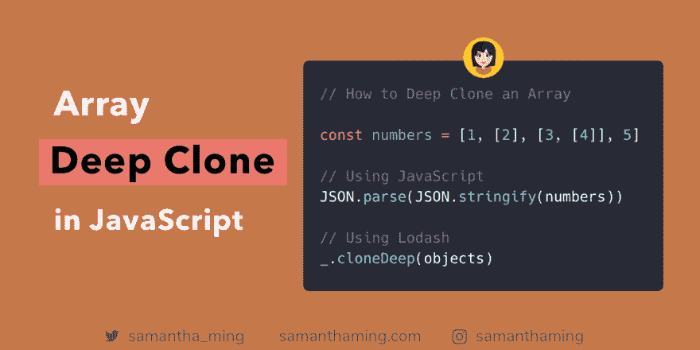

# 如何在 JavaScript 中深度克隆数组

> 原文：<https://dev.to/samanthaming/how-to-deep-clone-an-array-in-javascript-3cig>

[](https://res.cloudinary.com/practicaldev/image/fetch/s--PYLtLqbO--/c_limit%2Cf_auto%2Cfl_progressive%2Cq_auto%2Cw_880/https://thepracticaldev.s3.amazonaws.com/i/may9lgvv80ou524d7kzo.png)

有两种类型的阵列克隆:浅层和深层。浅拷贝只覆盖数组的第一级，其余的都被引用。如果您想要嵌套数组的真实副本，您将需要一个深度克隆。对于深度克隆，使用 JSON 方式或者使用 Lodash 更好👍

```
const numbers = [1, [2], [3, [4]], 5];

// Using JavaScript
JSON.parse(JSON.stringify(numbers));

// Using Lodash
_.cloneDeep(numbers); 
```

Enter fullscreen mode Exit fullscreen mode

## 数组是引用类型

为了理解为什么有两种类型的克隆。让我们深入基础知识，解释什么是引用类型。

不像你的原始类型(即数字或字符串)，数组是引用类型。这意味着当你把一个数组赋给一个变量时，你是在赋一个内存地址，而不是实际的数组本身。厚度😱。我知道这有点令人困惑。所以我们用一个例子来说明。

### 复制值类型

所以没什么大不了的。我们正在创建`value`的副本。而如果我们改变了`valueCopy`，并不影响原来的`value`。有道理——当我们改变副本时，它根本不应该影响原件。这里一切都好👍

```
let value = 3;
let valueCopy = value; // create copy

console.log(valueCopy); // 3

// Change valueCopy
valueCopy = 100
console.log(valueCopy); // 100

// ✅ Original NOT affected 
console.log(value); // 3 
```

Enter fullscreen mode Exit fullscreen mode

### 复制参考类型

好吧，事情开始变得奇怪了。让我们使用与复制值类型相同的方法来复制数组。

```
let array = [1,2,3];
let arrayCopy = array; // create copy

console.log(arrayCopy); // [1,2,3];

// Change 1st element of the array
arrayCopy[0] = '👻';
console.log(arrayCopy); // [ '👻', 2, 3 ]

// ❌Original got affected
console.log(array); // [ '👻', 2, 3 ] 
```

Enter fullscreen mode Exit fullscreen mode

为什么原来的阵列也受到了影响？这是因为你复制的不是数组本身，而是指向数组所占据的内存空间的指针。引用类型不保存值，它们是指向内存中的值的指针。

**复制引用类型的解决方案**

所以解决方法是复制值而不是指针。像这样:

```
let array = [1,2,3];
let arrayCopy = [...array]; // create TRUE copy

console.log(arrayCopy); // [1,2,3];

// Change 1st element of the array
arrayCopy[0] = '👻';
console.log(arrayCopy); // [ '👻', 2, 3 ]

// ✅ Original NOT affected 
console.log(array); // [ 1, 2, 3 ] 
```

Enter fullscreen mode Exit fullscreen mode

### 浅层 vs 深层克隆

当我使用 spread `...`来复制一个数组时，我只是创建了一个浅层副本。如果数组是嵌套的或者多维的，那就不行。我们来看看:

```
let nestedArray = [1, [2], 3];
let arrayCopy = [...nestedArray]; 

// Make some changes
arrayCopy[0] = '👻'; // change shallow element
arrayCopy[1][0] = '💩'; // change nested element
console.log(arrayCopy); // [ '👻', [ '💩' ], 3 ]

// ❌ Nested array got affected
console.log(nestedArray); // [ 1, [ '💩' ], 3 ] 
```

Enter fullscreen mode Exit fullscreen mode

如你所见，浅的或第一层是好的。然而，一旦我们改变了嵌套元素，原来的数组也会受到影响。所以解决办法就是做一个深度克隆:

```
let nestedArray = [1, [2], 3];
let arrayCopy = JSON.parse(JSON.stringify(nestedArray)); 

// Make some changes
arrayCopy[0] = '👻'; // change shallow element
arrayCopy[1][0] = '💩'; // change nested element
console.log(arrayCopy); // [ '👻', [ '💩' ], 3 ]

// ✅ Nested array NOT affected
console.log(nestedArray); //  1, [ 2 ], 3 ] 
```

Enter fullscreen mode Exit fullscreen mode

* * *

## 社区输入

### 值与 JSON 不兼容

[@tailcall](https://dev.to/tailcall) :使用 JSON 解决方案必须非常小心！它不适用于与 JSON 不兼容的值。如果必须处理这些数据，可以考虑使用库函数。

```
function nestedCopy(array) {
    return JSON.parse(JSON.stringify(array));
}

// undefineds are converted to nulls
nestedCopy([1, undefined, 2]) // -> [1, null, 2]

// DOM nodes are converted to empty objects
nestedCopy([document.body, document.querySelector('p')]) // -> [{}, {}]

// JS dates are converted to strings
nestedCopy([new Date()]) // -> ["2019-03-04T10:09:00.419Z"] 
```

Enter fullscreen mode Exit fullscreen mode

### [T1】deep clone vs JSON](#deepclone-vs-json)

我想让你注意到深度克隆和 JSON.stringify/parse.之间有一些不同

*   **JSON.stringify/parse**只处理数字、字符串和没有函数或符号属性的对象文字。
*   **deepClone** 工作用的所有类型、函数和符号都是通过引用复制的。

这里有一个例子:

```
const lodashClonedeep = require("lodash.clonedeep");

const arrOfFunction = [() => 2, {
    test: () => 3,
}, Symbol('4')];

// deepClone copy by refence function and Symbol
console.log(lodashClonedeep(arrOfFunction));
// JSON replace function with null and function in object with undefined
console.log(JSON.parse(JSON.stringify(arrOfFunction)));

// function and symbol are copied by reference in deepClone
console.log(lodashClonedeep(arrOfFunction)[0] === lodashClonedeep(arrOfFunction)[0]);
console.log(lodashClonedeep(arrOfFunction)[2] === lodashClonedeep(arrOfFunction)[2]); 
```

Enter fullscreen mode Exit fullscreen mode

### 使用递归

Tareq Al-Zubaidi : 这个问题还有一个更简单、更有效的解决方案。我会用递归来解决这个问题。

```
const clone = (items) => items.map(item => Array.isArray(item) ? clone(item) : item); 
```

Enter fullscreen mode Exit fullscreen mode

参见此处的对比试验

* * *

## 资源

*   [MDN Web Docs-JSON . stringify](https://developer.mozilla.org/en-US/docs/Web/JavaScript/Reference/Global_Objects/JSON/stringify)
*   [MDN 网络文档- JSON.parse](https://developer.mozilla.org/en-US/docs/Web/JavaScript/Reference/Global_Objects/JSON/parse)
*   [Lodash: cloneDeep](https://lodash.com/docs/4.17.11#cloneDeep)
*   堆栈溢出:如何在 Javascript 中克隆一个对象数组？
*   [如何在 JavaScript 中区分深层和浅层拷贝](https://medium.freecodecamp.org/copying-stuff-in-javascript-how-to-differentiate-between-deep-and-shallow-copies-b6d8c1ef09cd)
*   [JS:克隆，深度复制对象/数组](http://xahlee.info/js/js_clone_object.html)
*   [数组和对象的 JavaScript 深度复制](https://medium.com/@gamshan001/javascript-deep-copy-for-array-and-object-97e3d4bc401a)
*   [要点:原始类型&引用 JavaScript 中的类型](https://gist.github.com/branneman/7fb06d8a74d7e6d4cbcf75c50fec599c)
*   [解释 Javascript 中的值与引用](https://codeburst.io/explaining-value-vs-reference-in-javascript-647a975e12a0)
*   [理解 Javascript 中的深层和浅层拷贝](https://we-are.bookmyshow.com/understanding-deep-and-shallow-copy-in-javascript-13438bad941c)

* * *

**感谢阅读❤**
问好！[insta gram](https://www.instagram.com/samanthaming/)|[Twitter](https://twitter.com/samantha_ming)|[脸书](https://www.facebook.com/hisamanthaming) | [媒体](https://medium.com/@samanthaming) | [博客](https://www.samanthaming.com/blog)