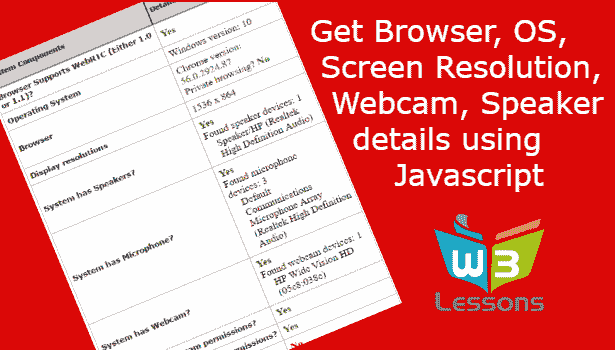

# 如何用 Javascript 检测浏览器？

> 原文：<https://dev.to/itzurkarthi/how-to-detect-browser-using-javascript-1bfc>

了解更多-[https://w3 lessons . info/how-to-detect-browser-OS-resolutions-speakers-microphone-web cam-using-JavaScript/](https://w3lessons.info/how-to-detect-browser-os-resolutions-speakers-microphone-webcam-using-javascript/)