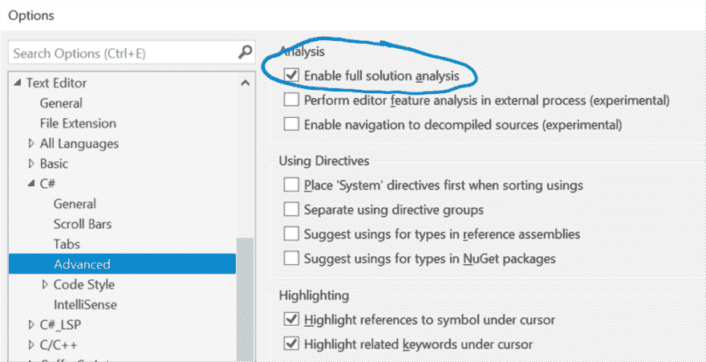
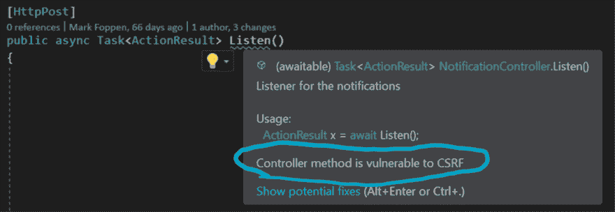
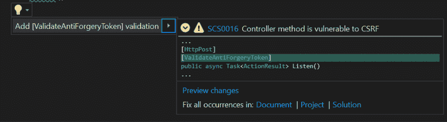
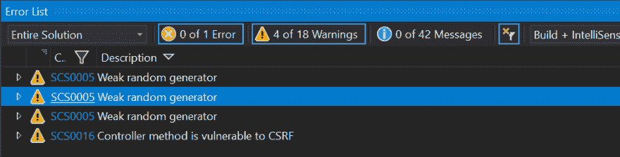
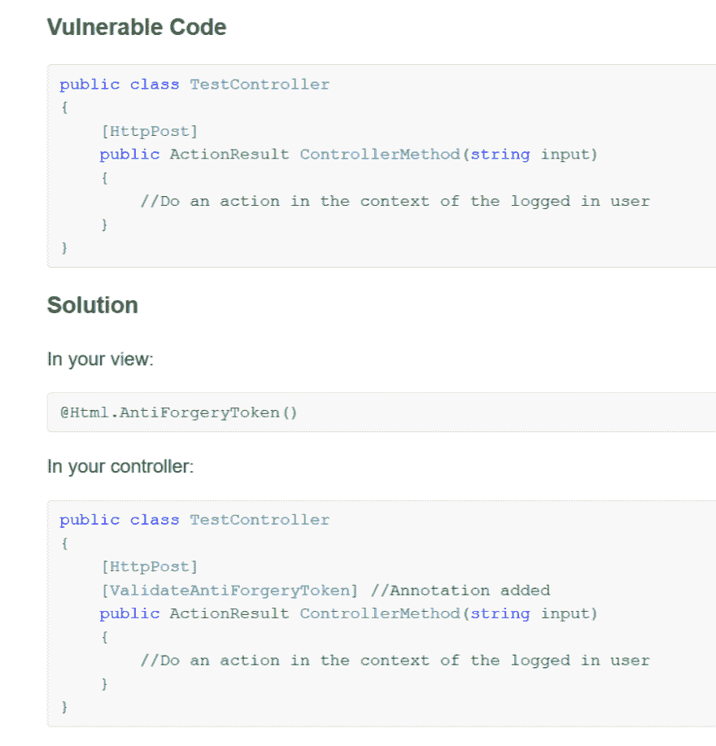
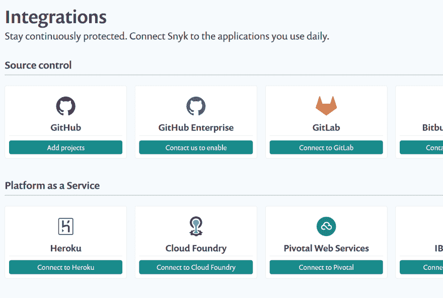
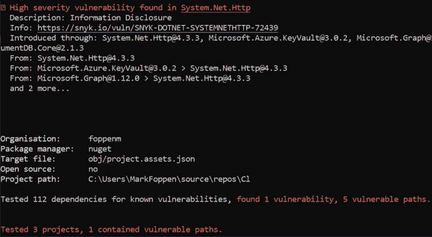
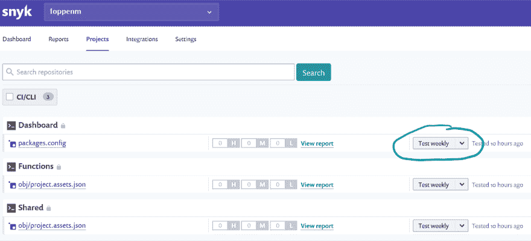

# 如何轻松开发更安全的解决方案

> 原文：<https://dev.to/foppenma/how-to-develop-more-secure-solutions-without-the-hassle-297h>

[](https://res.cloudinary.com/practicaldev/image/fetch/s--VuParPPB--/c_limit%2Cf_auto%2Cfl_progressive%2Cq_auto%2Cw_880/https://www.re-mark-able.net/conteimg/2019/01/blog-logo-1.png)

作为开发人员，我们一直试图以最好的方式实现我们的解决方案。我们经常“忘记”去寻找我们引入的漏洞，而没有真正去思考它。这可能是在上级的压力下发生的，或者仅仅是因为你不可能知道所有的漏洞。

为了改善这一点，我们想知道什么是错的，但(我个人)不希望它在我们做的每个本地构建中都被强制执行..为了改善这一点，我找到了两个解决方案，它们非常有效，不会让你一直感到困扰。

我们可以使用两种不同的解决方案:

*   发展过程中的实时信息和提示
*   附加依赖项上的漏洞

## 安全码扫描

对于第一个问题，我希望在 visual studio en visual studio 代码开发期间得到通知。这可以通过安装以下组件之一来实现:

*   visual Studio-> security codescan(**首选！**)和/或 DevSkim
*   Visual Studio 代码-> DevSkim

在本帖中，我们将主要关注安全代码扫描。为了使用它，您可以通过安装 visual studio 扩展[链接](https://marketplace.visualstudio.com/items?itemName=JaroslavLobacevski.SecurityCodeScan)或者通过将它作为一个 nuget 添加到您想要监视的项目上来获得它。我已经将它添加为扩展，因此将在每个打开的解决方案上得到漏洞警告。

安装后，确保在 Visual Studio >工具>文本编辑器> C# >高级中选中“启用完整解决方案分析”,如下图所示。

[T4】](https://res.cloudinary.com/practicaldev/image/fetch/s--7xCjO4ke--/c_limit%2Cf_auto%2Cfl_progressive%2Cq_auto%2Cw_880/https://www.re-mark-able.net/conteimg/2019/01/vs-tools-setting.png)

到目前为止，如果检测到某些东西，您将会收到警告。它可以以不同的方式出现。

[](https://res.cloudinary.com/practicaldev/image/fetch/s--AXXYIjL_--/c_limit%2Cf_auto%2Cfl_progressive%2Cq_auto%2Cw_880/https://www.re-mark-able.net/conteimg/2019/01/warning.png)

您还可以使用 quickfix 选项在大多数情况下修复它。

[](https://res.cloudinary.com/practicaldev/image/fetch/s--LdFGZk6F--/c_limit%2Cf_auto%2Cfl_progressive%2Cq_auto%2Cw_880/https://www.re-mark-able.net/conteimg/2019/01/quickfix.png)

最后但同样重要的是，您还可以在“错误列表”视图中获得所有警告的概述。

[](https://res.cloudinary.com/practicaldev/image/fetch/s--ZcwQhsNF--/c_limit%2Cf_auto%2Cfl_progressive%2Cq_auto%2Cw_880/https://www.re-mark-able.net/conteimg/2019/01/error-list.png)

在此视图中，您还可以在浏览器中打开该问题，以获取更多信息，包括如何解决该问题以及为什么这很重要。我的意思是，如果你认为这在当前情况下不适用，你可以忽略它。

漏洞的解决方案可以在[安全代码扫描](https://security-code-scan.github.io)中找到，它看起来像是:

[](https://res.cloudinary.com/practicaldev/image/fetch/s--Hm-mTGQp--/c_limit%2Cf_auto%2Cfl_progressive%2Cq_auto%2Cw_880/https://www.re-mark-able.net/conteimg/2019/01/solution-for-issue.png)

作为第二个解决方案，你也可以使用 DevSkim，它可以在这里找到[但是在我看来，这没什么用，而且会在构建时产生错误。DevSkim 确实捕捉到一些不同的可能问题，比如 URL 不安全。不幸的是，它不支持快速修复或解释为什么它是一个漏洞。](https://github.com/Microsoft/DevSkim)

[](https://res.cloudinary.com/practicaldev/image/fetch/s--vUhz5Xkc--/c_limit%2Cf_auto%2Cfl_progressive%2Cq_auto%2Cw_880/https://www.re-mark-able.net/conteimg/2019/01/unsecure-url.png)

## 雪

在我实现了一个解决方案后，它工作了，我准备部署它，有可能检查它是否存在已使用的依赖关系漏洞。这可以通过使用 [Snyk](https://snyk.io/) 来实现，它为开发者提供了一个免费层，并为公共存储库提供了无限制的测试(运行以检查您的解决方案)。请记住，对于企业来说，有付费选项。

首先，你需要注册一个免费账户。这将允许您访问您的仪表板。现在你有两个选择。您可以配置一个公共存储库或者使用一个本地(在您的机器上)项目。可以通过转到“Integrations”页面来配置公共存储库，在这里可以配置许多提供者。

[](https://res.cloudinary.com/practicaldev/image/fetch/s--tjog-Txw--/c_limit%2Cf_auto%2Cfl_progressive%2Cq_auto%2Cw_880/https://www.re-mark-able.net/conteimg/2019/01/snyk-integrations.png)

在这个例子中，我们将使用一个不在任何存储库中的本地项目，因为本地项目设置起来有点困难。

所以让我们直接在你的机器上安装 Snyk。为了安装 Snyk，我使用了 npm 和下面的命令

```
npm install -g snyk 
```

之后，你必须验证你的帐户。

```
snyk auth 
```

这将打开浏览器，您可以使用您的 Snyk 帐户登录。现在，您可以使用它来测试您的解决方案，方法是转到项目文件夹

```
cd c:\<your solution folder> 
```

对我来说，这是一个解决方案。azure 函数的. NET 项目。这是受支持的，但不是默认方式。通常你可以运行“同步测试”，它会自动检查你当前文件夹中的许多不同版本的包文件(见[文档](https://snyk.io/docs/using-snyk/))。因为。NET 项目你需要指定这样的解决方案文件

```
snyk test --file=MySolution.sln 
```

在测试摘要中，您已经可以看到是否存在漏洞

[](https://res.cloudinary.com/practicaldev/image/fetch/s--EdYujaqD--/c_limit%2Cf_auto%2Cfl_progressive%2Cq_auto%2Cw_880/https://www.re-mark-able.net/conteimg/2019/01/snyk-test.png)

要在 snyk.io 上的仪表盘中获得它，您需要运行

```
snyk monitor --file=MySolution.sln 
```

这将发送数据到您的 Snyk 帐户，您将能够在仪表板中看到它，并通过严重性浏览找到的漏洞。

这种监控的一个很好的额外好处是，它将保持您的包配置，并在有新发现的漏洞时提醒您。这样，当这种情况发生时，你会收到一封电子邮件，你可以回复。这可以设置为每天或每周检查一次。

[](https://res.cloudinary.com/practicaldev/image/fetch/s--pvnoHBa1--/c_limit%2Cf_auto%2Cfl_progressive%2Cq_auto%2Cw_880/https://www.re-mark-able.net/conteimg/2019/01/snyk-dashboard.png)

## 这个能用吗？

我只能说我自己，但对我来说，这两个步骤很容易在本地和 ci 构建中实现，使用起来没有任何麻烦。一个额外的好处是，我可以使用警告来改进解决方案，但我不是必须这样做。如果你想更进一步，你可以随时查看 [BinSkim](https://github.com/Microsoft/BinSkim) 。这个工具可以分析你的 DLL 和可执行文件中已知的漏洞。

总的来说，我认为这真的很“了不起”,所有这些都可以免费使用，同时它可以为我们的解决方案带来真正的附加值！