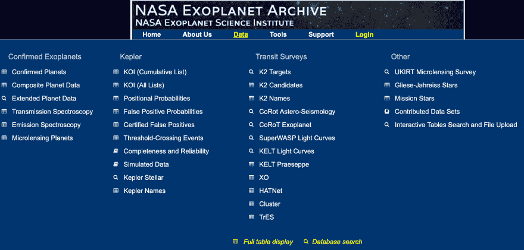
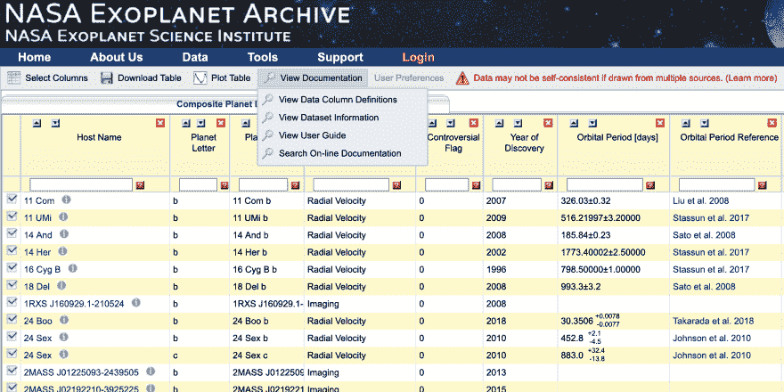
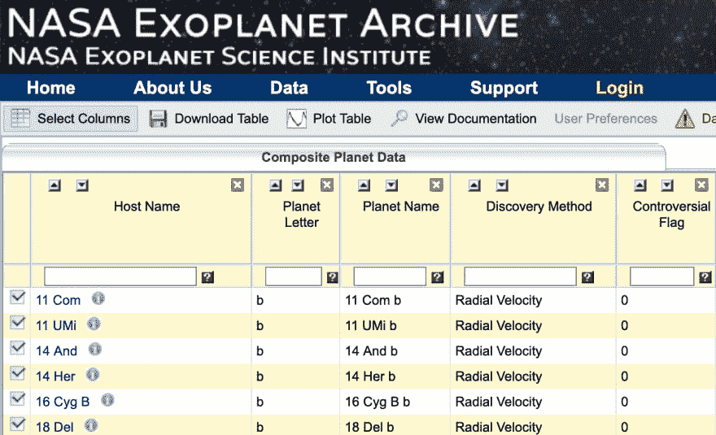
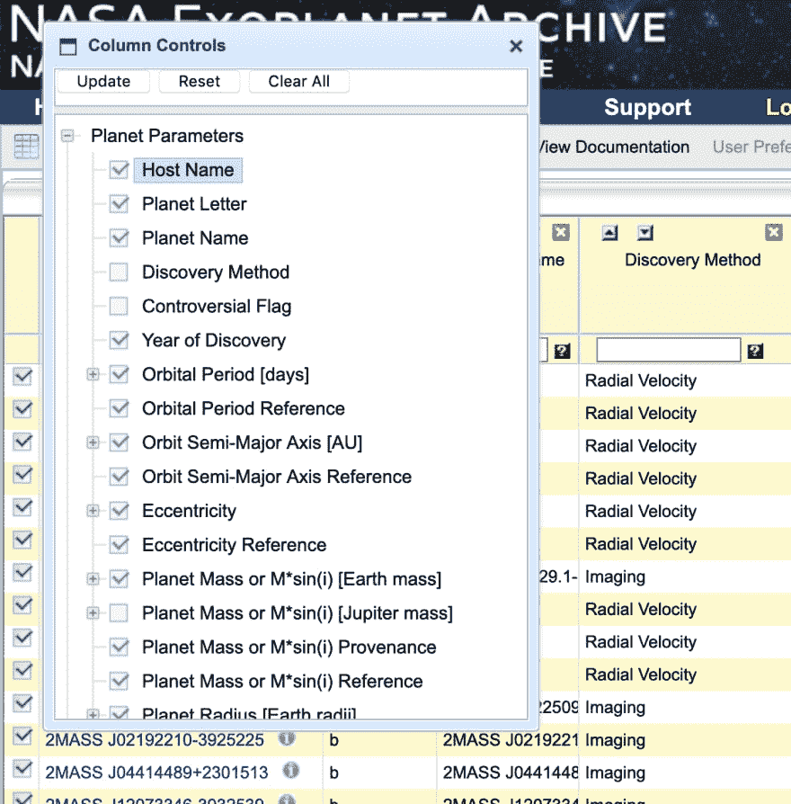
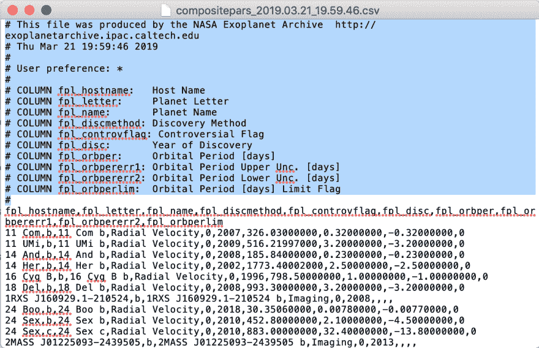
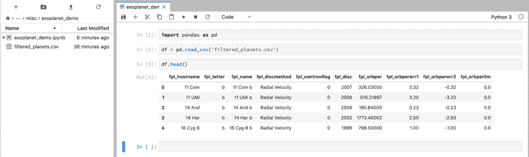
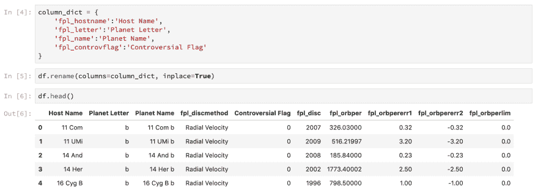

# 如何使用 Python 和 Pandas 探索 NASA 系外行星档案数据

> 原文：<https://dev.to/stevenbruno/how-to-explore-nasa-exoplanet-archive-data-with-python-and-pandas-351g>

### **简介**

美国宇航局系外行星档案馆(NASA Exoplanet Archive)拥有大量关于系外行星及其宿主恒星的数据集。然而，这个网站对新来者来说可能有点难以招架，因为它又大又复杂。这篇文章的目的是教有抱负的系外行星档案数据探索者如何浏览网站，下载数据集，并开始使用 Python 中的 Pandas 操作数据。为了构建讨论框架，我将详细介绍我最近在 [ChiPy 导师项目](https://chipymentor.org/)中为我的数据科学项目执行的步骤。

### **第 1 步** |找到你的数据集

大多数数据集可以通过导航到主站点导航中的*数据*选项卡找到。在里面，你会注意到四个主要部分-确认行星，开普勒，凌日调查，和其他。对于这个例子，让我们处理来自已确认系外行星部分的合成行星数据。打开数据集后，您会看到一个表格界面，您可以直接在浏览器中滚动浏览。要了解关于单个列或整体数据的更多信息，请浏览提供的*视图文档*链接。

<figure> 

<figcaption>可用数据集</figcaption>

</figure>

<figure> 

<figcaption>查看文档选项</figcaption>

</figure>

### **第二步** |过滤并下载

虽然你当然可以单独用 Pandas 完成所有的数据清理工作，但你可以通过使用存档网页中内置的工具来提前开始。单击选择列按钮，然后选择您感兴趣的列。您可以通过搜索行条目以及随意选择和取消选择行来进一步过滤数据。您所做的每一个更改都会反映在您的文件下载中。准备好后，点击下载按钮，下载 CSV 格式的数据。如果您试图在此时阅读 Pandas 中的 csv，您会遇到一些错误，因为下载带来了一些不必要的负担。在文本编辑器中打开您最近下载的 csv，删除第一个专栏标签之前的所有内容。在我的例子中，我将删除 fpl_hostname 之前的所有内容。将更新后的文件另存为 csv 文件。

<figure> 

<figcaption>选择列按钮</figcaption>

</figure>

<figure> 

<figcaption>列控件</figcaption>

</figure>

<figure> 

<figcaption>删除无关信息</figcaption>

</figure>

### **第三步** |将文件读入熊猫数据帧

现在是有趣的部分。我假设你已经安装了 Python 3 和 Pandas T1，但是如果你还没有，那就这样做吧。我喜欢在 jupyter 笔记本上处理数据，所以[安装 Jupyter 笔记本](https://jupyter.org/install)如果你还没有这样做的话。在保存过滤数据 csv 的同一目录下创建一个新的 jupyter 笔记本。在笔记本中，从导入熊猫开始。然后使用 Pandas 内置的 read_csv()函数将文件读入一个新的数据帧。完成后，运行 df.head()以确保您的数据帧看起来不错。

`import Pandas as pd`
`df = pd.read_csv('name_of_filtered_csv')`
T2】

<figure> 

<figcaption>导入您的数据</figcaption>

</figure>

### **第四步** |清理你的数据

到目前为止一切顺利！至此，熊猫数据框架中已经有了一个功能完备的系外行星数据集。您可能会注意到，列标题并不十分直观。为了解决这个问题，我们将使用 df.rename()函数对它们进行重命名。作为参数，它需要一个字典，其中键是旧的列名，值是新的列名。我们可以这样设置字典并在重命名函数中使用它:

`column_dict = {
'fpl_hostname':'Host Name',
'fpl_letter':'Planet Letter',
'fpl_name':'Planet Name',
'fpl_controvflag':'Controversial Flag'
}`
`df.rename(columns=column_dict, inplace=True)`
T2】

<figure> 

<figcaption>重命名列</figcaption>

</figure>

如果操作正确，您将看到列名被修改为新值。但是，如果我们要重命名的不仅仅是几个列，那该怎么办呢？如果有几十个，或者几百个呢？解决这个问题的一个方法是提取行星参数的 html 表，该表可从数据集的 web 界面中的*视图文档* > *视图数据列定义*链接访问。在那里，您将看到一个包含列名、标签和其他一些列的表格。前两列非常适合数据框架中的键(旧列名)和值(新列名)。为了解决这个问题，您可以使用 [pd.read_html()](https://pandas.pydata.org/pandas-docs/version/0.23.4/generated/pandas.read_html.html) 捕获表格，然后使用[这个方法](https://stackoverflow.com/questions/17426292/what-is-the-most-efficient-way-to-create-a-dictionary-of-two-pandas-dataframe-co)创建前两列的字典，然后使用 df.rename()函数完成对原始 dataframe 列标签的重命名。祝你好运！

##### 最后的想法

这是使用 Pandas 和 Python 从 Nasa 系外行星档案中提取数据集的介绍。这是我为“ChiPy 导师计划”撰写的博客三部曲中的第二篇。我的下一步是使用 sklearn.neighbors 模块中的方法，尝试根据恒星参数对恒星拥有绕轨道运行的系外行星的可能性进行分类。我已经执行了上面概述的所有步骤，它们是从系外行星档案创建模型就绪数据帧的好方法，但肯定不是唯一的方法。要了解更多从档案中提取数据的方法，请查看网站中的[工具](https://exoplanetarchive.ipac.caltech.edu/docs/tools.html)部分。