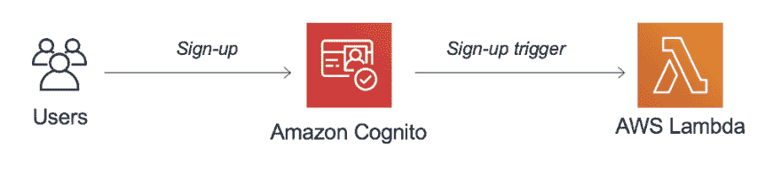

# 如何像专家一样 FaaS:在 Amazon Web Services 上调用无服务器功能的 12 种不常用方法[第 1 部分]

> 原文：<https://dev.to/aws/how-to-faas-like-a-pro-12-less-common-ways-to-invoke-your-serverless-functions-on-aws-part-1-4nbb>

<figure> 

<figcaption>是的，这就是你在这篇文章的结尾，盘算着新的可能性！
【照片由[约书亚·厄尔](https://unsplash.com/photos/etsVKbvxhCc)在[Unsplash](https://unsplash.com)</figcaption>

</figure>

上拍摄】

如果您想跳过下面的简短介绍，您可以通过这些快捷链接直接跳到前四个触发器:

1.  [亚马逊认知用户池](#1-amazon-cognito-user-pools-custom-workflows) —用户管理&定制工作流
2.  [AWS 配置](#2-aws-config-eventdriven-configuration-checks) —事件驱动的配置检查
3.  [亚马逊 Kinesis 数据消防软管](#3-amazon-kinesis-data-firehose-data-validation) —数据摄取&验证
4.  [AWS CloudFormation](#4-aws-cloudformation-macros) — IaC，宏&自定义转换

#### 先讲一点历史

当 AWS Lambda [于 2015 年 4 月 9 日](https://aws.amazon.com/it/blogs/compute/aws-lambda-is-generally-available/)正式推出时，它成为了第一个功能即服务，除了直接调用，只有几种方式可以触发您的功能:亚马逊 S3、亚马逊 Kinesis 和亚马逊社交网络。三个月后，我们获得了 Amazon API 网关支持，这为 web 和 REST 兼容的客户端开启了一个全新的浪潮。

到 2015 年底，你已经可以通过亚马逊 DynamoDB 流、Kinesis 流、S3 对象、SNS 主题和 CloudWatch 事件(预定调用)触发功能。

就我个人而言，我在 2016 年初左右开始用 AWS Lambda [做一个简单的机器学习用例](https://aws.amazon.com/it/blogs/aws/machine-learning-recommendation-systems-and-data-analysis-at-cloud-academy/)的实验。几个月后，我发布了第一个关于我 Lambda 体验的视频，其中涵盖了当时所有可用的触发器和配置；嗯，视频仍然可用[这里](https://www.youtube.com/watch?v=NhGEik26324)，但 AWS 控制台现在很不一样，所以我建议你只有在怀旧的时候才看它=)

**回到历史……**

在接下来的几个月里，AWS Lambda 变得非常受欢迎，许多其他 AWS 服务开始集成它，并允许您以许多新的方式触发功能。这些集成非常适合处理/验证数据，以及定制和扩展这些服务的行为。

你可能已经意识到(或者凭直觉猜测)AWS Lambda 是如何与诸如 [S3](https://docs.aws.amazon.com/en_us/lambda/latest/dg/invoking-lambda-function.html#supported-event-source-s3) 、 [DynamoDB](https://docs.aws.amazon.com/en_us/lambda/latest/dg/invoking-lambda-function.html#supported-event-source-dynamo-db) 、 [Kinesis 数据流](https://docs.aws.amazon.com/en_us/lambda/latest/dg/invoking-lambda-function.html#supported-event-source-kinesis-streams)、 [SES](https://docs.aws.amazon.com/en_us/lambda/latest/dg/invoking-lambda-function.html#supported-event-source-ses) 、 [SQS](https://docs.aws.amazon.com/en_us/lambda/latest/dg/invoking-lambda-function.html#supported-event-source-sqs) 、[物联网核心](https://docs.aws.amazon.com/en_us/iot/latest/developerguide/iot-lambda-rule.html)、[步骤功能](https://docs.aws.amazon.com/en_us/step-functions/latest/dg/connectors-lambda.html)和 [ALB](https://docs.aws.amazon.com/en_us/lambda/latest/dg/services-alb.html) 等服务集成的。有大量的文章和入门指南将这些集成作为无服务器之旅的良好起点。

在本文中，我想与您分享一些其他不太常见、不太为人所知、甚至是更新的在 AWS 上调用 Lambda 函数的方法。其中一些集成甚至没有出现在官方的[支持的事件源](https://docs.aws.amazon.com/en_us/lambda/latest/dg/invoking-lambda-function.html)文档页面上，我相信它们值得一提和尝试。

对于每个服务/集成，我将分享有用的链接、代码片段和云信息模板和参考。如果您认为缺少了什么，或者您需要更多的资源/细节，请随时在下面添加评论。即使你不知道 Python 或 JavaScript，代码也是不言自明的，并带有有用的注释。如果你有问题或疑问，请在本文底部发表评论。

让我们从 AWS Lambda 的前 4 个触发器开始。

### 1。Amazon Cognito 用户池(自定义工作流)

[Cognito 用户池](https://aws.amazon.com/cognito/)允许您将**认证和用户管理**添加到您的应用程序中。借助 AWS Lambda，您可以[定制您的用户池工作流](https://docs.aws.amazon.com/en_us/cognito/latest/developerguide/cognito-user-identity-pools-working-with-aws-lambda-triggers.html)，并在 Cognito 运行期间触发您的功能，以便定制您的用户池行为。

以下是可用触发器的列表:

*   **预注册** —在 Cognito 注册新用户(或管理员)之前触发，允许您执行自定义验证以接受/拒绝
*   **发布确认** —在新用户(或管理员)注册后触发，允许您发送自定义消息或添加自定义逻辑
*   **预认证** —当用户尝试登录并允许自定义验证接受/拒绝时触发
*   **认证后** —在用户登录后触发，允许您在认证后添加自定义逻辑
*   **自定义身份验证** —当您使用[自定义身份验证流程](https://docs.aws.amazon.com/en_us/cognito/latest/developerguide/amazon-cognito-user-pools-authentication-flow.html#amazon-cognito-user-pools-custom-authentication-flow)时触发以定义、创建和验证自定义质询
*   **预令牌生成** —在每次令牌生成之前触发，允许您自定义身份令牌声明(例如，新密码和刷新令牌)
*   **迁移用户** —当用户在使用密码登录时不在用户池中或在忘记密码流中时触发
*   **自定义消息** —在发送电子邮件、电话验证消息或 MFA 代码之前触发，允许您自定义消息

所有这些触发器都允许您实现无状态逻辑，并使用您喜欢的编程语言个性化 Cognito 用户池的工作方式。请记住，您的函数是同步调用的，需要在 5 秒钟内完成，只需返回带有附加的*响应*属性的传入*事件*对象。

从同一个 Lambda 函数处理多个事件可能会很方便，因为 Cognito 总是会提供一个名为 *event.triggerSource* 的属性来帮助您为每个事件实现正确的逻辑。

例如，下面是如何在 Node.js 中为定制消息实现 Lambda 函数代码: