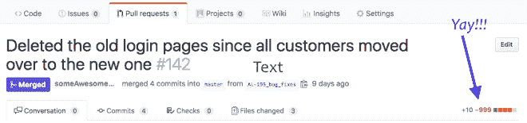

# 删除“死代码”感觉如何好

> 原文：<https://dev.to/cubiclebuddha/how-to-feel-good-deleting-dead-code-1mm2>

我们都有坚持过去的理由，就像那个我无法处理扔掉的变形金刚午餐盒。我喜欢它，但事实是我再也不会用它了。但是在专业软件工程领域，保留任何没有被利用的东西可能会通过无意的错误和混乱对代码库造成严重破坏，损害可维护性和团队道德。这些未使用的代码被称为“死代码”但是我们如何知道代码何时死亡呢？更糟糕的是，我们如何说服自己终于可以放下你不再使用的午餐盒了？以下建议将帮助你摆脱囤积问题。

但是首先，什么是“死代码？”死代码是客户不再使用的任何代码，或者是不可能命中的“if 分支”。由于代码行数与 bug 数量之间存在着已被证实的相关性，所以最好尽可能地精简代码。找到它的最好方法是每次添加代码时都去寻找它。但也许你太害怕删除代码？这是一种可以理解的恐惧，所以这里有一些让你和你的团队更舒服的建议:

## 秘诀 1——学会放手:

在我们谈论使大规模重构成为可能的许多技术解决方案之前，让我们稍微谈一谈删除代码的情感挑战。虽然我只能告诉你，放手可以并且将会让你更快乐……但要相信这一点并不总是那么容易。过去已经过去了，为什么我们还要让它困扰我们呢？有时候这真的真的很难接受。例如，当我开始写这个博客时，我想在我的地下室设立一个办公室，这样我就可以有一个安静、高效的空间来专注于写文章……不幸的是，我甚至不能在地下室里行走，因为从我们买房子时起，我就有大约 10 亿个搬家箱子。每次我打开一个盒子，我的大脑就会说，“哦，你以后肯定会需要这个的”，这几乎总是不真实的。我还需要一盒高中辉煌时期的 t 恤吗？那套我觉得太难学的口琴怎么样？不，这些都是过去的遗留物，它们阻碍了我享受现在的目标。

## 提示#2 以删除为乐

有些人可能会说“等等，我认为作为程序员，我们应该通过添加代码来增加价值？”不，有时候最好的代码是你不必写的代码。或者正如比尔·盖茨所说:“用代码行数来衡量编程进度，就像用重量来衡量飞机制造进度。”所以接受这个建议，享受让你的飞机变得更轻的时刻吧。这是你得到的那种拉式请求，以获得提交的乐趣:

 但是当然，我听你的。删除大量代码听起来很可怕。所以我们的下一个技巧是在你进行的过程中删除微小的部分。

## 提示#3 永远被猎杀死代码:

如果你有一个花园，保持好的植物健康的最好方法是每天到外面走走，拔一些杂草。这当然比等到你的花园杂草丛生要容易得多。上面关于我的地下室的故事也是一样——如果我每天简单地打开一个盒子，那么我就会更快地实现我的目标，创造一个干净的工作环境。这正是你应该在你的团队中创造的积极主动的氛围。你的一些队友可能会感到沮丧或气馁。向你的队友展示，从你的旧的、不可维护的代码库中清除无用代码是 100%可能的。

## 技巧 4——将你的整个团队变成死亡代码猎手

即使你的同行对你的狩猎技巧变得自信，也不意味着他们对自己的能力有信心。您可以通过每周花时间在整个团队中分享领域知识来提高他们的信心和理解，这样每个开发人员在编写代码时都可以考虑业务领域。因为你的同事现在会理解他们的变化的影响，他们可以更直观地理解变化会对用户产生什么影响。这将产生巨大的影响。但是有时领域知识不足以阻止开发人员害怕做出大的彻底的改变。这时您将需要更好的度量、工具和测试。

## 提示# 5——使用工具、测试和度量来确信删除死代码

1.  测试自动化:继续添加足够的自动化单元测试和 API 测试，这样您就可以放心地删除代码，并确保主要功能仍然工作。虽然单元测试无疑是重要的，但是拥有一些高于单元测试的测试也是值得的。您可以使用白盒测试来自动验证一个特性的全部功能。如果在你删除了你认为不再使用的代码之后，那些测试是绿色的…那么你应该很高兴知道你刚刚使未来的开发人员的生活变得更加容易。现在出现错误的机会减少了，你也改善了用户的生活。
2.  **让编译器为您工作:**虽然像 Cypress.io 这样的自动化测试可能会让您在用户界面(UI)这样的高度复杂的领域获得最高价值，但后端和中间层等领域无疑会受益于静态类型。如果你有 C#、Java 或者(我最喜欢的)TypeScript 之类的静态类型，那么你可以让编译器告诉你代码的哪些部分不能命中。它基本上可以帮你找到死代码。实现这一点的一个方法是从代码中删除一个特性标志(即一个为特定用户子集打开或关闭特性的变量),然后你就会知道哪一部分可以删除……因为这一部分有大量的红色曲线告诉你不能编译。
3.  **相信这些指标:**使用谷歌分析或 New Relic 之类的分析工具，查看每个特定功能的使用频率。这样，当你不得不删除整个功能时，你可以看到是否有太多的客户会介意它的消失。或者，如果您对接触一段令人困惑的代码感到紧张，如果您知道该代码是较少使用的功能的一部分，那么您可能会更愿意进行侵入性手术。
4.  缩小关注范围:如果你没有关于使用率的分析，你可以做出判断，删除那些“可疑的正在使用的”代码，因为正如史蒂夫·乔布斯常说的，“关注就是说不”( [2](https://www.inc.com/justin-bariso/20-years-ago-steve-jobs-revealed-single-word-that-led-to-apples-great-success.html) )。把你的软件想象成一个有生命的东西，比如一棵树。如果一棵树有一两根树枝开始枯萎或枯萎，砍掉这些树枝不是健康的吗？然后，这棵树就可以自由地把它的重要营养送到健康的、正在开花的树枝上。对你的代码做同样的事情——如果你的代码的一部分不再被使用，为什么还要看那些行呢？用你的时间做同样的事情:如果一个软件产品没有带来它应该带来的收入，或者它没有产生它应该产生的社会影响…那么停止维护它。最终，这些提示会让你更关注用户此时此刻的需求。如果你是一个有意识的人，你会消除那些阻碍你助人能力的东西。

记住，当只有几只小虫的时候，拔掉你花园里的杂草比当你的花园杂草丛生时花几个小时除草要容易得多。

也就是说:我的院子里现在有一堆杂草！哎，人无完人，*没关系*！