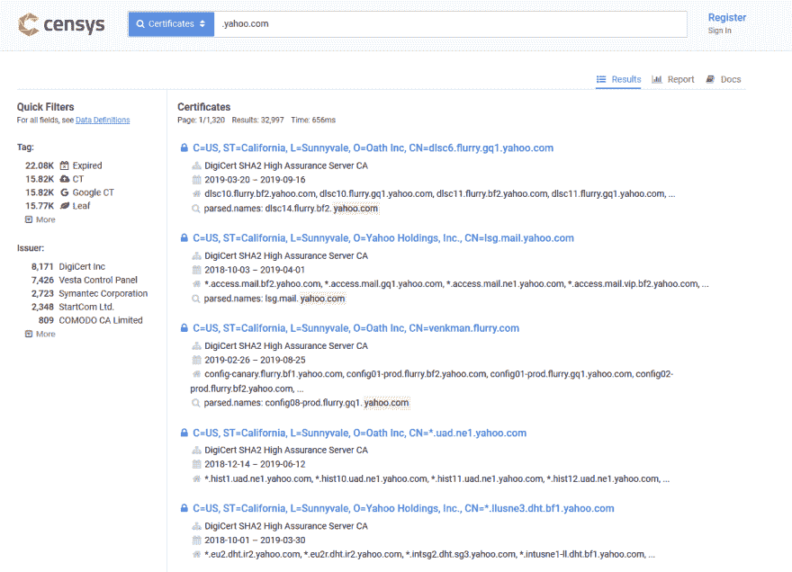
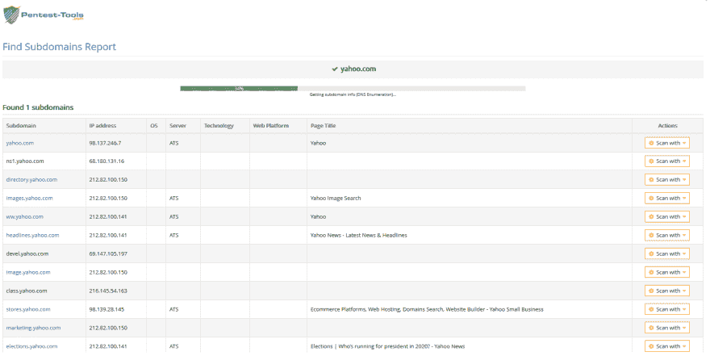
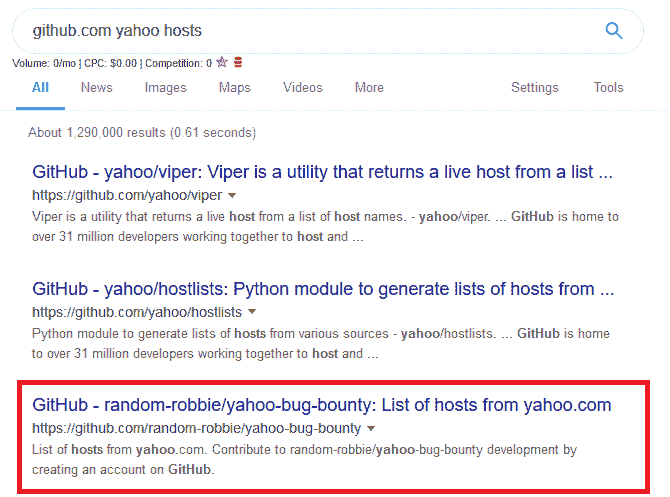

# 如何在网站上找到子域名(以及为什么应该这样做)

> 原文：<https://dev.to/ctrlshifti/how-to-find-subdomains-and-why-you-should-3he1>

这是一个发现网站子域的指南。我将介绍什么是子域，为什么你应该搜索它们，以及如何找到它们。

*Assumed knowledge:*

*   *基本 Linux/Unix 命令*

### 什么是子域？

从表面上看，子域只是域名的附加部分。在示例“*dev.mytotallysecurewebsite.com*”、“*mytotallysecurewebsite.com*”是根域，“*开发*”是子域。

作为一名开发者，创建子域可以让你创建一个完全独立的站点，但仍然使用你的根域。例如，创建一个子域来测试还没有准备好部署在官方网站上的新功能是很常见的。

开发子域通常用于“隐藏”新的和未测试的特性。仅仅通过访问 mytotallysecurewebsite.com，普通用户根本不知道像 dev.mytotallysecurewebsite.com T2 T3 这样的东西存在。

### 为什么要找子域？

通常，开发/测试子域是开发者的肮脏的小秘密。许多公司会投入大量的金钱和精力来确保他们的根域名尽可能的安全，但是却完全忽视了他们的子域，认为它们永远不会被发现。

但是，如果没有适当的控制，如防火墙，子域最终会被发现。你不能对谷歌或者一个特别好奇的黑客隐瞒任何事情。

如果你是一个拥有“隐藏”子域的开发者，对一些子域枚举器运行你的站点是一个好的实践。因为如果你能找到它，别人可能已经找到了。

作为一个测试者，子域列举将是你侦察的一个关键部分。子域可能比根域包含更多的漏洞。当我决定如何测试一个网站时，搜索子域是我首先要做的事情之一。

### 使用谷歌查找子域名

我不知道你为什么要这样做，而不是使用自动化工具。但我告诉你怎么做。

使用谷歌的“站点:”过滤器，我们可以看到谷歌为一个站点发现的一些子域名。

T4】

然后我们可以添加“-inurl:”过滤器来排除我们已经找到的子域，让我们看到更多。

T3】

你可以像这样不断迭代，直到你用完了子域，或者厌倦了，就用一个自动工具来代替。有数百种像样的子域枚举工具，所以我不会把它们都扔给你，我只列出我经常使用的。如果我错过了你的最爱，请不要对我大喊大叫！

免责声明:这些工具中的一些是蛮力，会触发警报。警报在某些情况下可以很好，但在其他情况下[不理想](https://www.google.com/search?client=firefox-b-d&q=prison)。
T3】

### Censys.io

Censys.io 是一个非常棒的工具，它能给你很多关于网站的信息。它可以用以下搜索字符串潜在地找到子域名:【https://censys.io/certificates?q=.examplesite.com】

T4】

Github 上还有一个[不错的工具，可以自动找到带有 Censys.io 证书的子域名。
T3】](https://github.com/christophetd/censys-subdomain-finder)

### pentest-工具

Pentest-Tools 是另一个寻找子域的网络应用。这很容易使用——只需输入根域并点击扫描。
T3】

T4】

### 用有感光胶的金属板做套色印刷的方法

Aquatone-discover 是我最喜欢的子域工具之一。运行它需要一点时间，但是它通常非常健壮，并且会产生很多结果。通常，我会先运行 Aquatone-discover，然后在等待 Aquatone 完成时让其他工具运行。
T3】

### 子列表 3r

[Sublist3r](https://github.com/aboul3la/Sublist3r) 严重惊艳。Sublist3r 使用开源智能来查找子域，通常会在几分钟内给你结果。当你渴望开始的时候，它是很棒的。当我的其他工具运行完毕时，我通常已经快速浏览了 Sublist3r 给我的所有域。
T3】

### 清除

面对现实吧——你可能不是最好的黑客。你正在做的任何事情，别人可能已经做得更好了。

我喜欢尝试的事情之一是谷歌搜索“site:github.com hosts example . com”，或者只搜索“site:github . com”以及我已经发现的一两个子域名。如果你幸运的话，有人可能已经为你测试的站点建立了一个子域名的转储(或者不幸的是，如果这是你自己的站点)。

T4】

除了在 Github 中搜索，Pastebin 也可以有结果。这是一个很好的方法来节省你自己的一点努力，如果你正在做的错误奖金，许多 pentesters 已经检查了该网站。

### 把所有的放在一起

如果你是一个网站开发者并且有子域名，在你的网站上运行扫描是检查你暴露程度的一个很好的方法。不要以为只要你配置了 robots.txt 就没人会发现你的子域。

如果你是一个圣灵降临者，这是了解你目标攻击面的重要一步。如果你正在做大范围的 bug 奖励，有时甚至完全忽略官方域，只专注于子域也是值得的。

黑客快乐！

*本帖最初发表于[explainhownow.com](https://www.explainhownow.com/)T3】*