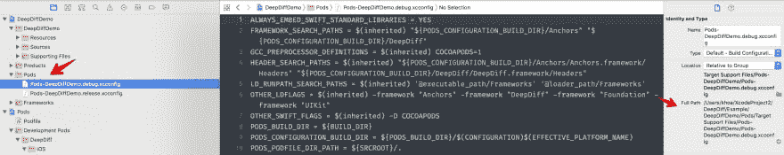
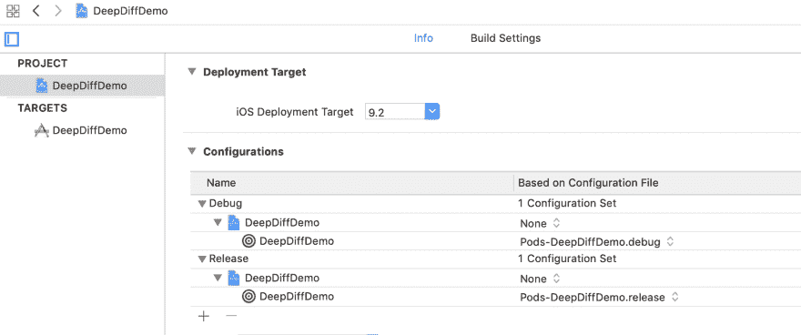

# 如何用 CocoaPods 修复方法错误-未定义的方法“real_path”

> 原文：<https://dev.to/onmyway133/how-to-fix-methoderror---undefined-method-realpath-with-cocoapods-4l2l>

[](https://res.cloudinary.com/practicaldev/image/fetch/s--XAnj_DFr--/c_limit%2Cf_auto%2Cfl_progressive%2Cq_auto%2Cw_880/https://user-images.githubusercontent.com/2284279/53346190-d3622880-3916-11e9-9028-ad0a6a37b277.jpg)

我在 React 本地应用程序中使用 cocoa pods 1 . 6 . 0 beta 2，它一直工作得很好。我需要的吊舱是`Firebase`和`FacebookSDK`。今天安装完吊舱后，我得到了错误

```
NoMethodError - undefined method `real_path' for nil:NilClass 
```

然后我尝试运行`pod deintegrate`从头开始，但是这个命令也失败了。

我下一次尝试使用`cocoapods 1.6.0`和`cocoapods 1.6.1`，但问题仍然存在。

在 Ruby 中,`undefined method`意味着我们正在调用一个对象上的方法，这个对象是 nil。我喜欢通过阅读代码来追踪问题，但是这个错误非常模糊。

仔细查看日志，我发现 CocoaPods 已经获取了依赖项，但是在集成步骤失败了，所以我的项目文件一定有问题。

然后我回溯提交到`project.pbxproj`，看看是否有什么问题。原来有一个提交意外地从项目中删除了`Pods-MyApp Staging.release.xcconfig`。这也伴随着
的下台

```
baseConfigurationReference = B7FC69316CC27F11022F8A82 /* Pods-MyApp Staging.release.xcconfig */; 
```

## CocoaPods 使用 xcconfig

如您所知，CocoaPods 使用`xcconfig`文件来声明 pod 相关信息，如`FRAMEWORK_SEARCH_PATHS`、`OTHER_LDFLAGS`和其他变量，如

```
PODS_BUILD_DIR = ${BUILD_DIR}
PODS_CONFIGURATION_BUILD_DIR = ${PODS_BUILD_DIR}/$(CONFIGURATION)$(EFFECTIVE_PLATFORM_NAME)
PODS_PODFILE_DIR_PATH = ${SRCROOT}/.
PODS_ROOT = ${SRCROOT}/Pods 
```

而对于一个普通的`pod install`，CocoaPods 会给你的项目添加一些`xcconfig`文件，路径是`Pods/Target Support Files/Pods-DeepDiffDemo`。对于你的每个项目目标，总会有`debug.xcconfig`和`release.xcconfig`。

[](https://res.cloudinary.com/practicaldev/image/fetch/s--Vl72h1Ul--/c_limit%2Cf_auto%2Cfl_progressive%2Cq_auto%2Cw_880/https://user-images.githubusercontent.com/2284279/53345363-0dcac600-3915-11e9-975f-e6a7207912d0.png)

如果你的项目 MyApp 有一个名为`MyApp Production`和`MyApp Staging`的生产目标，那么你应该有这些文件

```
Pods-MyApp Staging.debug.xcconfig
Pods-MyApp Staging.release.xcconfig
Pods-MyApp Production.debug.xcconfig
Pods-MyApp Production.release.xcconfig 
```

这些被添加到项目中，但没有被检查到任何目标中。就像 plist 一样，不需要给 target 添加 xcconfig 文件。

如果您转到项目信息页面，您将看到这些 xcconfig 文件被选中

[](https://res.cloudinary.com/practicaldev/image/fetch/s--xDieM4AS--/c_limit%2Cf_auto%2Cfl_progressive%2Cq_auto%2Cw_880/https://user-images.githubusercontent.com/2284279/53345592-93e70c80-3915-11e9-9826-3d1b9f30b900.png)

## 缺少 xcconfig

在我的例子中，`Pods-MyApp Staging.release.xcconfig`不知何故从项目中消失了，因此所有 pod 命令都失败了。

修复方法是重新添加该文件，并在项目信息页面中选择 xcconfig

原帖[https://github.com/onmyway133/blog/issues/170](https://github.com/onmyway133/blog/issues/170)