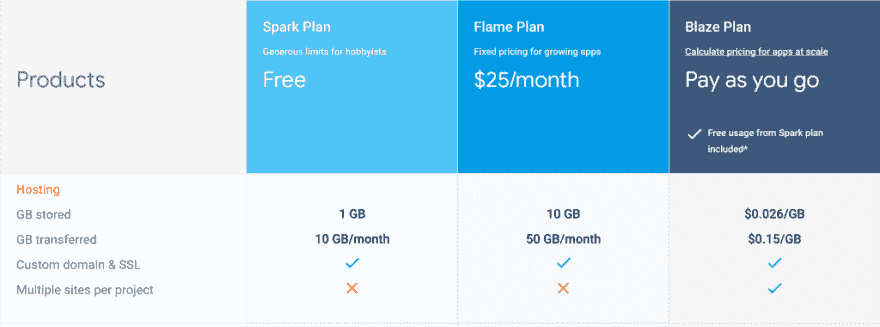
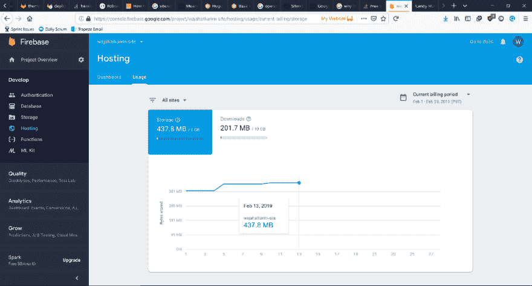
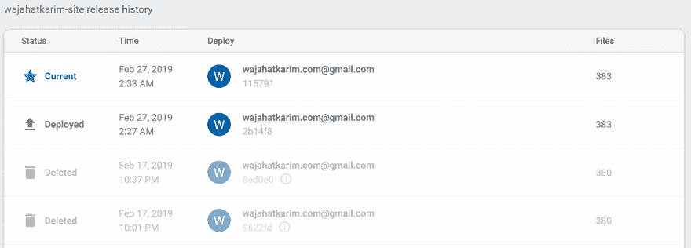
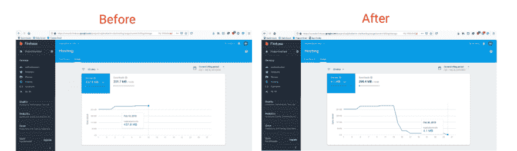

# ✅如何为你的静态网站释放无用的空间？

> 原文：<https://dev.to/wajahatkarim/how-to-free-up-useless-space-on-firebase-hosting-for-your-static-websites-1d0g>

#### 了解我如何在 Firebase 主机上将 Hugo 网站的存储空间从 437.8 MB 减少到 4.1 MB。

<figure> 

<figcaption>Firebase 主机标识</figcaption>

</figure>

> 这篇文章是我今天学习的系列的[的一部分，最初发布在我的](https://medium.com/p/65c64e1dcb6) [TIL Github 库](https://github.com/wajahatkarim3/Today-I-Learned/)和我在 wajahatkarim.com[的网站](http://wajahatkarim.com)

* * *

去年 2018 年 4 月，我将[我的网站](https://wajahatkarim.com)从 [Wordpress](http://wordpress.org) 迁移到 [Hugo](https://gohugo.io/) ，一个内置 go 语言的静态网站生成器框架。我通过 [Mochahost](https://www.mochahost.com/) 为 Wordpress 网站的托管服务器空间每月支付 5 美元。迁移到 Hugo 让我从每月付费中解脱出来，它的简单性让网站管理变得更加容易，就像 breeze 一样。

点击这里查看我的网站！

我在 [Firebase Hosting](https://firebase.google.com/products/hosting/) 上托管了这个新网站，因为他们的[免费星火计划](https://firebase.google.com/pricing/)给了我一个非常大的 1 GB 的存储空间和每月 10 GB 的带宽。

<figure> 

<figcaption>为 Firebase 托管定价— [来源](https://firebase.google.com/pricing/)</figcaption>

</figure>

我创建我的网站主要是为了展示和投资目的，所以我对高流量等没有太多的期望。此外，Hugo 是一个静态网站生成器，因此 1 GB 足以存储 10，000 篇中等质量图像的博客文章。这非常符合我的要求，也帮助我摆脱了每月支付托管服务器的费用。

经过几天的工作，一些谷歌搜索，和许多杯茶，我设法创建了一个简单的网站，并以某种方式将其部署在 Firebase 主机上，并连接我的 SSL 域。我将在一篇深入的文章中更详细地描述这个过程。

* * *

### 🔥问题— Firebase 托管存储很快就会填满

在 6-7 个月的时间里，一切都很好。网站已经建立并运行。只要我有时间，我就不断地添加新的帖子和页面。然后有一天(几天前的 2 月 13 日)，我检查了 Firebase 控制台，震惊地看到我的网站的存储大小。

<figure> 

<figcaption>[我的网站](https://wajahatkarim.com)托管空间 2 月 13 日在 Firebase 控制台上</figcaption>

</figure>

我很快检查了我的笔记本电脑中生成的网站文件，看到了大小。大约是 30 MB。现在我很惊讶，为什么这个简单的微型静态网站只有很少的 HTML 和 CSS 文件，却要占用大约 500 MB 的空间？

> 这几乎是我的网站在 Firebase 上的免费配额的 50%。

我网站上的图片是托管在 Cloudinary 上的，所以 Firebase 不可能使用图片中的空间。直到这一点，我已经意识到，也许我的网站并不都好，直到现在。这是我的无知和粗心，没有检查所有这几个月的使用和 Firebase 配额。

然而，仪表板选项卡显示了一些有趣的东西。它向我展示了我完成的所有部署以及每个部署添加的文件数量。

<figure>

<figcaption>[我的网站](https://wajahatkarim.com)的仪表盘选项卡上 Firebase 主机控制台</figcaption>

</figure>

Hugo 的工作方式是将你所有的 markdown 文件转换成 HTML 和 CSS 文件，创建一个静态网站。默认情况下，这些文件存储在一个名为 Public 的目录中，但是您也可以更改它。我在 Firebase 主机上部署了整个“公共”目录，它向我展示了一个很棒的网站。

* * *

### ✔️解决方案:删除所有旧部署

在挖掘了一些关于 Firebase 托管和部署的细节之后，我发现了一个非常简单的解决方案。您所要做的就是删除旧的部署。就是这样。别担心，这些不会对你的网站有任何影响。下面是我录制的简单 GIF，向您展示我们如何删除 Firebase 托管中的旧部署。

<figure> 

<figcaption>删除之前在[我的网站](https://wajahatkarim.com)</figcaption>

</figure>

控制台中的 Firebase 托管部署

我大概有 300 次部署。根据我在部署中添加的帖子和内容，每个部署都添加了 100 多个文件。这不断增加了 Firebase 主机的总存储量。

如果您删除所有部署，除了一些最新的，那么您可以大大减少 Firebase 用于静态网站的大小。这是一张对比图，展示了我的网站在采用这种解决方案后，存储容量是如何减少的。

<figure> 

<figcaption>[我的网站](https://wajahatkarim.com)的存储大小前(左)后(右)</figcaption>

</figure>

正如您在上面的图片中所看到的，在删除了所有(大约 300 个)之前的部署之后，我设法将网站的存储从 437.8 MB 减少到了 4.1 MB。这对我和我的网站来说真是太大了。我希望这也能帮助你减少网站的存储空间。

* * *

**如果你喜欢这篇文章，你可以在下面的 2018 年回顾中阅读我的新文章:**

[对 2018 年的反思——我的回顾之年](https://dev.to/wajahatkarim/reflections-on-2018my-year-in-review-144)

* * *

**Wajahat Karim** 毕业于[NUST](http://nust.edu.pk)，是一名经验丰富的移动开发人员，一名活跃的开源贡献者，也是两本书[学习 Android 意图](https://www.amazon.com/Learning-Android-Intents-Muhammad-Usama/dp/1783289635)和[用 Unity 掌握 Android 游戏开发](https://www.amazon.com/Mastering-Android-Game-Development-Unity/dp/1783550775/)的合著者。在业余时间，他喜欢花时间和家人在一起，做编码实验，喜欢写很多东西(主要是在博客和媒体上)，并且是开源的热情贡献者。2018 年 6 月，他的一个库成为了 [Github 趋势](https://github.com/trending)上的第一名。[他的库](http://github.com/wajahatkarim3)在 Github 上有大约 2000 颗星星，并被全球各地的开发者用于各种应用。在 Twitter 和 [Medium](https://medium.com/@wajahatkarim3) 上关注他，获取更多关于他的写作、Android 和开源工作的更新。

[Wajahat Karim (@WajahatKarim) | Twitter](https://twitter.com/WajahatKarim)

此外，如果你有任何想让他回答的问题，可以通过他的网站联系他，地址是[wajahatkarim.com](http://wajahatkarim.com)，主题栏是亲爱的瓦贾哈特。

* * *