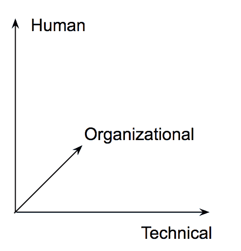

# 如何充分利用你的 pentest

> 原文：<https://dev.to/sqreenio/how-to-fully-leverage-your-pentest-n50>

在共同创立 Sqreen 之前，我花了几年时间从外部(作为一名安全顾问)和内部(作为苹果红队的一员)对应用程序进行压力测试。因此，首席技术官同事经常问我，在 [SaaS 安全](https://blog.sqreen.com/security-best-practices-saas-startups/)和渗透测试(pentests)方面的最佳实践是什么。因此，本文将阐明 pentest 的最佳实践和一些您应该避免的错误。

有很多方法可以主动测试应用程序的安全性。一种更常见的方法是对您的应用程序执行渗透测试。pentest 是一种从中立的第三方揭示您的应用程序和基础架构中的安全问题的方式，您可以利用这种方式对整个公司产生积极影响。

有大量的资源可以帮助你准备 pentest。这篇文章关注的是 pentest 应该向你提供的可操作的知识，而不仅仅是 pentest 提供的报告。

## 五旬节的三轴

 

<figcaption>五旬节的 3 个学习轴
</figcaption>

你可以从渗透测试中获得的知识可以分为三个方面。

*   技术知识:
    *   代码安全性的状态
    *   您的基础设施安全状况
    *   监控和安全警报的质量
*   组织学习:
    *   如何处理新的服务或基础架构变更(例如，迁移到云)
    *   过程和所有权是否被清楚地识别
    *   现有流程的有效性
*   人类的学习:
    *   报告安全问题时团队的反应
    *   公司的方式(层级、利益相关者等。)处理安全报告。

技术报告和与审计员的讨论将主要告诉你技术轴心。然而，这取决于你是否认真准备了你的 pentest，以便带着关键的洞察力和围绕人和组织维度的明确的行动项目离开。

pentest 还提供了一种方法来评估您的安全性如何随着时间的推移而发展。每次渗透测试之后都应该有几天的验证测试——以确保您发现并计划修复的项目确实已经被修复。您还应该向安全审计员提供以前的测试报告，作为发现初始漏洞的起点，迭代现有的漏洞，并确保它们被修复(如果它们再次出现，则意味着发生了回归)。

## **技术学习**

pentest 很可能会让您对您的基础架构和应用程序有新的技术见解。重要的是要彻底分析你的应用程序的技术方面如何应对测试，以及你设置的用于监控和保护你的应用程序的工具如何做出反应。你从圣灵降临节得到的报告会给你一个很好的概述，但是你比任何人都了解你的环境，从它在圣灵降临节的反应中也有很多要学习的。

### 五旬节之前

在 pentest 开始之前，您和您的开发团队应该回顾一下您在安全性方面的积压工作。你的窃听器里有安全标签吗？有多少张票贴有安全标签？他们多大了？

积压中没有安全票据最有可能意味着在安全方面缺乏关注。否则，检查在过去的几个月中解决了多少。如果答案是否定的，这可能意味着您没有足够重视安全性！

此外，确保您的团队掌握最新的技术安全知识:每个人都知道什么是 XSS 吗？打针？同源政策？CSRF？[内容安全策略](https://blog.sqreen.com/content-security-policy/)？如果你的团队有太多的差距，那么你需要在 pentest 结束后开始任何类型的修复之前更新你团队的知识。

### 五旬节期间

当你做 pentest 的时候，你的监控和警报工具的质量和有效性是需要检查的一个因素。团队监控的很多事情都可能因为 pentest 而触发。一个异常管理器，比如 [Sentry](https://www.sentry.io) ，在大多数渗透测试中会有不寻常的活动，你的开发团队需要解释这些活动。

您还应该检查您的性能监控工具(如 [New Relic](http://www.newrelic.com) )，它可以在 pentest 期间突出应用程序的缓慢部分。测试可能会降低应用程序的速度，并对基础架构的某些特定部分(例如数据库或微服务)造成压力。这可能导致检测到潜在的可应用的 DOS，并需要特定的优化或速率限制以防止耗尽它。大多数渗透测试并不寻找 DOS，因为它们专注于测试产品:那是你需要自己寻找的东西。

您的日志监控解决方案也将是一个很好的信息来源，它还可以告诉您应用程序是否变得太慢，并开始超时或出错。值得检查您的日志，看看您在这方面是否有问题。

最终，您的安全工具将生成关于攻击的警报。确保这些警报来自测试人员(基于 IP 地址、用户名等。…)并截图。测试人员会惊喜地发现你设法抓住了他们。

对您的应用程序进行测试的安全研究人员很可能不会注意到所有这些信息，因为他们对您的系统只有一个外部的观点。当这些类型的警报发生时，您需要做出反应并适当地解释它们。

在 pentest 完全结束之前，不要修改测试人员可能向您报告的任何内容。这样做将阻止他们充分理解和利用他们所发现的东西，也阻止他们在这方面发现更多的漏洞。

### 五旬节后

pentesters 在测试结束时向您提交的报告将涵盖他们发现的任何技术漏洞。接下来，由您和您的团队来确定修复的优先级并实施修复。许多 pentests 都有一个验证期，在这段时间里，人们可以要求他们的安全承包商确保报告的弱点已经得到验证。在 pentest 和您的票证之间使用清晰的映射将有助于您相应地组织和优先处理此事。

花点时间和圣灵降临者深入交流他们的发现，以便从锻炼中获得最大收益。Pentesting 公司通常会提供培训，针对一个特别难以理解的漏洞组织半天的培训对于提高开发人员的水平并让他们对这个主题感兴趣可能会特别有用。

此外，该报告还提供了对基础设施安全状态和代码安全状态的即时了解。这也将帮助你后退一步，找出你的团队中的差距所在。您是否应该针对给定的一系列漏洞对您的团队进行培训？改进您的流程，以便在编写规范时更加关注安全性？雇人挑战您团队的安全观点？雇佣一个可能成为安全冠军的人？pentest 报告可以帮助你决定这些问题的答案。

### TL；dr:技术轴心的行动

*   了解您的安全问题积压和您团队的安全知识状况
*   检查您的监控解决方案是否正常工作，并且被开发人员正确使用
*   花时间充分理解 pentesters 生成的报告，并采取具体步骤来提高您在团队中的安全知识以及您在应用程序中的安全性

## 组织学习

Pentests 也能让你深入了解你的组织。您的安全流程在实践中工作(或不工作)的方式，以及您的团队作为一个整体运作的方式，都是需要关注和确定需要改进的关键因素。

### 五旬节之前

这是审查您的安全流程的时候了。确保您的各种流程的职责得到明确定义和清楚了解。您应该知道当发现安全漏洞时应该向谁发出警报。渗透测试突出显示当前被利用的现有漏洞**的情况并不少见，这可能需要快速响应——在漏洞被纠正期间，您可能需要关闭服务。在这种情况下，请确保您知道如何做出反应，以及如何在您的公司内表达和传递这些信息——这可能涉及法律部门和通信部门，尤其是在上市公司的情况下。**

 **### 五旬节期间

团队如何响应安全警报是高效和有效的安全响应的关键要素。团队是否接受过这样的培训？一个过程是否准备好让被呼叫的人对此做出响应？这些过程不经常被触发，所以团队知道如何找到并实现这个过程吗？您的安全工具发送的所有安全警报是否都已移交给相应的团队？例如，代码中的漏洞应该由开发团队来修复，并且可以进行培训，以确保所有工程师都意识到这种特定的安全威胁。此外，任何新加入团队的开发人员也需要接受这种培训。

### 五旬节后

在渗透测试中发现的一些漏洞将来自于未能执行一些过程——或者缺乏过程。最初的修复总是技术性的，比如更改默认密码或升级库。但是问题的根源通常在于缺少或不完整的过程(或不完善的自动化)。

当新技术岌岌可危时，尤其如此。对于您的团队来说，新数据库系统或新云提供商的安全细节可能仍然模糊不清，尤其是从安全角度来看。在这种情况下，应该进行培训，以便您的团队更好地理解这些技术元素，并确保它们得到正确配置。这还包括需要改进向您的基础设施添加新技术的过程:工程师应该接受培训，从安全的角度达到适当的技术知识水平。还可以对任何新的元素系列进行安全审查。

### TL；dr:组织轴心的行动

*   检查您是否有适当的程序，以防发现重大缺陷
*   检查您的流程是否定义了明确的所有权
*   测试您的过程，以确保人们知道如何应用它们

## 人类的学问

Pentests 可以告诉你很多关于你团队中的个人的信息。他们的反应和回应可以传达很多关于他们对安全的准备和心态。

### 圣灵降临前:接受观念

对于许多技术人员来说，他们的工作是构建和操作系统，知道渗透测试正在他们构建的东西上运行可能会被视为对他们技能和智力的冒犯。这也可以理解为缺乏来自下令进行测试的人的信任。

当然，这是他们自我驱动的自发反应，可能不会持续很久。团队将很快意识到渗透测试有两个积极的结果:

*   首先，这是一个很好的学习机会，因为大多数安全专业人员会以教学的方式详述他们的报告。学习是 IT 专业人员最普遍的动机之一。
*   其次，这是优先处理产生安全债务的遗留任务的绝佳机会——安全债务是技术债务的子集。

这里的要点是，你向团队展示 pentest 的方式很重要。不要以合规性借口作为测试的理由，而是要清楚地利用这些积极的方面来让团队欢迎安全测试。

为了减轻 pentest 对团队精神的影响，提前告诉他们测试即将到来，并承诺他们会知道时间表(例如 3-6 个月)。给他们一个范围，而不是一个确切的日期，也为他们创造了一个机会，让他们养成在短跑中考虑安全的习惯，以及改善或检查安全问题的警报系统。团队经常意识到积压已久的安全问题，因此提前沟通给了他们解决这些问题的机会。

### pentest 期间:监控&对攻击的反应

当测试正在进行时，团队会被您的安全警告工具警告，如果您有一个(您应该有)。关键问题需要立即响应(取决于您与安全审计员的协议),并将由团队中的某个人来处理。

特别注意这些安全问题中人的一面。它们对您团队的心理影响会比一般的 bug 更大，因为它们被证明具有安全影响，并且会在安全审计员的报告中被强调，该报告可能会贯穿公司的整个层级。这可能会暴露团队成员之间的紧张和相互指责。这是提醒每个人仁者格言的恰当时机:每个人都在尽力而为。如果犯了错误，他们需要被理解，团队应该相应地采取行动，以确保他们不会再次发生。重要的是纠正错误，而不是指责，所以整个过程应该无可指责地进行。

### 五旬节后

安全审核结束后，团队需要汇报结果。测试中检测到的内容需要提交到一个共享文档中，并由每个人来丰富。让一个广泛的团队参与进来会让结果更好。

安全成功(例如，成功检测到攻击、pentesters 无法破解的系统部分等。)需要被强调和称赞，失败(例如，检测到和利用的漏洞，发现的弱点)必须被添加到您的缺陷跟踪系统中，并以特定的方式列出它们(用诸如“Q2 渗透测试”的标签)。如同任何其他问题一样，这些问题需要优先处理。大多数安全顾问会对他们的发现进行排序，以帮助您确定要修复的内容的优先级，但他们通常并不了解您的业务。这意味着您需要更深入地了解您的团队(如果问题结果不完全清楚，可能还需要安全顾问)，以便正确地对它们进行评级和优先级排序。

发现的每个问题(例如公司控制器中的 MongoDB 注入)都需要进行多次归纳。例如，“如果我们在这个控制器中有注入，我们可能在其他控制器中有一些注入”。“如果我们有注入，也许我们不擅长净化输入，让我们检查用户输入”。诸如此类。这将直接利用你的团队解决问题的技能。

最后，分析你的公司对测试中出现的坏消息的反应。安全是一个敏感的话题，可能会将人们置于他们认为敏感的位置，并使他们产生比平时更大的压力。诚信、诚实和透明对员工来说是至关重要的价值观，有助于他们主动报告安全问题，而不是隐瞒问题。为了提出这些问题，必须倾听和鼓励他们。这不仅仅意味着陈述价值观。人们会读到每个人在圣灵降临节期间的反应，并将其内化。

当发现安全漏洞时，一个典型的反应是这样的:“这确实是一个 XSS，但它是不可利用的，因为只有用户可以对自己这样做。”这种反应是可以理解的:如果漏洞不能被利用，我们为什么要修复它？

让我们把这个漏洞当作一个常规的 bug。你怎么处理普通的虫子？您修复那些可以快速修复的，或者会伤害您的，或者会危及您的应用程序的。你也吸取了教训，并确保这种错误不会再次发生。安全漏洞必须以同样的方式来考虑。如果它发生了一次，它可能会再次发生，并且如果应用程序中存在漏洞的部分后来在其他地方被重用，该错误将会传播。在这种情况下，其可利用性将产生不同的影响。

它*是*一个普通的错误，但是有安全后果。这值得你的团队给予不同程度的关注。

### TL；大卫:人类轴心的行动

*   在 pentest 发生之前，花点时间和你的团队讨论一下，并以正确的方式呈现给他们
*   在 pentest 期间，注意你的团队的心理方面。确保每个人都知道，无论发现什么，都与指责无关
*   花时间与您的团队进行全面的汇报，并以公平的方式对发现的安全问题进行优先排序和记录

## 需要帮助吗？

如果您有兴趣了解更多关于最大化您的 pentest 的信息，我们整理了一份 [Pentest 最佳实践清单](https://www.sqreen.com/checklists/pentest-checklist)。看看吧！

Pentesting 可以让您对您的安全性有一个很好的即时了解，并向您显示需要修复的关键问题。Sqreen 可以通过实时监控和保护以及可操作的警报来帮助您解决这些问题。他们一起工作很棒！[今天就免费试用](https://my.sqreen.io/signup)或[报名试玩](http://sqreen.com/demo)。

帖子[如何充分利用你的 pentest](https://blog.sqreen.com/leverage-pentest/) 首先出现在 [Sqreen 博客|现代应用安全](https://blog.sqreen.com)上。**