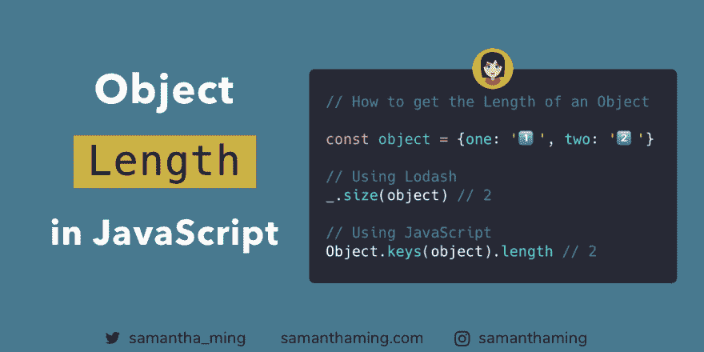

# 如何获得一个对象的长度

> 原文：<https://dev.to/samanthaming/how-to-get-an-object-length-30pd>

[](https://res.cloudinary.com/practicaldev/image/fetch/s--1TQ7hJNg--/c_limit%2Cf_auto%2Cfl_progressive%2Cq_auto%2Cw_880/https://thepracticaldev.s3.amazonaws.com/i/sf0t2ir572d8elv1oic9.png)

与数组不同，获取对象长度总是很棘手。不会再有了！Object.keys 返回所有对象的可枚举属性键的数组。之后，你可以简单地调用`length`，瞧！你知道物体的长度🎉

```
const object = {one: '1️⃣', two: '2️⃣'};

// Using Lodash
_.size(object); // 2

// Using JavaScript
Object.keys(object).length; // 2 
```

## 为什么我们不能在一个对象上调用`length`

你可能想知道为什么我们不能直接在我们的对象上调用`length`。让我们看看当我们这样做时会发生什么:

```
const object = {one: '1️⃣', two: '2️⃣'};

object.length; // undefined

object.hasOwnProperty('length'); // false 
```

你不能这么做，因为`object`没有`length`属性。只有`string`和`arrays`有`length`房产。

```
const string = 'hello';
const array = [1,2,3];

string.hasOwnProperty('length'); // true
array.hasOwnProperty('length'); // true 
```

## 什么是可枚举

好吧，让我们讨论另一个话题。我在开头提到过，`Object.keys`返回一个由**可枚举的**属性键组成的数组。所以让我们弄清楚这个`enumerable`属性是从哪里来的。

### 分配一个属性

通常，当我们想给一个对象添加一个属性时，我们可能只需要使用点符号:

```
const object = {};

object.one = '1️⃣';

console.log(object); // { one: '1️⃣' } 
```

### 定义一个属性

或者，我们也可以使用`Object.defineProperty`。它接受 3 个参数。它在*属性描述符*中，我们可以在这里设置我们的可枚举属性。

```
Object.defineProperty(object name, property name, property descriptor) 
```

好，让我们用这个方法定义一个属性:

```
const object = {};

Object.defineProperty(
  object,
  'one', {
    value: '1️⃣'
  }
);

console.log(object); // {} 
// ☝️ Why is it empty? 🤔 
```

嗯...太奇怪了。为什么我们的财产没有出现🤔这是因为当我们这样定义属性时，`enumerable`属性默认为`false`。所以如果我们想要它出现，我们需要设置`true`给它。

```
const object = {};

Object.defineProperty(
  object,
  'one', {
    value: '1️⃣',
    enumerable: true // 👈
  }
);

console.log(object); // { one: '1️⃣' } 
// ☝️ Great, it shows up now! 
```

### 可枚举默认为真

让我们回到用点符号设置的对象属性示例。为什么会自动出现？这是因为当我们以这种方式分配一个属性时，`enumerable`属性被自动设置为`true`。

```
const object = {};

object.one = '1️⃣';

object.propertyIsEnumerable('one'); // true 
```

### 可列举摘要

对于我们大多数人来说，在定义我们的属性时，我们很少触及可枚举属性。当我们使用`Object.keys`迭代对象时，这只是我们控制我们创建的特定属性是显示还是保持隐藏的一种方式。

如果你想了解更多关于可枚举性的知识，我推荐阅读这篇文章，ECMAScript 6 中的[可枚举性。](http://2ality.com/2015/10/enumerability-es6.html)

> 因此，属性 enumerable 用于隐藏不应迭代的属性。这就是在 ECMAScript 1 中引入可枚举性的原因。

*阿克塞尔·劳施迈尔博士，2 年*

## object . keys vs object . getownpropertynames

现在您已经理解了`enumerable`，让我们来介绍另一个方法，您可能会看到它是获取长度的一个选项，`Object.getOwnPropertyNames`。

```
const object = {one: '1️⃣'};

Object.defineProperty(
  object,
  'two', {
    value: '2️⃣',
    enumerable: false
  }
);

Object.keys(object); // [ 'one' ]

Object.getOwnPropertyNames(object); // [ 'one', 'two' ] 
```

如您所见，`Object.getOwnPropertyNames`将返回所有属性键，而`Object.keys`将只返回可枚举的属性键。正如我之前提到的，可枚举属性可能因为某种原因而被隐藏，所以你可能不想访问它。因此，`Object.getOwnPropertyName`可能不是您想要用来获取对象长度的方法。

## 物体长度用符号表示

之前你默认为`Object.keys`来获取物体长度。我想再指出一点考虑。在 ECMAScript 6，ES6 中，引入了一种新的原始数据类型，称为`symbol`。你可以使用`symbol`作为一个对象的属性名。

```
const animal = {
  [Symbol('ghost')]: '👻',
  turtle: '🐢'
}; 
```

但是问题是当您有一个`symbol`作为属性名时。`Object.keys`和`Object.getOwnPropertyNames`都不行。

```
Object.keys(animal);
// [ 'turtle' ] <-- no symbol

Object.getOwnPropertyNames(animal);
// [ 'turtle' ] <-- no symbol 
```

所以一个解决办法就是使用`Object.getOwnPropertySymbols`

```
Object.getOwnPropertySymbols(animal);
// [ Symbol(ghost) ] 
```

现在结合这两种方法，你会得到适当的长度。

```
const enumerableLength = Object.keys(animal).length;
const symbolLength = Object.getOwnPropertySymbols(animal).length;

const totalObjectLength = enumerableLength + symbolLength;
// 2 <-- 👍 
```

## 社区输入

*[@尤金·卡拉塔耶夫](https://dev.to/karataev/comment/a57o)* : Chrome 在控制台显示**不可枚举的**属性。它只是稍微显示了它们的不同——不像可枚举的那些那么明亮

[](https://res.cloudinary.com/practicaldev/image/fetch/s--FD2YnBUD--/c_limit%2Cf_auto%2Cfl_progressive%2Cq_auto%2Cw_880/https://thepracticaldev.s3.amazonaws.com/i/up6o4ozejq30mg9nnlr0.png)

* * *

## 资源

*   [MDN 网络文档:Object.keys](https://developer.mozilla.org/en-US/docs/Web/JavaScript/Reference/Global_Objects/Object/keys)
*   [MDN Web Docs: Object.getOwnPropertyNames](https://developer.mozilla.org/en-US/docs/Web/JavaScript/Reference/Global_Objects/Object/getOwnPropertyNames)
*   [MDN Web Docs: Object.getOwnPropertySymbols](https://developer.mozilla.org/en-US/docs/Web/JavaScript/Reference/Global_Objects/Object/getOwnPropertySymbols)
*   [MDN Web 文档:对象](https://developer.mozilla.org/en-US/docs/Web/JavaScript/Reference/Global_Objects/Object)
*   [2 ality:ES6 中的可枚举性](http://2ality.com/2015/10/enumerability-es6.html)
*   [2 事实:财产定义与转让](http://2ality.com/2012/08/property-definition-assignment.html)
*   [堆栈溢出:何时使用 Object.defineProperty](https://stackoverflow.com/questions/10105824/when-do-you-use-object-defineproperty)
*   [堆栈溢出:如何使用 JavaScript object . define property](https://stackoverflow.com/questions/18524652/how-to-use-javascript-object-defineproperty)
*   [堆栈溢出:object . getownpropertymanames vs object . keys](https://stackoverflow.com/questions/22658488/object-getownpropertynames-vs-object-keys)
*   [堆栈溢出:JavaScript 对象的长度](https://stackoverflow.com/questions/5223/length-of-a-javascript-object)

* * *

**感谢阅读❤**
问好！[insta gram](https://www.instagram.com/samanthaming/)|[Twitter](https://twitter.com/samantha_ming)|[脸书](https://www.facebook.com/hisamanthaming) | [媒体](https://medium.com/@samanthaming) | [博客](https://www.samanthaming.com/blog)