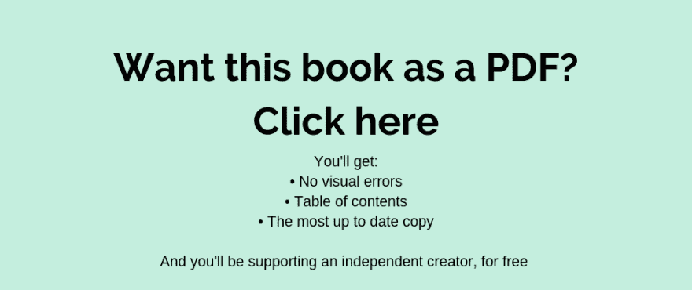

# 如何找到你想要的工作——就业技能指南

> 原文：<https://dev.to/brandonskerritt/how-to-get-any-job-you-want-a-guide-to-employability-skills-1i3m>

这是我写的一本 34000 字的求职书。它现在就在这里免费提供，没有陷阱。说真的。你不需要购买任何东西或注册任何东西。这是整本书，免费的，去掉了 0 个内容，增加了 0 个内容。真的很长。如果你想方便地翻阅页面或有一个漂亮的目录，你可以在这里购买这本书[亚马逊英国](https://www.amazon.co.uk/How-Get-Any-Job-Want/dp/1916046312/ref=sr_1_fkmrnull_1?keywords=brandon+skerritt&qid=1554463132&s=gateway&sr=8-1-fkmrnull)。

如果你想要一个漂亮的目录，但又不想买的话， [**注册我的邮件列表。**](https://page.skerritt.blog/job/) 你会得到这本书精美的 PDF 格式。[在这里报名](https://page.skerritt.blog/job/)

另外，这是使用 Pandoc 自动转换的。这篇博文可能有一些视觉上的错误。请忽略它们，它们不在书里(或者 pdf，如果你注册了我的[邮件列表](https://page.skerritt.blog/job/))。

发现一个错误或想对此资源有所贡献？GitHub 回购在这里是。如果你做了编辑，你的名字会出现在这本书的致谢部分(当我下次更新它的时候)。或者可以留言评论。😁

##  [蜜蜂山](https://github.com/bee-san) / [就业书](https://github.com/bee-san/Employabiltiy-book)

### 我的书的回购，如何得到任何你想要的工作

<article class="markdown-body entry-content container-lg" itemprop="text">

# 这是什么？

这是 GitHub 为我的职业书籍准备的回购。使用 Pandoc 将这本书转换成 HTML。HTML 在我的博客 [Skerritt.blog](https://skerritt.blog) 的 [Ghost](https://ghost.org) 上渲染成 HTML 卡片。

这是一本 34，000 字的书，涵盖了你想了解的所有就业技能。你可以在我的博客上免费在线阅读整本书:

[看这里](https://page.skerritt.blog/job/)

## 我在哪里能读到这个？

在我的博客上:

[看这里](https://page.skerritt.blog/job/)

如果你注重隐私，我的博客不会跟踪你。没有谷歌分析，没有广告网络。我的评论系统甚至允许匿名评论。

阅读这本书的另一种方法是下载 HTML 文件并自己查看。

## 能给我一份 PDF 吗？

当然可以。只需注册我的[电子邮件列表](https://page.skerritt.blog/job/)即可。你会得到 PDF 格式的精美目录。

## 你的书里有一个错误！或者我想补充一下

…</article>

[View on GitHub](https://github.com/bee-san/Employabiltiy-book)

# 前言

专业技能，仅仅是这个词的低语就让我想睡着。这是一个非常无聊的话题，无法回避。所以很多人在专业技能课上睡着了，或者从来没有花时间去学习这些至关重要的技能。

这使得参加无聊课程的人和没有参加的人有很大的不同。每年都有那么多人申请研究生工作，我敢打赌其中 95%的人都没有专业技能方面的经验。正因为如此，市场出现了缺口。如果你有基本的专业技能，你会比 95%的申请人看起来更好。

专业技能至关重要。即使你不想了解太多。对于像我这样学习专业技能的书呆子来说，我们知道这是真的。这是一个无聊的话题，但是如果你学习这个无聊的话题，你将会成为雇主眼中最棒的人。

学位不重要。除非你没有。如果你有，也没关系。99%申请研究生初级职位的人都有学位。一个学位不会让你脱颖而出，无论你多么努力地去争取那个学位。你需要让自己与众不同，展示你不仅仅是一个学位头衔。你可以做到这一点的方法之一是学习专业技能。

这本书是为那些明白这是一项重要技能，但没有知识或方法去学习它的人而写的。这本书是为那些迫切想学习这些技能，但却在课堂上睡着了的人写的。

如果你对在开始工作前获得加薪没有兴趣，或者对成为一家公司有史以来最好的实习生没有兴趣，那么放下这本书。不要读它。这不是给你的。

其中一个读了这篇文章初稿的人在开始之前就获得了提升。他们的简历是“我们见过的最好的东西”，正因为如此，这个人在所有不具备制作简历基本知识的人中间被视为神。

让我告诉你一个秘密。对于少数痴迷于专业技能的人来说，获得实习机会是一场游戏。我不是在开玩笑。我的一个朋友在第一年获得了 36 个实习机会，比如美国银行、巴克莱银行、苏格兰皇家银行、亚马逊、苹果等等。我有更多的朋友取得了类似的成就。

对于少数人来说，专业技能是一种游戏。我尽可能多地采访了他们，以了解这个游戏的秘密，如何得到你想要的任何工作。这本书汇集了这个排外团体的智慧和更多。

## 职业与工作

让我们直接进入今天的工作。工作是你为了钱而做的事情。你的兼职乐购工作是一份工作。职业就是你的生活，你在用你的生活做什么。这是任何可以接管你生活的东西。例如，大学教授。

有了工作，你就得轮班工作，仅此而已。你什么都不做。

有了职业，你可以轮班工作，回家后，你还可以继续工作。你可能会去参加会议，你可能会建立关系网，你可能会为了在工作中提高自己而学习一些东西。以下是最大的区别:

| **职业生涯** | **工作** |
| 长期的 | 短期 |
| 大量的增长和机会 | 低增长或无增长 |
| 赚钱经验 | 赚钱 |
| 超越 | 做最起码的事 |
| 很高兴你开始工作了 | 对你被迫工作感到愤怒或沮丧 |
| 与公司的核心价值观保持一致 | 不感兴趣或不关心核心价值观 |
| 想在公司的阶梯上往上爬 | 寻找一份薪水更高的新工作 |
| 职业是一段旅程 | 工作是一种折磨 |

## 工作周期

当你在大学时，为了得到一份好的毕业工作，你通常必须遵循一定的循环。循环是:

洞察日>春季实习>夏季实习>实习年>毕业工作。

你不需要做所有这些事情。大多数人绕过它的典型方式是:

暑期实习(或实习年) >毕业工作。

你在这个周期的起点越低，你就越有可能找到工作。这个周期没那么重要，除非你申请的是某个独家的地方。如果你想在美国银行这样的地方工作，你需要遵循这个循环。

美国银行宁愿雇佣和他们一起经历了整个周期的人，也不愿雇佣没有经历过的人。这一点很重要，因为他们是一家如此大的公司，甚至他们的洞察力日也很快填满。如果他们有数百人参加了洞察日活动，甚至是他们的校园大使，他们就不需要为那些只做过实习的人费心了。

较低层次(洞察日，春季实习，有时是夏季实习)是从同行业的其他公司结转过来的。

如果你在 BlackRock 做过 insight days 和春季实习，美国银行会认为你在这个行业真的很好。当然，他们总是会选择曾经在自己公司工作过的人，而不是刚刚在竞争对手公司工作过的人，但是你不能指望仅仅为了在一家公司获得一个机会就去做 20 天洞察日/ 20 次春季实习。

大多数洞察日/春季实习只是一家公司的广告。

## 得到那份工作

关注 5 家公司比申请 100 家好。我敢打赌，申请了 5 家公司、研究了每家公司并了解所有公司的人会比申请了 100 家公司但对他们申请的公司一无所知的人获得更多的毕业生工作机会。

如果你有实习机会，招聘人员会给你一些好建议，告诉你如何把实习机会变成一份研究生工作。

这个建议来自安德鲁·奥萨耶米。

“所以，你很幸运有一个春季或夏季的实习机会&你正在寻找一条非传统的建议，来帮助你增加获得全职毕业生工作的机会？

建议很简单——每天每隔 2-3 个小时问问你团队中的每个人是否想喝茶或咖啡

带着温暖的微笑去做。

如果他们说不——仍然微笑&礼貌地说“没问题，如果你需要什么，请告诉我！”

如果他们说是，仔细写下他们的订单，这样你就不会把它弄乱，包括任何特殊要求(豆浆，10 糖等)

当你拿着他们选择的饮料回来时，再次确保你给他们一个温暖的微笑！

接下来的 10 秒至关重要

你有机会问他们一天过得怎么样，他们是否有工作要你做，你是否能预约一个方便的时间去跟踪他们，他们是否看了最新的真人秀等等。

很快你的受欢迎程度将会增加，这将极大地影响你获得全日制研究生的机会。

我已经把这个建议给了无数我通过稀有招聘辅导过的学生&反馈是“它有效”！

## 你大学的就业团队

你大学的就业团队是一个专家精英团队，他们的全部工作就是让你找到好工作。这本书并不是要取代他们，而是与他们携手并进。他们可以面试你，看你的简历&更多的帮助你做好准备。

你可以通过谷歌搜索“[大学名称]职业团队”来了解如何访问你所在大学的职业团队。

### 我大学的就业团队很糟糕

它发生了。好消息是，你已经在成为就业技能专家的路上了。通过阅读这本书，你已经比其他求职者多做了 90%的工作——学习更多的就业技能。

为了练习面试，尽可能多地去参加面试。申请那些你可能永远不会去工作的公司，仅仅是为了获得面试经验。你做得越多越好。当你参加面试时，和其他候选人交朋友，一起努力实现伟大。找到好工作。他们可能会在你的简历和其他事情上帮你。

## 第一章之前的最后一件事

这本书不是放之四海而皆准的书。招聘行业大。事实上是如此之大，以至于不可能涵盖每一个细节。在某些行业，一份精心设计的简历是必不可少的。在其他人看来，除了黑色和白色之外的任何东西都被视为怪物。当我在本书中尽力引导你沿着这条路走下去的时候，你要知道你需要研究你自己。我不可能涵盖这里的每一个行业。

# 第 1 章-简历

简历是求职中最重要的部分之一。简单地说，这是你给招聘人员的一张纸。招聘人员会根据这张纸来决定你是否值得花时间去面试。

每个工作都需要一份简历。有时候，这份工作会迫使你在他们的网站上重写你的整个简历。即便如此，你仍然需要一份简历。因此，写一份好的简历是获得一份好工作的关键。

简历是你迄今为止职业生涯的总结。它突出了你的教育，你的工作经验，技能等等。

大多数时候是一个人阅读简历，但有时机器也可以阅读。最近人工智能被用来阅读简历。当一个人看你的简历时，他们并不是真的在看。估计说他们在你的简历上花了 7 秒钟，但这不是真的。如果你在看简历的位置上，看到一些看起来没精神的东西，你会费心去读吗？我知道你不会。这就是为什么你的简历需要吸引他们的眼球。它需要在最初的一两秒钟内让他们对你产生好奇和兴趣。第一印象很重要。

## 个性化你的简历

如果你的简历是为读者量身定制的，那么它会给他们留下深刻的印象。比起普通的乐购自有品牌生日蛋糕，每个人都更喜欢定制的生日蛋糕。让自己看起来非常适合这份工作，因为雇主只想要完美的候选人。申请一个非常大的组织的问题是他们不缺少候选人。两周后，你会有一个完美的人选，为什么要选择一个平庸的人呢？你需要表现得完美，并且相信自己非常适合这个角色。

### 关键词是这一部分的关键词

人工智能寻找关键词。他们没有平均时间看你的简历。招聘人员会在电脑程序中插入一串关键词。该计划将扫描每一个简历，并给简历一个分数多少关键字的简历。这就是为什么知道在简历中放什么关键词很重要。但是，用一张字体大小为 2 的 A4 纸来填充关键词可能行不通。你不知道他们会使用人还是机器，或者两者都用。机器也可以根据你的简历有多“干净”来给它排名。

要插入关键词，你需要知道你申请的是什么工作，什么公司。假设你向巴克莱银行申请一个夏季分析师的职位。首先，你会四处搜索。搜索类似“巴克莱简历关键词”和“夏季分析师关键词简历”的术语。如果这些没有返回任何内容，请阅读描述。
2018 年的部分描述是这样表述的:

> “我们正在寻找聪明、有个性的人，他们有取得成功的雄心，有学习的动力，并在竞争激烈的环境中充分利用这一绝佳的机会。”
> 
> 来自 https://join us . Barclays/eme/internships/banking-summer-analyst

巴克莱寻找热爱学习的人。想要改变自己和世界的人，最重要的是，善良的人。

你应该定制你的简历，以显示你热爱学习。你心地善良(例如，志愿工作可以证明这一点)，并且明白这是一个竞争激烈的职位。尽量使用关键词本身。巴克莱表示，你需要“学习的动力”，你可以在简历中写下你有学习的动力。你应该表明你需要这个职位。

要定制你的简历，分析一下职位描述。痴迷地阅读它，并突出显示出现的关键词。他们说他们想要一个有强烈上进心的人？找出你做过的能证明这一点的事情，并把它写进你的简历。就像之前巴克莱银行的例子一样，你的简历要尽可能地符合职位描述。

如前所述，通过在简历中插入关键词，你将能够通过由机器执行的关键词测试。但是请不要在你的简历上吐关键词，它必须看起来自然。

阅读工作描述，职责，具体要求，地点。如果你看到一个你不认识的单词，谷歌一下。你不认识的那个词可能是关键词。还记得之前的巴克莱银行的例子吗？这就像他们拿了一本词典，在工作描述中随意插入单词。这些词是关键词。

一些关键词在许多工作中反复出现，比如:
；团队合作
；时间管理
；微软办公软件
；领导技能
；电脑知识

假设一份工作描述中有这样一句话:

> *“要求具备微软应用程序(Word、Excel、PowerPoint)的高级知识。”*

然后，不要在简历上写“Microsoft Office ”,而是写:

> *“微软软件的进阶知识(Word、Excel、PowerPoint)。”*

如果机器能读取你的简历，你就能通过关键词测试。如果一个人看了你的简历，他们可能不记得确切的工作描述，这很好。当他们读到“微软软件的高级知识……”时，他们脑海中会闪现出一些让你脱颖而出的东西。这是因为他们的潜意识记忆会回忆起工作描述中使用的关键词。

### 让简历适合你，而不是你试图适应简历模板

如果你申请一份需要编程的工作，在你的简历上有一个“语言”部分，介绍你知道的所有语言。或者，如果你知道其他语言，包括它们。没有一份适合你的简历。你需要为自己制作一份完美的简历。

给自己的技能打分也是最好的。如果你德语流利，就说你很流利。如果你不流利，但仍然很好，写中级。诚实，不要撒谎说你的普通话很流利，因为工作可能需要你。

大多数人会向 LinkedIn 上的每一位招聘人员或招聘人员发送大量简历，好像这是你做的最后一件事。不要这样做。每项工作的个性化至关重要。

### 谎报你的位置

想在伦敦找份工作吗？然后在简历上写“伦敦”。如果你写的是“伦敦”,而你住在苏格兰，除非你打算搬家，否则这就不好了。如果你被叫去上班，就说你要搬家，或者你喜欢通勤。

你需要让雇主认为，如果他们雇用你，他们不会遇到任何问题，比如你住在一小时路程以外的地方。

### 如何研究一个组织

在你申请一份工作之前，你需要了解一个组织。你不能向一个你一无所知的组织申请，然后期望得到这份工作。为了成为完美的候选人，你需要成为这个组织的专家。

您想要了解的一些事情包括:

*   公司的使命宣言

*   谁创建了它，为什么

*   公司的简要历史

*   公司现任首席执行官

*   他们的基地在哪里

*   产品和服务

*   竞争对手

*   当前问题

*   时事

*   伦理与道德

*   文化

*   你将与之共事的人/面试你的人

*   职业发展

*   旅行机会

一旦你对它们进行了研究，将你发现的东西添加到 word 文档中并打印出来。在去面试的路上看一下这份文件。你不需要记住你申请的每一家公司。在你的求职信中使用这些信息，并在面试前一天了解这些信息。

你可以谷歌一下这些。只需谷歌“[公司名称][你想找到的东西]”。当你研究一家公司时，你应该关注的最好的网站是该公司自己的网站。对于历史，你应该看看该公司的维基百科页面。对于当前新闻，你可以谷歌搜索该公司，然后点击“新闻”标签。

对于大多数公司来说，彭博包含了公司的“快照”。这包括公司的主要高管，他们的年龄，他们的年薪，公司概况，他们有多少员工等等。这些快照的关键是“关键发展”部分，彭博在这里列出了一家公司最重要的新闻和发展。

要找到一家公司的彭博快照，谷歌“[公司名称]彭博快照”。

如果公司特别大，很可能《经济学人》在某个时候写过一篇关于他们的文章。找到你喜欢和信任的资源，搜索看看该公司是否出现在这些资源中。

## 
写简历

现在我们知道了定制简历，让我们开始学习如何写简历。第一个最重要的规则是你的简历应该是 1 页。不是双面，而是一页。如果你有 15 年以上的经验，那么 2 页就可以了，但是 1 页总是更好。

### 选择正确的简历模板

选择正确的简历模板总是很重要。你可以尝试创建自己的模板，但是我不建议你这么做，除非你擅长设计。找到好模板最简单最容易的方法就是谷歌“简历模板”，挑一个自己喜欢的。

确保模板设计良好，它必须在视觉上吸引人。该模板应该稍微稀疏的信息。一份信息很少的简历看起来比一份信息丰富的简历更有吸引力。招聘人员习惯于一段接一段地写简历。如果你的信息很少，就会引起他们的注意。尽量不要透露与职位直接相关的内容，你想成为这份工作的最佳人选。

如果你对电脑有一点点了解，你可以谷歌一下“LaTeX 简历模板”,免费得到一些不错的模板。如果它在背面或共享乳胶上，那么它更容易使用。LaTeX 就像一种编程语言，但不是为了写作。

一份精心设计的简历比大多数人想象的更重要。好的设计不一定等于“漂亮的颜色和漂亮的形状”。

在某些行业，一份精心设计的简历是一种负担。雇主可能会对他们恨之入骨。招聘行业更少的是“这一招对所有人都管用”，更多的是“这一招对行业的特定部分来说真的很酷”。精心设计的简历可能会受到科技初创企业或设计公司的青睐，但在其他地方，比如律师事务所，它们可能会遭到厌恶。虽然在这本书里我提倡彩色简历，但我知道你需要自己进行研究，找出它是否适合你的行业。

使用精心设计的简历的另一个缺点是求职者跟踪软件无法阅读它们。这是用来决定你是否是合适人选的软件/人工智能。

我恳求你不要在读完这些章节后想“这非常适合我的行业”，而是想“这是一个好主意，但是我想知道我的行业是否喜欢这样？”

如果你认为答案是“是的，我的行业喜欢这个”，那就继续吧。

但是，设计良好的简历的好处仍然存在。没有人会有你这样的简历，所以你会脱颖而出。此外，你可以有一份精心设计的简历，并有一个简单的黑/白布局。空白是你的朋友。空间大，信息少。

你必须自己决定什么是好的，什么是坏的。所有的行业都不一样。

我的朋友克里斯有太多的实习机会，他都记不清了。这些公司包括美洲银行、谷歌、脸书以及其他许多公司。他的简历是黑白的，这对他很有用。试着在你申请的行业中寻找像克里斯这样有丰富求职经验的人。问问他们这个行业怎么样。这个可以用 LinkedIn。

你的简历需要吸引眼球，需要设计得很好。它需要看起来很好，并有正确的信息在里面。

就个人而言，我用 NovoResume.com 来满足我所有的简历需求。我已经使用它们很多年了，它们从来没有让我失望过。

你的大学就业团队可能也有模板供你使用，但我建议至少修改一下这个模板。每年都会有成千上万的人使用你的大学职业模板，试着让它与众不同，成为你的简历。如果你找到了两个或更多你真正喜欢的模板，而你不知道该用哪一个，就去问你的大学就业团队。

如果你的简历在视觉上令人惊艳，雇主会喜欢的。他们每天阅读如此多的充满信息的相同黑白 PDF 文档，他们不顾一切地寻找一些有图形设计暗示的东西。

与一份精心设计的简历齐头并进，如果你打印出来，不要弄皱你的简历或在里面放褶皱。它必须看起来像是刚从打印机里出来的。永远不要交出一份有褶皱的简历。

### 简历上的成就和工作

写简历时，列出你在一份工作中的成就。不要列出你必须做的工作。每个人都必须在一份工作中做一些事情，成就更令人印象深刻。确保简历在视觉上吸引人，信息稀疏。你想用尽可能少的话来讲述一个故事。将你的工作按时间倒序排列，这样你最近的工作就会出现在简历的顶部。

如果我说我是最好的学生会官员，那会让我听起来很自大。如果我把这句话改成“将学生会的支持率从 30%改为 90%”，听起来会更令人印象深刻，也不会那么自私。

成绩也很重要。试着用这种方式取得你的成就:

> *“Q 证明了 Y，我就做了 X”*

一般来说，你需要一些与成就相关的统计数据。这让成就听起来更加令人印象深刻。将这一成就规则与统计数据相结合将对你大有裨益。

如果不相关，就不要包括工作。如果你申请成为一名投资银行家，而你在一家冰淇淋店工作了一周，那么穿上它对你来说并没有什么帮助。只会让你的简历看起来乱七八糟。如果没有经验，把学历放在上面会更有帮助。你想平衡你的教育和工作经验。如果你以前从未在任何相关的地方工作过，你会想把你的 A-levels 和大学模块和分数放在一起。如果你已经在工业界工作过，实习过或者诸如此类的，那么你可能不想为了写更多关于这方面的经历而加入 A-levels。

真实世界的经验总是比教育更有价值，所以尽可能多地透露你所受教育的信息。但是一定要写上大学。不包括小学/中学。你最早可以回到 A 级。

如果你要申请学术界的工作，你的教育比平常重要得多。如果你有工作经验和教育背景的完美结合，尽量简短地列出你的教育背景。只包括与工作相关的模块。如果你在申请一份游戏设计的工作，并且你已经完成了游戏设计的模块，把它们包括进来。

让你的简历脱颖而出的最重要的一件事就是为每份工作定制你的简历。

### 如何拼写检查你的简历

你需要不惜一切代价避免拼写和语法错误。这就是你得到工作和你没有得到工作的区别。最简单的拼写检查是运行 Microsoft Word 拼写检查程序。但是，这还不够好。你实际上需要阅读你的简历，然后让别人为你阅读。

你们大学的就业团队非常适合这个。几乎每个职业团队都会有某种形式的会议或门诊，让他们阅读你的简历，找出任何错误。如有疑问，请咨询你的职业团队。

我没有使用 Microsoft Word 的拼写检查器，而是使用了 Grammarly。

### 
要 PDF 还是不要 PDF

总是以 PDF 格式发送你的简历，除非他们明确规定必须以他们要求的格式发送。

PDF 被设计成在任何机器上都可读。PDF 在您的机器上的外观与在任何其他机器上的外观完全相同。任何人都可以打开 PDF。Internet Explorer 或 Chrome 支持 pdf。对于 Microsoft Word，如果他们有不同的 Word 版本，看起来可能会有所不同。对他们来说可能比对你来说更糟。还有，不是每个人都有微软 Word 但是每个人都有像 Firefox 或 Chrome 这样的网络浏览器。

如果他们需要明文形式的简历(复制和粘贴),你必须改变格式。您可以使用“—”制作截面。像这样:

> 成就
> -
> 
> *将学生会支持率从 30%更改为 90%

您可以使用星号作为项目符号，如上所示。

### 参考

根据要求没有参考资料。据我所知，没有一个找到工作的人会这么做。让招聘人员尽可能轻松。联系你要求推荐人对他们来说又是一步，这就更难了。省去中间人，把联系方式写在简历上供你参考。

我知道有些推荐人会给你写信，这很好。你应该在他们要求资格(如果有的话)或推荐信的时候把这些交上去。请不要将你的推荐信复制粘贴到你的简历上或附在另一面的空白处。就是不好。

你通常需要两份推荐信，一份学术推荐信和一份工作推荐信。如果你以前从未在某个地方工作过，如果可以的话，使用另一个学术参考资料或者你曾经志愿合作过的人。或者你所在社团的领导。

当你在简历上写推荐信时，应该是这样的:
姓名
他们是如何认识你的(前老板，前同事)
联系方式(电子邮件，电话)

就是这样。没有“我每周五都和他去喝酒”。没有故事什么的，简短而甜蜜。

确保你问这个人你是否可以用他们作为参考。确保他们只会说你的好话。如果他们想对你“诚实”,那就找别人吧。你的推荐人应该抓住机会谈论你有多了不起。

有一次，在温暖的星巴克里，我和一名招聘人员聊天。他们讨论了有多少人在没有确定引用者是否同意的情况下就写下了引用。或者他们会写一个对这个人不太感兴趣的推荐信。招聘人员通常会打电话给这些推荐人，得到的回答是:

> *“他们很好，他们完成了任务”*

或者更糟:

> “他们是谁？”

确保你的推荐人了解你并爱你是很重要的。对你写下的信息也要非常小心。

如果你写下推荐人的个人电话号码，而你的简历被别人分享，那么你已经和推荐人不知道的人分享了个人信息。这违反了许多数据保护法案的规定。

在一些国家，你甚至不需要在简历上写推荐信。有时候推荐信是招聘人员最不需要的东西。你可以把这个参考空间用在更重要的事情上。

就像选择一份精心设计的简历或一份普通的简历一样，你需要自己决定。虽然在英国有写推荐信的传统，但你需要考虑这样做的好处和坏处。

**好处**

*   招聘人员很容易找到更多关于你的信息。招聘人员越容易越好

**不利方面**

*   在简历上占据了宝贵的空间。简历应该只有一页长，你可以用这段时间做其他事情。

*   大多数国家不需要。

*   您可能会意外违反数据保护法规。

### 尽可能让你的雇主感到轻松

参考我之前说的，让你的雇主尽可能的轻松。想想你申请的对象是谁。如果你申请的是科技行业，他们很可能会在电脑上阅读你的简历，所以简历中的超链接很酷。如果没有，不要包括它们，因为它们打印出来不好看。

你申请成为一名平面设计师吗？简历的设计是最重要的。你是申请做游戏开发者吗？你可以把你的简历做成一个游戏，就像罗比·莱昂纳迪在这里做的一样:

 *认真考虑你申请的是谁，如何让你的简历更适合他们。

### 
有“简介”一节

这个简介是你简历的一小部分，包括你的技能、经历和目标的简要总结。这是你的电梯推销。想象一下，你和一家大公司的招聘人员在一部电梯里。你有 30 秒的时间来说服他们足够关心你以至于想采访你。这是电梯营销。好的个人资料会让人们对你感兴趣。这让他们有理由继续阅读并关注你的简历。

这是真正为你定制的。我真的不能告诉你写什么。你的电梯推销应该谈论你是谁，你做什么，你的教育和你的人生目标。一份好的个人资料会打破这些规则。遵守规则是一回事，但为了脱颖而出，你需要打破这些规则。我的简介是:

> *“痴迷的学习者和问题解决者，总是寻找下一个要解决的大问题”*

你的电梯推销谈论你的教育和经历，你的简历描述你的为人。如果他们想知道你的教育和经历，他们会继续读下去。你的人生原则和目标是被发现的，而不是被发明的。

我朋友的资料上写着:

> “我热爱我的工作——通过编码将想法变成现实。”

我很难描述这一点，因为它必须是个性化的。没有人能告诉你在这里写什么，但是请记住，如果你把你喜欢的东西藏在心底足够长的时间，你会发现它。

### 
要点，段落&动作动词

要点。总是试图有要点。你可以在简历中加入段落，但是如果你简历中的所有内容都是一个段落，那看起来会非常乏味。要点可读性更强。

就我个人而言，我唯一使用段落的时候是为了我的成就，当我想讲一个故事的时候。其他的都是要点。你应该在你的要点中使用动作动词，让它听起来更有力。而不是说:

> *“我领导了一个项目”*

你可以说:

> *“我策划了一个项目”*

以下是你可以使用的 185 个动作动词的列表，来自缪斯网站 [1](#fn1)

#### 

| 

#### You have improved efficiency, sales, Or revenue customer satisfaction

*   accelerated

*   to obtain

*   advanced

*   enlarged

    0] Increase
*   capital

*   delivery

*   increase

*   and expand

    Accelerate

*   and promote

*   to obtain

*   由...产生

*   Lifting

*   to the maximum value

*   exceeds the speed

*   stimulation.

 | 

#### You thought of and realized a project

*   Governance

*   Construction

*   Record

*   Creation 9] T20 Planned T21, T22, T23, T24, developed T25, T26, T27, T28, design T29, T30, T31, T32, establish T33, T34 and T35\. 8] T41

*   determined by T39

*   formed by T49

*   57]
*   includes

*   Start

*   Organization

*   拍摄
*   to open up

*   to take the lead

 |

| 

#### You saved the company time and money

*   Save

*   Strengthened

*   Reduce

*   T19] T20 Diagnose the decrease of T21, T22, T23 and T24, and reconcile the decrease of T25, T26, T27 and T28 with the decrease of T29, T30, T31, T32 and T33, T34 and T35.

 | 

#### You are responsible for a project

*   and preside over the execution of

*   coordinated by the constrained

*   Titled Operation

*   Well-planned organization

*   8]
*   According to the planned

*   ,

*   programming

 |
|  |  |
| 

#### You manage a team

*   allied with

*   educated

*   straight

*   T19] T20 Promote the cultivation of T21, T22, T23, T24, T25, T26, T27, T28, instruct T29, T30, T31, T32, hire T33, T34, T35

*   Instruct

*   and encourage motivated

*   recruitment

*   with the shape of ... supervise

*   teach

*   ]统一
*   consistent

 | 

#### You changed or improved something

*   Clarified T9]

*   Modified

*   T19]

    affects

*   Complete

*   Merge

*   Modify

*   Redesign

*   Refined

*   Re-focus

*   Repair

    [TT 57]
*   Reorganize

*   T65]

*   Rebuild

*   Revive T77, T78, T79, T80, simplify T81, T82, T83 and T84, standardize T85, T86, T87, T88, streamline T89, T90 and T84 T95]

    Update

*   Upgrade

*   Conversion

 |
| 

#### You changed or improved something

*   Clarified T9]

*   Modified

*   T19]

    affects

*   Complete

*   Merge

*   Modify

*   Redesign

*   Refined

*   Re-focus

*   Repair

    [TT 57]
*   Reorganize

*   T65]

*   Rebuild

*   Revive T77, T78, T79, T80, simplify T81, T82, T83 and T84, standardize T85, T86, T87, T88, streamline T89, T90 and T84 T95]

    Update

*   Upgrade

*   Conversion

 | 

#### You wrote or exchanged letters

*   , prepared

*   , made a briefing

*   ran for election

*   and co-authored. 】

    constitutes

*   and conveys

*   communication

*   Comments

*   Clear

*   Editor

*   附证明文件 7]
*   Lobbying

*   to persuade

*   to promote

*   [t71

 |
| 

#### You support customers

*   advise

*   advocate

*   arbitration

*   training [T17 20] Consult

*   Education

*   as outfielder

*   Well-informed

 | 

#### Do you take charge of or supervise

*   authorized

*   blocked

*   authorized

*   Perform

*   Ensure

*   Check

*   List

*   【T33

*   of

*   The confirmed

 |
| 

#### You have achieved something

*   and won the award of

*   and completed the demonstration of

*   20] Earned

*   exceeds

*   exceeds

*   and reaches

*   Success

*   exceeds

*   Targeted

 | You are a research machine

*   Analysis

*   Collection

*   Evaluation

*   Audit

    Well-planned

*   found that

*   had been appraised. 8] T39 T40 Forecast T41 T42 T43 T44 Identify T45 T46 T47 T48 Explain T49 T50 T51 T52 T52 Research T53 T54

*   Measured

*   Qualified

*   Quantified

*   [T77 检查
*   and track

 |
| 

#### You brought partners, Or funds

*   obtained

*   forged

*   driving

*   negotiation

    [T11 Group
*   guarantees

 |  |

### 简历中需要包含的内容

你有一个模板，你想改变一些东西，这里有一些你可能想包括的东西:

*   个人详细信息—电话、专业电子邮件、位置、姓名

*   工作经验

*   成就

*   教育

*   与工作相关的爱好和兴趣

*   与工作相关的关键技能

*   知道与工作相关的语言吗？放下枪。

你也可以把与工作无关的语言写下来。如果你懂一门亚洲语言，比如中文，并把它写进你的简历，招聘人员会立刻认为你是某种超级天才。

### 简历中不应该包含的内容

*   你的头像照片。除非公司指定他们需要这样做，否则不要这样做。他们不想见你。

*   年龄和出生日期——根据 2010 年平等法案，雇主询问你的年龄是违法的。

*   婚姻/关系状况——根据 2010 年平等法案，他们不能问这个问题。

*   你曾经做过的每一件事——让它变得简短，并根据每项工作进行定制。

让我们列出 2010 年平等法案规定雇主问你的所有事情都是非法的:

*   婚姻状况

*   出生日期/年龄 [2](#fn2)

*   性别

*   依靠的

*   一般健康 [3](#fn3)

*   宗教

*   残疾 [4](#fn4)

*   已失效的刑事定罪

*   工会会员

*   种族或其他代表性不足的特征 [5](#fn5)

*   怀孕

*   性取向

## 本章摘要

### 个性化简历

☐:你用过简历模板吗？

☐，你定制了适合你的简历模板了吗？

☐:你的简历里有关键词吗？

☐，你的简历简洁明了吗？

☐:你有和工作相关的特殊部门吗？IE 语言，技能，成绩？

☐:你的简历上有详细的联系方式吗？你想去的地方/你现在在哪里？

☐:在你的简历中，你在某项工作上有成就吗？

☐，你检查过你的简历了吗？

☐你的简历是 PDF 吗？

☐，你有介绍信吗？你的简历上没有“按需提供介绍信”吗？

☐，你有个人资料部分吗？

☐:你的简历中有动作动词吗？

☐，你已经抛弃了 2010 年平等法案下的所有东西了吗，除非它以某种方式对你有利？

### 研究一个组织

你知道公司的这些事情吗:

公司的☐使命宣言

☐是谁创立了它&为什么

☐公司的简史

☐现任该公司首席执行官

☐产品和服务

☐的竞争对手

☐时事

新闻报道

☐文化

☐职业发展

# 第 2 章-求职信

求职信是一封和简历一起的信，解释你为什么想要一份工作。这可能是你在潜在雇主面前脱颖而出的第一次机会。

求职信之所以如此困难，是因为写求职信没有明确的公式。

最终，求职信的目的是吸引别人对你的注意。它应该清晰，简洁，并显示出足够的语言技能。

需要注意的是，并不是所有的工作都需要求职信。如果确实需要求职信的话，应该在职位描述中注明。

## 求职信的设计

谷歌“求职信模板”，找到一个你喜欢的。简历上完全相同的建议在这里也适用。确保它设计得很好。如果你使用 Novoresume，他们也有求职信模板。

## 求职信的长度

有些人把整部小说都写成求职信，嗯，差不多。你的求职信应该简短。最多一整页。

求职信越短越好看。不要试图通过删减信息来缩短信息。4 段大约是完美的长度，因为它将遵循一个典型的故事弧线。

## 求职信的一般结构

从介绍开始。让读者意识到你为什么要写这篇文章。包括你申请的工作。我们将很快进入每个部分。

第二段是你的技能，你能为公司提供什么。

第三段应该是你为什么想为公司工作。

第四段是结论。提及你期待收到他们的回复。

这是一个典型的故事情节。从你是谁，为什么他们应该关心，为什么你关心他们开始，总结和结束。

## 求职信的一些一般提示

不要谈论这个职位对你有多重要。谈论你能给公司带来什么，永远把公司放在心上。在求职信中展示你的能力。试着讲个故事。故事照亮了人类的心灵，激起了他们的兴趣。试着督促他们多读书。

不要制作一刀切的求职信。它和简历一样，每个工作都要定制。求职本身就是一份工作。

就像简历一样，你的求职信可能会经过关键词测试，所以尽量包含一些雇主想看到的关键词。

发送 PDF 格式的求职信的原因和发送 PDF 格式的简历是一样的。

不要使用软弱或被动的语言。http://www.hemingwayapp.com 是一个在线编辑器，它会告诉你什么被认为是软弱或被动的。不要写“我觉得”，“我相信”，而要写“我确信”，“我肯定”。

尽量限制“我”的使用。这是一封关于你如何满足雇主需求的信，而不是为什么这对你有好处。

形式取决于公司。如果你申请的是一家科技初创企业，他们可能不会办理这种手续。老式银行？尽可能的正式

## 求职信的开头

求职信的开头应该包含您的信息:
名字&姓氏
街道地址
；城市
；邮政编码
；电话号码
；电子邮箱

然后是你的问候。亲爱的先生/女士/夫人/先生/女士/博士如果你知道这个人的名字和他们的尊称，那么你需要用这个。这封信应该是写给个人的，而不应该是你寄给每个人的一封普通的求职信

“约翰·格布林

假街 171 号 ct9 9lr

+0174857389

google@google.com "

## 第一段

第一段是你自我介绍的地方。你申请的东西。

“亲爱的先生或女士:

我叫布兰登·斯凯里特，我正在申请水石书店的书商职位，请查收附件中我的简历。"

在大多数情况下，他们已经知道你的名字和你申请的职位，所以如果可以的话，不要包括这一部分。总是包括称呼。如果你知道将要阅读这篇文章的人的名字，就用他们的名字。

正如《如何赢得朋友和影响他人》中所述:

在任何语言中，名字都是最甜美、最重要的声音

使用关键字。关键词和统计数据是开启第一次面试的秘密钥匙。

如果有人向你推荐这份工作，就要提到那个联系人。表达你申请的兴奋。读者应该觉得如果你得不到这份工作，你会死的。你想要这份工作胜过一切。

“我很荣幸认识你的一位顾问，埃莉诺·塞维利亚。她让我知道了空缺的职位，并推荐我与你联系。”

推荐很重要。一些专业人士表示，如果没有推荐，他们永远不会得到这份工作。

第一段应该是你是谁，为什么想要这份工作。如果你不知道写什么，你可以说“我希望你很好”。

## 
第二段

第二段是你谈论你的技能和经验的地方。不像简历，这里你不用生硬的语言，而是像讲故事一样讲述你的经历。你也可以在这里解释简历中可能出现的空白。

尽量不要以信函的形式重复你的简历。想想你在写什么，为什么要写。把它变成一个故事。你需要为每份工作定制求职信，就像你为每份工作定制简历一样。

这一部分应该显示你已经研究过这个职位，知道它是关于什么的，以及你的技能如何与这个职位相匹配。

从我记事起，我就是一个痴迷的读者。我在 GoodReads 上评论书籍，我在业余时间写了一些小说。我在[书店名称]做了两年的书商，我热爱这里的每一秒钟。作为一名书商，我还培训新员工，管理书店的日常运营。”

有时人们会使用要点，这完全取决于你。如果这是子弹形的，看起来会像:

“从我记事起，我就是一个痴迷的读者，甚至在业余时间写了一些小说。在过去的两年里，我一直是一名书商，在我的工作岗位上，我取得了以下成就:

*   培训新员工，尽管这不是我的工作

*   打破了一天赚最多钱的记录。之前的记录是 400，我和我的团队赚了 1200

*   通过打电话到该地区的每一家商店查询，找到了一本 20 世纪 80 年代的班级相册。只是为了让顾客开心。"

项目符号使它更短，更容易阅读，但它也带走了正常段落的人性。

## 第三段

第三段是你申请的原因。你喜欢你申请的工作或公司的什么？有关于公司的趣闻吗？读完最后一段，招聘人员应该会感到好奇。为什么爱干就要跳槽？这家公司有什么特别之处？你能为公司做些什么？

这是你挥棒把球打出公园的地方。这是你展示你的决心和对公司永恒的爱的地方。这是招聘人员决定你是否与众不同的地方。

“水石书店一直是我最喜欢的书店。我已经收集了超过 11 张邮票卡，并尝试每周去《水石》看看有什么新书发行。有时候，作为一名书商，我会情不自禁地重新整理那些被放错地方的书，或者根据书架为你的书店推荐一些书。一个这样的例子是一本名为“如何阅读水”的书；这本书放在《云收集者指南》——一本关于解读云的书旁边会很好看”

## 第四段

第四段是结论，你总结了这一切。重申你为什么想在那里工作，并表明你很高兴有机会在那里工作。

“在我去过的众多水石店里，你的店是我最喜欢的，我几乎都去过。我希望我有机会在这家神奇的商店工作。

我期待着你的回音，

布兰登·斯凯里特

另一种结束方式是:

“感谢您的时间和考虑。我期待着与您会面，进一步讨论我的申请。

你真诚的，

布兰登·斯凯里特

## 结论

☐:你对这家公司做过调查，知道该用什么关键词吗？

☐你有没有讨论过你能给公司带来什么，而不是公司能给你带来什么？

☐，你为每份工作定制过吗？

☐你的求职信是 PDF 格式的吗？

☐，你在使用主动语言(而不是被动语言)吗？

☐:求职信的正式程度和工作的正式程度相符吗？

# 第 3 章-个人品牌

“你在干什么？”

“我在谷歌搜索他们”我的朋友回应道，她的桌子上散落着简历。

“这一个是坏的，”她权威地说。简历本身看起来很适合面试，但她的网上调查显示她不适合这份工作。

她一个接一个地在谷歌上搜索他们。教育并不重要，他们的经历在很大程度上并不重要。

尽管这是当地一家小咖啡馆的兼职服务员工作，但他们在网上的形象很重要。这一点如此重要，以至于拥有令人惊叹的学术背景和丰富经验的人都被抛到了一边。

这就是为什么个人品牌很重要。这不仅是为了企业家，也是为了每一个人。大多数人认为个人品牌不会影响他们，因为他们不是名人。事实是，每个人都有自己的品牌。由你来决定何时以及如何控制它。你的个人品牌是存在的，不管你喜不喜欢。

个人品牌不是你卖的化妆品或杂志上的特写。这是你公共生活的一切。你的推特，脸书，Instagram。

你不必成为一名企业家来关心你的个人品牌。当你申请工作时，招聘人员会谷歌你。他们会想知道:

*   此人有博客或网站吗？

*   这个人在业余时间做什么？

*   有副业吗？

*   网上有他们不好的地方吗？

如果你勾选了其中的一些选项，你将会脱颖而出。

跑步圈里经常有一句名言:

“没事，慢慢跑。你还在围着坐在沙发上的人跑圈。

个人品牌也是如此。如果你的个人品牌没有多年的帖子或推文也没关系。如果你今天才开始也没关系。你仍然比那些没有开始的人做得更好。"

你的个人品牌会给你的生活带来比任何工作都多的财富。当我们在某个地方工作时，我们说那个东西就是我们。“我是律师”而不是“我是执业律师”。“我是程序员”而不是“我在工作中编程”。

这种思维方式消耗了你的生活。你的一生都围绕着这一份工作，这一个头衔。

不应该是这样的。如果你辞职或失业，你的头衔也就没了。如果你的头衔消失了，你的整个生活都会崩溃。

如果你开发了一个个人品牌，拥有朋友和粉丝，那么他们会继续和你在一起。当你在社交媒体上有这么多联系人时，跳槽或找新工作会容易得多。

举个例子，你有两个人:

夏洛特是谷歌的一名软件工程师。她定期写关于软件的博客，参加会议，有一个播客。她做工作之外的事情。

艾米丽是谷歌的另一名软件工程师。艾米丽的整个生活就是谷歌。她不参加会议，没有博客，甚至不关心其他任何事情。她只是一名谷歌员工。

这两个人都被解雇了。艾米丽努力找工作，不得不申请每一家有职位的公司。夏洛特写了一条关于这件事的快速推特，它被转发了几百次，几周后她有了一份新工作。

你的个人品牌就像是你自己和工作的保险。你的个人品牌，如果你认真对待，会超越你的事业，会成为你的事业。

## 交朋友，而不是联系

不要表现得好像你在 LinkedIn 上添加某人只是为了扩大你的职业网络。试着和他们成为朋友。

联系只是在最好的时候承认你存在的人。通常情况下，这是指某人在 LinkedIn 上随机与某人联系，以“扩大他们的关系网”。

联系毫无意义。如果你想在一家公司找份工作，而你在那里有关系，请他们帮你可能不会奏效，因为他们不认识你。

然而，如果你和这个人是朋友，你善良、慷慨并且帮助过他们，他们更有可能帮助你得到这份工作。

通过社交媒体建立的友谊比与某人的简单联系更有价值 100 倍。这就引出了第二点，你需要关心他们才能让他们关心你。

戴尔·卡耐基的书《如何赢得朋友和影响他人》中的第一条规则是:

“真诚地对他人感兴趣”

如果你不关心或庆祝某人的成就，那么当你该庆祝你的成就时，他们可能也不会关心。

不久前，当我进入大学时，我在社交媒体上发布了这件事。没有人在乎，因为我不在乎他们的成就。现在我定期庆祝我朋友的成就，无论大小，因为我关心他们，他们也庆祝我的成就。

只有你关心别人，别人才会关心你。你需要交朋友。和某人联系已经不够了。

我们现在处于感谢经济中。你曾经假装自己很大，直到你变大，现在你必须变小；即使你和谷歌一样大。不要假装你的日程太紧，把对方当成朋友。

以前，你可以假装自己很大。如果你拥有一家公司，你可以在打电话时播放一些背景噪音，让它听起来像你很忙。现在我们有了公众粉丝数，你不能假装自己很大。你需要成为人类。

## 创建内容

内容创作是建立个人品牌的唯一途径。无论这些内容是通过推文、Instagram 点数还是博客帖子。

如果你只喜欢或转发一些东西，你是不会交到朋友的。你需要生产内容。内容就像你种在地里的种子。你种的种子越多，它们就越有可能长成美丽的花园。

内容不一定是博客文章。可以是评论，Quora 上的回答，开源软件。只要它是免费的，在线的，能给人们提供价值的，它就是好的内容。

如果你是一个大牌明星，没有内容创作你可能也能过得下去。埃隆·马斯克很少创作在线内容，但仍然很出名。你不需要在网上创建内容的可能性很小。

内容创作是吸引人群的东西，是你可以向雇主展示的东西。看了你的个人资料，看到你对你的事业充满热情的人会喜欢你的。

你在社交媒体上的大部分帖子应该是关于你喜欢的东西。他们也应该向你展示一面，有感情在里面。没人喜欢转发推特的机器人。

你的内容必须是伟大的内容。不好的内容不够好。如果你不得不花时间去创造好的内容，而不是每天发布，那么就这样做吧。但是伟大的内容总是胜过平庸的内容，即使平庸的内容是每天甚至每小时发布的。

## 从其他内容创建内容——内容创建的支柱

这是一种允许您从一个内容片段创建大量内容的方法。你需要决定你的主要内容支柱。让我们以 YouTube 或 Medium(博客)为例。

一旦你创建了这一大块内容，一篇 5000 字的大文章或一个 YouTube 视频，你就可以挑选出要转发到相关社交媒体渠道的内容。通常你的读者/观察者会指出他们喜欢你内容的确切时刻。

在 Medium 上，读者会突出他们喜欢你文章的地方。在 YouTube 上，观察者会在你的评论中贴上视频时间戳。

一旦你知道他们喜欢什么，你就可以把这段特定的台词或视频片段发布到你的相关社交媒体上。有了内容创作，你不需要为每一个平台制作内容。专注于内容创作的主要支柱，尽你所能做到最好。使用这个策略，你可以从令人惊奇的内容中创造出令人惊奇的内容，而不会让自己过度劳累。

## 博客

写博客是创建个人品牌最简单的方法。你可以在博客上写任何东西。大多数关心个人品牌的博主会写他们的行业。这是向雇主展示你对这个行业充满热情的一种方式。

开博客很容易，最难的是知道写什么。看地段，看新闻，等。想法会来到你身边。即使你认为这些想法是愚蠢的或无足轻重的，它们仍然比那些没有博客的人要好。

平台并不重要，只要你写作。Medium.com 是一个让你发出自己声音的绝佳平台。虽然它不是最好的写作平台，而且你受到限制，但是没有其他博客平台能像 Medium 一样提供如此多的价值。

许多博客开始于 Medium，然后逐渐转向另一个平台。

如果你在别人的平台上建立了一个完整的业务或品牌，你就无法控制你的业务会发生什么。平台可能会失败，它可能会像 Vine 一样死去。

这里没有太多关于博客的内容，因为你可以在网上找到很多关于开博客的内容。

## 开源代码库

如果你写代码而你不在 GitHub 上，你在做什么？GitHub 是一个社交网络，其核心功能是版本控制系统。你上传代码，朋友或者粉丝可以看到你的代码。

### 绿色盒子

GitHub 在每个人的个人资料上都有一个名为“贡献”的板块。在绿色的盒子上面有一个数字，这个数字是你去年捐了多少钱。在 GitHub 上，每天你都会收到一个新盒子。如果你在那天做出了贡献，你会得到一个绿色的盒子。一天的贡献越多，绿色的阴影就越深。

贡献的定义是做一些事情。你上传一些代码，编辑一些代码，写一些文档。你可以对软件的缺陷发表评论。您创建的“问题”是您在其他人的代码中遇到的错误的报告。

你对开源社区的支持和互动越多，你得到的绿色盒子就越多。绿色方框越多，看起来你对编码越有热情。

### 个人简历

这里没什么特别的。把你在 Twitter / Instagram 上用的简历复制粘贴到这里就行了。

### 明星

把明星当成喜欢。你可以启动一个你觉得有趣的项目，其他人也可以看到。

### 仓库

存储库是代码项目。如果你已经创建了一个很酷的编码项目，为它创建一个资源库。

## 脸谱网

我没有必要解释脸书是什么，你已经知道了。

### 脸书集团

脸书小组就像 LinkedIn 小组一样(稍后讨论)。寻找你感兴趣的群体。科技行业有女性团体、LGBT+团体、有色人种团体等等。找到吸引你的专业团体，加入他们。

我以前看到过黑客马拉松广告，获胜者可以在脸书科技集团获得苹果公司的保证面试，所以以防万一，加入脸书集团是值得的。

### 脸书定向广告

我有朋友喜欢他们的脸书广告。如果你参加了很多科技活动，阅读了很多关于科技的文章，并定期与科技世界互动，你会得到针对你的广告。其中一些广告是有用的。其中一些可以是黑客马拉松，或者你可以参加的活动。每当你看到对你有用的广告，点击“查看更多”，让脸书知道这与你相关。

这个想法是获得可以直接改善你生活的广告。

### 追随影响者

就像你可以在推特上关注理查德·布兰森一样，你也可以在脸书上关注他。尽可能多地关注你所在领域的有影响力的人，并与他们或评论中的人互动。

### 脸书故事

脸书故事是你建立个人品牌的另一种方式。没有多少人使用脸书的故事，所以当你使用它时，你会在你的同龄人中脱颖而出。脸书群也有一个故事功能，所以你可以张贴故事到脸书群。

### 社区脸书页面

确保关注你感兴趣的脸书网页。请注意，其他人可以看到你喜欢的页面，所以不要去喜欢任何可能危及你未来职业生涯的太傻的内容。

### 脸书事件

脸书活动是了解您身边发生的事件的途径。从社会或公司发布的事件中，你可以找到任何事件。

脸书也会在侧边栏显示“相关”事件。如果你找到一个你喜欢的活动，一定要去看看相关的活动。

最后，有大量关于即将到来的科技事件的信息。公司试图让他们的活动为人所知，并与他们的潜在客户和与会者建立更多的个人关系。黑客马拉松和研讨会也经常在脸书上发布，所以请留意脸书群组的帖子，并使用脸书搜索栏。

除此之外，要查看更多您可能感兴趣的内容，请查看侧边栏中的相关事件。

### 统一资源定位器

这是你想做的第一件事，一个虚荣心网址是你在脸书定制的域名。你可以让 facebook.com/joeshmoe.转到脸书的定制网址页面，而不是 facebook.com/e2434h394oij，现在就设置你的网址。如果你找不到如何做到这一点，只需谷歌“脸书定制网址”。我没有在这里包括说明，以防他们在我发表后改变它。

### 照片

上传你在 LinkedIn 上用的那个。有些人不同意我的观点，他们会说你应该给游客一个独特的脸书体验——这很好，只要它不会损害你的品牌。

一般来说，我会说照片应该与你是什么类型的人有关，是你个人品牌的真实代表。换句话说，如果在你的个人资料照片中，你在乞力马扎罗山的顶峰，你最好是在登山。

## 推特

Twitter 是一个微博平台，允许用户上传 280 个字符长的“推文”。用户可以评论、喜欢或转发一条推文。

### 处理

你需要有一个专业的推特账号。这通常是你的名字，例如:"[@ brandonskeritt](https://dev.to/brandonskerritt)"或@brandon_skerritt "。

如果其他人正在使用你想要的 Twitter 句柄，而他们没有使用它(没有 tweets 或活动)，那么你可以提交一个请求来获得那个句柄。

为此，你需要有自己的域名和电子邮件地址。假设你想要手柄“@skerritt”。要获得这个句柄，你需要拥有一个电子邮件地址，比如:brandon@skerritt.tech，并拥有一个类似于 skerritt.tech 的网站或域名。

一旦你拥有了这些，你就可以在你想要的 Twitter 账号上申请冒名顶替。要获得定制的电子邮件，只需谷歌一下。

### Twitter 参与度

你的 Twitter 参与度分数是一条推文表现的关键绩效指标(KPI)。

Twitter 参与度的计算方法如下:

*   喜欢

*   转发

*   答复

*   提及

*   遵照

*   个人资料点击

*   永久链接点击

*   推文扩展点击量

*   链接点击

简而言之:这是你每条推文的受欢迎程度。

下面是一些直接来自推特 [6](#fn6) 的关于如何提高你的参与度的统计数据:

*   照片的转发量平均增加了 35%

*   视频增长了 28%

*   引用在转发中增加了 19%

*   包括一个数字会获得 17%的转发量

*   标签获得了 16%的增长

Twitter 民意调查是获得参与度的好方法。大多数人想知道投票的结果，所以他们会投票来看结果。

### 让人们关心你

了解自己所处的行业。找一个与这个行业相关的标签。如果你是一名程序员，#100daysofcode 是一个很好的标签。

如果你不知道任何标签，只需搜索你的行业，看看别人在用什么标签。

一旦你找到了一个标签，和人们互动。祝贺人们，回答他们可能有的问题，只是和他们交谈。日复一日地这样做，你最终会得到更多关注你内容的追随者。

另一种方法是发布帮助他人的内容。如果你通过你的内容帮助别人，他们会愿意跟随你，因为你可以帮助他们更多。

回复你收到的每一封邮件，以及任何你感兴趣的推文。

Twitter 的新提要不是按时间顺序排列的。一种算法会选择用户可能想看的推文，即使他们不想看那条推文。你与用户互动得越多，你的推文就越有可能出现在他们的提要中。

### 发微博还是不发微博

像任何社交网络一样，Twitter 奖励与其他用户互动的用户。你需要回复，喜欢，并转发其他用户。

如果你不这样做，Twitter 就不会向人们显示你的推文。

### Twitter 垃圾邮件规则

Twitter 对垃圾邮件发送者非常严格。如果你垃圾邮件关注，喜欢或转发 Twitter 不会显示你的推文给很多人。

事实上，Twitter 的规则非常严格，你可能会因为发送垃圾邮件而被标记，即使你不是故意发送垃圾邮件。如果你在某段时间内喜欢、关注或转发太多，你就被归类为垃圾邮件发送者。垃圾邮件规则的确切规则和时间并不为公众所知，因为垃圾邮件发送者可能会利用它们为自己谋利。在 Twitter 上与许多人互动时要极其小心。

## 照片墙

Instagram 是一个分享照片的社交网络。我不打算讨论如何拍出好照片，因为网上有数百万的摄影指南。

### 知道你的 Instagram 会不会增长

有时候，感觉就像中了彩票。你的 Instagram 会在 3 个月后长得大得离谱吗？还是好几个月都不会长。有几个迹象值得警惕。

#### 你所在领域的 instagrammers 数量

有多少其他的 Instagram 账号在创建&像你一样谈论内容？越多，你就越难渗透这个社区。想想你的定位，你的目标是什么？在 Instagram 上搜索这个领域的其他账户，看看你在这里是否会更难发展。

你可以通过标签来衡量有多少人处于某个特定的位置。这种方法并不完美，但它是我们最好的方法。像“#Yoga”这样搜索你的利基，看看这个标签下有多少帖子。#Yoga 有 6000 万个帖子，所以这是一个很难渗透和发展的社区。

如果你搜索“#BuildUpDevs”，你会发现这个标签有少量的文章，但它仍然是一个活跃的标签。这是一个容易理解的标签。

#### 你的 Instagram 账户有多独特

您的帐户在其内容类别中的独特性与快速发展活跃受众的可能性直接相关。你将如何使你的账户不同于你所在领域的所有其他账户？

你独特的卖点可能是你发布了最具视觉吸引力的照片，或者你在照片中加入了狗。你必须是独一无二的，这样你才能在你选择的领域成长。

没有人想关注另一个和其他人一样发布相同图片的账户。你需要独一无二，脱颖而出，吸引眼球。

### 选择你的定位

选择你的利基的最简单的方法就是选择一些让你看着开心的东西。就是这样。快乐才是最重要的。

你可以选择一个与你将来想工作的领域相关的领域。作为一名计算机科学家，我在 Instagram 上发布关于编码的文章。

一般来说，你的利基越具体，你的发展潜力就越大。记住，你的利基市场一定会有需求。穿着可爱套头衫的狗就是一个有大量需求的特殊领域的例子。

### 何时发布

知道何时发布是每个 Instagram 帐户独有的。如果你正在经营一家企业，并且想要极高的增长率，你可能一天要发布 5 到 7 次。你应该尝试看看你每天应该发多少帖子。

开始张贴一次，每周三天。然后上升到 5，然后上升到 7。试着每周发 X 个帖子，记录你获得了多少关注者。这样做几个星期，直到你发现你的利基需要多少职位。我尝试每天在我的编码 Instagram 中发布。

### ＃符号

标签让你在社区中受到关注。标签对于你的 instagram 帖子来说很重要。在 Instagram 上，你有社区。这些社区围绕标签进行交流和构建。为了加入一个社区，你需要定期在标签上发帖，并关注那些也在标签上发帖的人。

用户现在可以关注标签，所以即使他们没有关注你，他们也可以在标签中看到你的帖子。标签也可以出现在 Instagram 故事中，让关注标签的人看到你的故事。

您可以在您的个人资料中添加标签。你会出现在你选择的标签搜索中。在你的简历中使用标签来吸引更多的读者是个好主意。

为你的利基市场获得最佳标签的最简单的方法是找到该利基市场的顶级海报并复制它们的标签。他们已经为你做了所有艰苦的工作——找到有用的标签。

这种方法的一个问题是大客户已经有了大量的追随者——而你才刚刚起步。让我们假设拥有大帐户的海报在#Yoga 中发布，其中有 1600 万个帖子。这张海报有 20，000 名粉丝，所以当他们的粉丝看到这张照片时，他们会喜欢它。这通过#yoga 中的其他帖子提升了它，并使它出现在顶部——在那里它得到了更多的喜欢。

如果有人试图在#Yoga 下发帖，他的照片会淹没在每天发布到这个标签的数百张照片中。

刚开始时，你需要混合流行标签和不那么流行的标签。你想要那些流行的大标签，这样万一你的照片放大了，它会放大更多。你想要那些更小的标签，这样别人就能找到你。你最多可以有 30 个标签，所以其中 25 个应该更小，5 个应该更大。

较小的标签必须实际存在。你不能只做你自己的标签，因为没有人会发现它们。一旦你成为一个大客户，你可以选择制作自己的标签。

找到更小标签的最简单的方法是在你的领域中寻找更小的创作者，并检查他们使用的标签。知道哪些标签是“小”的，哪些是“大”的，完全取决于利基，只有你能决定。

当你搜索一个标签时，Instagram 会向你显示与你搜索过的标签相关的标签。点击这些，看看你是否能找到任何好的标签，你可以把它们放在你的帖子里。

当我开始自己编码 Instagram 的时候，我复制了别人的 hashtags，粘贴到我的 notes 应用中。现在每次发东西都只是复制粘贴。

发布标签时，最好将它们放在帖子的评论中，而不是放在帖子的描述中。这样看起来更干净。发表评论时，写下 5 个句号:

"

。

。

。

。

。

#标签#转到#这里

"

这将使你的标签隐藏在评论中，所以帖子看起来更干净。

### 相互作用

你现在应该明白了，社交媒体最重要的方面是社交。回复你收到的每一条评论，与人交谈。善于交际。这些应用程序会奖励使用它们的人。他们希望你善于社交。通过社交和与他人互动，让算法为你工作。

### 标记转帖

转发者是 Instagram 游戏中最大的玩家之一。你在一张与利基市场相关的照片上给他们贴上标签，他们就会转贴。他们给你信用，你得到成千上万的关注/喜欢/评论。

通常标签中最大的海报是转发者。点击一个帖子。他们是不是在给学分，比如“Photo by @brandon.codes”？如果简介不是一个人，他们可能是一个转帖者。

当你在你的帖子中标记了一个转发账号，你就有机会被转发。这些转发账户通常是利基市场中最大的，所以你的帖子会被成千上万的关注者看到。这增加了你自己的知名度，并能让你获得更多的追随者。

### 位置

除了用标签和人物来标记你的照片，你还可以用地点来标记你的照片。就像标签一样，每个地点都有自己的 Instagram feed。给你的照片加上位置标签是值得的，因为这让你又多了一个订阅源。

### 网格视觉

你的网格看起来如何对你的品牌很重要。你的网格必须一致、整洁、美观。如果你在表格中保持一致的主题，人们会追随你。这里有一些你可以使用的简单的网格系统。

#### 常态

只需发布相同类型的内容——不用担心它在更大的图片上看起来如何。坚持相同的颜色组合和相同的主题，你会做得很好。

#### 对角线

使用对角线，你的目标是对角匹配相同类型的照片。想想连接四个，但有照片。对于对角线照片，你应该坚持相同的整体定位，如“黄色”或“咖啡”,但每条对角线都应该与其他对角线不同。一条对角线可能是黄色的汽车，另一条可能是黄色的外套。

#### 瓷砖

很像黑白瓷砖地板，你会想把你的照片贴在这里。为了产生效果，您的瓷砖需要看起来不同。

#### 一行一行地

每一行都有自己独特的风格。与对角线非常相似，每一行都必须与其他行区分开来。

#### 线

您可以将一列照片放在中间，所有照片都遵循一个主题，或者放在一侧。

#### 彩虹饲料

随着时间的推移，饲料的颜色会逐渐变化，给人一种彩虹的感觉。这很难做到，但它让你的 feed 看起来很棒。

#### 边界

照片周围有白色边框可以为每个项目提供更多空间，使其看起来更酷。

### 关注标签以获得更多关注者

从 2017 年 12 月起，你现在可以关注标签了。这是一个里程碑，因为你可以在你的 Instagram feed 中看到你没有关注的人的帖子。关注尽可能多的标签，在 Instagram 上与每个人互动。你参与的越多，你成长的就越多。

### 创建独特的内容和系列

为了脱颖而出，你可能希望创建一个独特的系列内容。我的朋友萨莎有一个名为“彩色星期二”的每周 Instagram 故事系列。每周二，人们会给她寄去他们最喜欢的颜色，她会把它们贴到自己的故事里。

这种与她的粉丝群的互动加强了他们对她的喜欢。当 Instagram 看到所有这些数百人与她互动时，他们会通过将她的帖子放在 Instagram feed 的更高位置来奖励她。

你可以通过投票、问答、直播等方式与你的粉丝互动。Instagram 正在增加更多功能，使用户能够进行更多的互动。互动越多，Instagram 就会越喜欢你。

我最近开始的一个系列是关于我的追随者向我推荐的话题的微型博客。他们告诉我要报道一些东西，比如 PowerPoint 的图灵完整性。好吧，我承认，这听起来很无聊。当我写下这些的时候，我能听到你闭上眼睛的声音。但我是一名计算机科学家，这是我的领域中人们觉得有趣的地方。

## 商务化人际关系网

LinkedIn 是专业人士的社交网络。它是为任何想要变得更加专业的人而设计的。你可以把 LinkedIn 想象成去参加招聘会的虚拟版本。你可以在 LinkedIn 上认识很多人，建立联系&交朋友等等。

你的 LinkedIn 个人资料就像一份普通的简历。你的简历是根据工作和职位定制的，你的 LinkedIn 是通用的。

### 随时更新您的个人资料

这是所有社交媒体的通用规则。更新您的个人资料非常重要。每当你得到一份新工作或任何与专业相关的事情，更新你的个人资料。如果你做了很酷的事情，更新你的社交网络。

### 标题

标题是人们在 LinkedIn 上看到你时看到的第一件事。至少，标题应该是你目前的工作和公司。

标题最多 120 个字符。你的标题可以帮助人们找到你。当有人在 LinkedIn 搜索中搜索你时，他们会得到你的个人资料图片、你的名字和你的标题。

LinkedIn 上的大多数人只是把他们的工作头衔作为标题，但是你应该添加更多。你可以包括你的专长，你获得的任何奖项。甚至在你的标题中加入你想在 LinkedIn 搜索中出现的关键词。

您可以包括以下内容:

*   你帮助谁

*   你做什么

*   你对什么充满热情

*   证明你是可信的(博士学位，奖项等)

如果有人在 LinkedIn 上搜索“自由平面设计师”，而这是你的标题，你就会出现在搜索中。

而不是拥有:

“学生”

作为标题，您可以改为:

“专攻虚拟现实心理健康应用的学生”

你需要有创造力。不要老套。不要有这样的标题:

“生活的学生，艰苦磨练的学校”

### 照片

LinkedIn 的数据显示，LinkedIn 上有照片的个人资料被浏览的可能性是普通人的 11 倍。

你在 LinkedIn 上的照片应该是近期的，看起来应该很专业。不应该是你在夜店或者你的 Tinder 个人资料照片。如果可以的话，花钱请人帮你拿。你认识摄影专业的学生吗？友好地问他们是否能给你拍张照片。

应该是一张普通的，专业的自己的大头照。另一个好的建议是把你做某事的照片作为你的 LinkedIn 个人资料。如果你是虚拟现实专家，你戴着虚拟现实头盔就可以了。你仍然需要看起来很专业。向前看，微笑。

如果你所在的行业不穿西装(技术)，那么你的个人资料图片就不要穿西装。

你照片的背景很重要。它应该是极简的，背景中没有任何东西。最好是白色背景。

确保在你所有的专业社交媒体上使用相同的个人资料图片。你的品牌认知度很重要。你不希望人们在 Twitter 上搜索你，弄不清这是不是真的你。

尝试将照片文件命名为“名字”。姓氏. png "。搜索引擎优化意味着你要优化你的在线形象，使其在搜索引擎(谷歌)的搜索结果中排名靠前。通过将您的个人资料图片命名为该名称，您的名字将在搜索引擎结果中出现得更靠前。

您还可能只想使用。png 文件扩展名。的。jpeg 或者。jpg 是。png，意思是不会那么好看。尽量只在. png 上拍照，如果你在手机或者相机上拍过照片，很可能这个文件是. png 文件。如果你的照片名以。巴新，是巴新。

### 个人资料封面照片

背景图也需要专业。可以是你对观众说话，也可以是你写的一些代码。应该是干净专业的。如果你从来没有这样做过，那么任何你参加过的与这个行业相关的活动的照片都可以。

如果你还是被卡住了，挑一张好看的风景照什么的。

### 摘要

这对你的 LinkedIn 至关重要。总结是关于你的一段话。它包括你的专业总结，你在职业生涯中的任何希望或抱负。

在写总结之前，了解以下几点很重要:

*   你的观众是谁

*   你想让他们知道什么？

你的总结应该足够概括，涵盖你可能申请的任何工作，但也要足够具体，让你出现在搜索结果中。如果你想在你的总结中包含要点，谷歌“Ascii 要点”，然后复制并粘贴它，它看起来会像这样。

要出现在搜索结果中，你必须使用关键词。了解你想进入什么行业，谷歌一下与该行业相关的关键词。

你也可以从招聘信息中找到关键词。

在手机上，你的 LinkedIn 摘要的前 92 个字符是可见的。为了让用户看到其余的，他们必须点击“显示更多”。这意味着前 92 个字符最重要，确保每个字符都有价值。

还有，用第一人称写。读这样的东西让人毛骨悚然，感觉很奇怪:

“布兰登是一个热爱冰淇淋的创意天才”

在某人的个人资料上，当你知道一个事实时，他们已经自己写了。

你的总结可以让你扩展你的标题，你解决了什么问题，为什么你喜欢这样做。这应该是一个故事，如果可能的话，它应该证明你的资格。如果你自称精通宏观经济学，那你为什么会精通呢？

如果可以的话，附上行动号召。行动号召是你号召用户对某事采取行动。在你的 LinkedIn 个人资料中，这个动作通常是和你联系。给他们一个联系的理由，让他们和你联系。

### 拼写检查

这是不应该说的，但以防万一，一切都需要进行拼写检查。

### 拥有一家企业或品牌？看看这个很酷的魔术

在你的联系信息下，LinkedIn 给你链接到一个网站或博客的选项。但默认情况下，你的个人资料中显示的文本是极其乏味的“博客”或“网站”任何访问你的个人资料的人都不知道如果他们点击它会在哪里结束。

想使用您的实际品牌或企业名称吗？你可以！这里有一个简单的小技巧。

编辑您个人资料的网站区域时，选择“其他”选项。现在你可以添加自己的网站标题和网址。

### 个性化您的 URL

没有多少人知道这一点，但是你可以把你在 LinkedIn 上的网址个性化成一个虚名网址。您可以让它指向 LinkedIn/In/FirstnameLastname，而不是指向 LinkedIn/In/3857239。以下是直接来自 LinkedIn 的指导:

1.  点击 LinkedIn 主页顶部的 *Me* 图标。

2.  点击*查看简介*。

3.  在你的个人资料页面，点击右边栏的*编辑公共个人资料&网址*。

4.  在右栏的*编辑 URL* 下，点击您的公共个人资料 URL 旁边的*编辑*图标。

    *   这将是一个看起来像 www.linkedin.com/in/yourname-numbers 的地址

5.  在文本框中键入新自定义 URL 的最后一部分。

6.  点击*保存*。

注意:这些说明可能在本书出版后有所改变。

### 部分

您可以在 LinkedIn 中创建分区。我们将为您介绍所有可用的部分。

#### 经验

经验部分是你所有职业经历的倒序列表。通常，这将包括你从事的工作或工作经验。

为了让招聘人员确切地知道你在做什么，你需要在这里有描述性的职位名称。关键词永远是关键。如果你在工作描述中包含关键词，你会在搜索结果中排名靠前。

如果你在巴克莱银行实习，学习投资知识，而不是:

“在巴克莱实习”

你应该写:

“巴克莱银行投资分析师实习”

就像简历一样，我们希望在你对工作的描述中包括你的成就。如果你有推荐信的话，在这里附上，并且在你的经历中描述你得到的任何提升。

#### 教育

LinkedIn 对你的学历有 2000 字的统计，所以如果你想的话，尽情发挥吧。包括你的成就、模块、活动和社团以及任何你能想到的东西。您还可以包括“媒体”,让人们看到与此教育相关的媒体附件。经我的讲师允许，我在文章中加入了我给出的幻灯片。

媒体附件会让任何人看到你的作品，如果他们在乎的话。实际上，不太可能有人会看你的工作，但它会让你的教育脱颖而出，因为 LinkedIn 给了你一个关于你教育的漂亮的“媒体”部分。

这是我自己的教育部分的例子:

"*活动和社团:爱丁堡黄金公爵，自由代码营肯特，身体对抗*

模块:

第一单元-电子商务商业技能(核心模块)-第四级(15 学分)

第二单元-计算机系统(核心模块)-第四级(15 学分)

第 3 单元-就业能力和职业发展(核心模块)-第 4 级(15 学分)

第 7 单元-研究技能-四级(15 学分)

第 14 单元-网站设计-四级(15 学分)

第 19 单元-面向对象编程-四级(15 学分)

第 23 单元-软件开发人员数学-四级(15 学分)

第 24 单元-网络技术-四级(15 学分)

以及学习 MTA 证书制度。

除此之外，我还在从事黄金 DofE

在此期间的成就:

肯特大学模拟面试 100 分

代表我的学院参加 2016 年诺丁汉大学黑客马拉松的亚马逊网络服务奖。http://bit.ly/2lo7NGO

就业护照，两次。

学生的发言权增加了 60%

#### 志愿者经历

除了你的志愿者经历在这里之外，这一部分的设计与体验完全相同。这里没有太多要说的，因为大部分已经在前一节中介绍过了。

#### 技能和认可

在这一部分，你列出你拥有的技能，你的关系可以为你的这些技能背书。举个例子，你可以把“写作”列为一项技能，有 13 个联系证明你是一个好作家。

你可以在列表中上下移动这些技能。我建议将最受欢迎的技能或最令人印象深刻的技能放在最上面，以吸引雇主的眼球。

不要试图拥有相同的技能，但措辞不同。例如，你可以拥有这些技能:

*   微软办公

*   文稿演示软件

*   单词

*   擅长

但是 Microsoft Office 涵盖了所有这些内容。你只能使用 30 种技能，明智地使用它们。

要让你的关系认可你的技能，只要认可他们就行了。回到我们之前说的，如果你想让人们关心你，你需要关心他们。想要背书，就要背书。

另一种获得支持的方法是请求他们。创建一条消息，复制并粘贴给 LinkedIn 上认识的人。很少有人积极使用 LinkedIn，所以这是一个获得背书的好方法。

虽然有点垃圾，但它是有效的。

#### 推荐

人家会给你写推荐，你也可以写别的推荐。这些是某人认识你并认为你很优秀的证明。通常是一小段或两段关于你为什么了不起的话。

一些招聘人员不太喜欢推荐信，因为这很大程度上是你为你的朋友写一封，他们也为你写一封。

获得推荐的关键和获得认可是一样的，你为他们写一份，他们也会为你写一份。您也可以通过以下步骤请求他人推荐:

1.  点击 LinkedIn 主页顶部的 *Me* 图标。

2.  选择*查看个人资料*。

3.  向下滚动到*推荐*部分，点击*要求被推荐*。

4.  在*中输入您想向谁寻求建议的关系名称？*字段。

5.  从出现的下拉列表中选择名称。

6.  填写建议弹出窗口的*关系*和时间位置*字段，点击*下一步*。*

7.  通过更改消息字段中的文本，您可以在请求中包含个性化消息。

8.  点击*发送*。

#### 造诣

这是一整节献给你的成就。我们将在这里讨论每个小节。

##### 语言

这很简单，你懂什么语言？如果你是一名计算机程序员，你也可以在这里包括编程语言。这里没什么特别的。

##### 资格

这是你所有资格的地方。你所有的普通中等教育证书，高级证书和大学学位以及更多。如果您参加过任何在线课程，请将它们包含在此处。如果你有工作中的急救证书或者你有 DBS 支票，在这里包括他们。与简历不同，LinkedIn 上没有“太多”的固定规则。

招聘人员可以通过资格来筛选搜索，所以请确保尽可能多地包含这些条件。你的国家公民服务或爱丁堡公爵奖也在这里。

您可以在 LinkedIn 个人资料中添加许多新部分。从奖项到志愿者工作，总有一部分适合你。

##### 项目

你的项目部分详细列出了你参与过的所有项目。它的设计类似于体验部分，在那里你可以有项目的日期、描述和标题。

同样的经验建议在这里也适用。你也可以添加和你一起参与这个项目的其他人。

##### 组织

你是哪个组织的成员？如果你的学位被认可，请在此注明。例如，我的计算机科学学位是由英国计算学会认证的，所以我把它们列在这里。

我还在这里列出了我志愿服务过的组织。

##### 课程

你学过什么课程？有网络课程吗？急救课程？你的模块？任何与课程相关的东西都可以放在这里。

### 连接

在 LinkedIn 上，你可以和任何你想联系的人联系。算是吧。如果太多的人报告说不认识你，你将不再能够与人交流。你需要和你见过的人联系。但是，即使你见过别人，他们也可能不记得你。

这就是为什么向你联系的每个人发送个性化信息很重要。一个简单的“我在[此处]见过你”或“我对你在 X 上的工作感兴趣，我们能联系一下吗，这样我就能了解最新情况了？”

当你在 LinkedIn 上超过 500 个联系时，它只会在你的 LinkedIn 个人资料上显示为“500+联系”。如果你有 500 多个连接，而不是 499 个，那就更令人印象深刻了。即使你只有 501 个连接。LinkedIn 上的人分不清 501 连接和 171，326 连接的区别。它总是显示为“500+连接”。

### 博客帖子

可以直接在 LinkedIn 写博文和文章。这个功能不是很好用，但是可以用来增加你的影响力。

如果你想写一篇，点击 LinkedIn 主页“更新你的状态”部分下的“写一篇文章”。

### 组

LinkedIn 上有很多你可以加入的群组。你应该找到你感兴趣的团体。你可以找到一个网站开发、投资等等的小组。

一旦你加入了一个群，就可以在这个群中评论和发表文章。与团队中的人互动，这将有助于你在这个行业中交到朋友。

群体是交朋友和增加你的联系的一种简单方式。

## 结论

我不打算为这里提到的每一个社交媒体创建一个清单，这太长了。只需浏览适用于您的每个部分。

☐:你有没有仔细检查过你的每个社交媒体账户，并应用了本章提出的建议？

☐:你决定好要制作什么类型的内容以及如何制作了吗？

☐，你开始交朋友了吗，而不是人脉？

# 第 4 章-面试

面试对求职来说是必不可少的。几乎每一份工作都会涉及某种形式的面试。大多数人认为，面试是雇主检验你是否适合这份工作的地方。虽然这是事实，但面试也是你判断雇主是否适合你的地方。

说到面试，熟能生巧。尽可能多的练习。问问你的大学就业服务中心是否有面试练习。你做的采访越多，你就越容易得到他们。

在这本书的后面，我们将讨论很多可能的面试问题。

## 面试形式

这些面试形式可以混合搭配或单独使用。这要看用人单位想怎么做事。

### 面对面

正常的面试形式。最多会有 1 到 2 个人面试你。他们会问你一些与工作有关的问题。他们也可能让你在他们面前解谜，以了解你解决问题的过程。

### 在线视频采访

面试官会给你一系列的问题，你需要用 15 到 30 分钟的时间来回答这些问题。

面试官喜欢这种形式，因为如果你在前 15 秒钟就让他们厌烦，他们就不会再看了。

一些公司(如巴克莱银行)使用人工智能来读取你的面部，并以此来决定你是否进入下一阶段。如果你知道一个人工智能将读取你的面部信息，那么你需要有一个良好的互联网连接和摄像头质量，否则人工智能无法读取你的面部信息。

像任何面试一样，你需要穿着得体。即使不是一个人在采访你，他们仍然可以察觉到你的穿着。

### Skype 采访

雇主会用 Skype 和你通话，会像面对面一样问你问题。无论你做什么，确保你在一个安静的环境中，有良好的网络。

如果你不想接近你的职业服务，而宁愿向朋友寻求帮助，这是最容易寻求帮助的面试类型。

您的朋友可能正在床上用 Skype 读出一系列问题。然而，你必须表现得专业些。你不能躺在床上或者不穿合适的衣服。这是面试练习，不是提问时间练习。如果你不认真对待模拟面试，你会在真正的面试中犹豫不决。

在完成视频采访或 Skype 采访时，请向身后看。你后面是什么？这就是面试官会看到的。如果可以的话，试着用一个无趣的、朴素的白色背景来面试。你的大学就业团队可能会让你在一个漂亮单调的办公室里进行视频/ Skype 面试。

不要悲伤，微笑。微笑是面试的关键，即使他们看不到你。不要戴耳机或头戴式耳机，这会让你看起来不专业

做这个采访的时候，你面前可以有笔记。利用这一点。把你的简历、公司信息、你想问的问题等等放在你面前，这样你的面试官就看不到它们了。不要在面试中途搜索东西。

### 电话面试

这用来决定你是否值得花时间和精力去亲自面试。这种类型的面试几乎总是一个员工面试你。

就像 Skype 和视频采访一样，你可以把事情摆在面前。准备好你的简历、问题和任何你认为可能需要的东西。只是确保不要太大声地玩纸。

你还需要确保这是一次高质量的通话。如果你家里没有信号，找一个有信号并且安静的地方。如果你提出要求，你的大学就业小组可能会让你在他们的办公室打电话。

这次你可以悄悄地用谷歌搜索一些东西，只要它是安静的，并且你在你的演讲中没有留下太多的空白。打电话时不要直接在手机上打字，他们会听到的。

禁用电话通知也是一个好主意。你不希望招聘人员从你的 Snapchat 通知中听到你的手机嗡嗡声。

接电话时，用:

“您好，【您的姓名】在此”。

我的回答是:

“你好，我是布兰登”

微笑。即使他们看不到你。微笑是通过电话传达的，所以多微笑，开心点。

评估中心

评估中心是用来评估你的工作标准的建筑或办公室。评估中心通常遵循以下时间表:

*   与小组见面

*   与你的团队共进午餐

*   群体问题

*   个人面试

在评估中心的大部分时间里，你会被要求做一个报告。你的小组将被分配一个问题和一些阅读材料，以制作一份报告。关于演示的更多信息，请参见第 149 页

通常你会被要求重新参加你在网上做过的测试，比如语言推理和数字推理。有时人们让他们的朋友在网上做这些，所以这是一个测试，以确保你知道你在做什么。关于这些测试的更多信息可以在第 145 页找到。

你可以做所有这些事情，你可以做其中一些事情。如果你有一个评估中心，你知道那里会发生什么，请随意阅读适用于你的部分。

#### 社交活动

社交活动是评估中心被称为“非正式”的任何部分。这将是典型的午餐。这可能并且仍然会影响你的结果。利用这段时间问很多问题，做些笔记，这对将来面试该公司可能有用。

#### 收件箱/电子邮件箱练习

这类似于角色扮演场景。你将假装是一个新任命的经理，在一个托盘/收件箱里有一堆任务。你必须选择哪些任务是最重要的。还可能会要求您完成托盘中的任务。托盘练习将以丰富的资源为特色。它可以是电子邮件、语音邮件、信件或图表。

#### 小组活动

当进行集体练习时，会有一两个教练看着你。不要主导讨论，让每个人都发言，如果有人很安静，请他们发表意见。试着提出你的想法，因为这会让你在群体中脱颖而出。不要担心一个人被认为过于强势，因为这可能不会给招聘人员留下深刻印象。

在小组练习中，你必须包容，你必须让每个人都参与解决问题。他们在这里寻找的是在团队中工作出色的人。你不必成为团队中的“最佳”。你不会因为不是“最好的”而在小组问题中被淘汰。你必须展示出色的沟通技巧和团队合作技巧。

通常，您会遇到以下问题之一:

##### 业务场景

通常与业务相关。这可以包括为公司提出新的想法，制定预算，计划假期，制作新产品，慈善机构的案例研究。

##### 排名练习

顾名思义，你要对事物进行排名。不管这是你最喜欢的 10 首歌还是最喜欢的首相。面试官会给你一份名单，告诉你只有 5 到 10 个人能活下来，你会杀谁？

##### 体力任务

这是任何涉及体力活动的事情。它可以是建造一台收音机，或者以一种怪异的方式建造一座积木塔。也可能是足球或乒乓球。这取决于这家公司有多古怪。如果是一家科技公司，这是一个很好的迹象，表明他们可能有一些古怪的东西，如乒乓球。

##### 角色扮演

你的团队需要角色扮演一个场景。这可能涉及向某人出售物品、管理角色或假装解雇员工。

### 小组面试

你将接受一组人的面试，而不仅仅是一两个人。这非常类似于面对面的面试。

### 小组访谈

你们将作为一个团体接受面试。因为多个候选人将由一个面试官(或小组)面试。这通常也是一种面对面的面试。通过 Skype 或电话进行集体面试是不常见的。

雇主进行这种类型的面试是因为它效率高，他们可以一次面试多个候选人。

在这种风格中，你想要脱颖而出。您可以通过以下方式做到这一点:

*   保持自信和尊重。明白集体面试是高效的，不，雇主并不讨厌你。

*   做一个领导者。如果你正在做一个团队项目，寻找一个领导的机会。这并不意味着你可以成为一个独裁者并控制整个组织。

*   做好自己，做真实的自己。

*   跟进——面试后发一封感谢邮件。

## 面试风格

可以有许多不同风格的面试来匹配面试的形式。这一部分旨在对不同类型的面试进行概述。在本书的后面，我们将讨论面试问题

### 能力面试

能力面试要求候选人谈论他们解决问题的具体次数。他们想看到你有能力。这也是项目发挥作用的地方，在第 161 页上讨论过。如果你真的做过某事，还有什么更好的方法来证明你擅长呢？

基于能力的面试通常会让面试官从一张纸上或笔记本电脑上读出问题。他们可能会在整个面试过程中做笔记。

这里出现的问题类型将被严格格式化。没有那些“你最喜欢什么颜色？”问题。

准备能力面试的最好方法是通读本书后面列出的问题，并尝试自己回答。

基于能力的面试问题可以在下一章找到。

## 基于实力的面试

基于实力的面试关注的是你喜欢做什么，而不是你在基于能力的面试中能做什么。基于实力的面试来自“积极”心理学。该理论指出，通过将你与你喜欢做的事情相匹配，你会在你的角色中更快乐，会表现得更好，并在公司呆得更久。

面试官可能不会为此写下任何问题，或者不会写太多。他们可能会问类似“告诉我你最喜欢的外出日”这样的问题，他们会根据你的回答提问，以真正了解你这个人。这种类型的面试通常感觉像是和朋友的正式聊天，而不是一对一的面试。

越来越多的公司开始转向基于实力的面试。这些公司公开声明他们使用它们:

*   阿维娃（f.）

*   BAE 系统公司

*   主要经营银行）

*   加拿大白鲑

*   蛋黄

*   抱

*   皇家邮政

基于实力的问题没有二元的“对或错”答案。但是，做一个正派的人。不要说别人的坏话，不要撒谎，对人好就行。

就像其他类型的面试一样，你需要用例子来支持你的回答。

以下是一些基于实力的面试问题示例:

*   你业余时间喜欢做什么？

*   什么让你充满活力？

*   你的密友会如何描述你？

*   你最喜欢开始任务还是完成任务？

*   你喜欢大局还是小细节？

*   描述成功的一天。是什么让它成功了？

*   你擅长什么？

*   你的弱点是什么？

*   你喜欢在学校或大学学习什么？

*   你什么时候取得了让你真正自豪的成就？

*   你最不喜欢做什么？

*   你觉得一天中有足够的时间来完成你的待办事项清单吗？

*   哪些任务总是留在你的待办事项清单上？

*   你如何保持动力？

*   你对截止日期有什么看法？

*   你有没有第二次做一些不同的事情？

*   你认为这个角色会发挥你的优势吗？

我们将在第 6 章讨论如何回答这些问题。

## 基于压力的面试

基于压力的面试旨在让你有压力，让你承受压力，看看你做得有多好。

逻辑是，你在面试中应对压力的方式预示着你在工作中处理类似情况的方式。

他们可能会有问题，因为这可能会使申请人对公司产生负面的态度。有时，即使是最成功的申请人也会仅仅因为面试的性质而拒绝录用。

以下是一些基于压力的面试问题:

*   你觉得这次采访进行得怎么样？

*   你会如何处理上司不当的批评？

*   你还申请了多少其他工作？

*   如果你看到一个同事在偷物品或设备，你会怎么做？

*   当你有一个相处不好的老板时，你会怎么做？

*   如果一个同事因为你的想法而获得了荣誉，并且得到了晋升，你会怎么做？

*   你之前工作的压力对你来说太大了吗？

*   如果一个同事承认为了得到这份工作在简历上撒了谎，你会怎么做？

*   如果顾客在员工面前辱骂你，你会怎么做？

*   你会改变棒球帽的设计吗？

*   你为什么会被解雇？

*   到目前为止，你认为自己有多成功？

同样，我们将在下一章讨论这些问题。

## 技术面试

技术面试在技术行业被大量使用。它通常涉及编码。

关于技术面试有很多，从 800 页的书到如何通过技术面试的完整视频指南，所以我在这里不打算详细介绍。正因为如此，我不打算在这里写它们。推荐《破解编码面试》这本书，这本书的链接可以在这本书的末尾找到。

## 结构化面试

结构化面试是对某种面试的另一种描述。结构化面试通常会遵循一个结构。面试官以标准的速度问问题，问题通常是从一张纸上读出来的。

## 非结构化面试

如上，无结构的面试是另一个描述词。

这类面试没有严格的结构。通常面试官会问你一两个问题作为开始。其余的问题和面试的方式将取决于你对前 1 或 2 个问题的回答。

## 午餐面试

一种较为非正式的面试。面试官会请你吃午餐，并在午餐时面试你。

对你要去的餐馆做一些调查。在到达餐馆之前，试着提前决定你要点什么。虽然餐馆可能比面试更非正式，但是一定要穿得正式一些。

如果你申请的是谷歌或类似的公司，那里每个人都穿牛仔裤和帽衫，那么就穿牛仔裤和帽衫。确保你知道公司期望什么。大多数企业都要求穿西装和正装。

如果你不确定着装规范，后退一步，想一想。该公司是某个超级严肃的财富 100 强银行或投资公司吗？从头到尾都很正式。他们是科技初创企业吗？可能是非正式的。如果你在谷歌上搜索“[公司名称]着装规范”，你可能会找到它们。如果有疑问，穿得漂亮点。

尽量在预定时间前 15 分钟到达，并在餐厅外与雇主见面。

在这里，你能做的最好的事情就是从你的面试官那里吸取教训。当你坐下来的时候，漫不经心地问他们以前是否去过这家餐馆，他们认为什么是好的选择。希望他们的推荐会给你一个合适的价格范围。如果没有，当服务员来的时候，试着让你的面试官先点餐，然后选择那个价位(或者更低)的东西。

此外，一定要选择一个在你说话的时候容易吃的选项。(提示:几叉凯撒沙拉比一大块杂乱的三明治更容易操作。)

最后，不管你的雇主有多随意，你都要展现出最好的自己。这意味着:即使面试官点了酒，也不要点。如果你得到了这份工作，你会有很多机会和他们一起喝酒——面试不是开始的时间和地点。

有几个故事流传着，面试官要求服务员故意弄错面试者的顺序。这是为了让面试官看到申请人在这种情况下的表现。这是一个值得讨论的重要例子，因为虽然午餐面试是非正式的，但它们仍然是面试。

## 结论

☐:弄清楚你要参加什么面试

☐试着将面试与本章列出的类型相匹配

☐熟读了这些类型的面试，并加以练习

☐再次练习那些特定的风格(熟能生巧)

☐弄清了公司的手续

# 第 6 章-面试问题

这一章都是关于面试问题的。在我们进入这些问题之前，让我们先来复习一下回答面试问题的一些基本知识。

## 回答面试问题

星号法(见下文)适合用来谈论你经历过的有利于在面试中谈论的例子和情况。正如你将要看到的，大多数面试问题都需要你用例子来回答。

| **情况** | 你当时处于什么情况？给点背景细节。你在大学吗？实习？ |
| **任务** | 你的任务是什么？你被要求做什么，有团队吗？你为什么要这么做？ |
| **动作** | 你采取了什么行动？你实际上做了什么来解决这个任务？这是星法中最大的部分，你应该在这里比其他任何部分说得更多。 |
| **结果** | 结果如何？因为你采取了行动而发生了什么？ |

## 了解你自己

他们会问一些关于你简历的问题。人们经常忘记他们在简历上写了什么。确保你了解你放在那里的项目和工作。

如果你做过任何项目，我用这张表来帮助我记住我做过的任何项目(见下一页)。我建议你在面试前填写这份表格，因为它会对你有帮助。

“知己知彼，百战不殆。如果你了解自己但不了解敌人，那么每一次胜利都会让你遭受失败。不知己知彼，百战不殆。”—《孙子兵法》

如果你研究过这家公司，并且了解自己，你会在大多数时候脱颖而出。

| **项目名称** | **项目日期** | 项目是什么？ | 是给谁的？ | **3 该项目的成果** | **这个项目的 3 次失败，你学到了什么** |
|  |  |  |  |  |  |
|  |  |  |  |  |  |
|  |  |  |  |  |  |
|  |  |  |  |  |  |

我也用下面的表格找出在回答面试问题时可能有益的例子/项目。如果您没有参与过项目，请用示例替换项目。挑选三个你真正想关注的项目，你认为这会在面试中让你受益。一旦你选择了 3，完成这个表格。

| **常见问题** | **项目 1** | **项目 2** | **项目 3** |
| 你面临过哪些挑战？ |  |  |  |
| 你犯了什么错误/失败？ |  |  |  |
| 你喜欢什么？ |  |  |  |
| 出现了哪些与其他团队成员的冲突？ |  |  |  |
| 你会有什么不同的做法？ |  |  |  |
| **告诉我你在这个项目中展现领导力的一次经历** |  |  |  |

一旦你填好这些表格，你应该对你是谁和你做了什么有一个很好的了解。恭喜你！你已经比其他 60%的申请者优秀了。让我们在下一节中让你比其他 80%的申请者更优秀。

## 15 个面试问题

面试问题，有人爱，有人恨。这些通常被视为面试中最难的部分。你说什么？你是做什么的？这里的“正确”答案是什么？

面试问题占面试的 95%。面试的全部目的是提问和被提问。对你和我来说幸运的是，根据世界上最大的招聘机构之一 Reed 的说法，只有 15 个面试问题。其他所有面试问题都源于这神奇的 15 个。

帕累托原则指出，80%的回报来自 20%的工作。我们只需要知道如何回答 20%的面试问题，就可以回答 80%的问题。另外的 20%，嗯，应该来自你对公司的研究。稍后，在本书中，我们将讨论如何研究一家公司。

让我们直接进入这些面试问题。

### 说说你自己吧

不要错误地认为这是你的私人生活。他们不关心你的私生活。不管你是养狗还是养猫。他们想听听你的职业生涯。

一定要讲故事。如前所述，人类天生喜欢听故事。故事让对方感兴趣。不要给出一个有针对性的清单，与他们交谈。

这个问题是这些事情的组合:候选人准备得如何，他们的信心，以及他们在职业生涯中做了什么。

即使你在职业生涯中没有做过什么有趣的事情，你也可以编造任何故事让它听起来很神奇。在新闻世界里，不好的故事经常被渲染成好的一面。你可以把一些不有趣的事情变得有趣。

假设你在麦当劳兼职。我选择这个是因为这是我能想到的最平庸的东西。在麦当劳工作时，你发现按顾客所说的顺序输入比在最后输入更快。这不是突破性的东西，只是一个简单的观察。我们要编造这个故事，让你听起来令人惊叹。

“十几岁的时候，我在一家快餐连锁店工作。平均来说，我们每小时接待大约 400 名顾客，在高峰期，商店会变得非常繁忙，队伍会排到门外。在这种环境下，我学会了在极大的压力下茁壮成长。我不仅要确保每一位顾客用餐时都非常开心，而且我必须尽快做到。

在这里工作期间，我创建了一个新系统，提高了销售系统终端处理信息的速度和准确性。这一新系统使我们每分钟服务的顾客数量增加了一倍，同时保持了较高的顾客满意度。

有一次，我的商店没有牛奶了。我的经理选择我参与这项重要任务。补充我们的库存物资并快速补充。我不仅在 5 分钟内完成了这个任务，而且在任何顾客要求含有牛奶的物品之前，我成功地完成了这个任务。考虑到这家餐馆一分钟能招待 10 个人，我得说这是一个不小的成就。"

我想说的是，不管你认为自己的工作有多平庸，你都可以编造出来，让自己听起来很棒。

回到手头的问题。企业有电梯推销。这是描述业务的 30 秒钟演讲。这个想法是，如果你和一个投资者在电梯里，你有大约 30 秒的时间说服他们投资这家公司。人们也可以进行电梯间推介，这是用来回答这个问题的。

你的电梯间推介应该根据每个职位进行定制。希望你能理解，几乎所有的东西都应该根据工作岗位进行定制。我不能告诉你说什么，因为我不认识你。

不要说得好像从来没有人问过你这个问题。表现出自信。对着你的朋友或镜子练习。回答前不要“嗯”或“ehh”。这让你看起来没有准备好，不自信。看着他们的眼睛，微笑，大声说出来，就像你每天都在排练一样。

总是从你目前做的事情(专业)开始你的推销。以能让面试官回到过去的事情来结束这一段。你想讲故事。你也要先说说你最近的事情。

“我是利物浦大学的计算机科学学生。我的目标是获得一等学位。以前我在当地一所大学学习四级文凭”

接下来的部分会带你回到你的过去。注意我是如何以“以前我是”结束第一部分的。这轻轻地将你和读者推回到过去。我是学生，很可能你也是学生。教育是定义我们的东西，但是如果你有在工业工作的兼职工作，你可以把它们放在这里。

如果你是一名软件工程师，你可以这样说:

“我是利物浦大学的计算机科学学生。我的目标是获得一等学位。我也是兼职的软件工程师。”

确保每一部分都能顺利进入另一部分。

第二节要讲你的成绩。不要谈论你的责任，你必须做什么。谈谈你所取得的成就。

在我的例子中，它看起来像这样:

“上大学时，我成了学生会的高等教育副主席。在此期间，我负责管理由 5 所学院组成的集体学院伙伴关系的学生会。在我的角色接近尾声时，每个学生都在填写年度学生调查。在调查中，学生会的每个部门都提高了十倍。最引人注目的是，学生会的满意度从 30%上升到 85%。

这个角色要求我成为一名有效的领导者和团队成员。我需要在会议中向董事会成员传达复杂的想法。我必须学会应对快节奏的截止日期，甚至学会如何面试和选择合适的替代人选。我相信我获得的所有这些技能在这份工作中都会非常有用。"

还记得之前我说的关于编故事的事吗？如果可以的话，一定要包括统计数据。这个部分是你旋转的时机，让你自己听起来很棒。当时，我的工作要求我每月参加一次会议，并走进教室讨论学生问题。这看起来不多，但我可以旋转它，让它听起来很棒。此外，统计数据也很有帮助。

当你结束这个的时候，你必须让面试意识到你已经结束了。对于这个问题，有时面试官会尴尬几秒钟，想知道“他们完成了吗？”

就我而言，我喜欢以这样的话来结束:

“如果你还想知道什么，尽管问我。”

这个问题大部分考生都不及格，因为没有练过。他们不知道如何回答或谈论什么。这导致候选人不断地说出自己的立场和话语，直到他们对自己已经回答了这个问题感到满意。

在本书的所有这些问题中，我敦促你去实践它们。仅仅阅读并忘记它是不够的，你需要写下你自己对这些问题的答案。尤其是这个问题。这个问题几乎在每个面试中都被问到，通常是在面试开始的时候。因为这是一开始就被问到的问题，所以它会影响你的第一印象。如果你不能自信地回答这个问题，那么面试官可能不会雇佣你，即使你其他问题都回答得很好。

面试官问这个问题是因为这样可以让他们对你的背景和经历有个大概的了解。当然，他们可以看你的简历。但是面试官认为这是一个“简单”的问题，有助于缓解你的紧张情绪。

### 2.你为什么申请？

这个问题有助于雇主了解你能为他们做什么。你可以把这个问题重新表述为“我们需要你做什么，你能做什么？”他们想知道你能解决什么问题。他们想知道你是否有决心和动力为公司工作。

在里德的书《为什么是你？他们说这个问题的答案可以用一句话来表达:

“我申请是因为我的技能、经验和动力最适合这份工作。”

像所有的面试问题一样，你必须在每一次面试中定制它。不要在这里一概而论。不要在回答中提到这些:

*   你需要钱

*   你想离开这房子

*   较短的通勤路程比较长的要好

你想做这份工作是因为你热爱它。就算不爱，也不要让面试官知道。面试官想雇佣一个热爱公司和工作的人，不要给他们任何怀疑你的理由。

你想在这里研究一下工作角色，看看你如何适应这个工作角色。面试就是让你自己看起来像这份工作的完美候选人。下面是这个问题的一个答案示例:

“我想要这份工作，因为它强调帮助他人和正直，这两样东西构成了我的核心。在我之前的工作中，我在一个月内帮助慈善机构筹集了超过 5000 英镑的资金，并且总是把客户放在第一位。我知道我可以把我 3 年的经验带到这家公司，并继续你多年的成长”

### 3.你最大的优点是什么？

要回答这个问题，你必须根据职位描述来定制。在这里反映职位描述的内容。如果你申请的是办公室工作，谈论你在焊接方面有多棒是没有用的。

这个问题让你有机会夸耀自己，但不要给人傲慢的印象。现在不是谦虚的时候，你需要推销自己，就像你绝对适合这份工作一样。

我在这里不能说太多来帮助你，因为这个问题是为每个工作定制的。你需要考虑如何回答这个问题，并写下你的答案。

相反，让我们回顾一下什么是好答案。看这个回答:

“我是一个非常努力的工作者。我通常不会接很多项目，但一旦接了，我就会全力以赴。最近，我开始写博客，在不到 8 个月的时间里，成功积累了 8 万多名月读者。”

这个答案里的统计数据让它受到重创。每月有 80，000 人阅读我的博客，而我只用了 6 个月就做到了？请注意，我是如何设法在听起来不太自大的情况下在这里自夸的。你可以把它重新表述为:

“我的博客每个月都有成千上万的读者，而这只用了我不到一年的时间！”

这个听起来像是我对自己很着迷。如果你加上统计数据，你可以吹嘘自己，而不会听起来强迫或疯狂。

另一种说法是:

“阅读我博客的人是列支敦士登人的两倍”

这是用统计学。在列支敦士登大约有 30，000 人，80，000 人阅读我的博客，但这听起来有点大。你得直接说出数字。请注意，如果我们将其更改为包含数字，这是没有意义的:

“我的博客每月有 8 万名读者。列支敦士登有 3 万人。我的博客每月的读者数量是列支敦士登人的两倍多。

统计数据和硬数字非常重要。

确保统计数据与工作相关。如果我申请的是一份与写作无关的工作，我可能不会提起这个。

有了统计数据，你不必非得给你一个才能使用它。你可以自己算出这个统计数字。假设你在一家书店工作，你经常与顾客交谈。你可以说:

“我定期与顾客接触，卖给他们比他们来时更多的书。平均而言，我服务的每位顾客都会购买价值超过 50 英镑的书籍”。

有时候，展示你稍微擅长的东西比展示你擅长的东西更好。如果你擅长的事情与职位描述不符，那就不要提。如果你稍微擅长的事情确实如此，一定要提到它。

### 4.你最大的缺点是什么？

很多人在这个问题上失败，是因为他们认为正确答案是“我没有任何弱点”。什么？你是人类吗？每个人都有弱点。请不要回答类似以下的弱点:

*   我工作很努力。

*   我工作太多了。

*   我最擅长团队合作，没有人比我更擅长团队合作。

是的，当然它可能对你的祖父有用，但是雇主们可以在几英里之外看到谎言。在这里用一个实际的弱点，一些你不擅长的东西。但是不要承认一些疯狂的事情，比如:

“有时候我真的很想杀死采访我的人……:)”

回答这个问题的秘密是用一个你面临的真实问题。但是一定要说你是如何克服的。如果你还在克服这个问题，没关系。这个还是可以谈的。举一个我自己的例子:

“我过去害怕打电话，现在我仍在克服这一点，但我不像一两年前那么糟糕了。”

但是不要把缺点作为工作描述的一部分。如果工作描述说

“你需要非常擅长与人交谈”

从来不说

“我真的不擅长和人说话”。

你必须说你是如何克服你的弱点并把它变成积极的东西的。把它塑造成一个故事。

表明这在你目前的公司不会是一个问题。说些大意如下的话:

“我相信这在这家公司不会成为问题”

然后说为什么。我的答案是:

“我以前很害怕接电话。给某人打电话的想法对我来说是行不通的。在学生会工作过，在很多活动中，我不可避免地要打电话给别人，所以我已经习惯了。我仍在克服这一点，但我不像一两年前那么糟糕了。我相信这在这家公司不会是一个问题，因为我对这家公司的事业充满热情，这将允许我在电话上与公司周围的人更多地交谈。这是我想加入这家公司的原因之一，因为我可以做我喜欢的事情，我可以突破自己的界限，走出自己的舒适区，在个人和职业上都得到发展。”

必须非常清楚的是，这个问题就像给出你的姓名和地址一样正常，不要表现得好像他们在强迫你提供信息。无论你做什么，在任何情况下，永远不要回复这些:

*   我是个完美主义者！

*   我工作太努力了

*   我没有！

*   巧克力/食物

### 5.你的技能和想法会给这个公司带来什么？

说白了，这个问题就是:

“我们为什么要关心你？你能做什么别人做不到的事？”

这是面试中可能出现的最好的问题之一。这个问题是:

“你能做什么别人做不到的事？”

招聘人员要求你击败竞争对手。不要怜悯你的竞争对手，要清楚地表明你是最棒的。如果你已经参与了一个项目(稍后讨论)，现在是时候谈谈了。如果你是一名软件开发人员，你可能会这样说:

“我在 GitHub 上看到你们公司用了这个 Python 包，但是那个 Python 包已经弃用了。实际上，我已经制作了一个 Python 包，它工作起来是一样的，但是使用了 Python 现在需要的所有约定。也快了一点。”

你必须定制每个工作。没有多少面试问题是你不能为每份工作定制的。此外，你想击败你的组件，但不要说他们不好。关注你的优势，而不是你的组件的弱点。

如果你没有完成一个项目，谈谈你过去为其他类似的公司做过什么。让这些过去的成就听起来像是你能为这家公司做的事情。一个例子可能是:

“我把一个失败的产品从一个月 30 件变成了一周 10，000 件，我想卖出尽可能多的 X 产品”。

或者这里有另一个例子:

“我会把我独特的眼光带到你的公司。我可以看到你的公司在未来实现 X，我想帮助你实现这一点。我在与[公司目标]相关的 A、B、C 方面经验丰富。例如，我帮助我以前的大学提高了 45%以上的学生保留率。我的营销背景，以及我预见未来潜在问题的能力，将帮助你成长。”

### 6.你喜欢什么样的管理风格？

这个问题只是面试官想知道你们是不是要在一起相处。

这个问题有 3 个主要步骤。

#### 定义什么是好的管理

他们显然关心良好的管理，所以你和面试官在什么是良好的管理上达成共识是很重要的。下面是一个答案示例答案:

“管理风格很难描述，但我认为一个好的经理会给出明确的方向，不插手干预，但随时准备在需要时加入进来，提供专业知识或帮助。”

#### 2.添加您自己的拍摄

现在说一些让你独一无二的东西。你想脱颖而出，而不是成为候选人中的另一只绵羊。下面是福布斯对第二部分的一个很好的回应

“就什么让我与众不同而言，我会尽力去充分理解一个问题，并在寻求帮助之前尽我所能去解决它。当我这样做的时候，这是一个很短的聊天，因为我确切地知道问题是什么，我知道为了解决它我需要问什么问题。”

#### 3.添加一个示例

例子在面试回答中总是管用的。支持你所说的话。这部分有个回答:

> 我记得在[之前的公司名称]有一个项目，我必须在两周内完成 X。我不知疲倦地努力使它尽可能好，但我遇到了一个问题。在向我的经理寻求帮助之前，我对这个问题本身研究了几个小时。因为我的研究，我确切地知道问题是什么。和我的经理聊了两三分钟，就把一切都搞定了。我意识到更多的新员工可能会遇到这个问题，所以我创建了一个包含常见问题和修复方法的文本文档，让我们的经理可以减少帮助他人的工作，更多地确保目标按时实现

### 7.你认为自己五年后会怎样？

招聘人员问这个问题是因为他们想知道你是否打算在那里长期工作。每个雇主都希望你在那里工作很长时间，即使是一份很小的兼职工作。

品牌忠诚度在这里很重要。即使你不打算永远在那里工作，也要让它看起来像是。你可以这样说:

我对贵公司不太了解，但我想我还会在这里工作。在 5 年的时间里，我希望学到足够多的知识，以便能够培训未来角色的人。"

你要做的是把“我爱你的公司，我想永远在这里工作”和“我很有抱负，我想在我的职业生涯中担任一些更重要的角色”结合起来。

### 8.你会如何对待这份工作？

这个问题很奇怪。这是个棘手的问题。不在一家公司工作，你永远不会完全了解这家公司是如何运作的。不要回答得好像你是这方面的专家，但你确实需要回答得好像你对自己正在做的事情有一个相对较好的想法。

这样的回答会管用:

“嗯，在我开始这项工作之前，我不会清楚做这项工作的最佳方法。但我会从了解我的同事和团队开始，倾听、记笔记、建立关系，并尽我所能帮助他人。做完这些之后，我会有一个好主意，知道如何以最好的方式做好这项工作。在我的上一份工作中，我做到了……”

再次注意这个例子。谈谈你是如何最好地承担上一份工作的，但不要没完没了地谈论它。不需要每个问题都用长篇大论的故事来回答。大多数面试都有时间限制，所以不要像回答第一个问题那样回答每个问题。

### 9.你在其他角色中取得了什么成就？

这和问题 3 很像。这个问题允许你自吹自擂，炫耀自己。现在不是谦虚的时候。谈谈你在另一个职位上最自豪的成就。这是非常私人的，但我举个例子:

“我作为高等教育副总裁的角色一开始并不顺利。本来应该有 5 名学生会官员，但只有我想做这项工作。有效地留下我负责 5 个人的工作，同时和我们一起工作的学生会职员已经离开去做另一份工作。

幸运的是，这对我来说是完美的，因为我在没有人愿意的时候挺身而出。我尽可能地走遍了每一个校园，以确保所有的学生都被倾听。当一群学生来找我，告诉我他们的课程没有得到适当的资助时，我要求与东肯特学院的校长会面，以解决这个问题。

除此之外，我还多次以民主的方式在当地(肯特郡)和全国范围内代表学生。我被选去参加全国学生联合会的全国会议，在那里我选举了下一届全国学生联合会官员团队，并选择在全国范围内代表我的学院。

到了年底，学生们被要求填写一份关于他们在大学时光的调查。学生会的支持率之前在 30%左右，有大约 5 个关于学生会的问题。当我完成的时候，大约有 90%的学生评论说他们的问题如此容易地被解决是多么令人惊奇。

最重要的是，我收到了学生福利首席执行官的来信，说我是有史以来最好的学生会官员，并奖励我 50 英镑的亚马逊代金券。

谈谈你的成就，谈谈支持这些成就的统计数据。但是一定要在故事里，人类真的很喜欢故事。确保它是关于过去的成就，而不是当前的成就，也就是你现在正在取得的成就。

### 10.你喜欢和不喜欢你上一份工作的什么？

回答这个问题的时候，你要平衡两件事。一方面，你不想听起来像一个讨厌上一份工作的抱怨者。但你也想变得真实。因为谈论你喜欢上一份工作的什么很容易，所以我们将在这里讨论如何谈论消极方面。

面试官在问你对上一份工作的负面评价。不要假装没有任何负面的东西，每个人都不喜欢自己工作的某些方面。即使真的很小，也要真实，你会做得很好。

不讨论人。这会让你看起来残忍或者心肠不好。讨论你的环境或任务。

这里有一个很好的答案，你可以用它来模拟你自己的答案:

“我喜欢上一份工作的许多方面。一个我经常受到挑战的环境，了不起的人和很酷的项目。但是有一件事我不喜欢。期望有时不明确。我会在几乎没有指导方针的情况下完成一个项目，然后被告知其中有些部分是错误的。从那以后，我认识到沟通是这里的关键。如果我有不明白的地方，我需要向我的经理寻求帮助，了解他们希望我做什么。两个人看着同样的指导方针，会得出完全不同的结论。我将永远感谢在这家公司的学习机会，因为它帮助我提高自己。”

这个回答不错。它谈到了你工作中的一个负面因素，以及你是如何克服它的。雇主试图通过观察你是否有消极的一面来欺骗你。给他们他们想要的，但要谈谈你是如何把消极变成积极的。

### 11.告诉我你在团队中工作的一次经历

你很可能会在一个团队中工作，所以面试官想知道你在团队工作中表现如何。

你需要讲述一段经历，并把它编织成一个故事。你需要谈谈你做了什么，你的团队克服了什么问题。不要说你团队的坏话，只说他们的好话。记住，面试关心的是你的团队。团队里没有“我”，所以不要只说你在团队里是怎么做每一件事的。

这是真正的个人和定制给你，所以没有从我这里的例子。你应该形成自己的答案。只是让它成为一个快乐的故事，谈谈你的团队面临的一个问题，以及你是如何克服它的。

### 12.你的同事怎么评价你？

如果你有推荐书或推荐信，现在是询问你是否能出示它们的好时机。千万不要不问一声就掏出手机或纸质文件。

如果你没有推荐书，你需要从外部的角度谈谈你自己。像这样的答案会起作用:

“我的同事告诉我，我在时间管理方面非常有条理和出色。在一个项目中，我的团队成员称赞我开发并坚持了项目所有阶段的时间表。(简要概述该项目是什么。)我们最终成功提前完成了，而且非常成功”

注意我们如何谈论团队中的一段时间，以及我们如何用一个故事来讲述它。这是有效的。谈论团队成员对你的看法，比谈论你认为那些只和你一起吃午饭的人对你的看法更真实。

### 13.你如何处理压力和失败？

不要假装你从来没有经历过压力。谈谈你是如何应对压力和失败的。这是高度个性化的，所以再次为您定制。我的回答是:

“我曾经被 5 所大学拒绝。我不知道九月份我会做什么。

这对我来说是一段高度紧张的时期，因为我期望至少能进入一所大学。我去跑步，休息了几天，决定了我的选择。在接下来的一个月里，我可以悲伤，呻吟，沮丧，或者我可以坚强起来，接受已经发生的事情，决定我的下一步。我选择了后者。"

### 14.你想要多少钱？

除了如何回答这个问题，我还将告诉你如何逐年增加你的工资。

如果我告诉你背诵一首莎士比亚的诗可以得到 25000 英镑呢？你会说“帮我报名吧！”。你会记住整首诗，知道它的每一个细节。现在，如果我告诉你，任何人都可以通过背诵一首诗来获得这笔钱，会怎么样？你会想告诉所有你认识的人。如果你告诉你的朋友，他们说:

“这个嘛……我不喜欢诗歌。我也不怎么看书。那是一个荒谬的提议。我是建筑师，不是诗人。我对诗歌一无所知。”

听起来很荒谬。他们放弃了 25，000 英镑，因为他们不想在几分钟内背诵诗歌。这个例子和薪资谈判一模一样。只要花几分钟谈判，你就能赚几千，有时甚至几十万。你不需要成为专家或研究过它来谈判。我会告诉你所有的事情，确保你得到一份高薪的大学工作。

关于薪水的问题很难。一旦你给出一个数字，你就输了。他们知道这是你的最大值，所以不要试图第一个给出数字。面试官可能会问:

“你现在的工资是多少？”

这只是一个小把戏，看看你能接受多少钱。典型的正常薪资谈判是这样的:

*   在招聘网站上找工作(如 Monster)

*   寄一份简历

*   完成之前的测试

*   获得面试机会

*   被问到你希望得到多少报酬

*   你回答

仅此而已。你被困在那里了。你的年薪可能是 6 万英镑，如果你回答“2 万英镑”，那就是了。那是你现在的工资。

如果你看了这本书，它看起来是这样的:

*   一旦你在自己的领域确立了地位，就发一条“我在找工作”的推文/ LinkedIn 帖子/你使用的任何其他网站。

*   很多人给你发信息，邀请你去他们的公司工作，或者他们可以推荐你去 x 公司。

*   当这些人努力让你被他们的公司录用时，你在招聘网站上探索你的选择。你找到一些你喜欢的工作。

*   你可以联系在这些公司工作的朋友，寻求推荐(如果你真的有兴趣申请的话)。

*   你的招聘人员问你想要多少钱。你告诉他们“如果我们能达成一个双方都满意的提议就好了，你在想什么？”

*   他们回复 X

嘣。你得到了他们。一旦他们说出一个数字，他们就输了。当你说出一个数字时，你就输了。谁先说出数字，谁就是输家。让我们进一步探讨这个问题，包括如果他们拒绝先给出号码该怎么办。

你应该回避诸如“你想要多少钱”之类的问题。不要给他们任何数字。如果他们问了这些问题中的一个，就说:

“我现在不方便分享这些信息”

在这个过程中的某个时刻，你实现了一些我称之为“是的，如果……”而不是“不，但是……”。“是的，我们想和你合作，如果我们能达成一个双方都满意的报价，”这与“不，我们不想和你合作，但如果你便宜得令人作呕，我们可能会和你合作。”在你原则上同意“我们希望你在这里工作”之后。如何才能实现这一点？”—然后，也只有到那时，你才开始谈判。

这真的很重要。只有当其他的事情都说了，做了，你才可以谈薪水。在这之前你没有立足之地。如果你试图立即谈判，你会被赶出去。你为公司参加的面试、表格和测试越多越好。一家公司让你走到这一步需要花费**数千**。有些人认为，公司只是发布广告，仅此而已，人们申请，他们很快就找到工作。这不是事实。

事实是，该公司已经支付了几十万，只是为了找到申请人。他们必须发布广告，在招聘栏上登广告(这要花钱)，雇人写测试和面试问题，雇人对你进行面试，雇人复查你是否可以在该公司合法工作。有时雇主会付钱让你去那里参加面试。一些雇主可以在 12 个月内进行多达 16 次面试(Palantir 对每个申请人都这样做，而不是总共 16 次。一个申请人 16 次面试)。

如果你申请的是一家武器公司(BAE 系统公司),在你被允许去现场面试之前，他们必须付钱给你通过安全检查。

我想说的是，在过程后期更换候选人并不便宜。事实上，它贵得令人难以置信。如果你在他们已经花了 10 万英镑让你进入最后阶段的时候再要 2.5 万英镑，他们很可能会说是的，因为让一个人进入同样的阶段成本太高。

沉没成本谬误是一个重要的经济学原理。如果你花了 5000 英镑试图修理一辆车，但你还没有修好，由于沉没成本谬论，你更有可能继续试图修理这辆车，而不是买一辆新车。对于乔布斯来说也是一样。一旦你到了晚期，公司宁愿完成交易，也不愿找新的人来代替你。

不要因为公司选择了你而觉得你欠了他们一个人情。如果这笔交易有经济意义，一切都会好的。如果不行，他们会换掉你。他们对你没有感觉，你为什么要对他们有感觉？

在协商薪水时，试着让他们通过电子邮件来协商。它给你时间去思考别人在说什么，也给你时间去回复。你也有薪水的具体证明，以防他们试图欺骗你。

谈判从来没有坏处，统计数据显示，如果应聘者就薪水进行谈判，87%的公司不会接受工作邀请(为什么是你？—詹姆斯·里德)。

这个问题你需要做好准备。你需要调查这家公司其他员工的收入。以及不同公司职位相同的人挣多少钱。你可以使用谷歌、Glassdoor、PayScale 来查找这些信息。工作地点也很重要，会影响薪水。

脑子里有三个数字。完美的数量，这是这项工作可能达到的最高数量。最低金额，在这一点上，你可能会放弃这份工作；中等金额，这是两者的中间值。

如果公司给你股票期权，不要玩这个。什么都比不上冷酷的薪水。你所在的公司不太可能成为下一个脸书。尽快将股票期权转换成现金。

当你要给雇主发邮件时，问“你认为我值多少钱？”或者“你想了多少？”。第一个给出确切数字的人输了。你知道在典当之星他们总是讨价还价吗？那是因为卖家总是先给出价格。他们知道这是他们的最大限度，所以他们试图为自己省钱。

一旦你给出了一个数字，雇主也会做同样的事情。他们会讨价还价。如果雇主先给出一个工资数字，你可以讨价还价。你在掌控之中。

然而，在现实世界中，这可能不会发生。他们可能会给你最高工资的一半。这是你可以讨价还价的地方。他们可以砍价，那你为什么不砍价呢？

如果你必须在表格上填写你想要的薪水，那就把它填得尽可能低。试一试，那应该会让他们发笑。

如果他们用“我真的需要一个数字来推进这个过程”这样的话来反对你的“永远不要给数字”策略，那该怎么办？

首先，他们在骗你。他们想让你妥协你的谈判立场。您应该回答:

“我现在更想和你谈谈，看看我们是否合适。如果我们非常合适，那么我可以在数字上灵活地对待你，你也可以在数字上灵活地对待我。如果我们不是很合适，那么这些数字最终是无关紧要的，因为你的公司只雇佣最好的人，而我只做我最擅长的工作。”

如果他们再次反对，说:

不，说真的，我更感兴趣的是我们是否彼此合适。如果我们不合适，钱就无关紧要了。”

如果他们叫你出去，说“很好的躲避方法，但是说真的，我需要一个数字”有无数的方法来回应。如果你在 STEM，你可以说:

“嗯，我不想因为这个离开这家公司。在公司工作对我们俩都有好处。但是你知道，我听说现在招聘市场很紧张，你想让我把你介绍给其他候选人吗？让你不用花几个月的时间为这个职位寻找其他人。”

STEM 的招聘市场很紧张。公司很难找到合适的员工。STEM 职位的数量远远超过了员工的数量。你在这里有优势，不是他们。

如果你不在 STEM，你可以说:

“嗯，我在找[你之前查到的最高工资]”

记住过程中说过的话。如果他们在面试中说“光是找人面试就花了 6 个月”，那就利用这一点。说:

“我知道这比你想象的要多一点钱，但这是一个在不耽误你公司 6 个月时间的情况下获得这个职位的机会”。

永远把公司的最大利益放在第一位。戴尔·卡耐基的《如何赢得朋友和影响他人》谈到了为什么人们常常不关心你的问题。如果你说“我们”,而且“我们”说得很多，这会让他们对共同的问题更加开放。

有一个故事流传开来，一名男子收到了来自谷歌、苹果、Airbnb 等公司的邀请。在一周的时间里，他让每家公司互相竞争。“嘿苹果，Airbnb 给我开价 8.8 万，你开价 8 万。我想去苹果公司工作，但 Airbnb 的提议很有说服力，你能做些什么呢？”。最终，他拿到了 25 万美元的起薪 [7](#fn7) 。高于 12 万美元。此外，如果你不在 STEM，硅谷的薪水确实高得离谱。请记住，平均租金约为每周 2500 美元。

你必须记住的是，如果你申请的是《财富》100 强公司，他们有那么多钱，额外的 13 万英镑根本不算什么。苹果实际价值 1 万亿美元。13 万对他们来说绝对不算什么。不要害怕谈判。

### 15.让我看看你的创造力

这个问题可以多种形式出来，但都是参考创意。

几乎所有的雇主都寻求创造力。

创造力不一定是你画一幅画或创作一件雕塑。

你可能会决定创建一个 Google Sheets 文档，这样你的课程中的每个人都知道课程工作的所有截止日期。

和所有面试问题一样，在这里提供例子很重要，我不能告诉你应该包括哪些例子，因为我不认识你。

这里有一个很好的答案:

“在 SalesCompany 工作期间，我开发了一封线索归纳邮件，收到了前所未有的 37%的回复率——远远超过了之前 12%的纪录，邮件使用了友好的语气，使邮件准备得很随意，而且是个人撰写的，尽管只是一个模板。”

## 一般面试技巧

### 将“uhhhh”改为“”

不要说“啊啊啊”和“啊啊啊”，只要停顿一下。微笑。

### 请求暂停

在空手道中，我们有一种叫做形的东西，它就像一种舞蹈，包含了你应该知道的所有动作。在每一个动作之间，你有一个短暂的停顿，稍微休息一下来思考下一个动作是什么，这是完全没问题的，但是当你执行下一个动作时，你要做得又快又有力。

面试也是如此。完全可以说

对不起，我有点紧张。你介意我有几秒钟自己的时间，让我冷静一下吗？”

面试官知道你的紧张。这里的不同之处在于，你已经认识到了这一点，并且你已经做了一些努力来减轻它。大多数被采访的人都很紧张，他们从来没有停止过紧张。他们不停地说啊说啊，匆匆忙忙地做完每件事。

在空手道中，如果你仓促地完成你的形，那将会非常难看和复杂。面试也是如此。不要匆忙回答问题。甚至不用担心时间限制。如果你冷静仔细，面试官会知道时间的。

## 问面试官的问题

面试后，你要确保问的问题看起来很有趣。通常情况下，你会在与面试官交谈时提出问题，但如果你想不出任何问题，这里有一些有用的问题可以问:

"什么样的技能和经验会成为理想的候选人？"这个问题让面试官大声说出他们想要什么

"在这个职位上，你会如何描述典型的一天和一周？"这个问题只是为了确保你是这个职位的合适人选。

"我什么时候能收到你的来信？"这个问题很方便，可以防止你紧张。

“描述公司的文化。”这可以确保你对公司的文化感到舒适。

“在这家公司工作，你最喜欢的是什么？”这让你可以在个人层面上与面试官交流。

“你有电子邮件地址吗？如果我有任何问题，我可以联系你。”这个问题让你在每次面试后发送一封感谢邮件。

### 提问的小提示

避免问与你有关的问题，如薪水、假期、工作时间等。

避免回答“是”或“不是”的问题。

像求职中的大多数事情一样，你会想为每个公司定制这些问题。上面的问题是一般性的，但是一个好的关于面试官所说的事情的具体问题会显示你在听。

## 面试后的跟进

面试结束后，给面试官发邮件表示感谢。试着提及一些具体的事情，这样面试会记住你。甚至不一定是电子邮件。它甚至可以在社交网络上，只要它是专业的。

这是我在听完一个人的演讲后发给他的一条直接信息:

亲爱的凯恩，我去了你在利物浦大学的 NatWest 演讲。我真的很喜欢，我注意到你谈到了 API 和加密货币。作为一名计算机科学家，这真的引起了我的兴趣！你是否碰巧在 NatWest 有任何关于金融科技、加密货币、应用甚至个人品牌发展的会谈？”

这是我的朋友 Kunal 发给某人的一条后续消息:

“您好，我今天参加了曼彻斯特的技术展示活动，发现您在小组中的意见非常有趣。我已经在拉德布罗克的春季周获得了一个位置，并期待着与您合作。

非常感谢，库纳尔·阿加瓦拉”

这里的关键是让阅读跟进的人知道他们从哪里认识你。如果你刚刚采访了他们，并且谈到了你对猫的喜爱，你可以接着问:

“你好！我是艾玛，你今天采访了我，我们谈到了猫。我只想对您表示感谢，感谢您给我这个在[公司名称]面试的绝佳机会，我期待着与您的合作。

非常感谢，

艾玛·史密斯

## 采访危险信号

这里有一些面试的危险信号，因为面试是双向的。雇主在寻找完美的员工，你在寻找完美的工作:

*   你的面试官迟到了。稍微晚一点没关系，但是很晚？他们显然不关心你。

*   你的面试官在你面前不尊重员工如果他们不尊重其他员工，他们很可能会不尊重你。

*   他们根本没看过你的简历。

*   他们对过去的员工持负面评价。同样，如果他们不尊重过去的员工，他们也可能不尊重你。

*   他们咒骂和诅咒。不专业。一点也不。

*   这家公司人员流动率很高，员工不断流失。他们失去很多员工是有原因的。

*   该公司的网上评论很差。

如果这些在面试中出现，你应该三思而后行。

## 结论

☐，你看过你自己的简历吗？

☐:你填完这一章的表格了吗？

☐为每个面试问题创造你自己的答案

☐记得慢慢来

☐准备好要问面试官的问题

☐重读了可能的面试问题的答案，真正了解了它们。

☐牢记着采访红旗

☐面试后跟进

# 第 7 章-心理测试

所有这些测试都有严格的时间限制，通常给你 30 分钟的时间回答 30 个问题。有些公司不在乎你是否没有及时完成整个测试。一位招聘人员甚至告诉我，这让他们更难给人施加压力，而且申请人不可能按时完成整个测试。

你的就业团队可能会让你参加在线心理测试。精通这些测试的唯一方法就是练习它们。我不会告诉你 15 个最受欢迎的问题，因为网上有很多教程可以让你这么做。

如果你的就业团队不提供心理测试，谷歌“免费算术测试”或“免费语言推理测试”可以在网上找到一些免费的测试。

如果你完成了心理测试，他们通常会在评估中心或面试时让你完成另一项测试。有时，人们让他们的朋友替他们做测试，所以这是一种让他们确定的方式。

我练习面试和心理测试的方法是申请我不感兴趣的工作。例如，我申请了乐购的一份技术实习——尽管我实际上并没有打算接受这份工作。这是很好的练习。当我申请我确实想去的公司时，面试和心理测试要容易得多，因为我以前经历过这个过程。

## 算术测试

算术测试是一项旨在评估你的日常数学技能有多好，以及这些技能能在多大程度上应用于公司的情况的测试。考试将包括各种各样的问题。有些问题会涉及阅读图表。其他问题包括计算百分比或者你在工作中可能被期望做的任何事情。

你应该使用你自己的计算器。一定要知道你的计算器是如何工作的。如今，大多数计算器都能做令人惊奇的事情，例如轻松计算百分比。YouTube 上有很多计算器视频可以教你如何使用计算器。我用的是卡西欧 FX-991ESPLUS，它比图形计算器低了一步，但没有成本。

确保使用粗糙的纸张进行计算。这些心理测试通常在网上进行，即使你亲自参加。带一个笔记本去参加面试，进行粗略的计算。

在提交答案之前，请务必仔细检查。有时在线测试不会让你回到之前的答案。

还有，检查你的单位。这些在线测试有时会欺骗你，给你一个单位的数据，却要求你提供另一个单位的数据。确保你确切地知道你在计算什么。

## 语言推理

在口头推理测试中，你必须阅读一段文字，并回答关于这段文字的问题。在回答问题时，你通常可以重读这一段。

在回答口头推理测试时，你应该逐字逐句。有人问你一个问题，答案就在他们给你的段落里。不要试图用外部知识来回答问题。答案应该在文本的某个地方呈现给你。

因此，仔细阅读问题非常重要。因为答案已经在课文中给你了，所以这些问题经常会试图欺骗你。

熟能生巧。你可以通过谷歌搜索“语言推理测试”找到语言推理测试。

## 人格测验

性格测试是用来衡量你在不同情况下的表现，以及你是否能适应公司的文化。

性格测试通常用来判断:

*   你如何与他人相处

*   你如何与其他人一起工作

*   你如何工作

*   你的动力

*   你的偏好和态度

好消息是，在性格测试中，没有明确的对错答案。虽然答案没有对错之分，但你仍然有可能在性格测试中失败。

要想在这项测试中取得好成绩，你需要了解你的雇主想要什么。一旦你这样做了，相应地回答你认为完美的员工会如何回答。

## 结论

在你空闲的时候尽可能多的练习这些测试。

# 第 8 章-演示

演示很难。人们已经写了整本关于演示的书。在这一部分，我将试着从这些书中提炼出我所学到的一些知识。

## 热情

没有激情的演讲只是噪音。激情是让你的演讲令人兴奋和愉快的原因。科学表明激情是会传染的。如果你充满激情，你会激励他人。激情被定义为对你个人有深远意义的东西。

如果你没有激情，就很难对你的演讲产生热情。你希望人们喜欢你的演讲。如果你不喜欢你的演讲，他们怎么会喜欢呢？

对自己的主题充满热情的人会成为更好的演讲者。他们以一种非热情的人永远做不到的方式激励他们的观众。拉尔夫·沃尔多·爱默生曾经说过:

没有激情就没有伟大的成就

你可以有有效的幻灯片，令人惊叹的肢体语言&一个好的信息，但如果你没有激情，这些都不重要。

你不能假装热情。世界著名的 TED 演讲者 Simon Sinek 曾经说过:

“说到演示，我会作弊。我从来不做我不感兴趣的东西的演示。”

## 故事

在这本书里，你会看到故事让世界运转。演示也不例外。故事是触及人们心灵和思想的唯一、最有效的方式。你需要讲一个在情感上把你和你的观众联系起来的故事。

你的观众必须信任你。如果你讲的故事过于深奥，与普通人的生活脱节，你的观众就很难与你交流。

观众必须看起来和你在一个水平上。你需要以某种方式与他们产生共鸣。每个人都有家庭，讲一个关于家庭的故事。如果你不得不做一个关于 SanDisk 每月销售数字的报告，你可以通过谈论你对 SanDisk 的热爱来打开话题。你可以谈谈你所有的家庭照片都在 SanDisk 上。给他们看你在闪迪设备上的家庭照片。谈论你如何只信任 SanDisk 的家庭照片。

传递信息最有效的方式是通过情感；故事的联系。

当您听到:

《薰衣草的味道》

你大脑中与嗅觉相关的部分被激活。当您听到:

“它摸起来像天鹅绒”

你大脑中与触摸相关的部分被激活。你可以通过说话让人们使用他们的七种感官。

没有反派或英雄的故事是不完整的。让故事至少有一个观众可以支持的人。

开始的时候要有目的。想想你想谈什么很容易，但是想想你想让观众从你的演讲中得到什么。从心中的结局开始，或者从一个故事开始。这些是创作故事最可靠的方法。为了以目的为出发点，解构你想在结尾给出的最后论点。

西蒙·西内克说不要从事实和数字开始。他们不吸引人的注意力，从一个故事开始。故事吸引人们，让他们注意。

## 避免过度使用流行语和陈词滥调

这些都是空洞的，没有意义的。过度使用的隐喻很无聊。在一项研究中，像“艰难的一天”这样被过度使用的隐喻被简单地视为类似于“和”、“你好”和其他无聊的词。

## 对话，而不是演讲

你不想坐在房间的前面给人讲课，你想和观众交谈，就像你在和一个亲密的朋友交谈一样。坚持不懈地练习，直到你能够像正常对话一样进行陈述。

口头交付有四个要素，它们是:

1.  语速-你说话的速度。

2.  音高-你说话的音高。

3.  音量-你有多大声或多安静。

4.  停顿-你使用的停顿次数。

当你被迫阅读一本大学课本时，很自然地会突出重要的句子。口头对等是改变口头表达的四个要素之一。

语速是你说话的快慢。最佳的语速总是比你正常的对话速度慢。你想慢慢来。你希望每个人都明白你说的每一个字。如果你以正常的对话速度说话，可能会让一些人感到厌烦。

除了佩斯，TED 演讲的平均长度是 18 分钟。事实上，几乎没有一个 TED 演讲超过 18 分钟。TED 发现 18 分钟是完美的，所以最好坚持这个原则。如果你的演讲必须超过 18 分钟，那就改变一下，加入一些休息时间。让一些观众参与进来。

为了使你的陈述有趣，你应该改变口头表达的四个要素。

不要单调。你会让观众厌烦的。演示是一种娱乐形式，一定要表现得兴奋，说得好，让观众开心。

## 图片

图片吸引人。图片胜过千言万语。看过苹果/ TED 的演示吗？你会注意到他们几乎没有任何话语。尽量用文字代替图片。如果你在演讲的同时还在讲一面文字墙，听众会不知道读/听什么，会感到困惑。

虽然不要怕写。如果你需要一些文字来传达信息，那就在上面放一些文字。

## 身体语言

手势使强有力的论点更加有力。世界上最有魅力的领导者使用出色的肢体语言。

研究表明，复杂的思考者会使用手势，而手势会让听众对演讲者产生信心。有些人甚至说，与人交谈 80%是肢体语言，20%是交谈。

对于缺乏有效肢体语言的演示，最简单的解决方法是使用手势。许多演讲者在演讲时会将手放在身体两侧。这让人烦死了。你想用手势来帮助传达你的信息。

在《实验科学杂志》上发表的一项研究中，Bob Fennis 和 Marielle Seel 对超市中的手势进行了开创性的研究。当销售代表表现出热切的非语言风格时，71%的人更有可能购买一盒糖果，而不是一个更保守的风格。肢体语言和手势更好的销售代表销售率更高。

不要过度使用手势。你的手势应该自然，如果你强迫它，它会给人以欠考虑的印象。

大多数演讲者在讲话时会把手放在口袋里。不要这样。这会让你显得无趣和无趣。

当你练习的时候，仅仅排练单词是不够的。演示 80%是肢体语言，20%是口语。当你的肢体语言重要 4 倍的时候，为什么只练习说的部分？你需要站起来练习说话的动作。

## 新奇

新奇和有趣几乎是同义词。新颖性的定义是:

新的、原创的或不寻常的品质

揭示新的或独特的东西。或者为你的听众提供一个老问题的新答案。人脑喜欢新奇，就像它喜欢故事一样。

西北大学的神经科学教授玛莎·伯恩斯说，学习新事物会像赌博一样激活你大脑中相同的区域。当大脑中存在多巴胺时，我们往往比没有多巴胺时记得更多。新奇会在你的大脑中产生多巴胺效应。伯恩斯说，在你的听众中制造多巴胺的最简单的方法是让信息变得新颖和令人兴奋。新奇的定义。

## 情绪化

如果你与观众的情感方面联系起来，他们会更容易接受，更少分心。

## 统计数字

每一个伟大的演讲都包含某种统计数据。无论是以新的视角描绘的信息还是简单的旧统计数据。最好的统计是令人瞠目结舌的统计。举一个 TED 演讲的例子:

“为什么我们忽视了海洋？如果你比较美国宇航局探索天空的年度预算，那一年的预算将资助 NOAA 探索海洋的预算 1600 年。”

当你接触到一个人的头脑和心灵时，说服就产生了。让数字有意义。不要只是给出枯燥的数字，要赋予它们生命。

## 别太认真了

人类喜欢幽默。不要把你的话题看得太严肃，学会时不时地开个玩笑。当我们遇到幽默的人时，我们更有可能认为他们有其他可取的特点，比如聪明或美丽。通过搞笑，你的观众更有可能会信任你。

演讲中的大多数笑声来自于听众通过一个故事与演讲者的联系。如果发生在你身上的事情你觉得很幽默，很有可能其他人也会觉得很有趣。

## 流动

你的演示幻灯片需要像大海流入河流一样自然地流动。你不会发现很多人标记出大海变成河流的确切位置，因为它是自然的，流动良好。你的演示幻灯片也需要流畅。

## 直立的

演示时不要站在屏幕前。远离屏幕。你的演示文稿不应该有太多的文本和图像，以至于你需要直接指向它们。

3 的规则表明 3 件事情的列表比 2 件事情的列表更有趣。利用这一点来吸引你的观众。一场演讲就是要吸引和娱乐你的观众。通过将幻灯片限制为最多 3 个项目，您可以限制实际指向幻灯片的需求。

请随意重复要点。你可以使用三的规则来重复一个观点两次或三次，或者给你的演讲增加幽默。例如，演示幻灯片可以回答“人们准备演示时最流行的方式是什么？”

## 模板模板模板模板

模板是世界运转的动力。使用模板。可以利用模板在短时间内创建好看的演示文稿。

## 练习你的演讲

虽然您的演示文稿在笔记本电脑上看起来很棒，但在大屏幕上看起来可能很糟糕。如果您无法使用大屏幕进行测试，请使用高质量的图像和图形。以“.”结尾的图像。png”文件扩展名是高质量的，可以很好地扩展。

通过练习，你可以变得擅长演讲。没有人天生擅长任何事情，通过练习，你可以成为前 10%的演讲者。在英国的许多城市都有演示练习小组。我建议通过谷歌搜索找到这些团体中的一个。如果你不想参加这些活动，你可以在家里练习，但要确保人们在看着你。

公开演讲最重要的关键是自信。你只能通过公开演讲来建立自信，而不是通过读一本书来建立。你的第一次演示可能不是最好的，但是随着练习和时间的推移，你会做得更好。

如果可以的话，一定要把你的演讲记录下来，然后回头看，纠正你可能遇到的任何问题和错误。记录下你做过的所有演示，以及你可以如何改进。自我提升是唯一重要的提升。如果你不断寻求提高自己，没有什么可以阻止你。

“如果你不愿意学习，没有人能帮助你。如果你愿意学习，没人能阻止你。”

在创建演示文稿之前，了解您的受众。你必须为你的观众定制你的演讲。定制。这本书的第一个关键是定制。

如果你面对的是非常专业的听众，那么技术演示会更好。如果你和一个非技术型的观众交谈，那就不太好了。

想想你希望人们带着什么样的想法离开你的演讲。你的演讲应该呈现一个从许多幻灯片中提炼出来的坚实的想法。它可以回答一个问题，它可以提出一个问题，它可以给出一个新的心智模型。一旦你理解了演示的目的，你就可以开始修改和改进它。

演讲中的幽默令人惊叹。你的工作是以娱乐的方式向观众传达一个想法。幽默有助于你做到这一点，它能吸引观众的注意力。没有人喜欢被迫听/看无聊的报告。

## 结论

下一次你必须创建一个演示文稿时，重读这一章并应用其中的一些规则。多练习。你做的演示越多，你就会做得越好。

# 第九章-项目

项目对你的大学生活至关重要。没人在乎你的大学学历，除非你考的不到 2:1。如果你得了 2:1 或者第一，恭喜你。你和其他申请这份工作的人一样。正因为如此，公司才不管。

不要误解我的意思，如果你的薪酬比低于 2:1，那么大多数大公司都会把你推到一边。如果你得到了 2:1 或更高的分数，这些公司不会在意，但仍然会给你一个机会。很刻薄，对吧？因为你的大学学历并不重要，你需要让自己与众不同。成千上万的其他申请人都有相同的学位，你有什么别人没有的？

项目会让你脱颖而出。无论是实习中的项目还是你在大学之外承担的项目。在这个时代，实习和项目就像大学学位一样是获得一份好工作的必要条件。

如果你是一名程序员或设计师，恭喜你！你需要做的就是在业余时间设计/编写代码。就是这样。找出问题并解决它们，设计东西。事实上，如果你正在攻读任何技术学位，我认为你可以在业余时间轻松完成技术性工作。你是化学家吗？你可以在 YouTube 上开一个化学频道。如果你是一名工程师，那就设计你学位之外的东西。

当有疑问时，围绕你的主题创建内容。当然，有时你是石油钻塔的工程师。你不能在业余时间建一个石油钻塔。但是你能做的是教别人，创造关于石油钻塔的内容。

如果你正在攻读文学学士学位，那就创造一些东西。内容创作是你能做的最简单的项目之一，会让你脱颖而出。公司希望雇佣那些对他们的学科充满热情，以至于他们的一些空闲时间都花在这个学科上的人，而不是那些只上过大学，仅此而已的人。

如果没有其他人为你的主题创作内容，那就太好了！没有竞争。当你毕业的时候，你会看起来更棒。不要害怕尝试新事物。当你放弃的时候，这就是所谓的失败。如果你从不放弃，你就不会失败。从你的错误中学习，做出伟大的内容。

## 预项目

预项目是你在应聘公司工作之前参与的项目。这个项目对公司有利。让我们看一个例子。

有个叫尼娜的工程师想去 Airbnb 工作。她创建了 Nina4AirBnB.com 来展示 Airbnb 做错了什么，以及如何改进。尼娜还谈到了新兴市场，如将 Airbnb 引入迪拜。

因为尼娜参与了这个前期项目，所以她马上得到了一个面试机会。前期项目需要时间、研究和奉献，但有什么比免费提供更好的方式来显示你对一家公司的兴趣呢？一旦你做了一个前期项目，你几乎保证会有一次面试。

你和其他申请的人差别不大。你们中的一些人可能取得了更好的成绩，其他人可能有有趣的爱好。但你们都是研究生，需要一种脱颖而出的方式。如果你完成了一个前期项目，你不仅会脱颖而出，还会成为面试中唯一一个在公司工作过的人。

一个前期项目会让你受到关注，会让你与众不同，会让你迈出第一步。在 YCombinator 的创业学校，他们谈论所有员工必须对业务充满激情和奉献精神。有传言说，在 Airbnb，他们会问这样一个问题:“如果你只能活一年，你还会在这里工作吗？”看一个人对他们的事业有多热情。你可以通过参与一个前期项目来展现你对公司事业的热情。

项目前期工作不仅适用于技术角色，也适用于任何有项目的业务。而且所有的企业都有项目。

举个例子，你想在索普公园这样的游乐园工作。你可以研究并根据你的研究为他们建议一个活动。举个例子，你可以建议他们在复活节期间创造一个复活节活动，比如恐怖之夜。当然，你会比我更有创造力。

要创建一个前期项目，你需要了解公司在哪些方面可以做得更好。他们能扩展到新兴市场吗？他们的网站可以访问吗？这个网站如何迎合年轻观众？一旦你知道他们可以做得更好，你就可以开始项目前期工作。

你在这个项目中使用的确切风格和方法取决于你的目标是什么。确保文件被分成几个部分，每个部分都包含一个目标。例如，为了吸引年轻观众，您可以使用这一部分:

“开一个 Snapchat 账号，定期使用。80%的千禧一代拥有 Snapchat 账户，因此这是一个与年轻一代交流的好平台。”

如果你真的要写这样的东西，一定要写一份“参与计划”。你计划如何发展 Snapchat 帐户，你将如何通过它直接与人们交流。我知道这很糟糕，因为我们这个年龄的每个人都知道 Snapchat，但年纪大的人喜欢对所有与社交媒体有关的事情都有计划。

一旦你写好了一部分，清楚地定义你是这份工作的合适人选。例如:

“我不仅经常使用 Snapchat，而且我以前也曾为一家企业专业地使用过 Snapchat。”

这个想法不仅仅是展示你认为他们可以做得更好的地方，他们如何做得更好，而是展示你是执行这些事情的人。如果你没有表现出你是这份工作的合适人选，他们会直接把你的计划交给别人。

创建一个前期项目当然很好，但是你如何让人们看到你的项目呢？如果没人看到，那就没什么大不了的。Nina 使用 Wix 创建了她的网站，Wix 是一个旨在轻松创建在线网站的网站。你可以使用 Squarespace、Wordpress 或者普通的 HTML & CSS 来建立一个网站。关于如何建立自己的网站，有很多很多的指南，所以这里就不一一介绍了。只要明白创建一个网站可以像创建一个 PowerPoint 演示文稿一样简单。

如果你不想创建网站，你可以创建一个 PDF 文档或演示文稿来展示。它看起来不会像一个网站那样好，但它可以完成工作。

一旦你创建了一个好的网站或文档来展示，你需要找到合适的人来展示。

登录你的 LinkedIn 个人资料，搜索你想去的公司。点击选项卡中的“连接”并选择“第一和第二连接”。这将显示你在公司的所有关系，以及在公司的关系。仔细搜索并寻找适当部门的人员。如果你在他们的网站上发现了一些网络安全漏洞，找他们网络安全/网络团队的人。

如果你在 LinkedIn 上找不到任何人，不用担心。通过搜索“[公司]论坛”找到关于该公司的在线论坛。如果这个不行，试着为公司找一个分支机构。

如果你找不到任何子网站或论坛，找一个电子邮件地址。每个公司都有某种电子邮件地址，你可以发送电子邮件。

一旦你找到了要瞄准的人/地点，以下是你想写出来的方式。你要解释你是谁，你做过什么，如果他们不是合适的人选，告诉他们把这个消息传递下去。

这里有一个例子:

“亲爱的 Chris，我发现并非所有人都能访问美国银行的网站。我已经重新设计了它，并写在这里[链接]。如果您或您认识的人能够阅读并改进美国银行的网站，我将不胜感激。好心的问候，布兰登"

如果你在论坛发帖，你可以写:

“嘿大家！我很想为[公司]工作。我注意到了[公司]的一些情况，并在这里写了一份改进建议。你怎么看？”

这里重要的是，在第一条中，不要直接向对方要求工作职位。在《如何赢得朋友和影响他人》一书中，卡内基谈到永远不要直接向别人要求什么，而是让他们先考虑一下。想法是和他们交谈，让他们和你成为朋友。一旦你建立了这个职位，你可能会得到一份工作，如果没有，你可以问。但是永远不要把找工作作为你的第一条信息。

你想让他们认为他们决定雇佣你是基于他们自己的价值，而不是基于你说过或做过的事情。

## 结论

☐决定你要创建什么项目

☐参与了这些项目

☐参与了这些项目

重复

# 第 10 章——人际网络和招聘会

招聘会。如果你是一名大学生，很可能这个词从你十月份来的时候就已经被灌输给你了。事实是，招聘会和你想象的完全不一样。一些大学喜欢举办招聘会，作为毕业找工作的一种方式。事实是，招聘会只是数百家公司的巨型广告。没有公司会在招聘会上给你一份工作，相反，他们会把你重定向到他们的网站，这样你就可以申请了。

那么招聘会的意义何在？网络。当然，你可能不会直接从招聘会上得到一份工作，但是与人接触和建立关系网——这就是你去的原因。你的净资产就是你的人脉。和在这些公司工作的人交朋友。向他们寻求申请的建议。

在大公司找工作最简单的方法是通过认识内部的人并得到推荐。了解内幕的最简单方法是参加招聘会。

## 我应该带名片吗？

有些人会带着名片去招聘会，但事实是，在亚洲以外，名片真的不算什么。你可以拥有它们，但人们不太可能像在世界其他地方那样关心它们。

## 我如何研究一家公司？

大多数招聘会都会公布将要参加的公司名单。通常，这是一种广告形式，以说服人们前来，因为大公司会在那里。使用这个列表来决定哪些公司对你来说是最重要的。

一旦你列出了这个清单，研究一下这些公司。不要像面试一样进行广泛的研究，只需要一些关于他们的一般知识——足以进行一次关于该公司的谈话。最好是阅读他们的维基百科页面&查看新闻中有没有提到他们。

## 我应该打印出简历吗？

如果公司没有让你输入电子邮件地址的网页或电子表格，打印出你的简历并分发出去。通常，小公司更喜欢实体简历而不是在线申请。

## 在此之前我还应该做些什么？

练习你的电梯推销。电梯推销是一种 30 秒的推销，旨在让别人大致了解你的情况。它应该突出你目前的职位，任何重要的过去的职位，以及你的总体目标和人生格言。我的是:

“你好，我是布兰登。痴迷的学习者和问题解决者。未来世界改变者。目前是利物浦大学的计算机科学学生，也是《黑客正午》的记者。曾任东肯特集团高等教育副总裁。

你的电梯推销需要有说服力，它应该让听众对你感兴趣。它应该详细说明你知道的一些技能以及你未来的目标是什么。

在进行电梯推介时避免漫无边际，不要皱眉或说单调的话，不要将自己局限于一次电梯推介。你可以有不止一个，这取决于你和谁交谈。

最好让你的电梯推销更多地面向公司，而不是你自己。没错，每个公司都要定制。现在，这句话应该已经根深蒂固在你的脑海里，以至于你会在凌晨 4 点冒冷汗醒来，大喊“为每家公司量身定制”。

例如，从你的研究中，如果你知道一家公司正在寻求在他们的产品中实现人工智能，你可以在招聘会上接近该公司，并说“嘿，我叫布兰登。我研究人工智能，我以前在公司里实施过不同形式的人工智能。我知道你们公司也在寻求实施人工智能，我很乐意帮助你们。”

你需要找到公司存在的这些问题，你需要向他们展示你是能够解决这些问题的人。如果你能证明自己是这份工作的合适人选，你会比那些没有证明自己的人走得更远。

想象两个人:詹姆斯和埃达。

詹姆斯走近公司，说道:

“嗨，我叫詹姆斯。我拥有商业管理的一级学位，我经营着一个拥有 25 万订户的 YouTube 频道，业余时间我在朝圣者收容所做志愿者。

Eda 方法包括:

“嘿，我是埃达。我知道你的公司在吸引年轻人加入你的服务方面有困难。我的论文是关于年轻人的市场营销，作为一个年轻人，我知道如何向新一代做广告。像我这样的人有机会在贵公司解决这个问题吗？”

埃达将是一个被雇用的人，因为她更多的是关于公司而不是她自己。

## 穿什么

穿得漂亮点。想象一下这就像一次工作面试。参加招聘会的大多数人都会穿得很漂亮。

## 在招聘会上问的最好的问题

要问的问题可以是通用的，也可以是根据行业量身定制的(这通常会给招聘人员留下深刻印象，但需要事先具备商业意识)。

一些常见的一般性问题包括:

*   你认为自己 5 年后会怎样？这迫使招聘人员谈论自己，而人们喜欢谈论自己。

*   你现在正在做的一些有趣的项目是什么？

*   公司面临的挑战是什么？

## 一般提示

在每次谈话的最后，总是问:“我可以联系你进一步的问题吗，你有名片吗？”如果他们没有写下自己的名字，添加他们的 LinkedIn，并添加一条定制信息，这样他们就知道你是谁了。

## 结论

☐知道谁会去招聘会吗

☐挑选一些你想进入的公司

☐和为这些公司经营货摊的人成了朋友

☐问了很多问题

☐和你交的朋友保持联系

# 资源

注意:本部分所有亚马逊链接都是亚马逊会员链接。如果你使用这些链接，我将从你支付的费用中获得很小一部分，不需要额外的费用。

## 破解编码面试

[*https://amzn.to/2vJcq5b*](https://amzn.to/2vJcq5b)

 *《破解编码面试》是一本 900 页的大书，涵盖了你想知道的关于编码面试的一切。是亚马逊、谷歌、微软、苹果的招聘人员写的。它有 200 多个编码问题，并带你通过申请主要技术公司的过程。

## 为什么是你？你再也不会害怕的 101 个面试问题

[*https://amzn.to/2OP1wDP*](https://amzn.to/2OP1wDP)

 *这本书是里德写的，他是一家招聘公司的。这本书里布局的 15 个面试问题，里德在这本书里回答得比较完整。

## 粉碎它！

[*https://amzn.to/2nmFTyd*](https://amzn.to/2nmFTyd)

关于成为社交媒体影响者的好书，来自《社交媒体影响者》，加里·维纳查克。

## 如何赢得朋友和影响他人

[*https://amzn.to/2AYnv8e*](https://amzn.to/2AYnv8e)

 *如果你和其他人类互动，你需要这本书。如果你曾经和某人交谈过或者见过另一个人类，这本书就是你所需要的。每个人都应该读这本书。没有例外。

* * *

1.  [*https://www . themuse . com/advice/185-powerful-verbs-that-will-make-your-resume-awesome*](https://www.themuse.com/advice/185-powerful-verbs-that-will-make-your-resume-awesome)2018 年 07 月 08 日访问。 [↩](#fnref1)

2.  除非你必须达到一定的年龄才能从事这项工作，比如卖酒。 [↩](#fnref2)

3.  除非工作需要，例如商业驾驶的视力测试。 [↩](#fnref3)

4.  只有在合理的调整无法满足工作要求，或者招聘人员要求找出如何在这个过程中支持你的情况下。雇主可以比非残疾人更优惠地对待残疾人，所以在某些情况下最好把这一点写下来。资料来源:https://www . gov . uk/雇主防止歧视/招聘 [↩](#fnref4)

5.  雇主可以选择代表名额不足的人，比如科技行业的女性，而不是代表名额不足的人，所以如果这有助于你的申请，最好把这一点写下来。资料来源:https://www . gov . uk/雇主防止歧视/招聘 [↩](#fnref5)

6.  https://blog . Twitter . com/official/en _ us/a/2014/what-fuels-a-tweets-engagement . html[↩](#fnref6)

7.  https://hase ebq . com/forever-app-academy-hello-Airbnb-part-ii/[↩](#fnref7)****