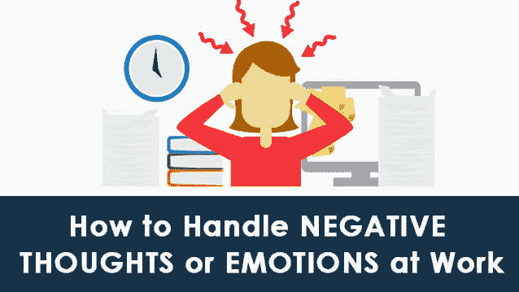

# 如何处理工作中的负面想法或情绪

> 原文：<https://dev.to/wenso_smith/how-to-handle-negative-thoughts-or-emotions-at-work-f31>

帖子[如何处理工作中的负面想法或情绪](https://www.wenso.co.uk/news/handle-negative-emotions-work/)首先出现在。

大自然把所有的人都变成了有感情的生物。正是这种属性使所有的人类从其他生物中脱颖而出。然而，正是这种情感在玩弄人类的心智。承认我们内心不断变化的情绪比控制它们要好。

时代并不总是一样的；有些情况下，我们变得情绪化，不知道如何处理。情绪爆发可能发生在任何地方；可以是家里，也可以是单位。

处理工作中出现的任何情绪失衡都是非常重要的。这种不平衡可能是由于直接与工作相关的事情或由于办公室的一些同事造成的不适而发生的。职业精神的最大特点是知道如何处理情绪，尤其是工作中的负面情绪。

我们习惯于抄袭工作中发生的哪怕是很小的事情。我们交一些志趣相投的人作为朋友，向他们倾诉，甚至谈论与生活伴侣一起发生的日常事件。然而，如果我们坐下来细数我们一直抱怨的所有事情，会让我们更加痛苦，并让我们失去在办公室享受工作的动力。处理这种情绪的最好方法是首先承认消极的感觉。如果在工作中出现疑问或困难，可以通过以下几个关键规则战略性地处理:

**远离现状，观察事物**

试着从远处观察你的情况，例如，一个不顺利的会议，或者你觉得被同事羞辱了；可能会有这样一种情况，你为完成一个项目所做的贡献没有得到适当的表扬。

在这种情况下，你应该学会接受，这可以从列出你最近经历的所有不愉快经历开始。然后关注那些你无法控制的事情。开始思考并和自己谈论某个特定的情况，比如如果你没有升职，你有权利为此生气或感到抱歉，但只是到一定程度。除此之外，你应该有勇气告诉自己，没有升职也没关系。生活不仅如此。

**积极和消极齐头并进**

在任何情况下，快乐的关键在于不要完全根据表面价值来判断情况。不是所有的情况都是完全积极或消极的。所以一个人应该有智慧在任何消极的情况下观察积极的一面。这有助于调节你对某些事情的情绪，这些事情并没有按照你的愿望发生。通过尝试这些技巧，你将更好地控制你的情绪能力，并学会以更好的方式疏导你的情绪。

为了停止任何负面情绪，从精神上把自己从那种情况中抽离出来是非常重要的。研究人员建议，你与第三方建立的距离越大，试图获得第三方的观点越多，你就能更好地处理这种情况，减少负面情绪。

[IT 咨询和产品公司](https://www.wenso.co.uk)