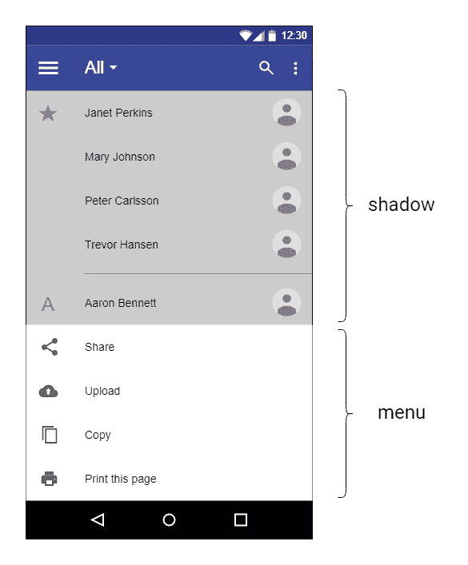
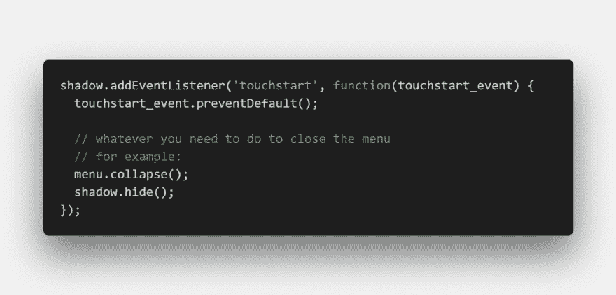

# 如何处理堆叠元素的 touchstart 事件

> 原文：<https://dev.to/ashleemboyer/how-to-handle-touchstart-events-with-stacked-elements-il6>

我在触摸屏上遇到了一些问题，我有一个扩展的导航菜单，在屏幕的非菜单部分显示常见的“阴影”。当我试着点击“阴影”关闭菜单时，太多的事情发生了！这里有一个快速的例子来说明我所说的是哪种屏幕:

当用户点击屏幕的“阴影”部分时，他们希望菜单关闭。应该不会有别的事情发生。您可以通过向用于阴影的元素添加一个`touchstart`事件监听器来处理这个问题，但是有一些事情需要注意。它的行为与您用于桌面版应用程序的`click`事件监听器不同。

这都是关于事件何时触发的。一个`click`事件直到点击结束并释放鼠标按钮后才会发生。因此，当用户用鼠标点击“阴影”时，不会有任何副作用。然而，触摸屏就不同了。

如果在“阴影”后面的项目是可点击的，用户触摸“阴影”来关闭菜单也将引起在那些项目上的点击事件。这是一个非常简单的修复。在您的`touchstart`监听器中，您所要做的就是在传递给监听器的事件上调用`preventDefault`。它可能是这样的:

真的就这么简单——一行代码就搞定了。一开始对我来说这并不太明显，所以我希望这有助于和我处境相同的其他人理清思路。你遇到过类似的问题吗？如果有，在评论里开导我们，让我们少受点苦！:)

* * *

你知道我有时事通讯吗？📬

如果你想在我发布新的博客帖子或宣布重大项目时得到通知，请联系 https://ashleemboyer.com/newsletter。