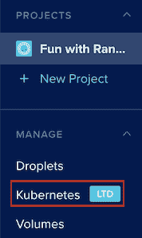
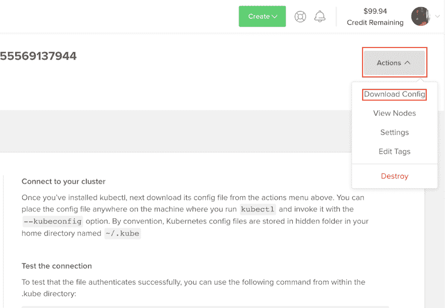
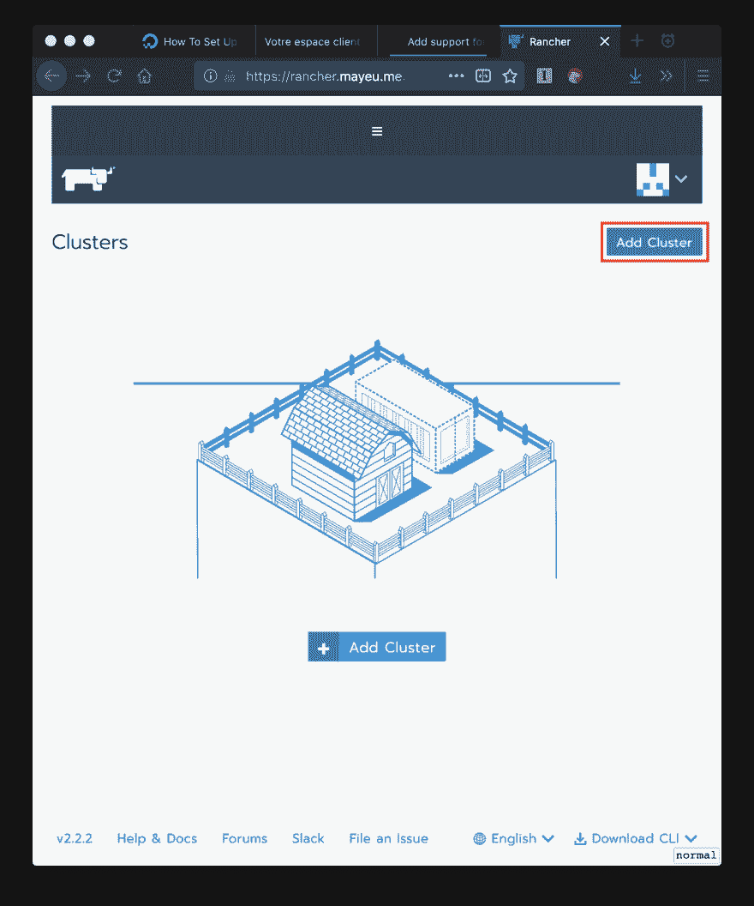
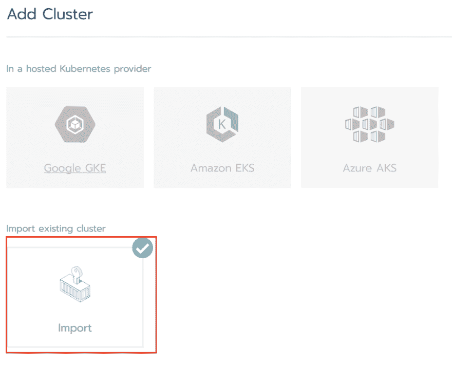
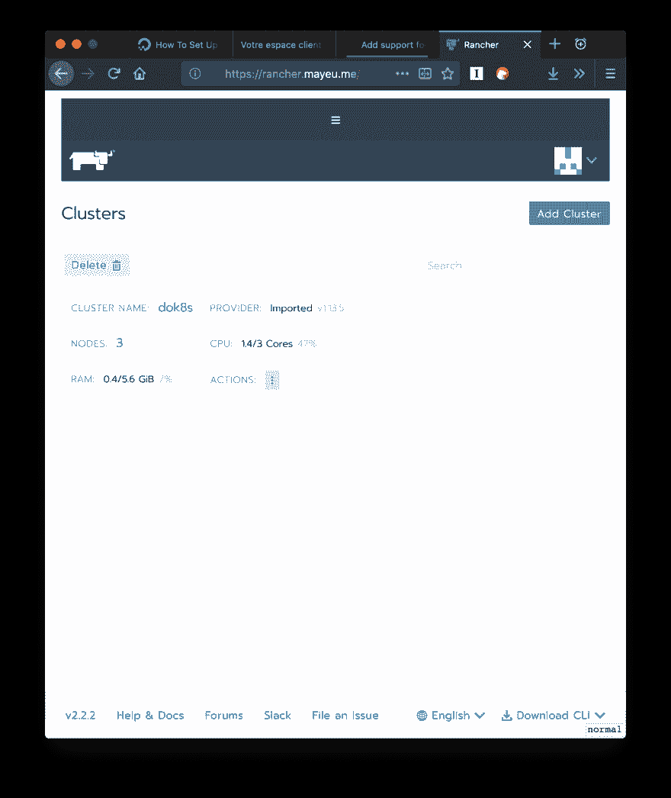

# 如何在 Rancher 中导入托管的数字海洋 Kubernetes 集群

> 原文：<https://dev.to/mayeu/how-to-import-a-managed-digital-ocean-kubernetes-cluster-in-rancher-3f8d>

此帖子包含到[数字海洋](https://m.do.co/c/f1bcc66950f3)的附属链接。它会让你 100 美元来测试平台，如果在某个时候你开始真正使用它，我会赚 25 美元。

[数字海洋](https://m.do.co/c/f1bcc66950f3) (DO)最近宣布[他们为 kubernetes](https://blog.digitalocean.com/digitalocean-releases-k8s-as-a-service/?refcode=f1bcc66950f3) 提供托管服务。Rancher 是一个帮助您在一个界面中管理多个 Kubernetes 集群的工具，但它本身还不支持新的 DO 产品，我想知道是否可以在您的 Rancher 实例中导入一个 DO 托管集群。

事实证明你可以，以下是方法。

## TL；大卫:跟着进口商走就行了

如果您已经知道如何为现有集群使用导入器，那么您就可以开始了。如果没有，只需转到那里，选择“现有集群导入”选项，并按照步骤导入您的 DO 托管集群🙂

## 插图指南

这里有一个关于导入的分步指南。它假设您已经有一个 Rancher 实例在某个地方运行。(这是一份关于在 DO 上经营牧场主的简明指南)。

*   您的第一步是[在 DO](https://m.do.co/c/f1bcc66950f3) 上创建一个托管集群。连接到你的账户，在侧边栏选择“Kubernetes”菜单。在那里，按照指南创建您的集群。

[](https://res.cloudinary.com/practicaldev/image/fetch/s--wFa0b0wG--/c_limit%2Cf_auto%2Cfl_progressive%2Cq_auto%2Cw_880/https://mayeu.me/post/how-to-import-digital-ocean-managed-k8s-in-rancher/do-01-kubernetes-setup.png)

*   现在，您的集群正在进行资源调配，您可以下载其配置。我们将使用它通过`kubectl`连接到它。

[](https://res.cloudinary.com/practicaldev/image/fetch/s--MoqRbn77--/c_limit%2Cf_auto%2Cfl_progressive%2Cq_auto%2Cw_880/https://mayeu.me/post/how-to-import-digital-ocean-managed-k8s-in-rancher/do-02-download-config.png)

*   打开你的牧场主界面，点击“添加集群”按钮

[](https://res.cloudinary.com/practicaldev/image/fetch/s--7Q46tvxS--/c_limit%2Cf_auto%2Cfl_progressive%2Cq_auto%2Cw_880/https://mayeu.me/post/how-to-import-digital-ocean-managed-k8s-in-rancher/rancher-01-add-cluster.png)

*   选择“导入现有集群”

[](https://res.cloudinary.com/practicaldev/image/fetch/s--KIOnYIer--/c_limit%2Cf_auto%2Cfl_progressive%2Cq_auto%2Cw_880/https://mayeu.me/post/how-to-import-digital-ocean-managed-k8s-in-rancher/rancher-02-select-importer.png)

*   导入器会给你一个`kubectl`命令来运行你的[数字海洋](https://m.do.co/c/f1bcc66950f3)集群。使用先前下载的配置文件运行它:

```
$ kubectl --kubeconfig=config-from-do.yml apply -f \ https://your.rancher.domain/v3/import/lotofgibberishrlasxtowg.yaml 
```

[](https://res.cloudinary.com/practicaldev/image/fetch/s--ueTyg2a1--/c_limit%2Cf_auto%2Cfl_progressive%2Cq_auto%2Cw_880/https://mayeu.me/post/how-to-import-digital-ocean-managed-k8s-in-rancher/rancher-03-command-to-run.png)

*   应用配置后，您的集群应该被导入，并在您的 rancher 界面中可用

[](https://res.cloudinary.com/practicaldev/image/fetch/s--NWtsZ8Sh--/c_limit%2Cf_auto%2Cfl_progressive%2Cq_auto%2Cw_880/https://mayeu.me/post/how-to-import-digital-ocean-managed-k8s-in-rancher/rancher-04-cluster-imported.png)

瞧，您已经在您的牧场主中导入了一个[数字海洋](https://m.do.co/c/f1bcc66950f3)托管集群🎉

*本文最初发表于 [mayeu.me](https://mayeu.me/post/how-to-import-digital-ocean-managed-k8s-in-rancher/) 。*