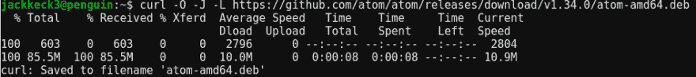
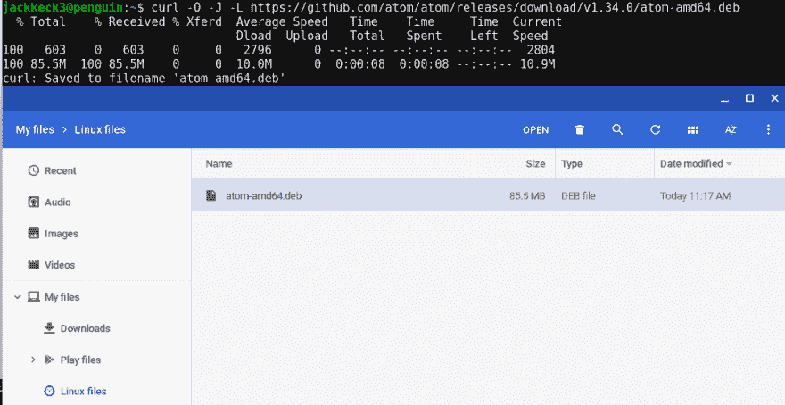
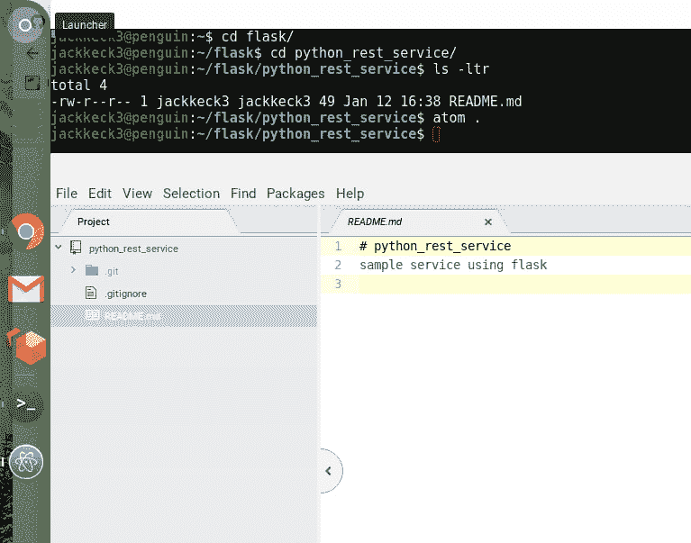

# 如何在 Chomebook 上安装 Atom.io

> 原文：<https://dev.to/jackkeck/how-to-install-atomio-on-chomebook-3e8i>

假设
你有一台支持 Linux 的 Chromebook。你可以在这里查看。
您已经启用了 Linux。你可以遵循这里的指示。

**我的环境**
三星 Chromebook 3
Linux 启用
谷歌 Chrome 72.0.3626.49(正式版)dev (64 位)

**步骤 1 -下载 Atom.io**
我直接从 [Atom 的 Github 发布页面](https://github.com/atom/atom/releases/tag/v1.34.0)下载了 deb 安装程序。您需要在 curl 命令中使用正确的标志来处理不可避免的重定向::le sigh::

**步骤 2 -安装 Atom.io**
安装很简单，打开你的文件浏览器，导航到我的文件> Linux 文件，然后双击 deb 安装文件。

**步骤 3 -启动 Atom**
我更喜欢使用`atom .`命令直接从我想要工作的目录启动。不过，您也可以只搜索 Atom 并以这种方式启动。

