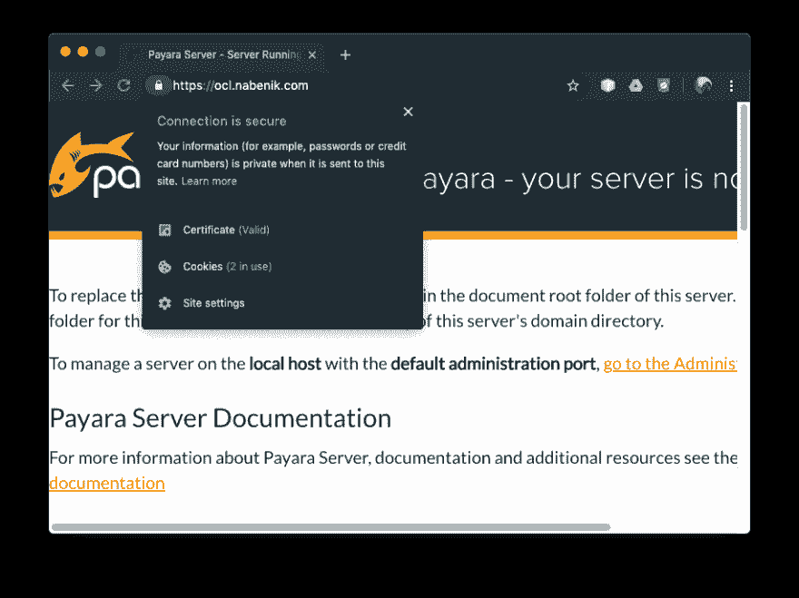
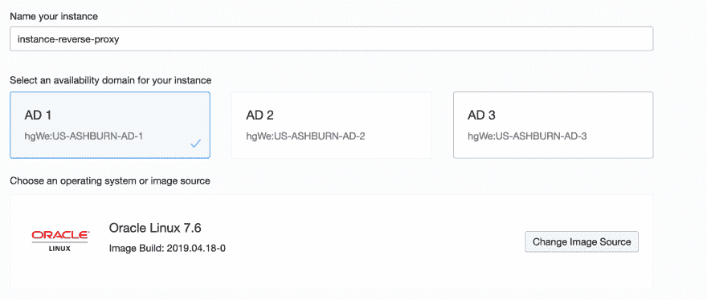
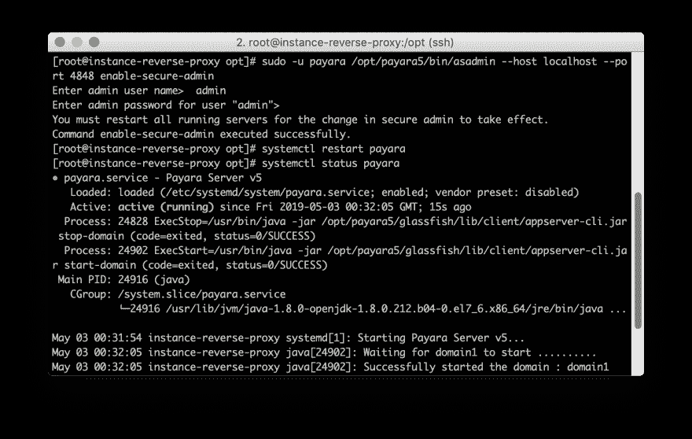
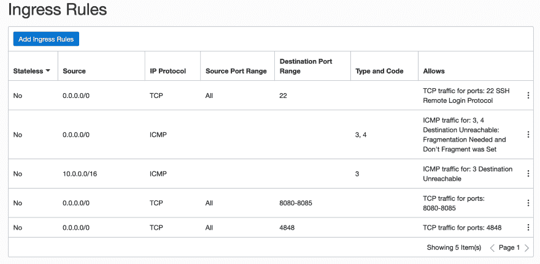
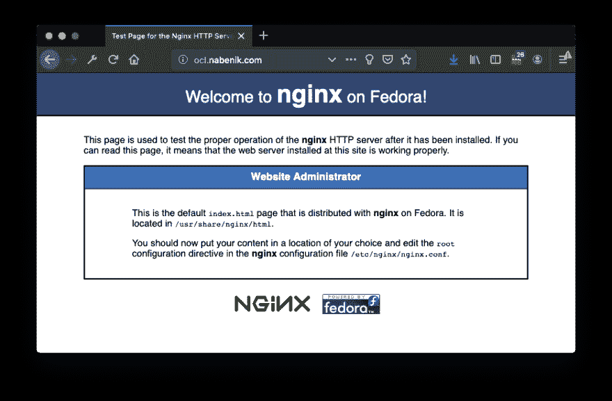
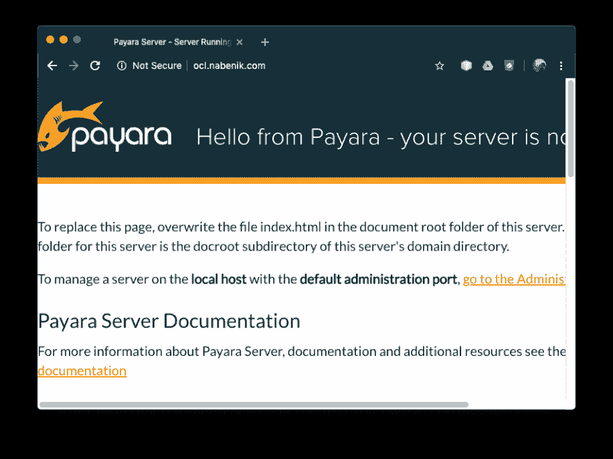

# 如何用 NGINX 安装 Payara 5，让我们在 Oracle Linux 7.x 上加密

> 原文：<https://dev.to/tuxtor/how-to-install-payara-5-with-nginx-and-let-s-encrypt-over-oracle-linux-7-x-34ke>

[](https://res.cloudinary.com/practicaldev/image/fetch/s--79-VJCAC--/c_limit%2Cf_auto%2Cfl_progressive%2Cq_auto%2Cw_880/http://www.vorozco.cimg/posts/reversepayara/payarassl.png)

从现场经验来看，我必须肯定，Java 应用服务器+反向代理是最棒、最稳定的组合之一，尽管有些功能明显重叠，但我倾向于将反向代理放在应用服务器之前，原因如下([请参见 NGINX 页面了解更多详细信息](https://www.nginx.com/resources/glossary/reverse-proxy-server/)):

*   **负载平衡:**反向代理充当流量警察，并可用作集群实例/后台服务的 API 网关
*   Web 加速:现在我们的大多数应用程序都使用 SPA 框架，因此缓存所有的 js/css/html 文件并把应用服务器从这个责任中解放出来是值得的
*   **安全性:**在针对应用服务器的任何尝试之前，大多数 HTTP 请求都可以被反向代理**拦截，这增加了定义规则的机会**
*   **SSL 管理:**与 [Java 密钥库](https://en.wikipedia.org/wiki/Java_KeyStore)相比，在 Apache/NGINX 中安装/管理/部署 OpenSSL 证书更容易。除此之外，[还是加密吧](https://letsencrypt.org/)官方用插件支持 NGINX。

## 要求

为了演示这一功能，本教程以经典(非 docker)方式组合了以下堆栈，但是大多数概念可能对 Docker 部署有用:

*   Payara 5 作为应用服务器
*   NGINX 作为反向代理
*   让我们加密 SSL 证书

假设在本教程中将使用一个干净的 Oracle Linux 7.x (7.6)机器，测试将在 Oracle Cloud 上使用`root`用户执行。

[](https://res.cloudinary.com/practicaldev/image/fetch/s--bAVX_qT6--/c_limit%2Cf_auto%2Cfl_progressive%2Cq_auto%2Cw_880/http://www.vorozco.cimg/posts/reversepayara/oraclelinux.png)

## 准备操作系统

由于 Oracle Linux 与 RHEL 是二进制兼容的，因此将添加 [EPEL](https://fedoraproject.org/wiki/EPEL) 存储库来访问 Let's Encrypt。作为前一步更新操作系统也是有用的:

```
yum -y update
yum -y install https://dl.fedoraproject.org/pub/epel/epel-release-latest-7.noarch.rpm 
```

## 设置 Payara 5

为了安装 Payara 应用服务器，需要一些依赖项，特别是 Java 开发工具包。例如，OpenJDK 包含在 Oracle Linux 存储库中。

```
yum -y install java-1.8.0-openjdk-headless
yum -y install wget
yum -y install unzip 
```

一旦安装了所有的依赖项，就该下载、解压并安装 Payara 了。它将位于`/opt`位置，遵循外部包的标准 Linux 约定:

```
cd /opt
wget -O payara-5.191.zip https://search.maven.org/remotecontent?filepath=fish/payara/distributions/payara/5.191/payara-5.191.zip
unzip payara-5.191.zip
rm payara-5.191.zip 
```

创建一个用于管理目的的`payara`用户，管理域或者使用 systemd:
作为 Linux 服务运行 Payara 也是很有用的

```
adduser payara
chown -R payara:payara payara5
echo 'export PATH=$PATH:/opt/payara5/glassfish/bin' >> /home/payara/.bashrc
chown payara:payara /home/payara/.bashrc 
```

还需要一个 systemd 单元:

```
echo '[Unit]
Description = Payara Server v5
After = syslog.target network.target

[Service]
User=payara
ExecStart = /usr/bin/java -jar /opt/payara5/glassfish/lib/client/appserver-cli.jar start-domain
ExecStop = /usr/bin/java -jar /opt/payara5/glassfish/lib/client/appserver-cli.jar stop-domain
ExecReload = /usr/bin/java -jar /opt/payara5/glassfish/lib/client/appserver-cli.jar restart-domain
Type = forking

[Install]
WantedBy = multi-user.target' > /etc/systemd/system/payara.service
systemctl enable payara 
```

此外，如果需要远程管理，应启用安全管理:

```
sudo -u payara /opt/payara5/bin/asadmin --host localhost --port 4848 change-admin-password
systemctl start payara
sudo -u payara /opt/payara5/bin/asadmin --host localhost --port 4848 enable-secure-admin
systemctl restart payara 
```

[](https://res.cloudinary.com/practicaldev/image/fetch/s--ZvFmUXaL--/c_limit%2Cf_auto%2Cfl_progressive%2Cq_auto%2Cw_880/http://www.vorozco.cimg/posts/reversepayara/payaraboot.png)

Oracle Cloud 默认配置将创建一个连接到您的实例的 VNIC，因此您应该检查规则以允许访问端口。

[](https://res.cloudinary.com/practicaldev/image/fetch/s--Wmmm7en4--/c_limit%2Cf_auto%2Cfl_progressive%2Cq_auto%2Cw_880/http://www.vorozco.cimg/posts/reversepayara/ingresrules.png)

默认情况下，Oracle Linux 实例在 iptables 和 SELinux 中有一组受限的规则，因此应该使用 firewalld 打开端口，并且应该将 SELinux 配置为允许反向代理流量:

```
firewall-cmd --zone=public --permanent --add-service=http
firewall-cmd --zone=public --permanent --add-service=https
firewall-cmd --zone=public --permanent --add-port=4848/tcp
setsebool -P httpd_can_network_connect 1 
```

这样就保证了对 http+https+payara 管理端口的访问。

## 设置 NGINX 反向代理

NGINX 在 EPEL 上市:

```
yum -y install nginx
systemctl enable nginx 
```

这时你需要一个指向你的服务器的 FQDN，否则加密验证不起作用。对于本教程，将使用`ocl.nabenik.com`域。如果您的域正确传播，您应该会看到如下页面:

[](https://res.cloudinary.com/practicaldev/image/fetch/s--1Sya9kSu--/c_limit%2Cf_auto%2Cfl_progressive%2Cq_auto%2Cw_880/http://www.vorozco.cimg/posts/reversepayara/nginxproxy.png)

不要担心 Fedora 徽标是由于 EPEL 的使用，但是您运行的是 Oracle Linux:)。

现在是时候将 NGINX 设置为反向代理了，一个固执己见的部署选项是在 NGINX 配置中创建一个`/etc/nginx/sites-available`和`/etc/nginx/sites-enabled`结构，用同一个实例(又名虚拟主机)隔离/管理多个域。

```
mkdir -p /etc/nginx/sites-available
mkdir -p /etc/nginx/sites-enabled
mkdir -p /var/www/ocl.nabenik.com/
chown -R nginx:nginx /var/www/ocl.nabenik.com

echo 'server {
    server_name ocl.nabenik.com;

    gzip on;
    gzip_types text/css text/javascript text/plain application/xml;
    gzip_min_length 1000;

    location ^~ /.well-known/acme-challenge/ {
        allow all;
        root /var/www/ocl.nabenik.com/;
        default_type "text/plain";
        try_files $uri =404;
    }

    location / {
        proxy_pass http://localhost:8080;
        proxy_connect_timeout 300;
        proxy_send_timeout 300;
        proxy_read_timeout 300;
        send_timeout 300;
    }

    error_page 500 502 503 504 /50x.html;
    location = /50x.html {
        root /usr/share/nginx/html;
    }

    listen 80;
}' > /etc/nginx/sites-available/ocl.nabenik.com.conf 
```

为了启用新主机，在`sites-enabled` :
上创建一个符号链接

```
ln -s /etc/nginx/sites-available/ocl.nabenik.com.conf /etc/nginx/sites-enabled/ocl.nabenik.com.conf 
```

在那之后，你应该在`/etc/nginx/nginx.conf`中包含下面一行，就在配置文件结束之前。

```
include /etc/nginx/sites-enabled/*.conf; 
```

用`nginx -t`检查你的配置也是有用的，如果所有工作正常，你应该在 NGINX 重新加载后到达 payara。

[](https://res.cloudinary.com/practicaldev/image/fetch/s--1PTQ15DQ--/c_limit%2Cf_auto%2Cfl_progressive%2Cq_auto%2Cw_880/http://www.vorozco.cimg/posts/reversepayara/reversepayara.png)

## 设置加密

一旦反向代理开始工作，certbot 应该足以添加一个 SSL 证书，插件本身将在`^~ /.well-known/acme-challenge/`创建一个挑战，因此代理排除是强制性的(如前面的配置步骤所反映的)。

```
yum install -y certbot-nginx
certbot --nginx -d ocl.nabenik.com 
```

使用 certbot 的一个注意事项是 python 版本的依赖性。如果你发现任何问题，另一个选择是用`pip`
安装它

```
yum install -y python-pip
pip install certbot-nginx
certbot --nginx -d ocl.nabenik.com 
```

如果一切正常，您应该会看到 SSL 下的 Payara 页面。

[](https://res.cloudinary.com/practicaldev/image/fetch/s--79-VJCAC--/c_limit%2Cf_auto%2Cfl_progressive%2Cq_auto%2Cw_880/http://www.vorozco.cimg/posts/reversepayara/payarassl.png)

最后，也是最重要的，让我们加密有效期只有 90 天的证书，因此您可以添加证书更新(`crontab -e`)作为 cron 任务

```
15 3 * * * /usr/bin/certbot renew --quiet 
```