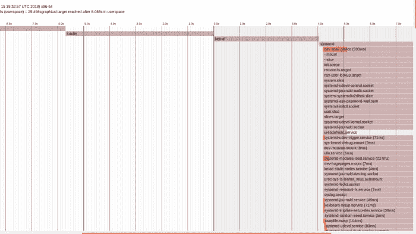

# 如何调查 Ubuntu 慢开机

> 原文：<https://dev.to/bogdancornianu/how-to-investigate-ubuntu-slow-boot-4e81>

调查 Ubuntu 启动缓慢的原因可能很困难。有很多事情可能出错:延迟的服务、错误的配置文件、fstab 中错误的磁盘 uuid 等等。

在我看来，最简单的开始方式是使用“systemd-analyze ”,它是 systemd 的一部分。

从 15.04 版本开始，Ubuntu 从 upstart 切换到 systemd 作为默认的系统和服务管理器。Systemd 不是 Ubuntu 特有的，而是其他主要发行版也采用的行业标准:Debian、Fedora 和 CentOS 等等。

“systemd-analyze”给我们关于启动时运行什么程序以及它们需要多少时间启动的信息。

我们可以使用 systemd-analyze 中的大约 12 个选项来查看启动瓶颈在哪里。但是从时间的角度来看，我们只对其中的几个感兴趣(要查看其他可用选项，您可以在终端中运行“man systemd-analyze”):

我们感兴趣的选项有:

*   [plot](#plot-command)
*   [时间](#time-command)
*   [责备](#blame-command)
*   [关键链](#critical-chain-command)

### *plot*

输出 svg 代码，其中包含所有已启动的服务、它们的依赖项以及它们启动所需的时间。

为了更好的可视化，您可以将输出转换成 svg 文件，然后用图像查看器打开它:

```
$ systemd-analyze plot > init.svg 
```

Enter fullscreen mode Exit fullscreen mode

你应该寻找红色长条。这些条形代表该过程开始所用的时间。

当打开生成的 svg 时，您应该看到类似于

[](https://i0.wp.com/bogdancornianu.com/wp-content/uploads/2018/12/systemd-analyze-plot-1.png?ssl=1)

### *时间*

显示了从引导装载程序将控制权交给内核到用户空间完成初始化所花费的时间。

```
$ systemd-analyze time
Startup finished in 7.541s (firmware) + 5.696s (loader) + 4.053s (kernel) + 8.206s (userspace) = 25.498sgraphical.target reached after 8.068s in userspace 
```

Enter fullscreen mode Exit fullscreen mode

本例中的值是针对我的笔记本电脑的，它配有 i7 处理器、16GB 内存和 512GB 固态硬盘。

如果您使用较旧的系统，您可能看不到固件数据，因为这仅适用于 EFI/UEFI 系统。

如果大量时间花在 ***固件*** 上，可能会有硬件问题。 ***loader*** 中的

时间是你的 bootloader 需要的时间，一般是 Grub。如果在这里花费了大量的时间，这可能意味着引导装载程序找不到一些磁盘，或者一些内核引导参数是错误的。

***内核*** 时间用于加载驱动和其他初始化。内核完成启动后，它将启动 init 进程(通常 id 为 1)。

在我们的例子中，init 进程是 systemd，它代表花费在 ***用户空间*** 中的时间。

### *怪*

显示服务的有序列表，从最慢到最快。

```
$ systemd-analyze blame
6.272s NetworkManager-wait-online.service
          2.998s plymouth-quit-wait.service
           930ms dev-sda6.device
           795ms fwupd.service
           632ms snapd.service
           547ms motd-news.service
           449ms plymouth-start.service
           396ms NetworkManager.service
           325ms upower.service
           274ms systemd-logind.service 
```

Enter fullscreen mode Exit fullscreen mode

### *关键链*

类似于责备，但是它考虑了服务之间的依赖性。缓慢启动的服务将以红色突出显示。

```
$ systemd-analyze critical-chain
The time after the unit is active or started is printed after the "@" character.
The time the unit takes to start is printed after the "+" character.

graphical.target @8.068s
└─multi-user.target @8.068s
  └─kerneloops.service @8.058s +10ms
    └─network-online.target @8.056s
      └─NetworkManager-wait-online.service @1.783s +6.272s
        └─NetworkManager.service @1.385s +396ms
          └─dbus.service @1.359s
            └─basic.target @1.356s
              └─sockets.target @1.356s
                └─snapd.socket @1.354s +2ms
                  └─sysinit.target @1.354s
                    └─systemd-timesyncd.service @1.137s +215ms
                      └─systemd-tmpfiles-setup.service @1.125s +9ms
                        └─local-fs.target @1.123s
                          └─run-snapd-ns-docker.mnt.mount @2.093s
                            └─run-snapd-ns.mount @1.818s
                              └─swap.target @262ms
                                └─swapfile.swap @157ms +104ms
                                  └─systemd-remount-fs.service @147ms +7ms
                                    └─systemd-journald.socket @140ms
                                      └─system.slice @139ms
                                        └─-.slice @137ms 
```

Enter fullscreen mode Exit fullscreen mode

通过使用来自 ***systemd-analyze*** 的所有这些信息，我们可以找出是什么减缓了启动过程。一旦我们知道了这一点，我们就可以深入挖掘，找到问题的根源。

帖子[如何调查 Ubuntu 慢开机](https://bogdancornianu.com/how-to-investigate-ubuntu-slow-boot/)最早出现在[波格丹一世 Cornianu](https://bogdancornianu.com) 上。