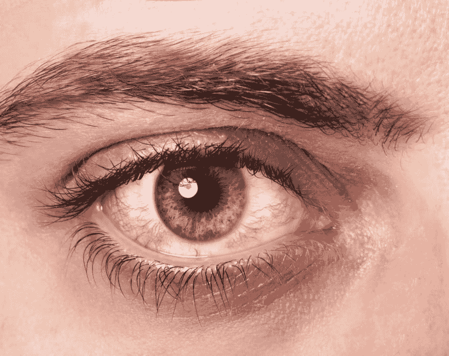
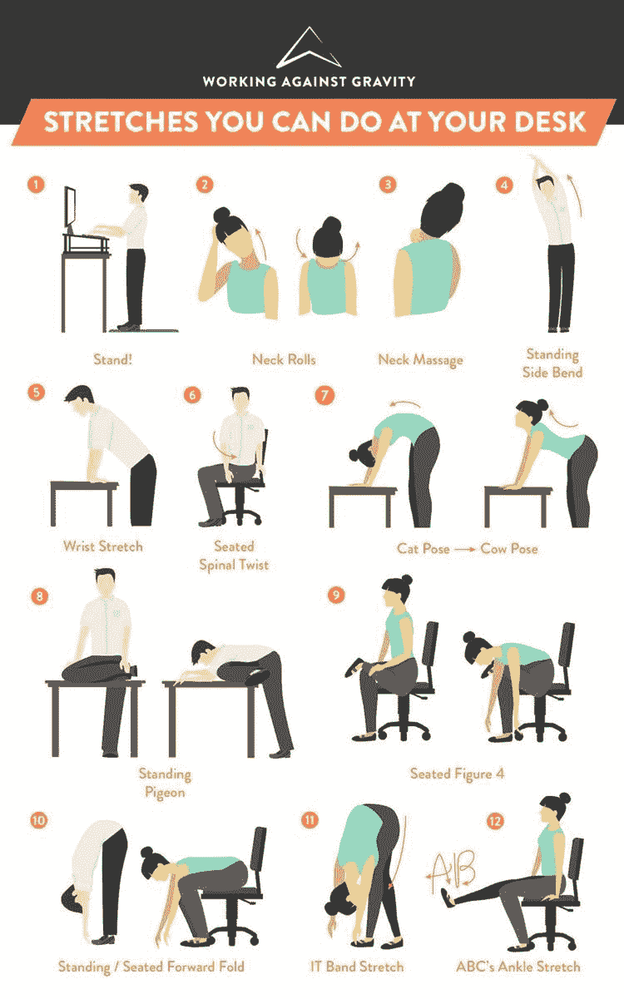

# 如何保持工作健康！

> 原文：<https://dev.to/andershornor/how-to-keep-your-work-healthy-20b>

如果你像我一样，你每周花 40 多个小时盯着电脑屏幕的深处。正如你可能意识到的那样，在电脑上生活会导致多方面的问题。虽然花这么多时间看屏幕可能会产生一些问题，但有一些方法可以减轻这些问题，也有一些方法可以避免任何问题。今天我想谈谈长时间看屏幕可能带来的一些潜在问题。我还想强调一点屏幕时间给我带来的一些方法，现在请你注意。我还想像有些人说的那样，用“半信半疑”作为这篇小广告的序言。

我不是医学专业人士，我在这里要讲的所有内容都应该考虑到这一点。做你自己的研究，找出什么对你有效，并把我在这里提到的一切作为一个一般性的建议，有一些科学和善意的研究支持，但仅此而已。

## 眼睛健康:2d 看重影

#### 首先，我想谈一谈已经详细讨论过的关于计算机的一些事情。我想先谈谈你的眼睛。

随着新技术的发展，计算机正在进入可见空间之外的世界，但在很大程度上，我们的眼睛是引导我们通过计算机化空间的。从向下滚动页面或潜伏在 reddit 上，到编写新的应用程序或在 reddit 上发帖，我们的眼睛不断移动，重新聚焦和映射我们在电脑和其他屏幕上互动的视觉空间。因此，当我们与屏幕互动时，我们的眼睛会承受持续的压力。由这些压力引起的许多问题在不同形式的文献中都有涉及，但在大多数情况下，这些压力的顶点通常被称为计算机视觉综合征(CVS)。更确切地说，电脑视觉综合症与眼睛问题有关，这是由于看屏幕时眼睛使用不当造成的。CVS 的主要症状是“眼疲劳、眼睛疲劳、刺激、发红、视力模糊和重影”(Blehma et。艾尔。, 253, 2005).与 CVS 相关的一些其他症状与姿势有关，将在本博客稍后讨论。
有趣的是，对于那些没有非 CVS 眼部疾病特定诱因的人来说，大多数与 CVS 相关的眼部问题都与眼睛干燥和屏幕距离有关，但除此之外几乎没有关系(Blehma 等人。艾尔。, 260, 2005).考虑到这一点，一些治疗方法可能看起来显而易见，但实施起来却不那么显而易见。现在，我将提出一些显而易见的建议，稍后我将介绍一些保护眼睛安全的技巧。这可能看起来很明显，也有点可笑，多眨眼，让你的电脑保持在 40 厘米或 1 1/2 英尺以上的距离是理想的，这将有助于把眼睛疲劳降到最低。

## 身体健康:谁知道保持健康还会这么难！

我们都经历过。磨出最后一页或涂料超级必要的功能，甚至可能是在 Apex 或 Dota 中的胜利，正当你准备挂起来的时候，你的手伸出来缓解你脖子上的扭结，这时它痛苦的爪子形状几乎无法鼓起力量来挠你小腿上靠近膝盖下方蓝色隆起静脉的奇怪瘙痒。现在你的背部和肩膀疼痛，你的面条手指无用，突然剧烈的胸痛让你好奇，因为你的视力开始衰退，你像你的面条手指一样，在地板上揉成一堆。心脏病发作！

好吧，也许我们都没有确切地经历过，但尽管经常使用电脑的常见疾病，如腕管综合征、背部和颈部疼痛以及深静脉血栓可能是你想到与电脑相关的伤害时的第一想法，但当谈到经常使用电脑通常导致的久坐不动的生活方式时，心脏病才是真正的杀手。

我想大多数读到这篇文章的人，在花了大量的时间在电脑上制作出令人惊叹的东西后，至少有过这些症状中的一种，但是你们应该考虑的问题是久坐对心脏的影响。一项对运输工人的研究发现，与大部分时间站着的人相比，大部分时间坐着的人患心脏病的可能性是大部分时间站着的人的两倍。艾尔。, 2015).是的，即使考虑了几乎所有其他的生命因素，可能性也是两倍。不仅心脏病是一个主要问题，而且一个不活跃的心脏会导致许多其他问题，甚至是上面考虑的问题以及许多其他问题，包括**糖尿病** (Biswas et。艾尔。，2015) **痴呆症** (Ahlskog 等。艾尔。，2011)，以及**癌症**(施密德&莱茨曼，2014)！

所有这些症状，颈部疼痛，背部疼痛，腕管综合征，或深静脉血栓形成，以及其他可能因久坐而引起的更严重的疾病。同样，也许一些显而易见的解决方案可以解决一些现实的、威胁生命的问题，但是站起来，走出去，积极行动起来，引用一位不常被引用的嘻哈艺术家的话。

## 所以我是不是彻底完蛋了？:简而言之答案是没有！

虽然我们可能会花很多时间坐在电脑前，你的生活可能依赖于它，但你不可避免地会活得更短。有一些策略可以避免皱缩成一堆。**保持活跃！**保持活力直到晚年每天 30 分钟的有氧运动可以预防长期久坐不动的生活方式可能带来的大部分问题。不仅仅是每天做一点运动，解决长时间坐着的一个很好的策略是每小时站两次，伸展几分钟。导致大部分健康问题的主要原因可能是因为坐得太久，而仅仅站几分钟就可以消除这些问题。站立不仅有助于你的心脏及其所有功能，还会让你的手、胳膊和眼睛得到必要的休息，这将有助于消除导致腕管综合症和电脑视觉综合症的劳损。
我想谈的最后一件事是，在你一天的最后几个小时里不要看屏幕，以获得更多宁静的睡眠。良好的睡眠不仅是一种积极的体验，也是学习和保持大脑健康的必要条件。

### 下面的链接推荐了一些保持健康工作习惯的好方法:

1.  使用计时器来调节你的屏幕时间
2.  一次只专注于一项任务，以保持正轨，并实现你的目标。
3.  休息一下，留出时间来减轻压力，避免精疲力竭。
4.  把工作和娱乐分开。
5.  练习冥想有助于缓解身体和精神压力。
6.  花时间伸展身体

特定眼睛:

1.  润滑眼药水
2.  专业“电脑眼镜”
3.  专业隐形眼镜
4.  向眼科医生咨询特定眼病的易患因素。

特定于生活:

1.  **睡眠**
2.  休息一下！

所以总而言之，保护你的心脏，做点运动或者至少采取措施每隔一段时间站起来。如果你照顾好你的心脏，你身体的几乎每一个其他部分都会更好地免受其他疾病的侵害。

资源:

1)[https://www.businessinsider.com/how-to-stay-focused-2015-11](https://www.businessinsider.com/how-to-stay-focused-2015-11)
2)[https://allabouteyes.com/work-computer-day-take-care-eyes/](https://allabouteyes.com/work-computer-day-take-care-eyes/)T5】3)[https://www.entrepreneur.com/article/246999](https://www.entrepreneur.com/article/246999)T8】4)[http://www . ergonomicfocus . com/un categorized/how-to-use-a-computer-all-day-but-still-stay-healthy/](http://www.ergonomicfocus.com/uncategorized/how-to-use-a-computer-all-day-but-still-stay-healthy/)
5)[http://time.com/4789208/screens-computer-eye-strain/](http://time.com/4789208/screens-computer-eye-strain/)
6)[https://then extweb . com/life hacks/2012 久坐行为增加某些癌症的风险，JNCI:国家癌症研究所杂志，106(7)。doi:10.1093/jnci/dju 206
10)](https://thenextweb.com/lifehacks/2012/03/31/cranky-with-a-headache-check-out-10-tips-to-avoid-computer-vision-syndrome/)[https://www . health . Harvard . edu/blog/much-sitting-linked-heart-disease-diabetes-premate-death-201501227618](https://www.health.harvard.edu/blog/much-sitting-linked-heart-disease-diabetes-premature-death-201501227618)
bis was，a .，Oh，P. I .，Faulkner，G. E .，Bajaj，R. R .，Silver，M. A .，Mitchell，M. S .，& Alter，D. A 成年人久坐时间及其与发病率、死亡率和住院风险的关系。内科年鉴，162(2)，123。多伊:10.7326/m14-1651
11)[https://www.ncbi.nlm.nih.gov/pubmed/21878600](https://www.ncbi.nlm.nih.gov/pubmed/21878600)
阿耳斯考格，J. E .，格达，Y. E .，格拉夫-拉德福德，N. R .，&彼得森，R. C. (2011)。体育锻炼作为痴呆和脑老化的预防或疾病缓解治疗。梅奥诊所学报，86(9)，876–884。多元指数:10.4065

图片 URL 1:[http://bytecolumn . com/WP-content/uploads/2012/06/happy-man-looking-computer . jpg](http://bytecolumn.com/wp-content/uploads/2012/06/happy-man-looking-at-computer.jpg)
图片 URL 2:[https://drboldodlapalma . files . WordPress . com/2016/09/red-rasted-eye . jpg](https://drboldodlapalma.files.wordpress.com/2016/09/red-irritated-eye.jpg)图片 URL 3:[https://www . workingagainstgravity . com/media/8813 fc 50-CDT](https://www.workingagainstgravity.com/media/8813fc50-cdbb-412e-9af3-3a949268fdba/750)