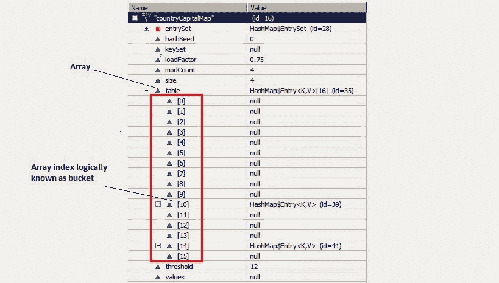

# 如何学习 java 编程

> 原文：<https://dev.to/arpitmandliya/how-to-learn-java-programming-1jp7>

Java 是世界上开发桌面应用程序和 web 应用程序最常用的编程语言之一。它已经在编程界工作了 22 年。

在这篇文章中，我们将看到如何以最有效的方式深入学习 java 编程。

Java 有一个巨大的学习曲线，它是一个完整的编程语言，有很多类，API 等等。不要试图一次学会所有的东西，循序渐进，掌握 Java 编程世界。

## 学习 Java 编程的方法:

### 看书:

有很多好书可以让你学习 Java 编程。
其中一些是:

*   头先 Java
*   有效的 Java
*   用 Java 思考

Head first Java 是我最喜欢的。我真的很喜欢 head first Java，并且喜欢阅读它。Head first Java 以非常独特和有趣的方式解释了 Java 概念。你将能够学习类、对象、线程、集合和泛型以及其他各种概念。

### 关注优秀的 Java 博客:

有许多好的在线博客/网站，你可以从中轻松学习 Java。

其中一些是:

*   [甲骨文文件](https://docs.oracle.com/javase/tutorial/)
*   [Javacodegeeks](https://www.javacodegeeks.com/)
*   [的划分](https://dzone.com/)

我还为初学者和有经验的程序员创建了一个完整的核心 java 教程，它将帮助你学习 Java 编程。

## 学习 Java 内部知识的技巧:

### 了解 Java 基础知识:

当你开始学习任何一门语言时，理解它的基础总是很重要的。你需要理解 Java 的基本概念，如[类、对象](http://www.java2blog.com/2017/05/object-class-java.html)、包、[变量](http://www.java2blog.com/2017/05/variables-java.html)、关键字、[数据类型](http://www.java2blog.com/2017/05/data-types-in-java.html)等。

### 以面向对象的方式思考:

如你所知，Java 是一种面向对象的编程语言，你需要理解面向对象的概念，如[抽象](http://www.java2blog.com/2017/04/abstraction-java-example.html)、[封装](http://www.java2blog.com/2017/05/encapsulation-java-example.html)、[多态](http://www.java2blog.com/2017/05/polymorphism-java-example.html)和[继承](https://java2blog.com/inheritance-java/)

你需要从对象和类的角度来考虑。例如，雇员具有诸如姓名、年龄等属性，以及诸如完成分配等行为。

### 主系列:

集合框架是 Java 中使用最多的框架。不要仅仅理解 HashMap、HashSet、TreeMap、Treeset 等集合的用法，还要理解集合的内部工作方式。

例如:如果你知道 HashMap 的[内部工作方式，那么调试程序和查看 HashMap 的内容就很容易了。它还将帮助您理解 Java 集合是如何设计的。](http://www.java2blog.com/2014/02/how-hashmap-works-in-java.html)

我们举一个很简单的例子。我有一个 Country 类，我们将使用 Country 类对象作为键，使用它的大写名称(字符串)作为值。下面的例子将帮助你理解，这些键值对将如何存储在 hashmap 中。

**1。Country.java**

```
package org.arpit.java2blog;
public class Country {

 String name;
 long population;

 public Country(String name, long population) {
  super();
  this.name = name;
  this.population = population;
 }
 public String getName() {
  return name;
 }
 public void setName(String name) {
  this.name = name;
 }
 public long getPopulation() {
  return population;
 }
 public void setPopulation(long population) {
  this.population = population;
 }

 // If length of name in country object is even then return 31(any random number) and if odd then return 95(any random number).
 // This is not a good practice to generate hashcode as below method but I am doing so to give better and easy understanding of hashmap.
 @Override
 public int hashCode() {
  if(this.name.length()%2==0)
   return 31;
  else 
   return 95;
 }
 @Override
 public boolean equals(Object obj) {

  Country other = (Country) obj;
   if (name.equalsIgnoreCase((other.name)))
   return true;
  return false;
 }

}
```

如果想了解更多关于对象的 hashcode 和 equals 方法，可以参考 JavaT3 中的 **[hashcode()和 equals()方法](http://www.java2blog.com/2014/02/hashcode-and-equals-method-in-java.html)**

**2。HashMapStructure.java**(主班)

```
import java.util.HashMap;
import java.util.Iterator;

public class HashMapStructure {

    /**
     * @author Arpit Mandliya
     */
    public static void main(String[] args) {

        Country india=new Country("India",1000);
        Country japan=new Country("Japan",10000);

        Country france=new Country("France",2000);
        Country russia=new Country("Russia",20000);

       HashMap countryCapitalMap=new HashMap<country>();  
        countryCapitalMap.put(india,"Delhi");  
        countryCapitalMap.put(japan,"Tokyo");  
        countryCapitalMap.put(france,"Paris");  
        countryCapitalMap.put(russia,"Moscow");  

        Iterator countryCapitalIter=countryCapitalMap.keySet().iterator();//put debug point at this line  
        while(countryCapitalIter.hasNext())  
        {  
            Country countryObj=countryCapitalIter.next();  
            String capital=countryCapitalMap.get(countryObj);  
            System.out.println(countryObj.getName()+"----"+capital);  
         }  
        }  

}</country>
```

现在将调试点放在第 24 行，右键单击 project-> debug as-> Java application。程序将在第 24 行停止执行，然后右键单击 countryCapitalMap，然后选择 watch。您将能够看到如下结构。

[](http://3.bp.blogspot.com/-T4TsTlhwaXU/Uwjj9ypm69I/AAAAAAAACsY/J4-a6rxZLLE/s1600/HashMapStructure1.bmp)

从上图中，您可以观察到以下几点

您在 HashMap 中放了 4 个条目，但在 Entry[]数组中只看到两个条目。如果你想了解 Entry[]数组为什么只有两个条目，你需要了解[Java 中 HashMap 是如何工作的以及 Hashcode 和 equals 方法。](http://www.java2blog.com/2014/02/how-hashmap-works-in-java.html)

这是一个非常简单的 HashMap 例子，但是在现实生活中你可能会有更复杂的例子，因此为了调试程序和查看 HashMap 中的值，学习 HashMap 的内部工作是很重要的。

### 选择任意 IDE:

可以选择 Eclipse、intellij 或 Netbeans 等 IDE。它将帮助你更快地进行编程，从而提高你的效率。您还应该了解该 IDE 的一些重要的键盘快捷键。

例如:

当您复制任何代码并将任何代码放入 eclipse 时，您需要导入该程序的所有导入语句，您可以简单地在 eclipse 中使用 [control+ shift+ O，它将负责导入。因此，这将有助于你提高编程效率。](http://www.java2blog.com/2016/02/how-to-import-all-classes-at-once-in.html)

### 编写基本程序:

在字符串、数字和数组等方面练习基本的 java 程序。它会帮助你写出简单的逻辑。

### 在 HackerRank 实习:

一旦你熟悉了集合和面向对象的概念，你就可以在 [HackerRank](https://www.hackerrank.com/domains/java/java-introduction) 练习 Java 编程了。有助于掌握语法和构建逻辑。

### 了解多线程:

掌握多线程是相当困难的。学习多线程需要大量的实践，因为在大多数情况下线程输出是不可预测的。您可以学习线程的基础知识，如[如何创建线程](http://www.java2blog.com/2015/06/java-thread-example.html)，线程的生命周期以及线程类的不同方法，如加入、睡眠、产出和线程同步。

一旦你熟悉了线程的基础知识，学习 executor 框架。Java 5 已经引入了 executor 框架，它负责线程的创建和管理，您可以专注于业务逻辑。

### 创建小项目:

您可以创建自己选择的简单项目，如图书馆管理、运输系统。创建一个简单的设计，确定主要实体，用例，并编写一个 Java 应用程序来解决这个问题。

### 在 github 上浏览一些好的项目:

[GitHub](https://github.com/) 上有很多很好的开源项目。你可以浏览一些好的项目，这将有助于你了解一些关于设计和编码的好做法。

### 学习设计模式:

学习一些设计模式总是一个好主意。学习一些设计模式，并将它们应用到 Java 应用程序中。

**举**的例子:[观察者设计模式](http://www.java2blog.com/2013/02/observer-design-pattern-in-java.html)描绘了发布者-订阅者的关系。您可以识别用例，并在 Java 程序中轻松实现它。

### 练习，练习，再练习:

学习 Java 没有捷径。如果你想成为一名优秀的 Java 开发者，你需要越来越多的练习。

以上就是如何学习 Java 编程的全部内容。如果你有更多的建议，请评论。