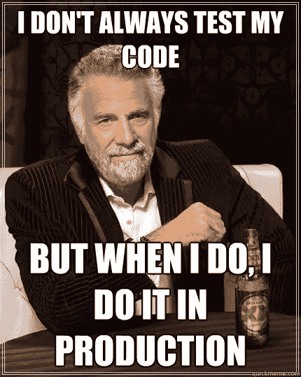
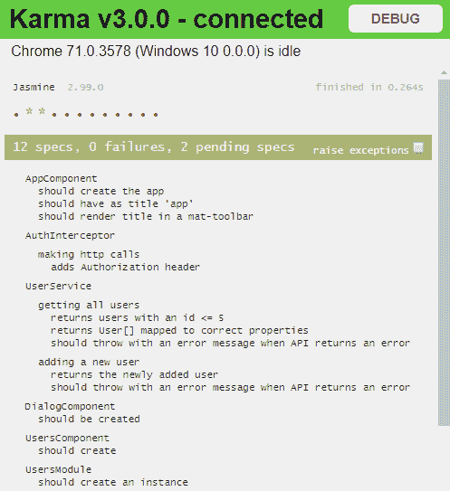
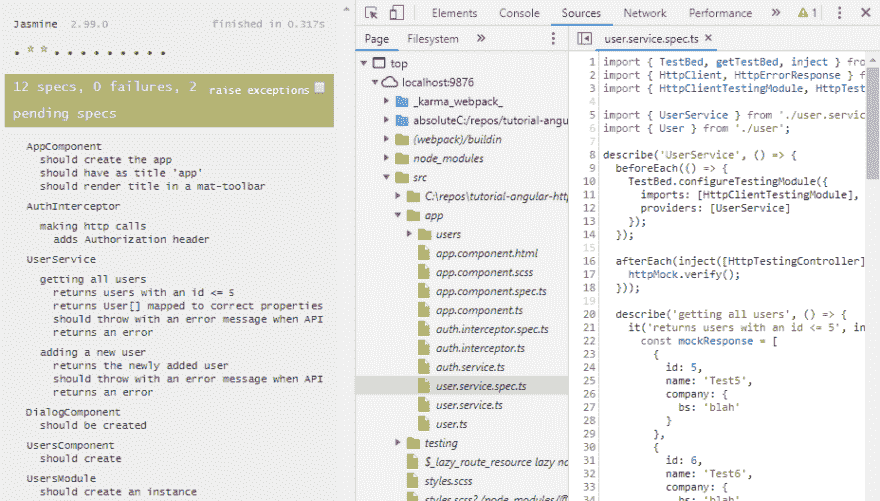
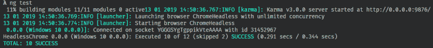

# 如何升级你的角度单位测试游戏(1/3)

> 原文：<https://dev.to/alisaduncan/how-to-level-up-your-angular-unit-testing-game-13-7a1>

单元测试当然有用。在您的应用程序周围有一组好的测试有助于更快地捕捉错误，并使无回归的重构代码更容易。是不是意味着你的应用不会有 bug？没有。但是当我重构或添加新特性时，我喜欢有信心我在正确的轨道上并且不犯愚蠢的错误。我很高兴 Angular(和 Angular CLI)从第一天起就有了测试的想法。

在 Angular 中，我们可以用单元测试做很多事情。这是 3 篇系列文章中的第一篇。

在这篇文章中，我们将学习一些技巧，使用 Angular CLI 提供的开箱即用的东西来提升您的测试水平，并开始单元测试！

[](https://i.giphy.com/media/bdpIDWZFkI67S/giphy.gif)

# 跟着一起走

我们使用 Angular CLI 测试应用程序，并使用我以前写的一篇文章中的代码。

[](/alisaduncan) [## 拦截 Http 请求——使用和测试 Angular 的 HttpClient

### 亚里沙 8 月 28 日 174 分钟阅读

#angular #testing #javascript #programming](/alisaduncan/intercepting-http-requests---using-and-testing-angulars-httpclient)

您也可以克隆[tutorial-angular-http client](https://github.com/alisaduncan/tutorial-angular-httpclient)并运行测试。帖子中讨论的所有关卡都可以在“测试-配置”分支中找到。

### 假设

> 我还假设你知道[单元测试为什么有用](https://dzone.com/articles/top-8-benefits-of-unit-testing)，[如何编写单元测试](https://angular.io/guide/testing)，以及[何时编写单元测试](https://medium.freecodecamp.org/why-end-to-end-testing-is-important-for-your-team-cb7eb0ec1504)(相对于端到端测试)。

# 角度 CLI

当你使用 CLI 创建一个 Angular 应用程序时，它为你的测试搭建了一切。当您使用 Angular 的 CLI 生成代码时，它会自动为您剔除测试。这使得运行您的测试变得轻而易举。在幕后，它使用 Karma 和 Jasmine 进行单元测试。如果茉莉和卡玛不是你的最爱，可以换。但是在这一系列的文章中，我们将使用默认的工具。

无论你喜欢什么样的测试框架，使用它。别做这种人。

[](https://res.cloudinary.com/practicaldev/image/fetch/s--NqSLP8FG--/c_limit%2Cf_auto%2Cfl_progressive%2Cq_auto%2Cw_880/http://www.quickmeme.com/img/70/70710c8aff156b84becbd522bea259023fb64be7369ec8c3bc9638f348284ab1.jpg)

## 运行测试

准备测试了吗？我们走吧！

[](https://res.cloudinary.com/practicaldev/image/fetch/s--_TpZOO-b--/c_limit%2Cf_auto%2Cfl_progressive%2Cq_auto%2Cw_880/https://angular.io/generatimg/marketing/concept-icons/cli.png)

使用命令`ng test`自动开始在 Chrome 手表模式下运行测试。这意味着你可以修改你的代码，它会自动为你重新运行测试。

[](https://res.cloudinary.com/practicaldev/image/fetch/s--KdnDW7gn--/c_limit%2Cf_auto%2Cfl_progressive%2Cq_auto%2Cw_880/https://github.com/alisaduncan/tutorial-angular-httpclient/blob/test-configuration/post-images/karma.png%3Fraw%3Dtrue)

厉害！这对编写功能代码非常有帮助！

现在，您可以愉快地编写代码来消除这个特性....哎呀！功能代码导致现有单元测试失败！我们如何找出测试失败的原因？我们能调试单元测试吗？为什么是的，我们可以。

[](https://i.giphy.com/media/KrV78CrSWtPDa/giphy.gif)

# 在 Chrome 中调试测试

根据您使用的是 Angular v6 还是 Angular v7，说明会有所不同。在 Angular v7 中，启动`ng test`后，您可以通过以下步骤调试单个测试:

1.  在 Karma runner 中按下**调试**
2.  打开 Chrome DevTools 并导航至**源**
3.  展开 src，找到您想要进入的测试，并设置断点
4.  在 Chrome 的 Karma runner 中点击你想要运行的测试的链接

[](https://res.cloudinary.com/practicaldev/image/fetch/s--3uWUVU4x--/c_limit%2Cf_auto%2Cfl_progressive%2Cq_auto%2Cw_880/https://github.com/alisaduncan/tutorial-angular-httpclient/blob/test-configuration/post-images/karma-debug.png%3Fraw%3Dtrue)

在 Angular v6 中，启动`ng test`后，您可以通过以下步骤调试单个测试:

1.  在 Karma runner 中按下**调试**
2.  打开 Chrome DevTools 并导航至**源**
3.  展开 webpack:// → <repo file="" path="">→ src → app</repo>
4.  找到要单步执行的测试并设置断点
5.  在 Chrome 的 Karma runner 中点击你想要运行的测试的链接

您可以设置断点并单步执行单元测试调用的代码，而不仅仅是单元测试本身。那么，你想通过单元测试来单步调试你的角度服务代码吗？没问题！像正常调试应用程序一样对待单元测试调试。

[](https://i.giphy.com/media/14nakW0jC4HA6k/giphy.gif)

当主动编写代码时，在监视模式下运行测试是非常好的，但是有时您希望只运行一次测试。或者您想在无头模式下运行测试。Angular CLI 提供了支持这一点的机制，它使用了各种各样的[标志，您可以使用](https://github.com/angular/angular-cli/wiki/test)。

# 传入旗帜

想只运行一次测试而不是连续运行吗？当你完成你的故事或者作为 CI 过程的一部分，如果你想最后一次运行测试，这是很有用的。因为是时候签入新代码了，所以开始运行测试，将`watch`标志设置为 false。

```
ng test --watch false 
```

Enter fullscreen mode Exit fullscreen mode

是啊！但是构建过程通常也需要无头运行。您可以将标志堆叠在一起，以便无头运行和一次性运行您的测试。

```
ng test --watch false --browsers ChromeHeadless 
```

Enter fullscreen mode Exit fullscreen mode

[](https://res.cloudinary.com/practicaldev/image/fetch/s--8aJzdxB1--/c_limit%2Cf_auto%2Cfl_progressive%2Cq_auto%2Cw_880/https://github.com/alisaduncan/tutorial-angular-httpclient/blob/test-configuration/post-images/ng-test.png%3Fraw%3Dtrue)

不要忘记，您可以创建一个 npm 脚本来运行这个测试配置，以节省您输入的时间！

[](https://res.cloudinary.com/practicaldev/image/fetch/s--qn5uXyzs--/c_limit%2Cf_auto%2Cfl_progressive%2Cq_auto%2Cw_880/https://encrypted-tbn0.gstatic.com/images%3Fq%3Dtbn:ANd9GcT8OCWc4vgZdLkv13SgIKM6AdqzcVL85gEkl7JZTXZiJ_oPqyVu)

既然我们已经介绍了使用 Angular CLI 运行单元测试的基础知识，我们将在本系列的下一篇文章中更深入地研究 Karma 配置和定制测试运行程序。