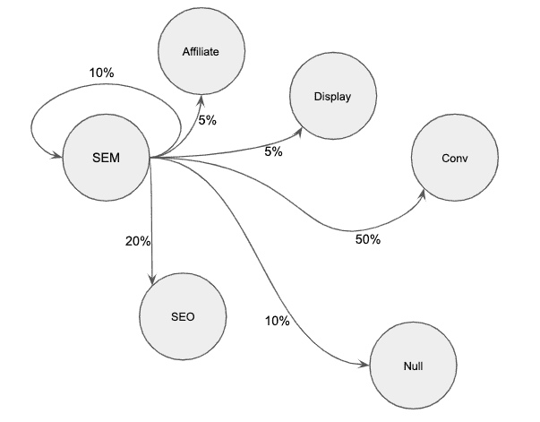
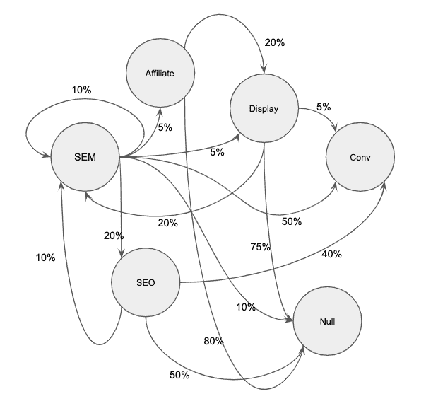
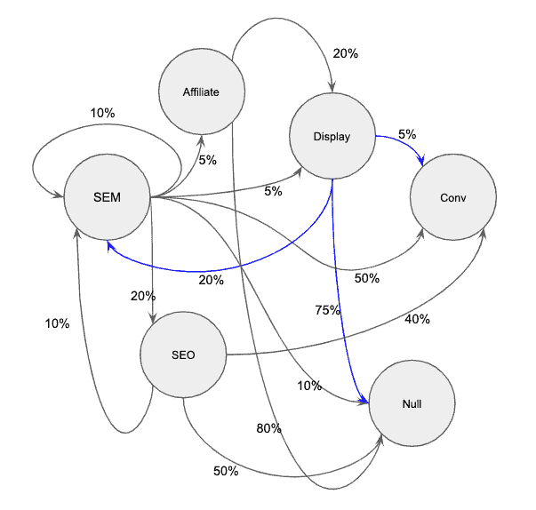

# 如何利用马尔可夫链进行归因

> 原文：<https://dev.to/tensorflowgobrr/how-to-leverage-markov-chains-for-attribution-1k1i>

不久前，我发表了一篇关于开发基于 python 的属性模型的技术性文章，该模型利用了被称为`Markov chain`的概率图形建模概念。

我意识到更好的内容实际上是做这件事背后的动机，以及提供对幕后发生的事情的更清晰的理解。额外收获:最后你可以用 Python 自己抓取代码来做这件事！为此，在这篇文章中，我将描述马尔可夫过程的基础知识，以及为什么我们要在归因建模的实践中使用它。

# 什么是马尔可夫链

马尔可夫链是一种概率模型。这意味着它是一个用概率来表示彼此关联的不同状态的系统。

在我们的归因模型的例子中，状态是给定用户接触到的渠道或策略(例如，非品牌 SEM 广告或展示广告)。那么问题就变成了，鉴于你目前的状态，你下一个最有可能的状态是什么？

估计的一个方法是，从一个状态中得到一个所有可能状态的列表，然后创建一个条件概率分布，表示从初始状态移动到其他可能状态的可能性。

因此在实践中，这可能看起来像下面这样:

设我们当前的状态是一个包含了`SEM`、`SEO`、`Display`、`Affiliate`、`Conversion`、`No Conversion`等可能状态的系统中的`SEM`。

在我们查看了数据集中的每个用户路径之后，我们得到了类似这样的条件概率。

> P(SEM | SEM) = .1
> P(SEO | SEM)= . 2
> P(附属| SEM) = .05
> P(展示| SEM) = .05
> P(转化| SEM) = .5
> P(无转化| SEM)= . 1

这可以用图形表示。

注意从 SEM 状态延伸出来的概率总和等于 1。这是马尔可夫过程的一个重要属性，如果你恰当地设计了你的数据集，这一属性就会有机地出现。

# 连接所有节点

上面我们只确定了当前状态为 SEM 的场景的条件概率。现在，我们需要对所有其他场景进行同样的处理，以建立一个你可以无限跟踪的网络模型。

# 直觉

到目前为止，我已经写了很多关于定义和构建马尔可夫链的过程，但我认为在这一点上，解释一下`why`我喜欢这些模型，而不是基于标准启发式的归因模型是有帮助的。

再次查看我们创建的完整构建的网络，但要特别注意我在下面用蓝色突出显示的出站显示向量。

根据数据，我们有大约 75%不转化的高可能性，只有 5%的机会转化用户。然而，该用户有 20%的可能性继续进行 SEM 作为下一步。而 SEM 有 50%的几率转化！

这意味着，当涉及到这种模式的“归因”部分时，展示很可能会增加其转化率的份额。

# 归属转换

现在我们已经构建了代表我们的用户行为的系统，是时候使用它来重新分配一段时间内发生的转换总数了。

我喜欢做的是获取整个系统的概率矩阵，并在系统中模拟成千上万次运行，这些运行在我们模拟的用户到达`conversion`或`null`时结束。这允许我们使用相当小的样本进行归纳，因为我们可以通过我们对从一个阶段移动到下一个阶段的概率的预先理解来模拟我们系统的不同阶段的随机行走。因为我们将概率分布传递到混合中，所以我们允许模拟结果有更多的变化。

在得到系统的转换率之后，我们可以模拟当我们从系统中一个接一个地去除通道时会发生什么，以理解它们对整体的总体贡献。

我们通过计算`removal effect` [1](#fn1) 来做到这一点，它被定义为如果给定的渠道或策略从系统中删除，我们将错过的转化百分比。

换句话说，如果我们为每个通道创建一个新模型，其中该通道被设置为 100%无转换，我们将有一个新模型来强调完全移除该通道对整个系统的影响。

从数学上来说，我们将某个给定通道设置为零时，整个系统的转换速率与整个系统的转换速率之间的百分比差异。我们会对每个频道都这样做。然后，我们根据去除效应的总和为每一个因素设定一个权重，最后，我们可以将这个数字乘以转换次数，得出转换的分数属性。

如果上面的段落让你感到困惑，请翻到[这里](https://analyzecore.com/2016/08/03/attribution-model-r-part-1/)，向下滚动大约三分之一，看一个清晰的去除效果的例子。我把我的示例系统做得太复杂了，以至于我不想手工写出移除效应 CVRs。

# 就是这样

到目前为止，您已经有了一个有效的归因模型，它利用马尔可夫过程将转化的一部分分配给多个接触点！我还用 Python 构建了一个概念验证，使用上述方法在给定一组接触点的情况下执行基于马尔可夫模型的属性。 [2](#fn2)

干杯！

杰里米·纳尔逊

* * *

1.  Anderl、Eva 和 Becker、Ingo 和 Wangenheim、Florian V .和 Schumann、Jan Hendrik,《描绘客户旅程:在线归因建模的基于图表的框架》( 2014 年 10 月 18 日)。可在 SSRN 获得:[https://ssrn.com/abstract=2343077](https://ssrn.com/abstract=2343077)或[http://dx.doi.org/10.2139/ssrn.2343077](http://dx.doi.org/10.2139/ssrn.2343077)T4】↩

2.  [https://github.com/jerednel/markov-chain-attribution](https://github.com/jerednel/markov-chain-attribution)↩