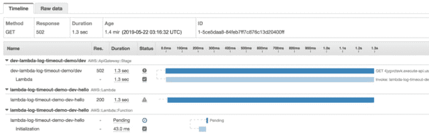
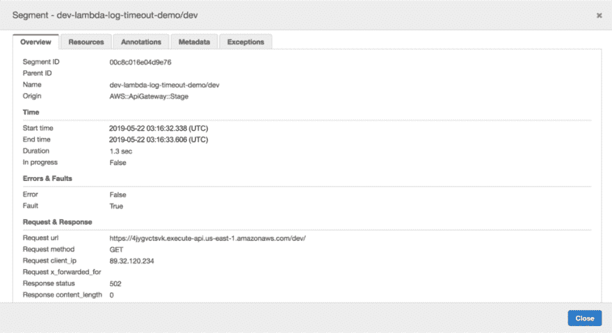
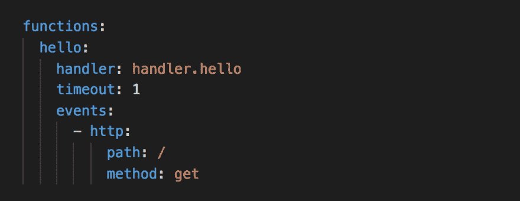

# 如何记录超时的 Lambda 调用

> 原文：<https://dev.to/theburningmonk/how-to-log-timed-out-lambda-invocations-4ab3>

想象一下这种情况。现在是凌晨 3 点，PagerDuty 提醒您 5XX 错误的数量已经达到峰值。有点不对劲。

奇怪，没有错误日志…

幸运的是，我们已经启用了 X 射线跟踪，我能够快速找到这些 5XX 错误的一个痕迹。

遗憾的是，这些痕迹并没有为这个错误提供任何解释。

漫无目的地摸索了一会儿线索后，灵光一现。我只是碰巧注意到这个函数的超时值被设置为 1 秒。来自轨迹的`Duration`是 1.3 秒。

啊哈，Lambda 函数大概超时了！现在我有了一个可疑的原因，我可以通过在日志中查找`"Task timed out"`消息来得到确认。果然，我能找到他们。

现在我可以开始真正调查发生了什么，并找出导致函数超时的原因。

如果我有一条错误日志消息来通知我这些超时，事情会简单得多！

如果这一切听起来很糟糕，那么你很幸运。今天，我们将看看如何在 Lambda 函数超时时记录错误信息。

### 抢先记录超时消息

抓紧你的帽子，因为解决方案简单得令人难以置信！您所要做的就是在调用超时之前记录错误消息；-)

Node.js 函数的`context`对象有一个非常有用的方法叫做`getRemainingTimeInMillis`。它返回当前调用剩余的毫秒数。因此，我们可以安排在函数超时之前进行回调，并抢先记录超时事件。

当然，您可能会在日志中得到奇怪的误报。但是这仍然比函数超时时没有任何错误日志好得多！

这是一个应该封装到中间件中的横切关注点。如果你使用 Node.js，那么你应该考虑使用中间件引擎。在这里，我可以编写一个非常简单的中间件来记录超时错误: