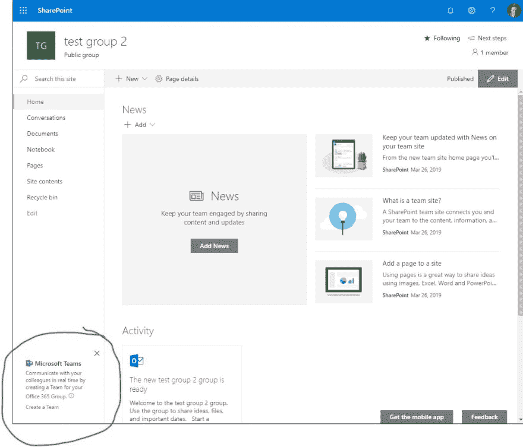
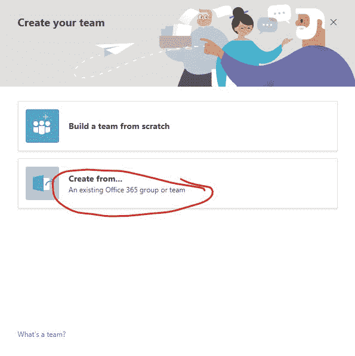

# 如何让 teamify 对话框在 Office 365 中重新出现

> 原文：<https://dev.to/okms/how-to-make-the-teamify-dialog-re-appear-in-office-365-1ilm>

这里有一个快速提示给那些在 Office365 群组网站中永久怀念“Teamify”网站对话框的人。

[](https://res.cloudinary.com/practicaldev/image/fetch/s--PM7TWQdL--/c_limit%2Cf_auto%2Cfl_progressive%2Cq_auto%2Cw_880/https://thepracticaldev.s3.amazonaws.com/i/t6ra3p9zzs9qf101hwzf.jpg)

## PnP PowerShell 片段

```
$siteUrl = "<full url to your site collection>"
# Show Teamify prompt again
$site = Get-PnPTenantSite -url $siteUrl 
# Temporarily disable NoScript
$site.DenyAddAndCustomizePages = [Microsoft.Online.SharePoint.TenantAdministration.DenyAddAndCustomizePagesStatus]::Disabled
$site.Update()
$site.Context.Load($site)
$site.Context.ExecuteQuery()

Connect-PnPOnline -Url $siteUrl
Remove-PnPPropertyBagValue -Key TeamifyHidden

# re-enable NoScript
$site.DenyAddAndCustomizePages = [Microsoft.Online.SharePoint.TenantAdministration.DenyAddAndCustomizePagesStatus]::Enabled
$site.Update()
$site.Context.ExecuteQuery() 
```

该脚本的简短版本是，它暂时删除了 Office 365 中所有组站点上强制实施的 NoScript 限制。这样做是为了我们可以删除“teamiyhidden”property bag 值，该值控制对话框是否可见。最后，我们重新启用 NoScript。

对于那些不知道的人，teamify 对话框允许你创建一个 Office 365 团队，附加到你现有的组站点。当然还有其他方法，最常见的是通过团队界面将现有的组站点连接到新的团队

[](https://res.cloudinary.com/practicaldev/image/fetch/s--GCiUMOqV--/c_limit%2Cf_auto%2Cfl_progressive%2Cq_auto%2Cw_880/https://thepracticaldev.s3.amazonaws.com/i/5yt3ihwr14jsibvucyy4.jpg)