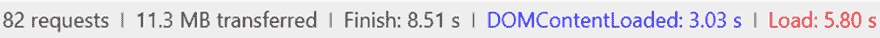
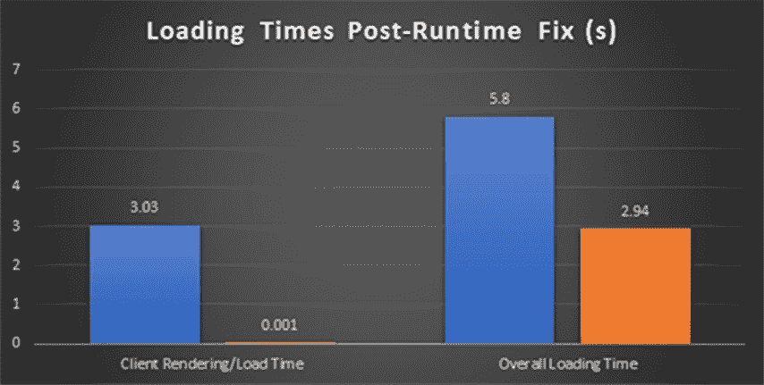

# 如何让你的？网络应用不那么古怪

> 原文：<https://dev.to/rionmonster/how-to-make-your-net-applications-less-quirky-pe5>

*这篇文章最初发表在[我的博客](http://rion.io)上。*

我愿意相信，作为开发人员，我们总是在寻找那些银弹类型的解决方案。我们只需添加一行代码，调整一些全局设置，一切都会得到改善。事情运行得更快，更有效率，错误开始自己解决-这太好了。

这篇文章详细介绍了一个您可能没有启用的设置，尤其是对于旧的遗留应用程序，这可能会导致您无法利用。NET 框架提供了。

## 让我们看看你的申请是否古怪

[](https://res.cloudinary.com/practicaldev/image/fetch/s--fgLZsWTQ--/c_limit%2Cf_auto%2Cfl_progressive%2Cq_66%2Cw_880/http://www.rion.io/conteimg/2019/02/quirky.gif)

你要做的第一件事是在你的应用程序中打开`web.config`。如果您看一下`<system.web>`部分，您应该会看到类似下面的内容(这个特殊的例子是一个旧的 ASP.NET MVC 应用程序):

```
<system.web>
    <compilation debug="true" targetFramework="4.5" />
    <httpRuntime targetFramework="4.5" />
    <authentication mode="Forms">
      <forms loginUrl="~/Account/Login" timeout="2880" />
    </authentication>
    <pages>
      <namespaces>
        <add namespace="System.Web.Helpers" />
        <add namespace="System.Web.Mvc" />
        <add namespace="System.Web.Mvc.Ajax" />
        <add namespace="System.Web.Mvc.Html" />
        <add namespace="System.Web.Optimization" />
        <add namespace="System.Web.Routing" />
        <add namespace="System.Web.WebPages" />
      </namespaces>
    </pages>
</system.web> 
```

此部分的外观可能会有所不同，但它应该具有相对相似的结构。在这篇文章中，我们真正关心的部分是`<httpRuntime>`部分:

```
<httpRuntime targetFramework="4.5" /> 
```

**如果你设置了`targetFramework`属性，那么你可以停止阅读这篇帖子；你很棒。如果你没有，那么你应该为即将发生在你的应用程序上的美妙事情而高兴。**几个小小的字符会对你的应用程序产生如此大的影响，这似乎有点微不足道，所以让我们来讨论一下这个属性的确切含义和作用。

## 天哪！我的申请很奇怪，我该怎么办？

[](https://res.cloudinary.com/practicaldev/image/fetch/s--cteJewEp--/c_limit%2Cf_auto%2Cfl_progressive%2Cq_66%2Cw_880/http://www.rion.io/conteimg/2019/02/fix-it.gif)

如果你在上面提到的古怪的船上，那么停下你现在正在做的事情，去把它添加到你的`web.config`中。我可以等待，事实上，你可以关闭你的浏览器，不必继续阅读(尽管如果我们在现实世界中相遇，请考虑给我买瓶啤酒)，因为你的应用程序中的一切现在应该更好了*。但是为什么呢？*

 *这一切都归结于。NET Framework 实际上解析。NET，但是这里的关键是:**如果 web.config 中没有`<httpRuntime targetFramework>`属性，那么就假定应用程序需要 4.0 quirks 行为，而这是您绝对不想要的。**

> 启动 Internet Explorer，访问你能想到的最现代的网站，然后启用 Quirks 模式。当你看到网站的希望和梦想逐渐消失，变成一团乱麻时，要知道没有设置 targetFramework 对你的 web 应用程序也是一样的。

基本上，如果您没有设置这个属性，您的 web 应用程序将会像针对~2009 版本的。NET 框架。如果没有这一点，框架在性能、可靠性和安全性方面的大部分优势都将荡然无存。添加后，你会想知道你是如何做到的，而错过了所有这些令人难以置信的功能和改进。

## 动作敏捷

让我们看看将它应用到现实世界的应用程序中会是什么样子。首先，我们将打开我过去工作过的一个大型企业级应用程序的登录页面:

[](https://res.cloudinary.com/practicaldev/image/fetch/s--ydwRHGkD--/c_limit%2Cf_auto%2Cfl_progressive%2Cq_auto%2Cw_880/http://www.rion.io/conteimg/2019/02/first.PNG)

然后在应用修复后:

[](https://res.cloudinary.com/practicaldev/image/fetch/s--iNQLsUZM--/c_limit%2Cf_auto%2Cfl_progressive%2Cq_auto%2Cw_880/http://www.rion.io/conteimg/2019/02/after.PNG)

那么这里最大的区别是什么呢:

*   **轻微的压缩改进** -有效载荷的总大小从 11.3MB 减少到 11.2MB，这虽然不是非常显著，但却非常重要(尤其是在大规模情况下)。
*   **显著减少客户端加载时间**——DOM 本身的内容加载时间减少了几个数量级，从大约 3 秒减少到 100 毫秒；一个巨大的进步。
*   **整体更快的感知性能** -最终用户绝对会感受到客户端上更快的加载时间，这几乎将整体加载时间减少了一半，并且渲染时间显著增加。

如果你更喜欢图表，我们可以在下面看到它的样子:

[](https://res.cloudinary.com/practicaldev/image/fetch/s--pqAKoYqx--/c_limit%2Cf_auto%2Cfl_progressive%2Cq_auto%2Cw_880/http://www.rion.io/conteimg/2019/02/postfix.PNG)

您的收获可能会有所不同，但是如果像这样的改进可以应用于任何应用程序，那么不利用它们就是彻头彻尾的疯狂，尤其是知道只需要少数几个字符就可以做到这一点。*