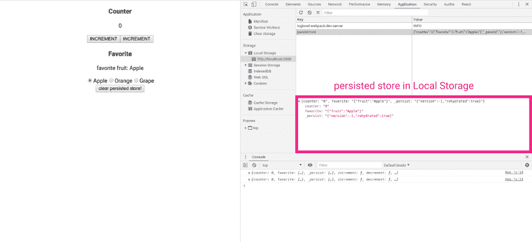

# 如何迁移 redux-persist 持久化的存储？

> 原文：<https://dev.to/sasurau4/how-to-migrate-store-persisted-by-redux-persist-5dng>

## [T1】简介](#intro)

最近，我在开发 react-native 应用程序时陷入了一个关于 redux-persist 的陷阱。这是因为两个原因。一个是 app 里的 redux store 形状复杂。另一个是 [redux-persist 的迁移示例文档](https://github.com/rt2zz/redux-persist/blob/v5.10.0/docs/migrations.md)非常简单，我找不到任何其他关于迁移的文档。

如果你读了文档并弄明白了，你也许不需要读下面的内容。如果您对如何迁移商店或迁移工作方式有疑问，这篇文章将会有所帮助。

## 先决条件

这篇文章基于以下版本。

纱线:v1.13.0
还原-持续:v5.10.0

## 第一步

本文中的所有代码都是[这里的](https://github.com/sasurau4/sample-redux-persist-migration)。
此回购由 create-react-app 制作并已设置。

请克隆回购并结帐`v1.0.0`。

```
git clone https://github.com/sasurau4/sample-redux-persist-migration.git
cd sample-redux-persist-migration
git checkout v1.0.0 
```

按照命令启动开发服务器。

```
yarn install
yarn start 
```

然后在浏览器上自动打开新标签页！第一步完成了🎉

## 检查应用程序中发生的事情

你会看到非常简单的应用程序组成的计数器和最喜爱的水果采摘。
用 app 玩增量或减量或者选择自己喜欢的水果！
播放后重新加载页面。app 会怎么样？

应用程序的状态将与重新加载前相同！多亏了 redux-persist。

应用程序中发生了什么？去检查一下。

我一般用谷歌 Chrome。我也用它来解释。

打开你的开发者工具，如下图所示。

[](https://res.cloudinary.com/practicaldev/image/fetch/s--Bo3l2cTy--/c_limit%2Cf_auto%2Cfl_progressive%2Cq_auto%2Cw_880/https://thepracticaldev.s3.amazonaws.com/i/gbm9d5khn2xhu5ufu4m0.png)

您可以在本地会话中找到`persist:root`键，在值中找到`_persist`键。
它显示了 redux-persist 通过`JSON.stringify`序列化我们的 reducers。
可以看到[代码](https://github.com/rt2zz/redux-persist/blob/v5.10.0/src/createPersistoid.js#L126)
`_persist`是 redux-persist 添加的元数据。

如果没有版本指定了配置，库会将缩减器识别为`minus 1 version`。

当改变一些东西时，你可以看到本地存储中的持久数据与应用程序的状态同步！

所以，进入主要问题，迁移。

## 店铺迁移

保持 te webpack-dev-server 运行，并输入以下命令。

```
git checkout v2.0.0 
```

app 怎么了？

最喜爱的动物项目出现在应用程序和一些日志在控制台！这是 redux-persist 迁移的成功。

迁移设置如下提取[此处](https://github.com/sasurau4/sample-redux-persist-migration/blob/v2.0.0/src/Store.js#L12)。

```
...
const migrations = {
  0: state => {
    return {
      ...state,
      favorite: {
        ...state.favorite,
        animal: 'Tiger',
      },
    };
  },
};

const persistConfig = {
  key: 'root',
  version: 0,
  storage,
  debug: true,
  migrate: createMigrate(migrations, { debug: true }),
};
... 
```

迁移状态有最喜欢的动物为`Tiger`，所以你在 app 里看到最喜欢的动物为`Tiger`！
在`_persist`查看版本，你会发现版本 0。

接下来，结帐到主人。发生了什么事？

你看 app 上的`I don't like fruit!`消息！
v 0 到 v1 迁移成功。

这里的代号是

```
...
const migrations = {
  0: state => {
    return {
      ...state,
      favorite: {
        ...state.favorite,
        animal: 'Tiger',
      },
    };
  },
  1: state => {
    return {
      ...state,
      favorite: {
        animal: state.favorite.animal,
      },
    };
  },
};
... 
```

你会发现`0`键和`1`键缺少`state.favorite`的区别。
版本 1 的迁移存储已经没有`Favorite`减速器中的`fruit`键。
所以，你看到“我不喜欢水果！”消息。

如果你想更多地玩这个应用程序，你可以查看你想要的任何版本。如果你想知道更多关于 redux-persist 的细节，我推荐你查看一下 [repo](https://github.com/rt2zz/redux-persist)
它非常有帮助，并且有据可查。

## 结论

当你考虑持久存储时，redux-persist 是非常有用的库。它提供了简单而强大的 API！

如果你发现任何错误或误解，请指出给我。🙏

感谢阅读！

注意:在发表这篇文章后，我发现这篇文章讲述了 redux-persist 自述文件中的相同主题！这也很有帮助！如有需要，请阅读 [it](https://medium.freecodecamp.org/how-to-use-redux-persist-when-migrating-your-states-a5dee16b5ead) 。