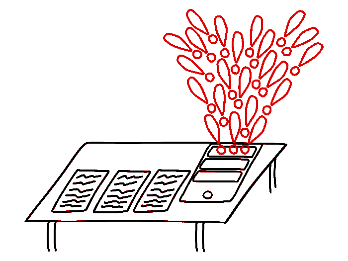

# 如何防止拖延症

> 原文：<https://dev.to/m1guelpf/how-to-prevent-procrastination-4ki7>

[https://app.blogcast.host/embed/280](https://app.blogcast.host/embed/280)

想要高效工作吗？以下是一些如何远离网络诱惑陷阱的小技巧。

与其试图说服自己不要查看社交媒体，或者不要阅读新闻，不如确保你根本*不能。*

但是首先，一个快速的警告:你可能会找到绕过所有这些诡计的方法(除非你绝望到把密码给了某个监视你的人)。然而，它们会让你更难滑倒，并在你需要的时候帮助你集中注意力。

我们经常在电话或电脑上，突然发现自己在不知不觉中查看社交媒体。这是一种潜意识的习惯。我们自动地做这件事，没有任何有意识的决定，就好像硅谷有人给我们编了程序一样。

这篇文章的目的是帮助你决定是否要拖延。与我们开始拖延相比，这是一个很大的进步，因为我们只是不知不觉地陷入其中。

## **手机？扔掉它！**

### **遵循三感法则**

真的需要学习或者深度专注吗？

然后用 3 感法则:**眼不见，心不烦，耳听。**

把你的手机放在你够不到的地方。理想情况下，这样你就看不到了。关闭声音。关闭通知。

### **坏应用出局，好应用在**

另一个提示:删除你不需要的应用程序。你的手机不需要脸书。

对于 iOS 和 Android，可以获得一个名为 [Forest](https://www.forestapp.cc/) 的 app。当你想集中注意力而不想把手机拿在手里时，你启动一个定时器，一棵树就开始在应用程序中生长。如果你想在计时器结束前使用你的手机，你会丢失你的进度。效果出奇的好。

### **做自己的好父母**

您可以通过设置特殊密码在 iOS 上设置家长控制。然后你可以屏蔽那些你花太多时间浏览的网站。

你是看新闻而不是学习吗？限制你对它们的访问。

如果你想访问被屏蔽的网站，你必须在家长控制中关闭它们，这很烦人。

如果您开始定期关闭家长控制，您可以更进一步，要求您的朋友或家人设置一个您不知道的密码。如果你想进入禁区，你需要先得到他们的许可。

你也可以设置一条规则，每天只能查看 Reddit 一次。例如在晚上 8 点。这些规则的诀窍在于，它们必须对你自己公平。如果你制定了一个残酷的规则，几天后你可能会反抗。

您可以为自己设定的规则示例:

*   我要到晚上 12 点才会查看社交媒体。
*   我只会在中午 12 点、下午 4 点和晚上 8 点查看社交媒体，每次 10 分钟。
*   工作了 4 个小时才会去查推特。

### **最坏情况场景**

有一款名为 [Freedom](https://freedom.to/) 的应用可以让你屏蔽其他应用和网站。它不是免费的，但是也许你自己的生产力每个月值几美元。

iOS 12 Apple 允许你在设置中阻止应用程序，但它并不完美，你可以很容易地绕过它，所以上面提到的选项可能会更好。

## **电脑？分而治之！**

计算机在如何改变我们的环境方面给了我们更多的选择，从而帮助我们做出相应的行为。我们可以屏蔽我们需要屏蔽的。

### **最佳方案？使用 2 个设备。**

最好的解决方案是一台设备用于学习和工作，另一台用于娱乐。

在学习电脑上，你不能访问任何东西:你不能浏览 Youtube、电子邮件或社交媒体——你只能学习，而在第二台电脑(或平板电脑)上，你可以访问任何你想访问的东西。

为什么这很有帮助？当同一个设备既可以用于工作又可以用于娱乐时，就会出现一个问题。找乐子比工作容易得多，所以你必须有强烈的意愿去抵制它。尤其是只有一次点击的时候。

### **次佳方案:同一台电脑上的两个账户。**

但不是每个人都有机会或负担得起多种设备。幸运的是，还有其他很好的选择。例如，如果你有一台电脑，你可以把它分成两台。

怎么会？创建 2 个帐户。一个用于学习(或工作)，第二个用于娱乐。为了学习，你不能访问那些你可以拖延的网站。在娱乐账户上，你可以访问任何你想访问的内容。

这种账户分割需要一点时间来建立，但当它完成后，就更容易专注于你想做和应该做的事情。

## **使用 2 台设备(或账户)有什么坏处**

现在，你可能在想:“*什么会阻止我使用我的有趣设备呢？*”。当然，你也可以退出游戏，然后打开游戏。但是如果你在你的娱乐账户上设置了一个令人讨厌的长密码，你必须从某个地方粘贴，你需要花费很多精力。这个额外的障碍可以帮助你坚持做你需要做的事情，当你试图拖延时，它也可以帮助你意识到。

现在，你可以决定你是否想要理想地走遍整个房子、办公室或公寓，拿着写有你的长密码的便利贴，一个字母一个字母地输入，并登录你的有趣账户，*或者你是否可以再逼自己一点，继续学习。*

### **如何阻止访问社交媒体**

太好了，你已经决定创建两个独立的帐户，或者你有两台电脑。你将如何阻止访问社交媒体？

您可以使用这些简单的步骤:

1.  将您的社交媒体密码更改为您不记得的密码。
2.  注销
3.  不要将密码保存在密码管理器或浏览器中

脸书没有登录是没用的。当你学习并决定输入你的浏览器 F 时，你将进入脸书的登录页面，而不是你会注意到你想拖延的令人上瘾的新闻提要

当你完成一天的重要工作后，你可以退出电脑的工作帐户，登录另一个帐户查看脸书，如果你想的话，但要问心无愧，知道你需要做的事情已经完成。

### **但是我需要必须访问脸书**

但是如果你需要做的工作涉及到使用脸书呢？

脸书的问题在于，当你带着一个特定的任务来到这里时，你会被通知、消息、状态等淹没。你没有去做你本来想做的事情，而是偏离了方向，浪费了时间。

通过采取这两个简单的步骤，你可以大大限制你的脸书使用，但仍然有所有的好处。

1.  关闭聊天。进入页面右下角的聊天区，点击设置按钮，选择*关闭聊天标签*、*关闭活动状态*(针对所有联系人)，然后选择*隐藏侧栏*。
2.  下载这个[扩展](https://chrome.google.com/webstore/detail/news-feed-eradicator-for/fjcldmjmjhkklehbacihaiopjklihlgg) -新闻提要根除器。它隐藏了脸书的新闻。

## **如何屏蔽其他网站**

如果你只是想限制或减少花在某些网站上的时间，我会推荐[stay focused](https://chrome.google.com/webstore/detail/stayfocusd/laankejkbhbdhmipfmgcngdelahlfoji)。它是 Google Chrome 的扩展(在 Opera 中也能工作)。

它甚至提供了一个所谓的核选项，可以阻止所有网站的访问，时间长短由你决定。

## **获得对自己时间的更多控制权**

社交媒体的创造者想要偷走我们的时间和注意力。我们要靠自己来抵御对大脑的偷偷摸摸的操纵。

我希望这些建议不仅读起来有趣，而且你会用它们来更好地控制你每天的生活。选择至少一件你能做的事情，今天就去尝试吧！