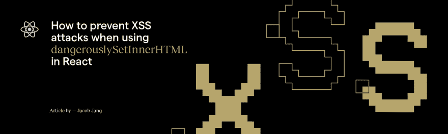

# 在 React 中使用 dangerouslySetInnerHTML 时如何防止 XSS 攻击

> 原文：<https://dev.to/jam3/how-to-prevent-xss-attacks-when-using-dangerouslysetinnerhtml-in-react-1464>

[](https://res.cloudinary.com/practicaldev/image/fetch/s--FWZ1z6d0--/c_limit%2Cf_auto%2Cfl_progressive%2Cq_auto%2Cw_880/https://thepracticaldev.s3.amazonaws.com/i/x2fc02w53jwn7cel1gmj.png)

这篇文章旨在展示我们用来减轻在 [Jam3](https://jam3.com) 的跨站脚本(XSS)攻击的技术之一。当`dangerouslySetInnerHTML`被错误使用时，这些漏洞可能会出现，我们的目标是提前检测到它，并清理不可信的值。

# **危险地设置 innerHTML**

该特性旨在向前端呈现和插入 DOM 格式的内容数据。使用该特性是一种不好的做法，尤其是在处理用户输入和动态数据时。你必须考虑它的漏洞，以防止 [XSS 攻击](https://www.owasp.org/index.php/Cross-site_Scripting_(XSS))。

使事情安全的“容易”是反应哲学之一。React 是灵活的和可扩展的，这意味着坏的实践可以变成最佳实践。消毒道具价值是一个显而易见的选择，并强烈建议。

# **XSS 袭击**

跨站点脚本(XSS)允许攻击者(黑客)将恶意代码注入其他最终用户的网站。通过这样做，攻击者可以访问个人数据、cookies、网络摄像头，甚至更多。阅读更多关于[跨站点脚本](https://www.owasp.org/index.php/Cross-site_Scripting_(XSS))的信息。

复制`https://placeimgxxx.com/320/320/any" onerror="alert('xss injection')`并粘贴到下面 xss 注入示例中的输入字段:
[](https://codesandbox.io/s/k9vxk9ppyo?autoresize=1&moduleview=1)

### **阻止 XSS**

这个问题不限于反应；为了了解如何在您的 web 开发中防止它，OWASP 有一个很好的[预防备忘单](https://www.owasp.org/index.php/XSS_(Cross_Site_Scripting)_Prevention_Cheat_Sheet)。防止 XSS 攻击的一种方法是净化数据。这可以在服务器端或客户端完成；在本文中，我们将关注客户端解决方案。

### **防范 XSS 陷入险境**

使用`dangerouslySetInnerHTML`时在前端净化内容总是一个很好的安全实践，即使有可信的[真实来源](https://en.wikipedia.org/wiki/Single_source_of_truth)。例如，另一个负责维护项目的开发团队改变了事实的来源，却没有意识到它会如何影响站点。这样的变化可能会导致严重的 XSS 漏洞。

在 Jam3 中，我们尽可能避免使用`dangerouslySetInnerHTML`。当需要时，我们**总是**在后端和前端应用净化安全层。此外，我们在 [`eslint-plugin-jam3`](https://github.com/Jam3/eslint-plugin-jam3) 内部创建了一个名为`no-sanitizer-with-danger`的 [ESLint](https://eslint.org/) 规则来检测`dangerouslySetInnerHTML`的不当使用。

# **ESLint 规则**

我假设你已经熟悉了 ESLint。如果没有，[开始](https://eslint.org/docs/user-guide/getting-started)。

```
$ npm i eslint eslint-plugin-jam3 -save-dev 
```

延长。通过添加`jam3`创建 eslintrc 配置文件。可以省略 eslint-plugin- prefix。然后，通过向规则添加`jam3/no-sanitizer-with-danger`来配置规则。注意:建议错误等级为 2。使用此选项，退出代码将为 1。错误级别 1 将发出警告警报，但不影响退出代码。0 表示关闭规则。插件会检查传递给`dangerouslySetInnerHTML`的内容是否包装在这个杀毒函数中。包装函数名也可以在 JSON 文件中更改(`sanitizer`是默认的包装函数名)。