# 如何保护 WordPress 网站免受黑客攻击

> 原文：<https://dev.to/bitofwp/how-to-protect-a-wordpress-site-from-being-hacked-59l2>

“WordPress 是有史以来最好的东西！我爱死了！”-说没有人的网站被黑过。

人们倾向于指责他们的主机提供商、插件、主题和 WordPress 开发者、黑客，因为他们除了黑他们的网站没有更好的事情可做……事实很简单。这可能发生在任何人身上，你有责任去阻止它。或者至少让它变得极其困难。

如果你正在读这篇文章，你可能有过恶意软件的糟糕经历，或者你听说过一些故事，不希望这些发生在你身上。

从这个问题开始并不完全错误:“**我的网站为什么会被黑？**”。这是一个合理的要求。黑客这样做可能是为了好玩或有目的，但这不应该与你有关。

更重要的问题是:“**我的网站是如何被黑的**？”因为当你回答这个问题时，你就知道了被黑客利用的弱点是什么，你可以做些什么来消除它。

幸运的是，这个问题之前已经被回答过很多次了，所以我们已经有了一个
好主意，知道 WordPress
最常被利用的弱点是什么，以及我们应该对此做些什么。

#### 这里列出了保护你的 WordPress 站点需要做的 5 件事

*   [保护登录页面](#Protect1) 
*   [保护您的文件和数据库](#Secure2) 
*   [更新你的主题、插件和 WordPress 核心文件](#Update3) 
*   [对机器人、特定 IP 和国家/地区进行限制](#Apply4) 
*   [监控你的网站](#Monitor5) 

## 1.保护 WordPress 登录页面

[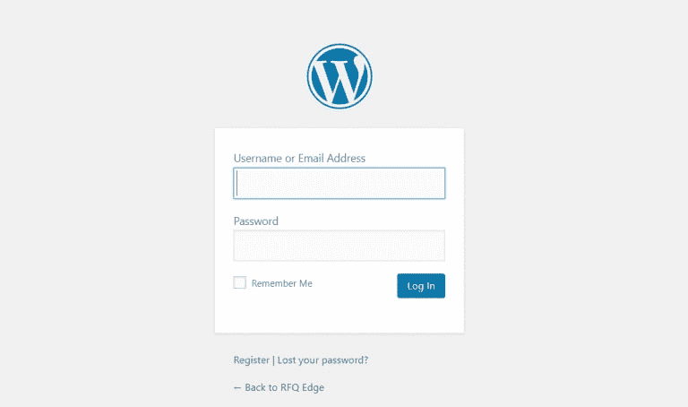](https://res.cloudinary.com/practicaldev/image/fetch/s--V8xG36K_--/c_limit%2Cf_auto%2Cfl_progressive%2Cq_auto%2Cw_880/https://img.bitofwp.com/wp-content/uploads/2019/03/ProtectMain-768x454.png)

默认情况下，可以通过在域名中添加 *'/wp-admin'* (或 *'/wp-login.php'* )来访问 WordPress dashboard 登录页面——即 domain.com/wp-admin(或*domain.com/wp-login.php*)。

这意味着任何有互联网连接和浏览器的人都可以轻松访问您的登录页面。他们所要做的就是猜测你的用户名和密码，当然，这并不容易。这就是暴力攻击发挥作用的地方。

暴力攻击意味着黑客将通过猜测用户名和密码进行无数次登录尝试。这是通过使用计算机程序来完成的，因此黑客实际上可能会尝试数千种组合，这取决于他们硬件的速度，直到其中一种有效。当他们作为管理员用户登录后，没有任何限制。

您可以选择以下一个或多个(或全部)建议:

### 限制登录尝试

[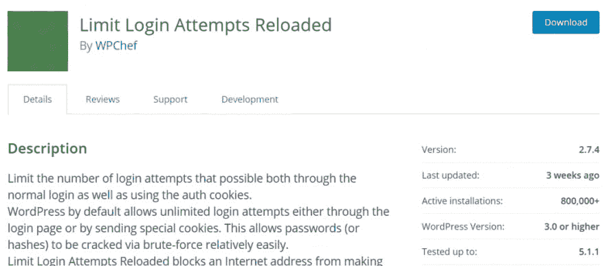](https://res.cloudinary.com/practicaldev/image/fetch/s--9UQ28GMy--/c_limit%2Cf_auto%2Cfl_progressive%2Cq_auto%2Cw_880/https://img.bitofwp.com/wp-content/uploads/2019/03/LimitLogin-1024x451.png)

如果你想要一个轻量级插件，限制登录尝试的 **[重载的](https://wordpress.org/plugins/limit-login-attempts-reloaded/)** 是一个不错的选择。它确实如标题所示。而 **[iThemes Security](https://wordpress.org/plugins/better-wp-security/)** (之前的 BetterWP Security)则更加通用，相当受欢迎。

[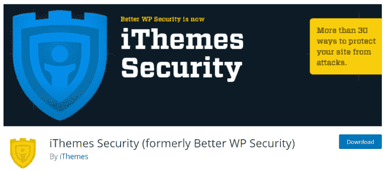](https://res.cloudinary.com/practicaldev/image/fetch/s--_TyeeLuv--/c_limit%2Cf_auto%2Cfl_progressive%2Cq_auto%2Cw_880/https://img.bitofwp.com/wp-content/uploads/2019/03/iThemes-768x341.png)

如果您将登录尝试次数限制为 3 次，您将使试图强行进入管理仪表板的人变得困难，因为他们不会有无限的尝试次数。黑客在 3 次尝试中猜出凭证的几率有多大？你必须是世界上最不幸的人(或者使用可预测的凭证)。这使我们……

### 调整您的密码

[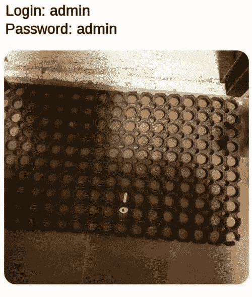](https://res.cloudinary.com/practicaldev/image/fetch/s--bTrP7wJn--/c_limit%2Cf_auto%2Cfl_progressive%2Cq_auto%2Cw_880/https://img.bitofwp.com/wp-content/uploads/2019/03/adminAdmin.png)

调整您的密码(和用户名)也是登录安全的一个非常重要的部分。有些人根本不想变得有创造性，使用非常可预测的用户名(名字:汤姆，杰里，斯派克等。)和密码(密码@123 等)。

重要提示-不要使用“admin”作为用户名，因为这是一个可预测的用户名，对于试图强行进入的人来说，您基本上排除了很多因素。你可以使用密码生成器甚至密码管理器(这样可以省去你记密码的麻烦)。

### 更改您的登录 URL 路径

[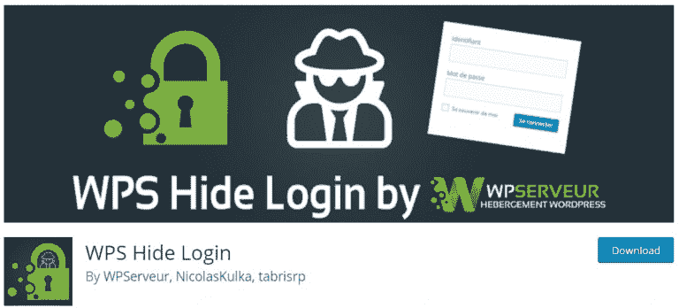](https://res.cloudinary.com/practicaldev/image/fetch/s--wpgIBCfp--/c_limit%2Cf_auto%2Cfl_progressive%2Cq_auto%2Cw_880/https://img.bitofwp.com/wp-content/uploads/2019/03/WPSHideLogin-768x348.png)

如前所述，WordPress admin 登录可以通过在域名中添加 *'/wp-admin'* 或 *'wp-login.php'* 来访问。这是 WordPress 的默认设置。有一些插件可以改变这一点，所以你必须输入 domain.com/login 而不是 domain.com/wp-admin,(当然‘登录’不是个好主意。可预见的。).这给黑客们增加了一个要弄清楚的变量，因为现在他们除了已经猜出用户名和密码之外，还必须猜出登录 URL。

**[WPS 隐藏登录](https://wordpress.org/plugins/wps-hide-login/)** 提供了这一功能。

### 注销空闲用户

[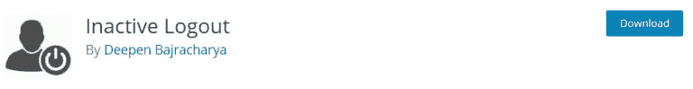](https://res.cloudinary.com/practicaldev/image/fetch/s--vmsoDT0N--/c_limit%2Cf_auto%2Cfl_progressive%2Cq_auto%2Cw_880/https://img.bitofwp.com/wp-content/uploads/2019/03/InactiveLogout-768x99.png)

这意味着一段时间不活动后，用户将被注销，插件 **[不活动注销](https://wordpress.org/plugins/inactive-logout/)** 将这个特性添加到你的 WordPress 站点。想象一下，有人登录并打开了 WordPress 仪表盘。任何路过的人都可以编辑你的网站内容。或者你使用你朋友的设备登录，而那个人是个爱恶作剧的人。

### 双因素认证

[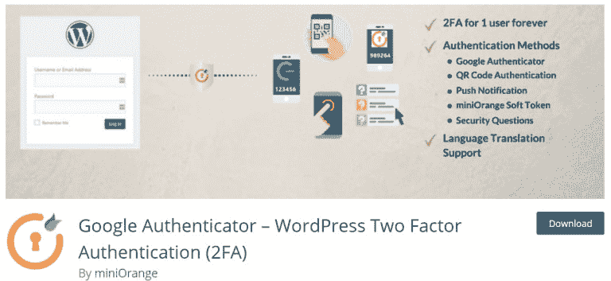](https://res.cloudinary.com/practicaldev/image/fetch/s--csyn3ow0--/c_limit%2Cf_auto%2Cfl_progressive%2Cq_auto%2Cw_880/https://img.bitofwp.com/wp-content/uploads/2019/03/TwoFactor-768x353.png)

这听起来可能有点矫枉过正，但请这样想——银行正在使用它。意味着这是一个很好的方法，只有你(或拿着你手机的人)可以登录。基本上，插件会在你每次尝试登录的时候发送一个密码到你的手机上，并且会在登录页面提示你输入密码。

有几个插件提供这种功能，如:
–**[Google Authenticator–WordPress 双因素认证(2FA)](https://wordpress.org/plugins/miniorange-2-factor-authentication/)**
–**[双因素认证(由 UpdraftPlus authors 提供)](https://wordpress.org/plugins/two-factor-authentication/)** 。

## 2.保护您的文件和数据库

所有的托管公司都说他们的服务器是安全的，因为他们不得不这样做，但这是一个无聊的吹嘘。可能会上传包含恶意内容的文件，或者更改服务器上的一些现有文件。但是，有几件事可以做，使别人很难访问您服务器上的文件。

所有这些都可以通过在你的服务器上编辑配置文件或者使用类似于 **[多合一 WP 安全](https://wordpress.org/plugins/all-in-one-wp-security-and-firewall/)** 或类似的安全插件来完成。使用插件有好处也有坏处。

#### 赞成的意见

*   使用方便
*   只需点击几下，即可启用/禁用选项

#### 骗局

*   性能下降
*   可能与其他插件/主题冲突

### 小心设置目录权限

[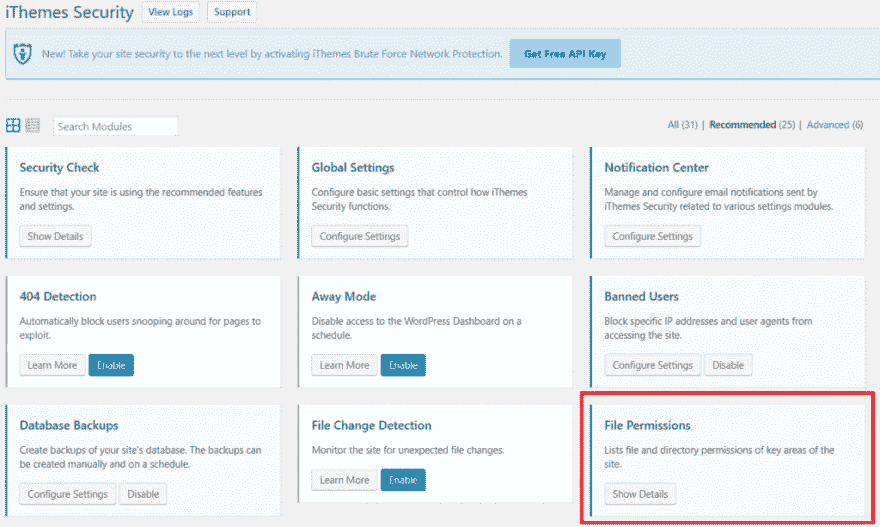](https://res.cloudinary.com/practicaldev/image/fetch/s--NMW2PnLM--/c_limit%2Cf_auto%2Cfl_progressive%2Cq_auto%2Cw_880/https://img.bitofwp.com/wp-content/uploads/2019/03/Permissions-1024x613.png)

一般的经验法则是将目录权限设置为“755 ”,将文件设置为“644 ”,以保护整个文件系统——目录、子目录和单个文件。

错误的目录权限可能是致命的，尤其是在共享托管环境中。例如，为文件设置 777 权限意味着每个人都可以读取、写入和执行该文件。这组权限是不明智的，永远不应该使用。 **[iThemes Security](https://wordpress.org/plugins/better-wp-security/)** 插件可以显示是否有任何权限需要更改。

此外，明智的做法是咨询您的主机提供商的主机支持，因为根据您的主机计划，这些权限可能会有所不同。

如果你不确定这些数字代表什么，我建议你看一看这篇文章。

### 不允许文件编辑

[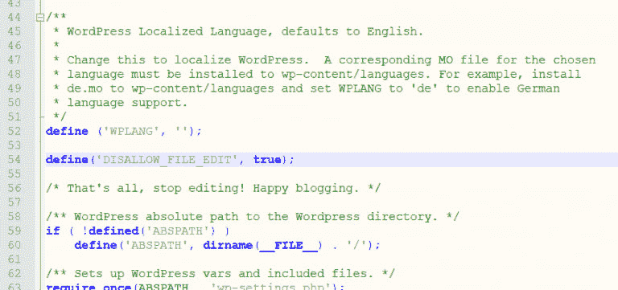](https://res.cloudinary.com/practicaldev/image/fetch/s--KszkzfgC--/c_limit%2Cf_auto%2Cfl_progressive%2Cq_auto%2Cw_880/https://img.bitofwp.com/wp-content/uploads/2019/03/DisallowFileEdit-768x361.png)

有很多方法可以从 wp-admin dashboard 编辑主题和插件文件(例如主题编辑器)。任何具有管理员权限的用户都可以这样做。

要删除此功能，请在 wp-config.php 文件中添加以下行:

`define(‘DISALLOW_FILE_EDIT’, true);`

举例来说，如果你不想每次想对你的主题文件做一点小的改动时都通过 SFTP 连接，这可能是一个麻烦，但是如果你差不多完成了硬编码，这是一个很好的安全措施。

### 禁用目录列表(最好通过。htaccess)

[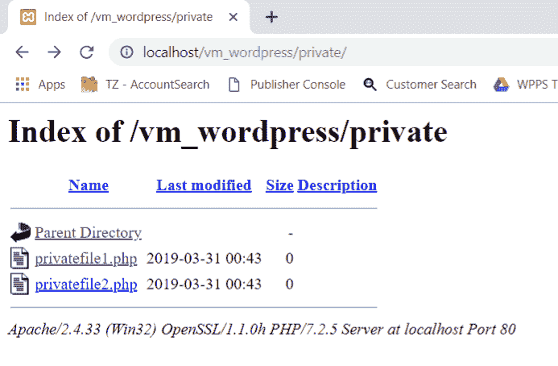](https://res.cloudinary.com/practicaldev/image/fetch/s--fm2AG_Iq--/c_limit%2Cf_auto%2Cfl_progressive%2Cq_auto%2Cw_880/https://img.bitofwp.com/wp-content/uploads/2019/03/DirectoryListing.png)

假设你创建了一个名为“Private”的目录，把除了你之外任何人都不能看到的文件放在里面。如果目录中没有 index.html 或 index.php 的文件，任何人只要输入 domain.com/private/.就能看到目录的内容

为了防止这种情况，你必须:在这个目录中放一个空的 index.html 文件(或者 index.php，它只包含开始的 php 标签' 2。通过禁用目录列表。htaccess 通过添加这一行:

`Options All -Indexes`

### 选择 SFTP/宋承宪自带的主机

尽管 SFTP 和 FTP 对最终用户来说看起来是一样的(尤其是当使用 FileZilla 这样的工具连接时)，但两者之间有很多不同之处。

虽然 FTP 协议只传输原始格式的 FTP 命令，但 SFTP 协议在您的计算机和服务器之间提供加密，使得有人很难破坏连接或伪造您的信息。

### 阻止所有热链接

[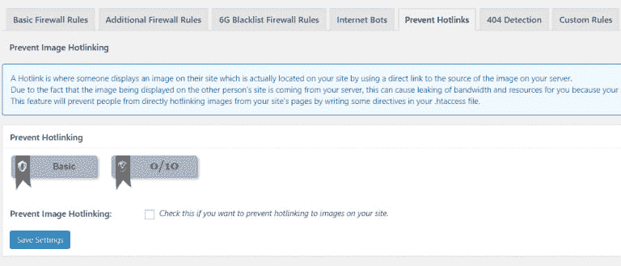](https://res.cloudinary.com/practicaldev/image/fetch/s--NXoiUzal--/c_limit%2Cf_auto%2Cfl_progressive%2Cq_auto%2Cw_880/https://img.bitofwp.com/wp-content/uploads/2019/03/Hotlinking-768x330.png)

“热链接”是指在一个网站上共享文件，而这些文件不在该网站的同一台服务器上。例如，有人在他们的网站上分享你网站上的一张照片——这增加了服务器的负载，如果经常这样做，会导致你的网站变慢。

一个简单的方法来防止热链接是通过使用所有在一个 WP 安全和防火墙有这个选项内置。尽管如此，最好还是通过。htaccess 文件或通过使用 CDN。

### 使用 SSL 加密数据

就像使用 SFTP 比使用 FTP 更安全一样，使用 SSL 证书更好，因为它可以加密你和你的访问者通过网站传输的数据。

想象一下在信中发送机密信息。如果有人截获了这封信，他们可以简单地阅读信息。但是，如果这些信息被转换成密码或代码，就需要像艾伦·图灵这样的人来搞清楚了。

简而言之，这就是 SSL 加密的作用。

[**让我们加密**](https://letsencrypt.org/) 提供免费的 SSL 证书。一些主机提供商有自动安装程序，而另一些则需要变通方法。

### 保护你的 WordPress 数据库

网站的所有数据和信息(你的页面、帖子、用户及其证书、评论、插件数据等等)都存储在 WordPress 数据库中。

#### 更改数据库前缀

[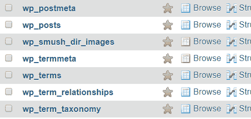](https://res.cloudinary.com/practicaldev/image/fetch/s--FYmsdWfW--/c_limit%2Cf_auto%2Cfl_progressive%2Cq_auto%2Cw_880/https://img.bitofwp.com/wp-content/uploads/2019/03/prefix.png)

安装 WordPress 时，数据库带有默认前缀‘WP _’。使用默认前缀会使您的数据库容易受到 SQL 注入攻击。建议改成‘mywp _’之类的。一些提供托管服务的主机会自动为你做这件事，并使前缀看起来像“wp_hjl12lka_”。

#### 为您的数据库设置强密码

[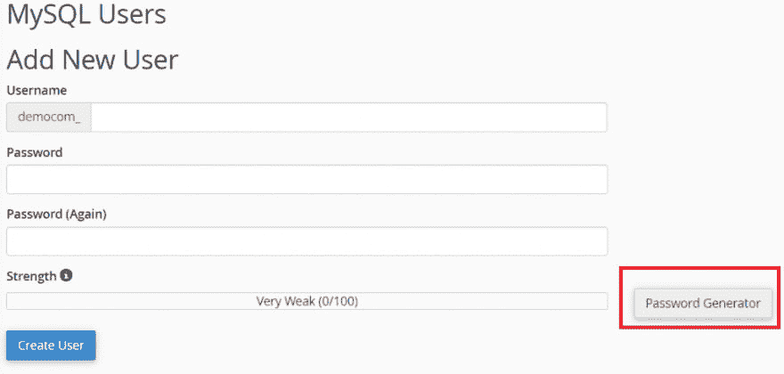](https://res.cloudinary.com/practicaldev/image/fetch/s--qh4yG6k5--/c_limit%2Cf_auto%2Cfl_progressive%2Cq_auto%2Cw_880/https://img.bitofwp.com/wp-content/uploads/2019/03/DBPassword-1024x489.png)

这和 WordPress 用户名和密码的逻辑是一样的——不要被预测。如果你使用 cPanel 的托管包，生成一个强密码是很容易的，因为 cPanel 提供了这个选项。

### 备份备份备份。

[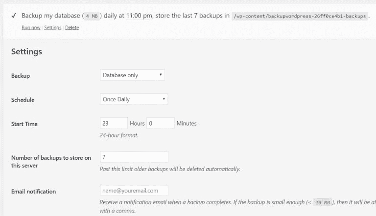](https://res.cloudinary.com/practicaldev/image/fetch/s--DzoyiO5g--/c_limit%2Cf_auto%2Cfl_progressive%2Cq_auto%2Cw_880/https://img.bitofwp.com/wp-content/uploads/2019/03/BackupWP-768x442.png)

万一一切都不顺利，你仍然希望能够恢复你的网站。

有一批备份插件名声很大: **[UpdraftPlus](https://wordpress.org/plugins/updraftplus/)** ， **[BackUpWordPress](https://wordpress.org/plugins/backupwordpress/)** ， **[WP 复印机](https://wordpress.org/plugins/duplicator/)** 不一而足。

这些插件还可以按计划自动备份，所以你不必每次都手动备份。我个人更喜欢 BackUpWordPress，因为它可以让你指定创建备份的确切时间。

为什么这很重要？根据站点的大小和流量，运行备份可能会消耗服务器资源。在这个过程中，托管在共享服务器上的网站速度大幅下降甚至崩溃的情况并不少见。指定一个时间，当你知道访问者的数量将会很低，这是一个很好的策略来避免这个问题。

另一种方法是从你的主机提供商或其他公司购买自动备份。这对大型网站特别有用，因为插件可能需要很长时间来创建备份，甚至可能无法完成备份。

请务必查看我们的 **[WordPress 维护服务](https://bitofwp.com/wordpress-maintenance-services/)** 。

## 3.更新你的主题、插件和核心

[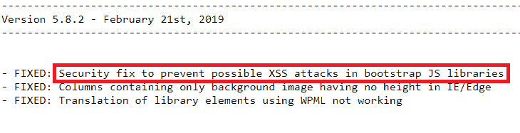](https://res.cloudinary.com/practicaldev/image/fetch/s--oTevkuaq--/c_limit%2Cf_auto%2Cfl_progressive%2Cq_auto%2Cw_880/https://img.bitofwp.com/wp-content/uploads/2019/03/Changelog.png)

这可能看起来微不足道，但事实是-过时的软件只是让黑客很容易进入您的网站。

每当一个新版本的插件、主题或 WordPress 核心发布时，一个更新日志也会随之发布。此变更日志可能包含已修复的安全漏洞的说明。这揭示了黑客可能利用的以前版本的弱点。

### 正在检查可用的更新

[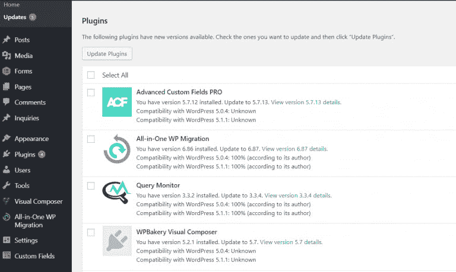](https://res.cloudinary.com/practicaldev/image/fetch/s--4nAbqOxj--/c_limit%2Cf_auto%2Cfl_progressive%2Cq_auto%2Cw_880/https://img.bitofwp.com/wp-content/uploads/2019/03/AvailableUpdates-768x459.png)

你可以通过进入“仪表板->更新”来检查 wp-admin 仪表板中的过期软件:

这一页将显示 WordPress/themes/plugins 是否有可用的更新。

### 小心废弃的插件

[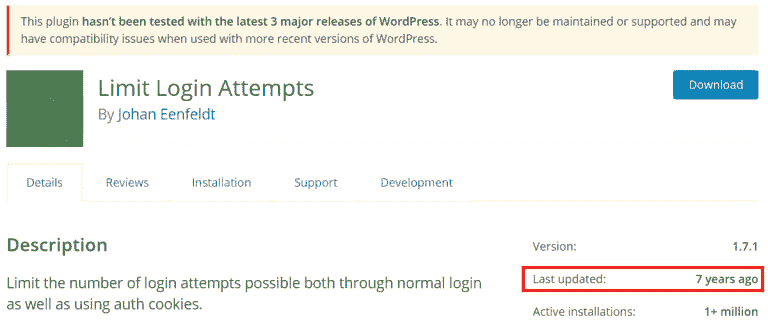](https://res.cloudinary.com/practicaldev/image/fetch/s--nYnH_HaD--/c_limit%2Cf_auto%2Cfl_progressive%2Cq_auto%2Cw_880/https://img.bitofwp.com/wp-content/uploads/2019/03/Abandoned-768x326.png)

想象一下，安装这个插件来防止暴力攻击，结果却发现你的网站被黑了，因为同一个插件有安全漏洞。一个很好的讽刺例子，你不觉得吗？

我见过网站所有者拒绝更换插件的例子，因为这基本上意味着他们必须在一定程度上重建网站。有些人没有时间，有些人没有知识，也不想花钱，但相信我，如果你的网站被黑，你最终将不得不花费你的时间和金钱。

### 使用定期更新的主题来构建您的网站

热门题材，尤其是优质题材，是一个安全的赌注。像 **[阿瓦达](https://themeforest.net/item/avada-responsive-multipurpose-theme/2833226)** ， **[迪维](https://www.elegantthemes.com/gallery/divi/)** ， **[店面](https://wordpress.org/themes/storefront/)** ， **[X 主题](https://themeforest.net/item/x-the-theme/5871901)** 等主题。在可预见的将来会定期更新。这意味着，无论何时出现安全问题，一个简单的更新就能修复它。这也意味着主题将与一直在发展的 WordPress 核心兼容。

### 自定义主题、插件和不回信的开发者

为一个站点创建一个自定义主题并不罕见。一些网站所有者希望有特定的布局或功能，并使用定制的主题。不幸的是，为您构建它的开发人员不在或者干脆不再回复您的电子邮件，这种情况也并不少见。

随着 WordPress 核心的改变，定制的主题或插件可能会停止兼容，并且肯定会成为你网站安全的一个漏洞。

无论您的网站是否属于这种情况，我们都将探索可能有助于保护您的网站的附加安全层。

## 4.对机器人、特定 IP 和国家/地区应用限制

#### 对机器人应用限制

总的来说，机器人可能相当令人讨厌。即使是合法的。如果你的网站上有很多帖子和页面，并且搜索引擎机器人开始每天对它们进行索引，你会看到你的网站性能显著下降。

有很多理由阻止某些机器人。还记得那个问题“为什么我的网站被黑了”？这并不是因为有人偶然发现了你的网站，四处打探，发现了一些弱点，并决定尝试一下。黑客不会通过浏览网页来手动实现这一点。他们使用实际上可以收集过时软件、WordPress 版本等信息的机器人来编制可能被黑客攻击的网站列表。

如果你有论坛插件，也有垃圾邮件创建账户，在页面上发表评论，甚至可以发布帖子。

#### Robot.txt 神话

一些人认为，在 robot.txt 文件中阻止一个机器人对所有机器人都有效。虽然你可以屏蔽掉访问你的网站比你想的更频繁的合法机器人，但坏机器人只会忽略 robots.txt。这就像希望小偷不会仅仅因为你写了“小偷，不要进来！”在你的门上。

这需要不同的方法，幸运的是有一些解决方案。

## 使用 StopBadBots

[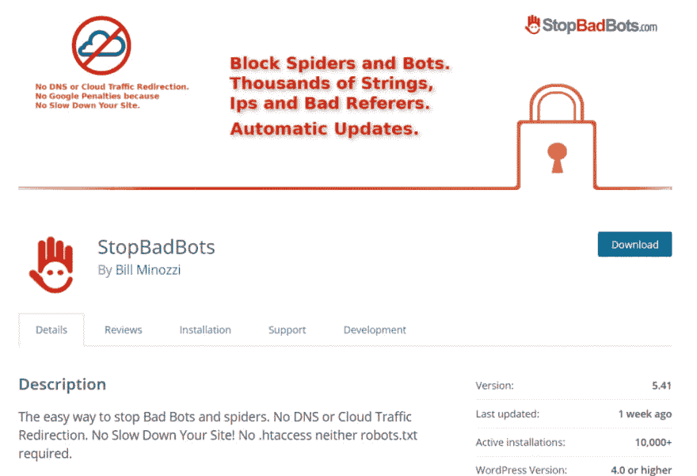](https://res.cloudinary.com/practicaldev/image/fetch/s--hQqzU3VD--/c_limit%2Cf_auto%2Cfl_progressive%2Cq_auto%2Cw_880/https://img.bitofwp.com/wp-content/uploads/2019/03/StopBadBots-1024x699.png)

虽然一些安全插件提供了阻止坏机器人的选项，但在这种情况下，我更喜欢一个专用插件。它有一个已知的坏机器人和可疑 IP 的数据库，定期更新，并有一个选项来通知您网站上的任何机器人活动。

[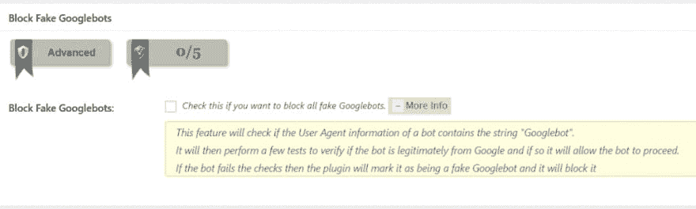](https://res.cloudinary.com/practicaldev/image/fetch/s---eY_GinX--/c_limit%2Cf_auto%2Cfl_progressive%2Cq_auto%2Cw_880/https://img.bitofwp.com/wp-content/uploads/2019/03/AIOWPStopBadBots-1024x307.png)

插件 **[All In One WP 安全](https://wordpress.org/plugins/all-in-one-wp-security-and-firewall/)** 有一个选项可以阻止假冒的谷歌机器人，但 **[StopBadBots](https://wordpress.org/plugins/stopbadbots/)** 覆盖的范围要大得多。

### 阻止来自某个国家的 IP

[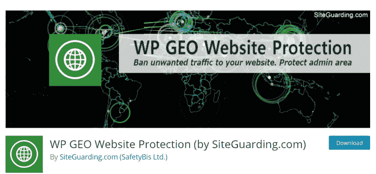](https://res.cloudinary.com/practicaldev/image/fetch/s--8Lt1RGA---/c_limit%2Cf_auto%2Cfl_progressive%2Cq_auto%2Cw_880/https://img.bitofwp.com/wp-content/uploads/2019/03/WP-GEO-768x357.png)

如果你是一家在美国某个城市经营的小型餐饮服务公司，你不会有太多来自俄罗斯或巴西的网站访问者。因此，除非你计划积极扩张，否则你可以将所有国家拒之门外，除了你开展业务的国家。

这个 **[Wordfence](https://wordpress.org/plugins/wordfence/)** 插件提供了许多其他有用的特性。还有， **[WP GEO 网站保护](https://wordpress.org/plugins/wp-geo-website-protection/)** 是个不错的选择。

## 5.监控您的网站

[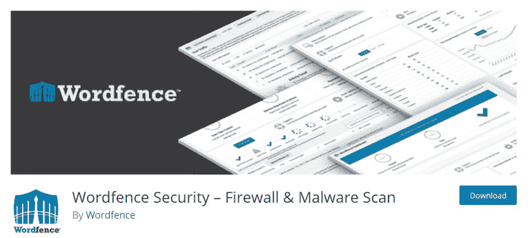](https://res.cloudinary.com/practicaldev/image/fetch/s--ar-WKWqD--/c_limit%2Cf_auto%2Cfl_progressive%2Cq_auto%2Cw_880/https://img.bitofwp.com/wp-content/uploads/2019/03/Wordfence-768x345.png)

监控站点上的更改和活动对于防止安全漏洞至关重要。应该跟踪任何文件更改、失败的登录尝试和对网站的更改，以避免在您的背后发生一些事情。

### 监控审计日志

[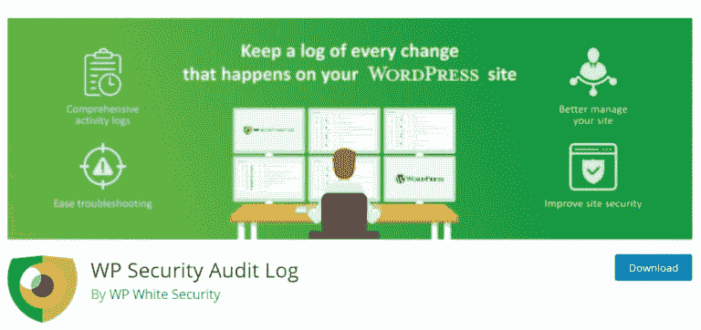](https://res.cloudinary.com/practicaldev/image/fetch/s--WSv2vjr8--/c_limit%2Cf_auto%2Cfl_progressive%2Cq_auto%2Cw_880/https://img.bitofwp.com/wp-content/uploads/2019/03/AuditLog-768x362.png)

当你使用 **[WP 安全审计日志](https://wordpress.org/plugins/wp-security-audit-log/)** 时，没有什么会被忽视。无论是有人更改了小工具，编辑了页面还是仅仅更改了发布帖子的日期，都会有痕迹，你会知道的。您将获得一个活动列表，以及电子邮件通知和报告。

也许你的某个投稿人记不住他的密码，或者是他的用户名遭到了暴力攻击。

[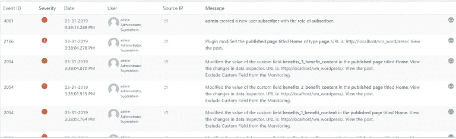](https://res.cloudinary.com/practicaldev/image/fetch/s--wDXHr5BL--/c_limit%2Cf_auto%2Cfl_progressive%2Cq_auto%2Cw_880/https://img.bitofwp.com/wp-content/uploads/2019/03/AuditLog2-768x235.png)

### 监控您的文件

[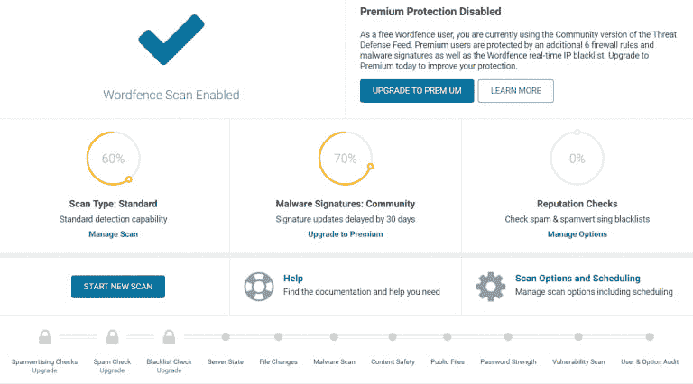](https://res.cloudinary.com/practicaldev/image/fetch/s--UaEJZkVz--/c_limit%2Cf_auto%2Cfl_progressive%2Cq_auto%2Cw_880/https://img.bitofwp.com/wp-content/uploads/2019/03/WordFence2-768x426.png)

WordPress 安装中有 1700 多个文件。如果你的网站因为改变或添加文件到 WordPress 核心而受到损害，可能很难注意到，你不这样认为吗？现代主题和插件也是如此。

这就是为什么有一个工具可以发现服务器上的文件变化，将它们与 WordPress 知识库中的原始文件进行比较，甚至用原始的原始版本覆盖已更改的文件。

这也是一个很好的策略，有一个安全公司的保费计划，特别是如果你已经有一个恶意软件的问题。有时，后门会被插件留下，导致再次感染。在这种情况下，像我们提供的这样的专门服务将是最有益的。

随时向 **[请求免费报](https://bitofwp.com/wordpress-malware-removal/#contact)** 。

### 扫描您的网站

[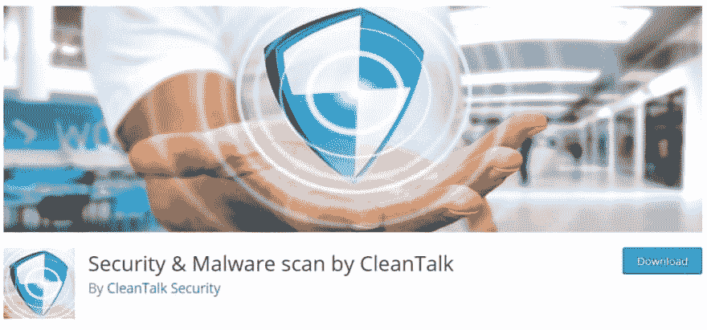](https://res.cloudinary.com/practicaldev/image/fetch/s--FMcND5ZQ--/c_limit%2Cf_auto%2Cfl_progressive%2Cq_auto%2Cw_880/https://img.bitofwp.com/wp-content/uploads/2019/03/CleanTalk-1024x478.png)

您实现了这些更改，但这并不意味着您应该暂时忘记安全性。你仍然应该定期浏览你的网站。如果最终证明该网站感染了恶意软件，您将能够通过 CleanTalk 的 **[安全&恶意软件扫描快速解决。](https://wordpress.org/plugins/security-malware-firewall/)**

如果恶意软件不断卷土重来，你可能需要专业服务机构的帮助。请查看我们的 **[月计划](https://bitofwp.com/wordpress-maintenance-services/)** ，其中包括:

*   备份
*   更新
*   垃圾邮件删除
*   页面速度优化等等。

***提示:*** 如果你正在寻找一个代码简洁、功能齐全的 WordPress 主题，这样你的网站就可以快速运行，那么，你可以看看 [Visualmodo WordPress 主题](https://visualmodo.com/wordpress-themes/)组合，它有各种需要的主题，有最新的更新和最佳的开发实践，可以保证你的网站安全。

## 最后的想法

由此得出的主要结论是要积极主动。显然，有很多东西要看，可能看起来很难，但绝对值得。你已经在你的 WordPress 网站上投入了大量的时间和金钱，你应该保护你的投资。与不得不清理乱七八糟的东西并可能把所有东西重新组装起来相比，额外的几个小时或几天的工作算什么？你猜对了。没什么。

BitofWP 的帖子[如何保护 WordPress 网站免受黑客攻击](https://bitofwp.com/security/protect-a-wordpress-site-hacked/)首先出现在 [WordPress 支持服务上。](https://bitofwp.com)