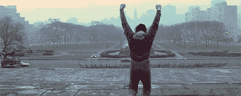

# 如何进行令人惊叹的科技演讲？黑客包括🛠

> 原文：<https://dev.to/andrewbrown/how-to-put-on-f-cking-stunning-tech-talk-hacks-included-1poc>

原谅标题中的语言。老实说，我很少说脏话，但我认为这值得引起你的注意，因为我希望你的演讲非常精彩。

这个月我有四次预定的演讲，在过去的六个月里，我做了大约 20 次。我想我会与你分享我的学习经验，以帮助你获得最好的技术演讲。

### 参加混合活动可让您的出席率翻倍(现场和实时)

每当我做一个演讲，我总是抛出一个缩放链接，让人们虚拟地参加。总体出席人数几乎总是翻倍，而且这似乎并不影响现场出席者。

### 事后给他们一个和你说话的理由

我总是在 Zoom 上录制我的现场讲话，不管质量如何，然后把它放到 Youtube 上，并要求主持人给与会者发一封后续电子邮件，他们可以在那里请求访问。因为问答环节，很多人想要活动的录音。

### 引肌为问&答

就像喜剧演员有讨价还价的人一样，科技演讲也是如此。房间里总会有一对夫妇问一些超出你们谈话范围的问题。如果你认识任何 SME(主题专家),带他们一起来帮你答疑解惑。

### 要坚定，没有 Q &一直到结束

我有一张幻灯片，上面写着把你的问题留到最后。即使考虑到这一点，仍然有人会忽略警告并提出问题。直接说不。

问答是其他演讲者之间的缓冲，所以如果主持人因为活动原因需要缩短问答时间，你可以给他们灵活性。此外，您还想让您的与会者“保持在最佳状态”

### 无谈——工作坊！

许多人都尝试过，但都失败了。在这些讲座中，你可以通过笔记本电脑进行现场练习。这种活动听起来很有吸引力，可以填满一个房间，但在 30 分钟到 1 小时的时间内完成一些事情是不可行的，只会损害你的信誉。

### 没有演示！

我最近做了一个演讲，因为第一个演讲者迟到了，所以我必须先发言。我很幸运事件发生了这样的变化，因为当演讲者到达第二个时间段时，他们的谈话进行了 5 分钟，整个虚拟房间都离开了，现场与会者都在打电话。发生了什么事？演讲者通过 AWS 控制台进行了现场演示，这让观众感到厌烦和困惑。如果你想做一个演示，录下字节大小的片段，假装你真的在做，但老实说，我建议远离演示。

### 可以的话先走

如果有一个以上的演讲者，你先说，因为你在我的最后一点中看到，如果继续你的演讲者不好，他们可以清理房间，你的听众就少了。

### 预先录制您的谈话

在我向听众发表演讲之前，我会从头到尾预先录制我的演讲，如果我说漏了或说错了，我会重新开始录制，直到我能在比实际时间限制少 10 分钟的时间内结束。起初，我们尝试了大约 12 次，现在是每次对话大约 2 次。活动结束后，我把预录的彩排放在了 youtube 上。

### 共享时被认证

当我在 Twitter、LinkedIn、DEV.to 和 Youtube 上发布我的演讲时，我不只是复制和粘贴，而是为每次发布付出额外的努力。我希望人们知道我为每个社区付出了努力。(来自 X 的转贴)可能会令人厌烦，因为它对社区来说不可信。

### 走得快，走得远

我的演讲可以是 20 分钟内 40 多张幻灯片。你有没有看过 Youtube 的视频，放在 2x 上？这就是我想让我的演讲包含大量信息的方式。没关系的原因是，我会在会后分享我的演讲，这样人们可以以他们的速度观看，这个想法是我放弃了很多价值。

### 为 Q 准备附加题& A

我会准备更多谈话要点的附录幻灯片，以防观众羞于提问。

我会用流行文化或我本周所做的作为 segway 的一种方式来让观众说话。

“有人看新的《权力的游戏》了吗？”我可以 segway“我正在用 AWS Lambda 建立一个 Twitter 机器人，回复任何提到外面有多冷的人#winteriscoming。”

"我有上等肋排出售。"我可以 segway，我正在使用 Amazon ReKognition 来识别杂货店传单中不同种类的肉类，并随着时间的推移插入价格，这样我就可以确定什么时候烧烤肉类有重大交易。"

### 做好准备

我有时会带上投影仪，以防我以前没有去过这个地方，我会带上多个适配器，还会带一台备用笔记本电脑。我还会将我的 Google Slides talk 导出为 PowerPoint 和 PDF 格式，并准备好与大家分享。

### 不要在你说话的时候推销

尝试创造价值，而不是做销售演示。我很少在开始时提到 ExamPro，有时我会在最后 30 秒提到要卖的东西。

我注意到人们在谈话的核心部分过多地谈论他们的产品，会在问答中被讨价还价。

### 与人交往

始终确认连接。获取他们的电子邮件、电话号码或 LinkedIn 邀请，并当场确认他们已经收到。

不要成为那种对学校太冷淡的失败者。“我不在 LinkedIn 上”或“我不用名片”。

我有亮橙色的超厚名片，价值 1 美元。为什么？(我想留下一个印象)[[https://www.youtube.com/watch?v=uoXaRORian4](https://www.youtube.com/watch?v=uoXaRORian4)。我的名片很少能让人们用它来记住我的联系方式。

我最近开始使用 LinkedIn，多年来我一直避开它，但现在它变得不同了，对建立联系很有帮助。如果你还没有加入，重新考虑并加入。

在一次活动后，我会将我的 LinkedIn 视频发布到群中预先录制的谈话中，然后梳理 meetup 群与会者以在 LinkedIn 上进行连接。

### 个人感谢你的主人

第二天，我亲自向主人致谢。

### 起初，预约会谈可能会很艰难

我花了八个月的时间才能够与 AWS 多伦多用户组交谈，我得到一个位置的唯一原因是我建议如果有人退出，我将代替他们，我事先准备了八个可能的谈话。然后有一天我收到了要填写的邮件。我有备而来，粉碎了它。在那次演讲结束时，另外两位与会的 meetups 主持人说我必须为他们做技术演讲。

更多更多建议？看看海伦和杰里米的帖子。

## 文章不再可用

 [## 建立一个💣炸弹挖掘技术演示(🎤麦克风下降可选)

### 1911 年 5 月 1 日微软 Azure 杰瑞米·利克内斯·⚡️阅读

#career #beginners #speaking #discuss](/azure/build-a-bomb-diggity-technical-presentation-mic-drop-optional-1fhb)