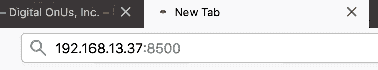
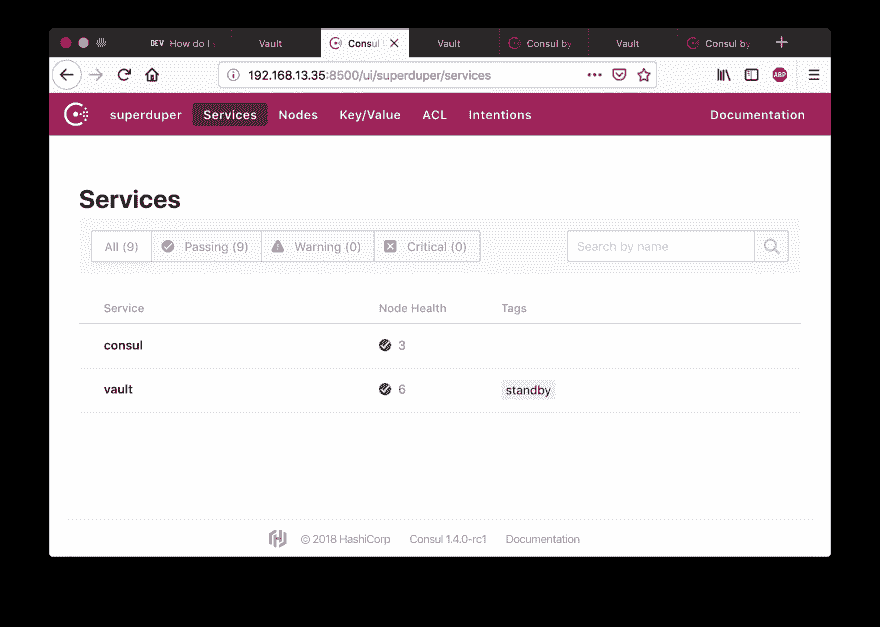
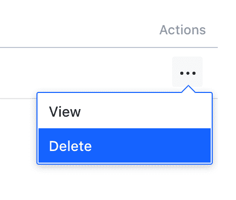

# 如何使用 Consul 将哈希公司的保险库“重置”回零状态

> 原文：<https://dev.to/v6/how-to-reset-a-hashicorp-vault-back-to-zero-state-using-consul-ae>

在紧急情况下，有两种不同的方法可以清除存储集群。

这假设您的 Vault 集群已经使用 Consul 作为其存储和 HA 后端。这种给予保险库失忆的过程也适用于具有其他存储后端的保险库集群，但是我只在 Consul 上测试了这一点。

无论如何，这里有一些你可能想这样做的场景:

1.  您希望清除 HashiCorp Vault 集群中的所有数据，而无需重新部署其基础架构。这对测试很有用。
2.  对于升级到 Enterprise 的用户，这种情况较少，但是如果您希望在将数据添加到复制集之前确保目标群集中没有数据，这种情况可能会很方便。

使用 Consul 重置 Vault 是一种简单的灾难恢复/备份方法。

值得一读，因为这种紧急恢复方法不在公开的文档中。至少，我还没找到。

你可以通过给执政官一点失忆来重置金库集群。只需删除领事的数据，瞧，保险库被重置，准备初始化。

## 金库集群重置方法一:通过删除领事“数据文件夹”的内容来删除领事的状态。

在您的 Consul 配置文件中，您应该可以找到如下所示的一行:

```
 "data_dir": "/opt/consul/data", 
```

Enter fullscreen mode Exit fullscreen mode

`"data_dir":`之后的部分是您想要删除其内容以“清除”给定 Consul 节点的文件夹。

示例(第 11 行):[https://github . com/V6/super-duper-vault-train/blob/develop/configure consul . sh # L11](https://github.com/v6/super-duper-vault-train/blob/develop/configureconsul.sh#L11)

当使用 Consul 的 CLI 时，Consul 配置文件中的这一行对应于`-data-dir`命令行标志。

[https://www.consul.io/docs/agent/options.html#_data_dir](https://www.consul.io/docs/agent/options.html#_data_dir)

如果您想要重置整个集群的存储状态，只需删除所有 Consul 节点上该文件夹的内容。在这之前，请确保关闭金库，然后关闭领事！

删除该文件夹的内容后，您可以启动 Consul，然后启动 Vault。

## Vault 集群重置方法 2:通过删除 Consul KV API 中的 Vault 目录来删除 Consul 的状态。

查看您的 Vault 配置文件(对于一个`backend`部分，它的默认位置是`/etc/vault/vault.hcl`。在那下面，如果你使用 Consul 作为后端，你应该看到一行定义了一个`path`。如果您想使用 Consul KV API 重置 Vault 的数据，这是 Consul KV 存储中要删除的路径。

```
 path    = "vault/" 
```

Enter fullscreen mode Exit fullscreen mode

例如:[https://github . com/V6/super-duper-vault-train/blob/develop/configure vault . sh # L6](https://github.com/v6/super-duper-vault-train/blob/develop/configurevault.sh#L6)

对于上述情况，我将运行以下命令来重置 Consul:

```
consul kv delete -recurse vault/ 
```

Enter fullscreen mode Exit fullscreen mode

如果您得到 403 错误，您可以尝试检查是否需要 Consul ACL 令牌。

```
Error deleting key vault/: Unexpected response code: 403 (rpc error making call: Permission denied) 
```

Enter fullscreen mode Exit fullscreen mode

下面是一个使用 ACL 令牌删除 Vault 集群上 KV 存储的`vault/`部分的示例:

```
[vagrant@instance5 vagrant]$ export CONSUL_HTTP_TOKEN=a4c878e5-a0eb-48ef-b6b4-00e18a146bf2; consul kv delete vault/ 
```

Enter fullscreen mode Exit fullscreen mode

成功！已删除的密钥:保险库/

关于 Vault 邮件列表的讨论，通过一个示例用例，您可以检查以下内容:[https://groups . Google . com/d/msg/Vault-tool/kRFNlZYiyxc/D5 sobtwhbgaj](https://groups.google.com/d/msg/vault-tool/kRFNlZYiyxc/d5sOBTwHBgAJ)

## 金库重置方法 3:通过删除领事 GUI 中的金库目录来删除领事的状态。

从技术上讲，这与方法 2 非常相似，但是对于我们这些不熟悉 Consul 的 CLI 和 API 的人来说，这值得一提。

首先，你需要找到领事桂。将领事的 IP 地址添加到浏览器的地址栏中，然后在后面加上`:8500`，如下例所示:

[](https://res.cloudinary.com/practicaldev/image/fetch/s--aJxTaH6B--/c_limit%2Cf_auto%2Cfl_progressive%2Cq_auto%2Cw_880/https://thepracticaldev.s3.amazonaws.com/i/ee1x6gl4d52iv05zs3if.png)

一旦您点击`Enter`转到 IP 地址和端口，您将看到咨询 web 界面:

[](https://res.cloudinary.com/practicaldev/image/fetch/s--pbZNixMm--/c_limit%2Cf_auto%2Cfl_progressive%2Cq_auto%2Cw_880/https://thepracticaldev.s3.amazonaws.com/i/155xmrmxjq2xhvewzeoh.png)

如果您随后导航到键/值页面，假设您在 Consul KV Store 中的默认路径被定义为`vault/`，您将看到如下内容:

[](https://res.cloudinary.com/practicaldev/image/fetch/s--HZs1SbRa--/c_limit%2Cf_auto%2Cfl_progressive%2Cq_auto%2Cw_880/https://thepracticaldev.s3.amazonaws.com/i/m8kyyevi3vlepsyfx073.png)

点击`Actions`下的`...`，选择`Delete`，删除该数据。

[](https://res.cloudinary.com/practicaldev/image/fetch/s--Bjv1Bg5o--/c_limit%2Cf_auto%2Cfl_progressive%2Cq_auto%2Cw_880/https://thepracticaldev.s3.amazonaws.com/i/g6mr37j8wd5xrt7gwy03.png)

以下是您可以使用本地集群完成的一些步骤的示例:

1.  创建一个集群
2.  初始化集群
3.  后备执政官(`consul snapshot save mysnapshot.dat`)
4.  关闭集群及其 Consul 后端
5.  删除 consul 的/opt/consul/data/raft 文件夹
6.  重启领事
7.  重新启动保险库
8.  通过再次检查 Vault 的 UI 初始化提示，检查 Vault 是否已被“擦除”
9.  从 Consul 快照恢复 Vault(Consul 快照恢复 mysnapshot.dat)

**文章链接**:【https://v.gd/NL3GLH T2】