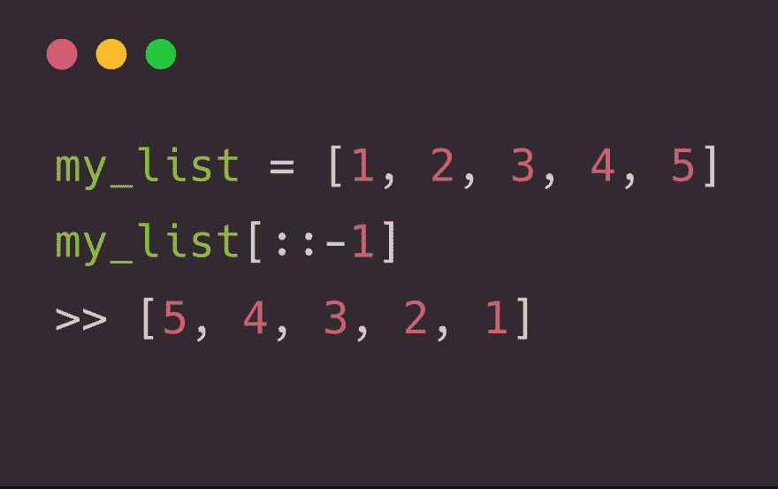

# 如何在 Python 中反转列表

> 原文：<https://dev.to/barrachri/how-to-reverse-a-list-in-python-1i97>

> Christian Barra@ Christian Barra如何用方括号符号反转列表 [#Python](https://twitter.com/hashtag/Python) ？[# euro python](https://twitter.com/hashtag/europython)2018 年 7 月 25 日上午 11:00[](https://twitter.com/intent/tweet?in_reply_to=1022074115476389888)[](https://twitter.com/intent/retweet?tweet_id=1022074115476389888)8[](https://twitter.com/intent/like?tweet_id=1022074115476389888)28

在 Python 中反转一个列表非常非常简单。

这不仅适用于`list`，也适用于[序列](https://docs.python.org/3/glossary.html#term-sequence)(例如字符串和元组)。

```
msg = "hello there"
print(msg[::-1])
# ereht olleh 
my_tuple = (1, 2, 3)
print(my_tuple[::-1])
# (3, 2, 1) 
```

这个魔法背后的秘密？[切片对象](https://docs.python.org/3/library/functions.html#slice)。

```
name = "christian"
print(name.__getitem__(slice(None, None, -1)))
# 'naitsirhc' 
```

虽然我很老，但我真的建议阅读一下 [Python 2.3 的新特性](https://docs.python.org/3/whatsnew/2.3.html?highlight=slice#extended-slices)，它引入了对内置类型的支持。