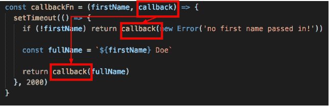
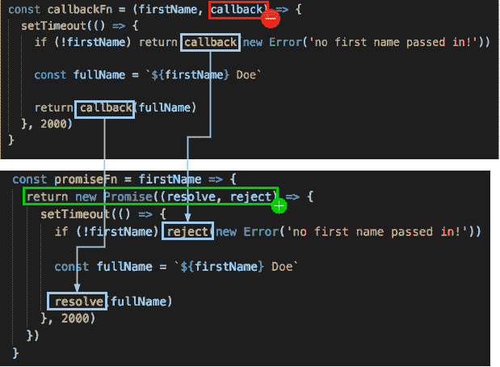
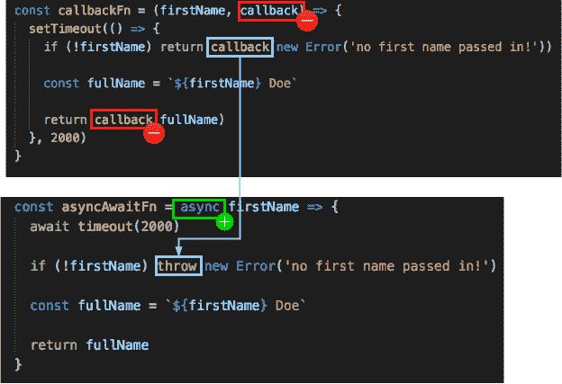

# 如何用 JavaScript 重写 Promise 形式和 async/await 形式的回调函数

> 原文：<https://dev.to/ccleary00/how-to-rewrite-a-callback-function-in-promise-form-and-asyncawait-form-in-javascript-410e>

***原载于 [coreycleary.me](https://www.coreycleary.me/how-to-rewrite-a-callback-function-in-promise-form-and-async-await-form-in-javascript/)** 。这是我的内容博客的交叉帖子。我每一两周发布一次新内容，如果你想直接在收件箱里收到我的文章，你可以[注册我的时事通讯](https://www.coreycleary.me/about/)！我也定期发送备忘单和其他赠品！*

> “你真的应该在这里使用 Promises 或 async/await，使其更具可读性”

有多少次，当你试图得到你的问题的答案时，你发布了一些代码片段，但有人最终缠着你不放？现在，除了您的代码已经存在的任何问题之外，您还需要学习和“修复”另一件事情...

或者，如何在工作中处理对现有的基于回调的代码库的重构？如何将它们转换成原生 JavaScript 承诺？能够使用现代 JavaScript 进行开发并开始利用`async/await`功能将是一件非常棒的事情...

如果你知道如何避免回调，你可以在寻求帮助时将代码发布到网上，而不会有人要求你重写代码，也不会真正回答你的问题。

如果你正在重构一个现有的代码库，代码将更具可读性，你可以避免“回调地狱”,即使在 2019 年，当 Promises 已经在许多浏览器和节点中支持多年，并且许多版本也支持`async/await`...

### 狐狸

让我们来看看如何将这些老派的回调转化为承诺和`async/await`版本。

[这里是代码的链接](https://github.com/coreyc/converting-callbacks)演示了回拨- >许诺和回拨- > `async/await`版本。

### 回调版本

```
const callbackFn = (firstName, callback) => {
  setTimeout(() => {
    if (!firstName) return callback(new Error('no first name passed in!'))

    const fullName = `${firstName} Doe`

    return callback(fullName)
  }, 2000)
}

callbackFn('John', console.log)
callbackFn(null, console.log) 
```

你会注意到这里我们使用了`setTimeout()`函数来使我们的函数异步。除了`setTimeout()`，您在现实世界中可能会看到的其他异步操作有:AJAX 和 HTTP 调用、数据库调用、文件系统调用(对于 Node，如果不存在同步版本)等。

在这个函数中，如果名字参数为空，我们就“拒绝”它。当我们传入`firstName`参数时，回调函数(几乎总是基于回调函数的参数列表中的最后一个参数)被调用，并在`setTimeout()`中设置的 2 秒后返回我们的值。
T3T5】

如果我们没有传入回调，就会得到一个`TypeError: callback is not a function`错误。

### 承诺版

这是这个函数基于承诺的版本:

```
const promiseFn = firstName => {
  return new Promise((resolve, reject) => {
    setTimeout(() => {
      if (!firstName) reject(new Error('no first name passed in!'))

      const fullName = `${firstName} Doe`  

      resolve(fullName)
    }, 2000)
  })
}

promiseFn('Jane').then(console.log)
promiseFn().catch(console.log) 
```

转换成基于承诺的函数实际上非常简单。请看下图的直观解释:
[](https://res.cloudinary.com/practicaldev/image/fetch/s--yl2rp2mh--/c_limit%2Cf_auto%2Cfl_progressive%2Cq_auto%2Cw_880/https://www.coreycleary.me/wp-content/uploads/2019/01/callback-to-promise-1.png) 
首先，我们去掉回调参数。然后我们添加代码，从基于承诺的函数返回一个`new Promise`。错误回调成为一个`reject`，而“快乐路径”回调成为一个`resolve`。

当我们调用`promiseFn`时，快乐路径的结果将显示在`.then()`中，而错误场景将显示在`.catch()`中。

让我们的函数以 Promise 的形式存在的好处是，如果我们不想的话，我们实际上不需要“让它成为异步/等待版本”。当我们调用/执行函数时，我们可以简单地使用`async/await`关键字，就像这样:

```
const result = (async () => {
  try {
    console.log(await promiseFn('Jim')) 
  } catch (e) {
    console.log(e)
  }

  try {
    console.log(await promiseFn()) 
  } catch (e) {
    console.log(e)
  }
})() 
```

*附注:这里我将函数调用包装在一个生命中——如果你从未见过的话，这就是`(async () => {....})()`的含义。这仅仅是因为我们需要将`await`调用包装在一个使用`async`关键字的函数中，并且我们还希望“立即调用”该函数(IIFE = "立即调用的函数执行")以便调用它。*

这里没有回调，没有`.then()`或`.catch()`，我们只是使用一个`try/catch`块来调用`promiseFn()`。拒绝承诺会被`catch`阻止。

*注意:`async/await`在大部分[半新版本的主流浏览器](https://caniuse.com/#feat=async-functions)中都有，除了 Internet Explorer。Node 从版本 7.6.0* 开始支持该特性

### 异步/等待版本

但是如果我们想将回调函数直接转换成该函数的`async/await`版本呢？不直接用承诺？

是围绕承诺的语法糖，所以它在幕后使用它们。你可以这样转换:

```
const timeout = ms => {
  return new Promise(resolve => setTimeout(resolve, ms))
}

const asyncAwaitFn = async firstName => {
  await timeout(2000) // using timeout like this makes it easier to demonstrate callback -> async/await conversion

  if (!firstName) throw new Error('no first name passed in!')

  const fullName = `${firstName} Doe`

  return fullName
}

const res = (async () => {
  try {
    console.log(await asyncAwaitFn('Jack')) 
  } catch (e) {
    console.log(e)
  }

  try {
    console.log(await asyncAwaitFn()) 
  } catch (e) {
    console.log(e)
  }
})() 
```

使用下图了解如何从回调到`async`:

[](https://res.cloudinary.com/practicaldev/image/fetch/s--CSbBs5fr--/c_limit%2Cf_auto%2Cfl_progressive%2Cq_auto%2Cw_880/https://www.coreycleary.me/wp-content/uploads/2019/01/callback-to-async-1.png) 
类似于转换为基于 Promise 的版本，我们去掉了传递给原始函数的回调，以及函数体内的那个参数调用。接下来，我们将`async`关键字添加到函数声明的开头。最后，当我们遇到错误场景时，我们抛出一个`Error`，这将导致一个被拒绝的承诺(当我们调用函数时被捕获在`catch`块中)，并简单地返回快乐路径场景中的`fullName`。

请注意，`async`函数都返回承诺，所以当您使用`return`时，您只是在解析承诺。

### 包扎

下次您需要将基于回调的函数转换为基于承诺的函数或基于`async/await`的版本时，使用本文中的可视化图表可以快速轻松地完成这项工作。如果你需要一些代码来帮助概念更加稳定，[这里是代码](https://github.com/coreyc/converting-callbacks)的链接，展示回调- >承诺和回调- > `async/await`版本。

回调地狱现在没有了！

我为未来计划了更多的内容，所以如果你觉得这很有帮助，并且想直接收到你的收件箱，而不必记得查看这里，[这里是时事通讯的链接！](https://www.coreycleary.me/about/)