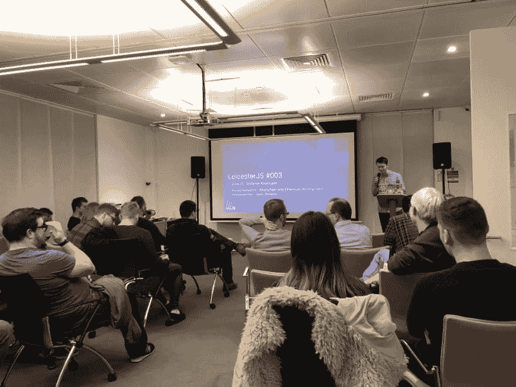
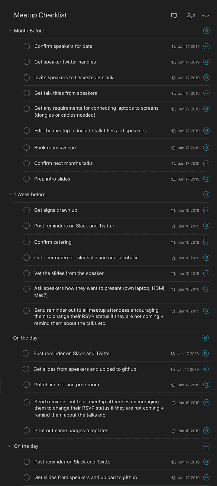

# 如何成功举办一次科技聚会——即使你很健忘

> 原文：<https://dev.to/joshghent/how-to-run-a-successful-tech-meetupeven-if-youre-forgetful-3d65>

<figure> 

<figcaption>一张图摘自 2018 年 11 月莱斯特队 meetup</figcaption>

</figure>

LeicesterJS 诞生于 Javascript 的兴起，现在它已经成为大多数开发者事实上的编程语言。此外，我们的目标是在莱斯特建立一个技术社区。

我管理莱斯特已经超过 4 个月了，这仅仅是个开始。在第一次聚会之前，我很紧张要把所有的东西都聚在一起，虽然它没有任何戏剧性的意外，但我学到了很多，并在每一次活动中继续这样做。以下是我希望在计划我的第一次聚会之前得到的一些建议。

### 从要领入手

meetup 的基本要求是场地和餐饮。对莱斯特来说，我能够与我目前的工作场所合作举办活动，并为提供的食物和饮料买单。作为交换，我们在每次活动开始时给他们一个广告，让他们接触潜在的雇员。通常聚会会以这种方式安排，因为它使组织活动变得容易得多，因为你，组织者，在会场准备好任何需要的东西。如果你想安排自己的聚会，那就一石二鸟，看看你的雇主是否愿意帮忙。

接下来是演讲者，为此，我求助于我团队中的开发人员，询问是否有人想发表演讲。你也可以在 twitter 上联系你在这个领域认识的其他开发者。最坏的情况下，你自己去说吧！

就这样，我们开了一个聚会！除了一件关键的事情…

### …。人

你希望你的聚会成功，而成功的一部分可以通过出席率来衡量。以下是我如何从头开始建立一个社区的方法

*   从同事那里获得支持——因为他们认识你，和陌生人呆在一起会更容易打破僵局
*   **通过 Twitter 与该地区的其他聚会联系起来**——我非常幸运地得到了 [PHP East Midlands](https://phpem.uk/) 的慷慨支持，他们取消了自己的聚会，加入了第一批莱斯特队(再次感谢伙计们！).有他们在身边真是太好了，又多了几张熟悉的面孔
*   **联系一个技术松弛小组**——[TechNottingham](https://www.technottingham.com/)有一个蓬勃发展的松弛社区，我在他们的#javascript 频道上宣传了这个聚会
*   **个人社交媒体**——除了使用品牌[“莱斯特”推特](https://twitter.com/leicesterjs?lang=en)账户。我还用我自己的 Twitter 和 LinkedIn 为这次聚会做了广告。此外，你也可以鼓励你的同事把话传出去
*   口碑——你会惊讶有多少人只是因为在 meetup.com[上看到它才来参加活动。从我收集的纯粹的轶事数据来看，似乎人们来这里主要是因为他们在 meetup 上看到了这个活动。](https://www.meetup.com/)
*   **回复邀请的事情** —在会议开始的前一天，如果人们不再打算参加会议，鼓励他们更新他们的回复邀请状态是很好的。很多时候，你在 meetup 上只能收到 60-70%的回复。确保你跟踪这个 KPI，鼓励“常客”参加你的聚会

<figure> 

<figcaption>在这里下载完整的东西:[https://gist . github . com/joshghent/2 bb 9 c 6 e 2 ce 616 e 29 AAAA 3c 7a 2895 CB 17d](https://gist.github.com/joshghent/2bb9c6e2ce616e29aaa3c7a2895cb17d)</figcaption>

</figure>

### 流程

第一次聚会后，很多人来找我要他们给我的演讲幻灯片。我甚至没有想过这个问题！有很多这样的事情，我必须确定一个流程。

*   **讲幻灯片** —从 NottsJS 那里偷了一个点子，我决定创建一个 Github 组织，把幻灯片放在一个回购中。这是最少摩擦的分发方式。我考虑过使用 Google drive 或者其他文件共享服务，但是这会给我一些困难的 URL，观众可能很难找到
*   **谈论想法**——在有许多人询问关于演讲的问题后，我再次求助于 GitHub。现在的流程是提交一个 talk idea 作为回购上的 Github 问题。我为这个问题准备了一套模板，所以不会遗漏任何我在最后一刻可能需要的信息
*   **聊天的地方** —尽管有大量的 slack 小组，但许多人要求建立一个 Slack 小组来讨论 meetup 和整个莱斯特的技术社区。这件事进展顺利。我用免费的 Heroku 盒子上的[slacking](https://github.com/rauchg/slackin)创建了一个网站，让人们可以获得即时邀请
*   第一次会议有一些非常基本的介绍幻灯片，但我已经逐渐充实了这些幻灯片，以确保每个人都有宾至如归的感觉。一些基本的事情，比如指出洗手间，告诉人们食物什么时候到，聚会什么时候结束，对人们来说都是非常有用的。另一个额外的建议是，我让和我在一起的人举手(因此，在办公室，我们在)，我告诉其他观众，如果他们需要任何帮助，他们也可以去找那些人

### 其他指针

完成以上步骤后，看起来好像没有什么要做的了——只需扩大 meetup，对吗？我也掉进了同样的陷阱。但是进一步的改进首先是引入了一个行为准则。在这份文件中，它概述了不仅演讲者，而且所有与会者应该如何表现，并为不这样做的人制定了明确的流程。拿一份已经写好的文件是值得的，因为十有八九你不是律师(但如果你是，那就去做吧！).此外，如果有人想要举报，最好有一个联系点(电子邮件地址和人名)。尽管你希望这样的事情永远不会发生，但仅在科技行业就有太多的案例突显出，对他人不宽容或任何形式的不良行为的问题不幸并不罕见——往往没有被报道，我希望这种情况永远不会在莱斯特发生。尽管如此，拥有。

此外，如果任何潜在的演讲者需要帮助准备演讲，你可以主动提供帮助。从一开始，我就鼓励第一次发言的人发表演讲。这可能是一次伤脑筋的经历，所以慷慨地提供幻灯片、话题等支持。meetup group slack 频道是做这件事的好地方。

我早期学到的一个教训是鼓励观众参与。这使得聚会更加活跃，也激励人们在会后进行讨论。也许建议你的演讲者展开讨论。询问是否有人使用正在讨论的技术，或者询问他们是否使用替代技术。

开始你自己的技术聚会是一个非常值得的追求，但是不要低估它的工作。同样值得注意的是，如果你像我一样在一个小城市，支持任何现有的聚会比创建自己的聚会更好。询问组织者你是否能以任何方式提供帮助，也许是安排新的演讲者或处理活动的推广，他们欢迎任何人伸出援手。

如果你在莱斯特地区，就来莱斯特吧——聚会在每月的第三个星期四举行！

* * *