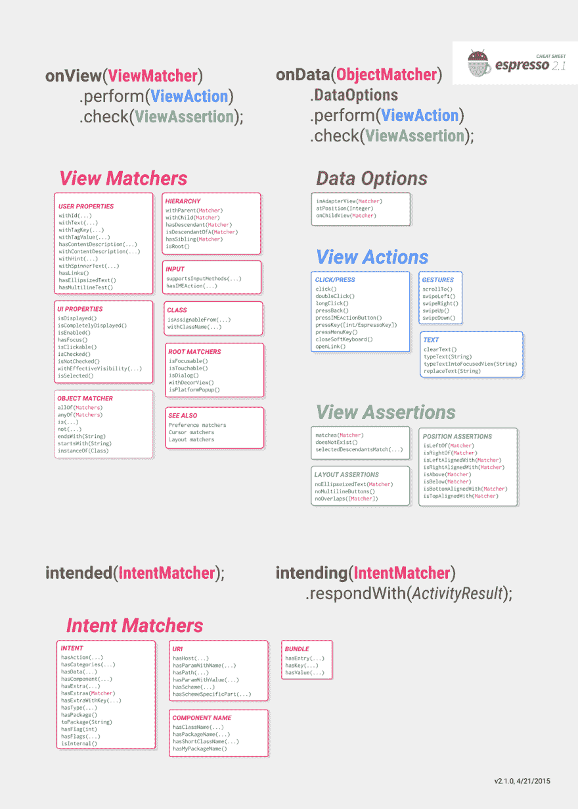
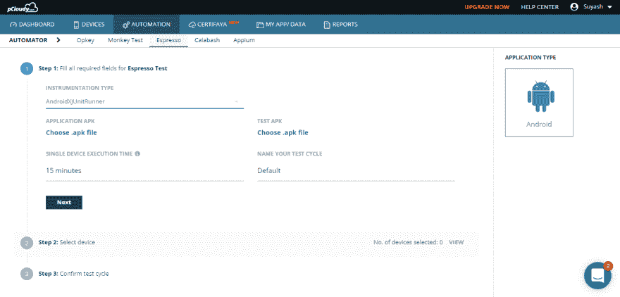
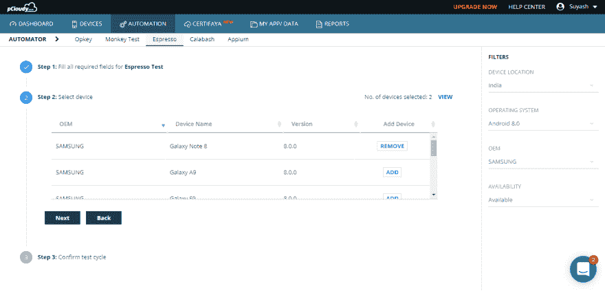
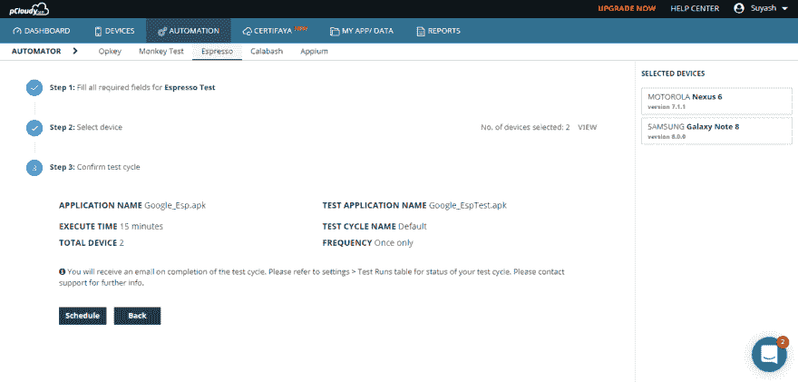
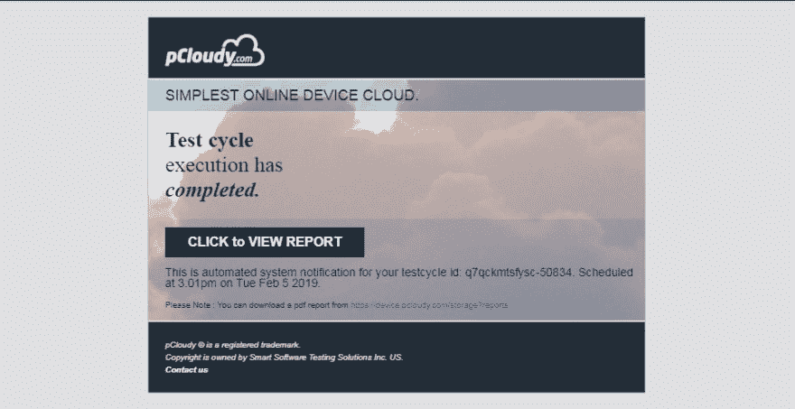
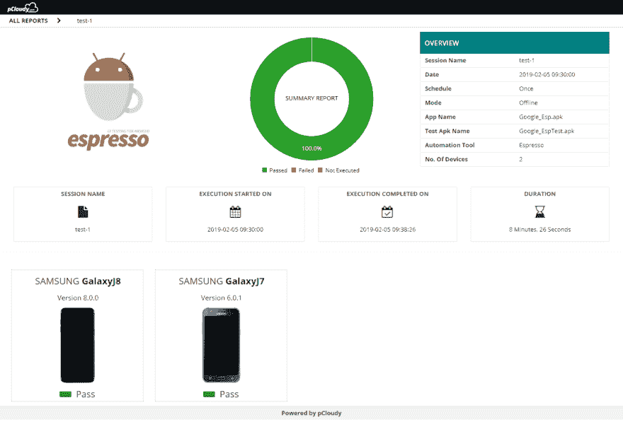
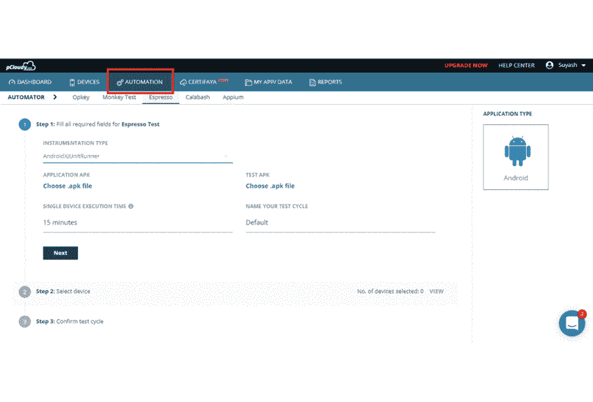

# 如何在远程设备上运行 Espresso 测试

> 原文：<https://dev.to/pcloudy/how-to-run-espresso-test-on-remote-devices-iob>

 
什么是 Expresso 框架？
Espresso 是一个用于编写 UI 测试用例的测试框架。它会用你的应用程序的 UI 自动测试你的动作。该框架还确保您的活动在测试运行之前启动。它可以用于跨多个应用程序进行测试。如果用于测试外部应用程序，您只能执行黑盒测试。因为您不能访问应用程序内部的类。

Espresso 有三个组件:
ViewMathers:允许在当前视图库中查找视图。
ViewActions:允许对视图执行操作
ViewAssertions:允许断言视图的状态

为什么是 Espresso
快速:快速运行测试用例非常重要，因为可能会有很多测试。UI 测试需要时间和成本，并且您可能无法运行所有的测试。

易于设置:本地机器上的设置过程很容易，Android 开发人员对他们每天使用的移动 SDK 语言感到很舒服。

它不那么古怪:自动化开发运维流程需要快速可靠的反馈。用本地工具编写的测试不那么容易出错。它给了应用程序更多的控制权:它是白盒测试， [Espresso](https://www.pcloudy.com) 在应用程序内部，它可以访问并知道如何使用实际运行应用程序的代码，以便对每个元素进行更彻底的测试。

您可以使用 Espresso 备忘单作为快速参考，因为它包含 Matcher、ViewAction 和 ViewAssertion 的大多数可用实例。

来源:[https://developer . Android . com/training/testing/espresso/cheat-sheet](https://developer.android.com/training/testing/espresso/cheat-sheet)

使用 pCloudy 在 Espresso 中运行测试脚本的步骤:
用你注册的电子邮件 ID &密码登录[https://device.pcloudy.com](https://device.pcloudy.com)。
要在 pCloudy 上安排“浓缩咖啡”，请遵循以下步骤-

转到“自动化”页面。
将自动化工具选择为“Espresso”。
根据您编写的测试脚本选择“工具类型”。

注意:pCloudy 为 Android 提供了对检测类型(InstrumentationTestRunner、AndroidJUnitRunner 和 AndroidXJUnitRunner)的支持。

选择您必须在“我的应用程序/数据”部分上传的应用程序 APK 和测试 APK。
选择单个设备执行时间，并为您的测试周期指定一个名称。
在下一步中，单击“添加”添加要测试的设备，然后单击“下一步”。
现在您可以通过点击“添加”按钮来选择设备。您还可以使用设备过滤器来简化设备搜索。选择设备后，单击下一步。

点击“时间表”开始测试。

转到您的电子邮件收件箱并打开 pCloudy Automation Alert mail。点击给定链接“点击查看报告”。

现在您已经得到了您计划的测试自动化的结果。

看一看这个 GIF 来理解运行测试周期所采取的行动的流程。

软件开发人员容易犯错误，因为应用程序开发是一个非常复杂的过程。这意味着应用程序将包含 bug。 [Espresso 帮助我们发现开发过程中可能出现的错误](https://www.pcloudy.com/espresso-for-ui-testing/)，确保客户的可靠性和对应用的满意度。