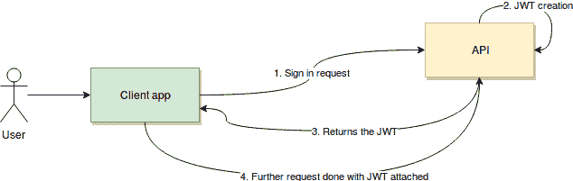

# 如何使用 JWT 保护 REST API

> 原文：<https://dev.to/bnevilleoneill/how-to-secure-a-rest-api-using-jwt-2die>

[](https://res.cloudinary.com/practicaldev/image/fetch/s--rc9HVxsX--/c_limit%2Cf_auto%2Cfl_progressive%2Cq_auto%2Cw_880/https://cdn-images-1.medium.com/max/916/1%2ABu2PZVJlN_EHyHLF696Now.png)

REST APIs 很棒，因为它们在逻辑上很简单，它们不在内存中保存复杂的状态，它们处理资源(而不是处理松散的、不相关的功能),使它们的整个业务逻辑紧密结合。我真的很喜欢它们，既然你正在读这篇文章，我想你也一样。

也就是说，由于 REST APIs 背后的性质和机制，保护它们并不总是简单的。用户提交凭据后会发生什么？您如何知道他们在后续请求中正确登录了呢？你不能在你的服务器端保持一个状态来表明这一点。那你是做什么的？

在本文中，我想与您分享一个非常强大而简单的方法:使用 JSON Web 令牌。

[](https://logrocket.com/signup/)

### 什么是 JWT

JSON Web Tokens 是一种开放和标准的( [RFC 7519](https://tools.ietf.org/html/rfc7519) )方式，让你在双方交互时安全地表示用户的身份。也就是说，当两个系统交换数据时，您可以使用 JSON Web 令牌来标识您的用户，而不必在每次请求时都发送私有凭证。

如果您将它应用到我们的 REST API 上下文中，您将会看到我们的客户端-服务器交互如何从这些机制中受益。

简单地说，JWT 是这样工作的:

[](https://res.cloudinary.com/practicaldev/image/fetch/s--c_KfP8Zc--/c_limit%2Cf_auto%2Cfl_progressive%2Cq_auto%2Cw_880/https://cdn-images-1.medium.com/max/634/0%2AiS5eKdJLJvLLDsKd)

1.  用户/客户端应用程序发送登录请求。换句话说，这里是您的用户名/密码(或您需要提供的任何其他类型的登录凭证)将要经过的地方
2.  一旦通过验证，API 将创建一个 JSON Web 令牌(稍后会详细介绍)并使用一个秘密密钥对其进行签名
3.  然后，API 会将该令牌返回给客户端应用程序
4.  最后，客户端应用程序将接收令牌，在自己的一端验证它以确保它是可信的，然后在每个后续请求中使用它来验证用户，而不必再发送他们的凭据

我知道这听起来太简单了，不可能是真的，不是吗？这怎么可能安全呢？让我进一步解释一下。

### 令牌的结构

API 返回的令牌本身(简单地说)是一个编码字符串。它由三个不同的部分组成，用点字符分隔开:

*header.payload.signature*

每一部分都包含了拼图的重要部分。一旦解码，前两个将是数据的 JSON 表示，包含相关信息，最后一个将用于验证令牌的真实性:

*   **报头**将包含与我们正在处理的令牌类型和用于生成令牌的算法相关的数据。这里需要指定几种兼容的算法，但最常见的是 HS256 和 RS256。这取决于你需要什么样的安全标准和措施。在这两个例子中，一个使用服务器和客户端都知道的秘密密钥，另一个使用服务器使用的私有密钥和客户端知道的公共密钥。
*   **有效载荷**将包含与请求和发出请求的用户相关的数据。有一组标准的键/值对被定义为 JWT 的一部分，您可以在实现中使用它们，例如:
*   **Iss**(issuer)——换句话说，一种识别发出请求的用户的方法
*   Sub(subject)-或者更确切地说，请求的主题，在我们的例子中，包含所使用的 URI 可能是有意义的
*   (观众)——它试图提供某种形式的令牌接收者的身份证明
*   **Exp** (到期日期)——令牌通常不会永久有效，这是为了确保使用它的人实际上提供了一个最近生成的令牌

作为标准的一部分，您还可以向 payload 对象添加其他属性，但以上是最常见的属性。当然，您可以使用它们，或者只定义您自己的，只要客户端和服务器在实现上达成一致。

*   **签名**只是一个编码字符串，服务器和客户端都使用它来验证有效载荷的真实性。

现在，让我试着把我们到目前为止讨论过的所有内容结合成一个例子。

### 使用令牌

让我们假设我们正在为我们公司的工资单 API 开发一个客户端。这个 API 的目的是向公司员工支付款项，检索他们的历史信息，最后编辑员工的信息。

此外(为了防止人为错误), API 的开发人员认为其中一些操作需要管理员权限。因此，我们将拥有普通访问权限的用户，他们只能查看信息，拥有超级访问权限的用户(管理员)还可以支付费用和编辑数据。

这是一个非常基本的例子，但它应该足以提供一个清晰的思路，说明我们为什么要在 JWT 做这些事情。

如上所述，任何与我们的安全 API 的交互都将从一个登录请求开始。它看起来会像这样:

`POST /api/users-sessions`

有效载荷:

```
{
“Username”: “fernando”
“Password”: “fernando123”
} 
```

Enter fullscreen mode Exit fullscreen mode

假设凭证有效，系统将返回一个新的 JSON Web 令牌。但是让我们来深入了解这个令牌的细节。

特别是，让我们考虑一下有效载荷中的信息。一些有趣的选项可能是:

*   **Iss**——包含登录用户的用户名。这特别有用，因为我们可能想在我们的 UI 中显示它
*   因为我们只允许这个新令牌在接下来的 8 小时内使用(这通常是用户每天应该使用的时间)
*   **Admin** -描述用户角色的布尔值。这对 UI 来说很方便，因为我们需要了解是显示还是隐藏一些 UI 元素

为了简单起见，我们将使用 HS256 算法对数据进行编码，这意味着我们将在客户端和 API 上使用相同的秘密。出于这个例子的目的，我们的秘密将是:

*一个秘密的 API 示例*

现在，让我们看看令牌的不同部分应该是什么样子:

***标题:***

```
{
“alg”: “HS256”,
“typ”: “JWT”
} 
```

Enter fullscreen mode Exit fullscreen mode

***有效载荷:***

```
{
“Iss”: “fernando”
“Exp”: 1550946689,
“Admin”: false
} 
```

Enter fullscreen mode Exit fullscreen mode

现在，为了创建实际的令牌，我们需要对上述项目进行编码，然后对结果值进行签名，以将最后一部分添加到令牌中。

所以我们有:

base 64(header)=**ewiywx nijoikhtmju 2 iiwkin5 CCI 6 icjkv 1 qicn 0k**

Base64(有效载荷)=**ewoisxnzijogimzlcm 5 hbmrviiwkikv 4 CCI 6 ide 1 NTA 5 nd y2 odkscijbzg 1 pbii 6 igzhbhhnlcn 0k**

HS256(Base64(头)+"。"+ Base64(payload)，"一个秘密的 API 示例")=**tsearzvbatdbu 8 F3 teirgsuokyaw 2 sbhcwb 0 qlkpdp 8**

API 返回的最后一个令牌是，您可能已经猜到了:

*ewiywx nijoikhtmj 2 iiwkin 5 icjkv 6 icjkv 1 qicn 0k . ewisxnzijoimzlcm 5 hbmrviiwkiv 4 CCI 6 ide 1 NTA 5 ndy 2 odkskizbzg 1 pbii 6 igzhbhnlcn 0k . tsearzbatdbus 8 F3 terguokyaw 2 sbhcwb 0 qlkpdp 8*

这就是有趣的地方——我将向您展示为什么它如此强大。

客户端应用程序在接收到该令牌后，可以通过获取报头和有效载荷部分并自行签名来解密和验证该令牌(这当然是可能的，因为客户端和服务器都知道秘密短语)。这样做可以确保没有人改变消息的内容，并且使用它是安全的。

同时，客户端应用程序发送的任何进一步的请求都将包含相同的令牌，服务器将通过每次重新签名并将结果与令牌的签名部分进行比较来验证该令牌。

例如，这可以防止有人干预消息的有效负载，将“admin”属性更改为“true ”,从而允许假冒的(甚至是有效的非 admin 用户)执行特权操作(比如向某个特定的雇员付款)。

这种操作会将有效负载内容修改为如下内容:

ewoisxnzijogimzlcm 5 hbmrviiwkikv 4 CCI 6 ide 1 NTA 5 nd y2 odkscijbzg 1 pbii 6 ihrydwukfqo =

导致客户端应用程序发送的最终令牌如下:

eyjhbgcioijuzi 1 NII SINR 5 CCI 6 ikpxvcj 9 . ewoisxnzijogimzlcm 5 hbmrviiwkikv 4 CCI 6 ide1 NTA 5 nd y2 odkscijbzg 1 pbii 6 ihrydwukfqo = . tsearzvbatdbu 8 F3 teirgsuokyaw 2s bhcwb 0 qlkpdp 8

这个令牌的签名必须是:

dornk 7 covjfoiffmvrq 2 wvxcgequcyjzuchaynayx 1 jw

这与作为消息的一部分发送的请求不匹配，因此证明请求已被篡改。

### 最后的想法

希望到现在为止，您已经能够掌握 JWT 安全性的基本知识，并且已经意识到保护您的 REST APIs 实际上并不困难。当然，我在本文中提到和展示的内容还有很多变化，但是您可以通过访问 [jwt.io](https://jwt.io/) 自行查看。在他们的网站上，您将能够生成和验证 JSON Web 令牌，以及到最常见编程语言的主要 JWT 库的链接。

从本质上来说，将 JWT 安全性添加到 API 中所需的一切都可以通过他们的网站轻松获得。

不过，作为最后的警告，我必须提到，虽然我在这里介绍的机制非常简单，每个人都可以使用，但是您应该明白，仅仅将 JWT 安全性添加到您的 API 中是不够的。你不会刀枪不入，如果你只是做到了以上几点，许多聪明的黑客会想办法绕过它。还有许多其他的漏洞可能(并将)伤害你，安全是关于覆盖你的所有战线，而不仅仅是实施一个通用的安全方案。与 JWT 紧密相连的另一层保护是通过 HTTPS 连接来确保所有网络流量的安全。换句话说，确保用户发送和接收的所有内容都通过端口 443(或者您可能使用的任何自定义号码)，而不是通过旧的、不安全的端口 80。

就是这样！如果你觉得我忘了提到这个话题的一个重要方面，或者如果你觉得它很有趣和有帮助，请随时联系并留下评论，我也很乐意听到你的意见。

直到下一个！

* * *

### Plug: [LogRocket](https://logrocket.com/signup/) ，一款适用于网络应用的 DVR

<figure>[](https://logrocket.com/signup/)

<figcaption></figcaption>

</figure>

LogRocket 是一个前端日志工具，可以让你回放问题，就像它们发生在你自己的浏览器中一样。LogRocket 不需要猜测错误发生的原因，也不需要向用户询问截图和日志转储，而是让您重放会话以快速了解哪里出错了。它可以与任何应用程序完美配合，不管是什么框架，并且有插件可以记录来自 Redux、Vuex 和@ngrx/store 的额外上下文。

除了记录 Redux 操作和状态，LogRocket 还记录控制台日志、JavaScript 错误、堆栈跟踪、带有头+正文的网络请求/响应、浏览器元数据和自定义日志。它还使用 DOM 来记录页面上的 HTML 和 CSS，甚至为最复杂的单页面应用程序重新创建像素级完美视频。

免费试用。

* * *

帖子[如何使用 JWT](https://blog.logrocket.com/how-to-secure-a-rest-api-using-jwt-7efd83e71432/) 保护 REST API 首先出现在[日志博客](https://blog.logrocket.com)上。