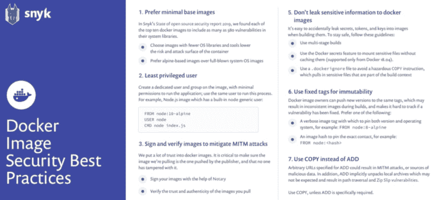

# 如何为 Node.js 安全地构建 Docker 映像

> 原文：<https://dev.to/lirantal/how-to-securely-build-docker-images-for-node-js-4d7o>

## 使用最低特权用户

当一个`Dockerfile`没有指定一个`USER`时，它默认使用根用户执行容器。实际上，很少有理由让容器拥有 root 权限。

Docker 默认使用 root 用户运行容器。当该名称空间被映射到正在运行的容器中的 root 用户时，这意味着该容器可能拥有 Docker 主机上的 root 访问权限。

让容器上的应用程序以根用户身份运行会进一步扩大攻击面，如果应用程序本身容易被利用，还会使权限提升变得容易。

为了最大限度地减少曝光，选择加入为应用程序在 Docker 映像中创建专用用户和专用组；使用`Dockerfile`中的`USER`指令来确保容器以尽可能低的特权访问运行应用程序。

特定用户可能不存在于映像中；使用`Dockerfile`中的说明创建该用户。

下面是一个完整的例子，展示了如何为一个通用的 Ubuntu 镜像做这件事:

```
FROM ubuntu
RUN mkdir /app
RUN groupadd -r lirantal && useradd -r -s /bin/false -g lirantal lirantal
RUN chown -R lirantal:lirantal /app
WORKDIR /app
COPY . /app
USER lirantal
CMD node index.js 
```

Enter fullscreen mode Exit fullscreen mode

上面的例子:

*   创建一个系统用户(-r)，没有密码，没有主目录集，也没有 shell
*   将我们创建的用户添加到我们之前创建的现有组中(使用 groupadd)
*   将最后一个参数集添加到我们要创建的用户名中，与我们创建的组相关联

如果你是 Node.js 和 alpine images 的粉丝，他们已经为你捆绑了一个名为`node`的通用用户。这里有一个 Node.js 示例，使用了通用的节点用户:

```
FROM node:10-alpine 
RUN mkdir /app
COPY . /app
RUN chown -R node:node /app
USER node
CMD [“node”, “index.js”] 
```

Enter fullscreen mode Exit fullscreen mode

如果您正在开发 Node.js 应用程序，您可能想要咨询官方的 [Docker 和 Node.js 最佳实践](https://github.com/nodejs/docker-node/blob/master/docs/BestPractices.md)。

这篇文章是你应该采纳的 10 个 Docker 图片安全最佳实践的一部分。感谢你的阅读，也感谢和我一起工作的[奥马尔·列维·赫弗罗尼](https://twitter.com/omerlh)。

最初的博客帖子包括一个高分辨率的可打印 PDF，就像你在下面看到的片段。[看看吧](https://snyk.io/blog/10-docker-image-security-best-practices/)

[](https://snyk.io/blog/10-docker-image-security-best-practices/)