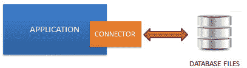
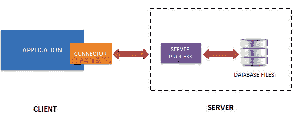
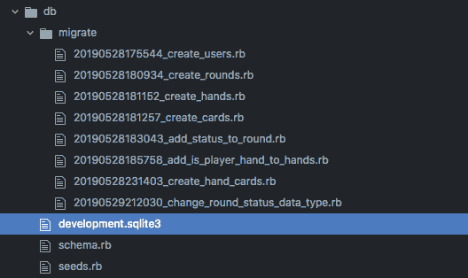

# 如何选择关系数据库管理系统

> 原文：<https://dev.to/milandhar/how-to-select-a-database-management-system-5006>

在我参加熨斗学校的网络开发课程的第六周结束时，我和我的伙伴终于完成了我们在 T2 的加勒比梭哈项目，并准备将其部署到 Heroku。然而，我们已经使用 SQLite 数据库而不是 PostgreSQL 开始了我们的项目，这最终导致了一个令人沮丧的(但不是不可克服的)问题。事实证明，Heroku 与 SQLite 不兼容。虽然我们最终能够将我们的 sqlite3 数据库迁移到 postgres 并部署到 Heroku，但我并不清楚为什么数据库迁移是必要的，甚至不清楚这两个数据库管理系统(DBMs)之间有什么区别。我认为随着我们继续开发更复杂的网站，这个主题将变得更加重要，这也是我想了解更多信息的原因！

[](https://i.giphy.com/media/aQCCNezRpb9Hq/giphy.gif)

# 数据库术语

虽然这看起来像是一个基本的主题——我注意到术语“数据库”和“数据库管理系统”可以互换使用，并且正确理解它们是很重要的。

**数据库**是一个有组织的数据集合，通常通过计算机系统以电子方式存储和访问。例如，上图中的文件“development.sqlite3”是一个数据库，它在表中存储了我们的扑克应用程序的有价值的信息，如用户、牌、手牌等。

**数据库管理系统** (DBMS)是一种软件，它与最终用户、应用程序和数据库本身进行交互，以捕获和分析数据(运行查询)。在我们的 poker 示例中，我们最初使用 SQLite DBMS，然后迁移到 PostgreSQL。

SQL 是一种特定于领域的语言，用于管理关系数据库管理系统中的数据。这是我们用来创建牌桌、存储、操作和读取扑克游戏数据的语言。

# 数据库管理系统的类型

另一个最初让我困惑的话题是为什么需要多个 DBMS。如果每个用例都有一个合适的，不是更好吗？也许吧，但事实证明，不同类型的项目最适合不同的 DBMS，这取决于它们的存储、速度和功能。

## SQLite

[](https://res.cloudinary.com/practicaldev/image/fetch/s--DpkE6wD8--/c_limit%2Cf_auto%2Cfl_progressive%2Cq_auto%2Cw_880/https://tableplus.io/asseimg/sqlite-vs-postgresql/sqlite-works.jpg) 
*嵌入式数据库*

根据其网站，SQLite 被描述为[“无服务器”](https://www.sqlite.org/serverless.html)，这与大多数 DMBS 的不同。通常，想要访问数据库的程序可以与服务器通信以发送请求和接收数据。SQLite 跳过中间服务器进程，要求程序直接从保存的数据库文件中读写。

### SQLite 的优势

*   无服务器 DBMS 避免了安装、设置、配置、初始化、管理和排除服务器进程故障的管理需求。这使得与应用程序的集成更加容易。
*   SQLite 允许多个应用程序同时访问同一个数据库(这在无服务器 DBMS 中很少见)。
*   不出所料，SQLite 的库非常轻量级。并且整个数据库存储在一个文件中，这使得它非常具有可移植性。

### SQLite 的缺点

*   无服务器使得在客户端应用程序中提供针对错误和损坏内存的保护变得更加困难。
*   尽管它可以同时托管多个应用程序，但一次只有一个进程可以对 SQLite 数据库进行更改。
*   SQLite 没有用户管理系统来给用户定义对数据库的访问权限。

### 何时使用 SQLite

*   嵌入式应用，如移动应用、游戏控制台、电视、飞机、无人机、手表和机器人(物联网)。
*   测试。包括一种内存模式，可以在没有实际数据库操作开销的情况下运行测试。
*   处理少量数据。SQLite [网站](https://www.sqlite.org/whentouse.html)建议任何接近 1TB 的数据库都应该放在一个集中式客户端-服务器数据库中。
*   一次只需要一个编写器。

## PostgreSQL

[](https://res.cloudinary.com/practicaldev/image/fetch/s--hUlW_c0z--/c_limit%2Cf_auto%2Cfl_progressive%2Cq_auto%2Cw_880/https://tableplus.io/asseimg/sqlite-vs-postgresql/postgresql-works.jpg) 
*客户机-服务器模式*

PostgreSQL 给自己贴上了“世界上最先进的开源关系数据库”的标签，它使用一种客户机-服务器模型，需要一个 DB 服务器来设置并在网络上运行，这与 SQLite 的无服务器模型相反。在客户端-服务器[架构](https://www.postgresql.org/docs/9.0/tutorial-arch.html)中，每个会话包括:

1.  服务器进程管理数据库文件，接受客户端应用程序到数据库的连接，并为客户端执行数据库操作。数据库服务器叫做`postgres`。
2.  执行数据库操作的用户客户端应用程序。这些客户端应用程序可以是任何东西，从 web 服务器到图形应用程序，再到特殊的数据库维护工具。

Postgres 服务器可以处理来自不同客户端的多个同时连接，这是一个巨大的优势。对于每个新的连接，服务器“分叉”一个新的服务器进程，然后客户端和新的服务器进程可以通信，而不需要原始`postgres`进程的干预。

### PostgreSQL 的优势

*   Postgres 非常符合 SQL 标准。
*   这是一个开源项目，由社区驱动。

### PostgreSQL 的缺点

*   因为它为每个新的客户端连接派生一个新的进程，所以它的内存性能很差(每个新进程分配大约 10MB 的内存)。
*   它不如 MySQL 等其他客户机-服务器 DBMS 流行，这意味着没有多少第三方工具来帮助管理 Postgres DB。

### 何时使用 PostgreSQL

*   需要将数据库与其他工具集成。Postgres 与许多其他编程语言和平台兼容。因此，如果您需要迁移数据库以适应不同的工具，Postgres 是一个很好的选择。
*   使用复杂的操作，如数据仓库和在线交易处理。
*   您的项目不需要最快的读取速度。
*   您对优化数据完整性感兴趣。

[](https://res.cloudinary.com/practicaldev/image/fetch/s--61ovmnM_--/c_limit%2Cf_auto%2Cfl_progressive%2Cq_auto%2Cw_880/https://i.imgur.com/mo7vuqY.png) 
*我们不可部署的 sqlite3 文件*

# 从 SQLite 迁移到 Postgres

根据上一节中详细介绍的因素，可以理解的是，像 Heroku 这样的基于云的平台需要像 Postgres 这样的客户端-服务器 DBMS 来维护数据一致性，而不是 SQLite 提供的磁盘备份存储。

因为 Rails 默认安装了 SQLite，并且我们在 Poker 项目中使用了 sqlite3 数据库，所以我们必须将 DB 迁移到 Postgres，以便部署到 Heroku。我们是这样做的:

1.  删除`Gemfile`中的以下行:
    `gem 'sqlite3'`
    ，替换为
    `gem 'pg'`。然后运行`bundle install`

2.  接下来，转换`config/database.yml`文件。更换显示为`adapter: sqlite3`到`adapter: postgresql`的适配器线。另外，将`database:`改为自定义线路。

3.  在更改了`Gemfile`和`config/database.yml`之后，您必须创建并迁移新的 Postgres 数据库:

    ```
    $ rake db:create
    $ rake db:migrate 
    ```

4.  最后，只需运行一个`git add .`和`git commit -m "postgres"`，就可以设置好 Postgres DB 了。此时，你可以[用 git](https://devcenter.heroku.com/articles/git) 将你的项目部署到 Heroku，如果这是你的最终目标。

# 结论

希望这篇文章能够详细介绍两种广泛使用的 DBMS(PostgreSQL 和 SQLite)之间的一些主要差异，并帮助您为下一个项目选择最佳的 DBMS。欢迎在下面添加任何问题或评论！

##### 除了内联链接，我在这篇文章中使用了以下参考:

[https://en.wikipedia.org/wiki/Database](https://en.wikipedia.org/wiki/Database)
T3】https://en.wikipedia.org/wiki/SQLT5[https://www . digital ocean . com/community/tutorials/SQLite-vs-MySQL-vs-PostgreSQL-a-comparison-of-relational-database-management-systems](https://www.digitalocean.com/community/tutorials/sqlite-vs-mysql-vs-postgresql-a-comparison-of-relational-database-management-systems)
[https://devcenter.heroku.com/articles/sqlite3](https://devcenter.heroku.com/articles/sqlite3)