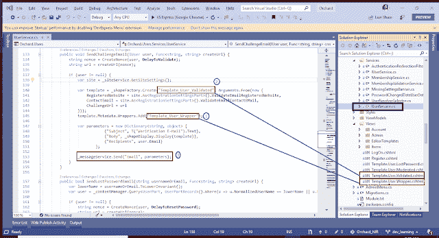

# 如何在果园 CMS 中发送电子邮件

> 原文：<https://dev.to/niranjankala/how-to-send-email-in-orchard-cms-7nf>

# 简介

在本文中，您将学习如何使用 Orchard CMS 的开箱即用服务发送电子邮件

# 在果园 CMS 中发送邮件的步骤

*   创建电子邮件包装模板
*   创建电子邮件模板
*   在控制器或定制服务中注入所需的果园服务
*   指定要使用和传递数据的电子邮件模板
*   使用 MessageService 发送电子邮件

为了演示这个场景，我们以发送一封质询电子邮件来验证用户电子邮件地址为例。在果园。用户模块中，您会发现使用 orchard 服务发送电子邮件的所有代码。

[](https://res.cloudinary.com/practicaldev/image/fetch/s--fFcqHFMj--/c_limit%2Cf_auto%2Cfl_progressive%2Cq_auto%2Cw_880/https://3.bp.blogspot.com/-w-ldBHiXoWs/XLkCg6gOu8I/AAAAAAAABtY/5n7iNSwrGmIuxVu0WYZB41tyOKx2QHVAwCLcBGAs/s640/OrchardCMS_Email_Template.png)

# 步骤 1 -创建电子邮件包装模板

它为创建 HTML 模板主体的 SmtpChannel 应用默认主体变更。创建新文件”模板。Views 文件夹下的 User.Wrapper.cshtml。

```
@* Override this template to alter the email messages sent by the Orchard.Users module *@
@Display.PlaceChildContent(Source: Model) 
```

# 步骤 2 -创建邮件模板

现在创建电子邮件的内容。它为创建 HTML 模板主体的 SmtpChannel 应用默认主体变更。创建新文件”模板。Views 文件夹下的 User.Validated.cshtml。这是同一个 razor 视图页面，我们可以在其中传递数据并放置在占位符上。例如模型。ContactEmail 是网站联系人的地址。

```
@T("Thank you for registering with {0}.<br /><br /><br /><b>Final Step</b><br />To verify that you own this e-mail address, please click the following link:<br /><a href=\"{1}\">{1}</a><br /><br /><b>Troubleshooting:</b><br />If clicking on the link above does not work, try the following:<br /><br />Select and copy the entire link.<br />Open a browser window and paste the link in the address bar.<br />Click <b>Go</b> or, on your keyboard, press <b>Enter</b> or <b>Return</b>.", Model.RegisteredWebsite, Model.ChallengeUrl)
@if (!String.IsNullOrWhiteSpace(Model.ContactEmail)) {
    @T("<br /><br />If you continue to have access problems or want to report other issues, please <a href=\"mailto:{0}\">Contact Us</a>.",Model.ContactEmail)
} 
```

# 步骤 3 -在控制器或定制服务中注入所需的果园服务

为了呈现电子邮件模板，我们需要使用一些 orchard 服务。在 Orchard CMS 中，每个视图对象都是一个形状，所以我们需要使用我们创建的模板视图来创建一个形状。我们需要注入 IShapeService 和 IShapeFactory 来创建电子邮件内容的形状。IMessageService 需要通过 SMTP 通道发送电子邮件。

```
namespace Orchard.Users.Services {
    public class UserService : IUserService {
        private readonly IMessageService _messageService;
        private readonly IShapeFactory _shapeFactory;
        private readonly IShapeDisplay _shapeDisplay;
        public UserService(
        IMessageService messageService, 
        IShapeFactory shapeFactory,
        IShapeDisplay shapeDisplay) {

            _messageService = messageService;
            _shapeFactory = shapeFactory;
            _shapeDisplay = shapeDisplay;
        }
        ... 
```

# 步骤 4 -指定要使用的电子邮件模板并传递数据

在这一步，我们指定电子邮件和包装模板来创建 HTML 内容的形状。在代码 ShapeFactory 的下面一行。Create 方法接受电子邮件模板的第一个参数，然后我们在模板元数据中添加电子邮件包装模板。与此同时，我们使用匿名对象传递模型数据。

```
var template = _shapeFactory.Create("Template_User_Validated", Arguments.From(new {
    RegisteredWebsite = site.As<RegistrationSettingsPart>().ValidateEmailRegisteredWebsite,
    ContactEmail = site.As<RegistrationSettingsPart>().ValidateEmailContactEMail,
    ChallengeUrl = url
}));
template.Metadata.Wrappers.Add("Template_User_Wrapper"); 
```

# 步骤 5 -使用 MessageService 发送电子邮件

现在指定邮件主题、正文和收件人。您也可以指定附件。只需将“Attachments”键和 List as 值添加到参数字典中。附件应该是电子邮件要附加的文件路径。

```
var parameters = new Dictionary<string, object> {
                    {"Subject", T("Verification E-Mail").Text},
                    {"Body", _shapeDisplay.Display(template)},
                    {"Recipients", user.Email}
                };

        _messageService.Send("Email", parameters); 
```

下面是发送挑战邮件的方法的完整代码:

```
public void SendChallengeEmail(IUser user, Func<string, string> createUrl) {
    string nonce = CreateNonce(user, DelayToValidate);
    string url = createUrl(nonce);

    if (user != null) {
        var site = _siteService.GetSiteSettings();

        var template = _shapeFactory.Create("Template_User_Validated", Arguments.From(new {
            RegisteredWebsite = site.As<RegistrationSettingsPart>().ValidateEmailRegisteredWebsite,
            ContactEmail = site.As<RegistrationSettingsPart>().ValidateEmailContactEMail,
            ChallengeUrl = url
        }));
        template.Metadata.Wrappers.Add("Template_User_Wrapper");

        var parameters = new Dictionary<string, object> {
                    {"Subject", T("Verification E-Mail").Text},
                    {"Body", _shapeDisplay.Display(template)},
                    {"Recipients", user.Email}
                };

        _messageService.Send("Email", parameters);
    }
} 
```

# 结论

我估计在果园 CMS 发个邮件就这么多了。