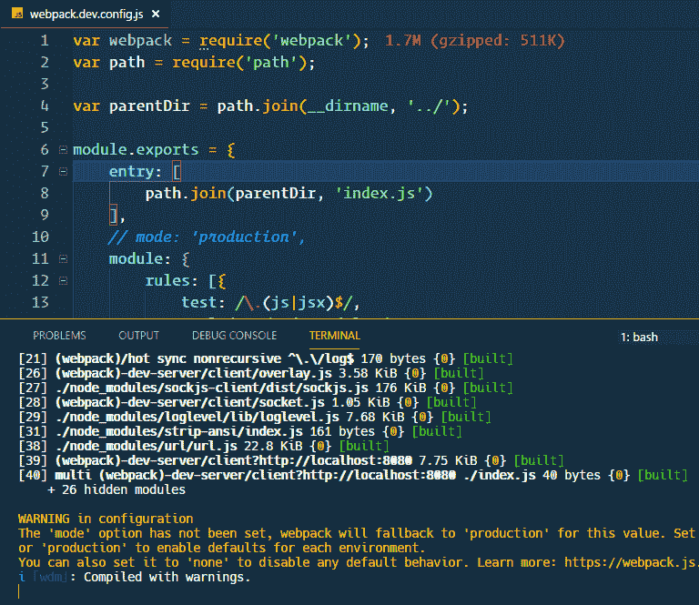
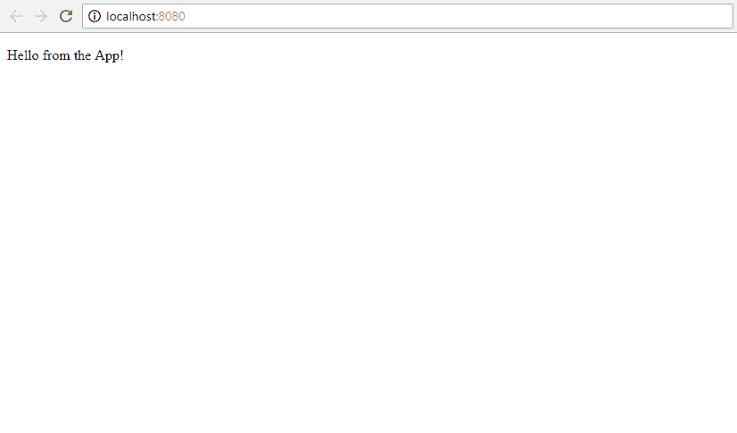
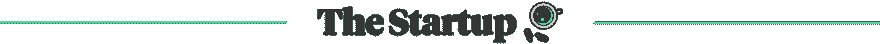

# 如何从头开始建立一个 React 项目

> 原文：<https://dev.to/kris/how-to-set-up-a-react-project-from-scratch-4ob>

[](https://res.cloudinary.com/practicaldev/image/fetch/s--caE0DmKm--/c_limit%2Cf_auto%2Cfl_progressive%2Cq_auto%2Cw_880/https://cdn-images-1.medium.com/max/1024/1%2Ady6J64BKcW0kHjWEuXgP7Q.png)

#### 特性反应历程

*   [学习纯 React——深入了解 React.js 基础知识的互动课程](https://www.educative.io/collection/5661736652767232/5629499534213120?affiliate_id=5312887308419072)

尽管 React 很受欢迎，但一开始设置应用程序是一项艰巨的任务。为了解决这个问题，脸书推出了 create-react-app，它隐藏了复杂的功能，并向最终用户展示了一个有效的应用程序。今天，花点时间了解一下 easy react 应用程序的复杂性吧！

自己设置可能听起来不太实际，在很多情况下你都不应该这样做。然而，理解里面的东西可能很重要。万一有一天你不喜欢 create-react-app 样板文件，那就创建你自己的样板文件，用它开始每个 react 项目。

**确保您已经安装了:**

1.  NodeJS
2.  npm
3.  末端的
4.  文本编辑器

**从头开始设置 react 库:**

我们将使用 webpack 和 babel 来设置 react，我不希望您感到困惑。

1.  Babel 是下一代 JavaScript **的编译器。**它将较新的 JavaScript (ES6/7/8)编译成较旧的 ES5 标准，以便在新旧浏览器上运行。
2.  Webpack 是一个模块捆绑器。我们将使用多目录和多文件方法来简化项目管理。Webpack 将我们所有的文件捆绑成一个，提供更好的性能和更容易的依赖管理。

设置围绕着这些工具，所以我们将得到详细的配置。

让我们开始，启动强大的终端！

```
mkdir react-from-scratchcd react-from-scratchnpm init -y 
```

这将创建一个目录 react-from-scratch 并初始化节点项目，y 标志用于跳过所有带有默认答案的问题。

现在我们有了保存项目的目录，让我们安装 react

npm 安装反应反应随机

[查看 raw](https://gist.github.com/therj/f3ac87beea665037683ebea1d6d40536/raw/43d78bbd9cd6c70c286fe1007846d78fd3628892/install-react.sh) [install-react.sh](https://gist.github.com/therj/f3ac87beea665037683ebea1d6d40536#file-install-react-sh) 托管与

由 [GitHub](https://github.com/)

这将安装 react 和 react-dom。

node_modules 文件夹将存储所有模块及其依赖项。

package.json 包含关于名称、依赖项和更多脚本的信息。

package-lock.json 用于依赖完整性，没有“在我的电脑上运行良好”。

### 什么是真实和反应？

react 是定义视图组件的库，React 组件。

react-dom 是创建视图的库。react-dom 相当于 Web DOM。它创建并显示网页。

这种分离使得 React 可以在多个平台上使用，只需改变 react-dom 的渲染库。iOS 和 Android 的 React 原生渲染。ReactVR 是针对 VR 设备的。

### 初始化 Webpack 开发服务器

我们现在有了创建和渲染 React 组件的方法。我们还没有将这些组件发送到浏览器来显示它们。这就是 web 服务器的用途。

npm 安装 webpack webpack-dev 服务器 web pack-CLI-save-dev

[查看原始数据](https://gist.github.com/therj/f3ac87beea665037683ebea1d6d40536/raw/43d78bbd9cd6c70c286fe1007846d78fd3628892/webpack-dev-server.sh)[web pack-dev-server . sh](https://gist.github.com/therj/f3ac87beea665037683ebea1d6d40536#file-webpack-dev-server-sh)与

由 [GitHub](https://github.com/)

- save-dev 标志将它们保存为开发依赖项。它们不会是部署在服务器上的最终版本的一部分，它们将用于开发过程。从终端运行项目需要 webpack-cli。

必须安装 webpack，因为 webpack-dev-server 依赖于它。这个开发服务器将实时重新加载我们的应用程序。

### 创建 React 应用

在根目录下，我命名为 react-from-scratch，创建一个新文件 index.html。这将是提供给浏览器的主文件。

```
<!DOCTYPE html>
<html lang="en">
<head>
    <meta charset="UTF-8">
    ReactJS Sample Project
</head>
<body>
<div id="root"></div>
<script type="text/javascript" src="bundle.js"></script>
</body>
</html> 
```

*   react 组件将放在 id 为 root 的 div 中。
*   脚本 bundle.js 将使用 webpack 创建，它将包含我们所有的 react 代码，包括 react 库和渲染器，格式正确。

创建一个 index.js 文件，代码如下

```
import React from 'react';
import {render} from 'react-dom';

render(
  React.createElement("div", null, "Hello World"),
  document.getElementById("root")
); 
```

React 应用程序必须导入 react。使用析构从 react-dom 导入 render 方法。

render 有两个参数:第一个是组件，第二个是位置。

做出反应。CreateElement 是一个顶级的 React API。它创造了元素，不包括 JSX。

因为没有 JSX 它不是很实用，我们以后会用 component 替换它。

```
import React from 'react'
import { render } from 'react-dom'
import App from './containers/App'

render(<App />, document.getElementById('root')) 
```

document.getElementById("root ")是我们在 index.html 的位置。

### 设置 Webpack 开发服务器

我们已经安装了 webpack，但是我们还没有使用它。

回到候机厅，

webpack-dev-server 将很好地编译我们的代码，并在 localhost:8080 上运行。/src。这是因为 webpack 在。/src/。您可以将 index.js 移动到 src，或者修改 package.json 文件，或者在 webpack 配置文件中设置条目文件。最后一个选项是最首选的，我们将使用相同的不动。

```
mkdir webpackcd webpacktouch webpack.dev.config.js 
```

使用文件 webpack.dev.config.js 创建目录 webpack。

在 webpack.dev.config.js 中设置入口点

```
var webpack = require('webpack');
var path = require('path');

module.exports = {
entry: [
path.join(\_\_dirname, '../index.js')
]
} 
```

它使用 webpack 作为依赖项，并将入口点设置为 index.js

我们需要加载模块，因此将 webpack.dev.config.js 修改为

```
var webpack = require('webpack');
var path = require('path');

var parentDir = path.join(\_\_dirname, '../');

module.exports = {
    entry: [
        path.join(parentDir, 'index.js')
    ],
    module: {
        rules: [{
            test: /\.(js|jsx)$/,
                exclude: /node\_modules/,
                loader: 'babel-loader'
            },{
                test: /\.less$/,
                loaders: ["style-loader", "css-loder", "less-loader"]
            }
        ]
    },
    output: {
        path: parentDir + '/dist',
        filename: 'bundle.js'
    },
    devServer: {
        contentBase: parentDir,
        historyApiFallback: true
    }
} 
```

它包含了一系列规则:

**入口点**

index.js 是所有脚本的起点。

**包裹**

*   加载 jsx 文件的加载器。
*   少加载器，用于加载更少的文件
*   less-loader 需要较少的对等依赖。

安装所有依赖项和对等依赖项:

npm 安装-保存-开发风格-加载器 CSS-少加载器-少加载器

**输出**

捆绑文件命名为 bundle.js，包含在 dist 目录中。

**开发服务器**

当前目录被用作基本目录。

### 设置通天塔

我们需要 babel 将 ES6 代码转换成 ES5。

安装 babel 和支持库

npm 安装-保存-开发巴别-cli 巴别-核心巴别-加载巴别-插件-转换-对象-休息-传播巴别-预置-es2015 巴别-预置-反应巴别-预置-阶段-0 巴别-注册

配置 react 应用程序以利用 package.json 中的 babel

```
"babel": {
  "presets": ["es2015", "react", "stage-0"],
  "plugins": ["transform-object-rest-spread"]
} 
```

它还使用一个插件来支持 rest/spread 操作符。

对 index.js 进行更改，使用 App 组件而不是手动创建元素。

这是我们的新指数

```
import React from 'react'
import { render } from 'react-dom'
import App from './containers/App'

render(<App />, document.getElementById('root')) 
```

创造。/containers/App.js 文件来服务 App

```
mkdir containerscd containerstouch App.js 
```

现在用一些基本的 React 代码填充 app . js

```
import React, {Component} from 'react';

class App extends Component {
    render () {
        return <p>Hello from the App!</p>
    }
}
export default App 
```

我们想要创建一个脚本来为我们运行 react 应用程序。

```
"scripts": {
  "test": "echo \"Error: no test specified\" && exit 1",
  "dev": "./node\_modules/.bin/webpack-dev-server --config ./webpack/webpack.dev.config.js"
} 
```

npm run dev 将使用来自的配置文件从节点模块运行 webpack-dev-server。/webpack/webpack.dev.config.js。

这是我得到的

npm 运行开发

[](https://res.cloudinary.com/practicaldev/image/fetch/s--_7OjROSn--/c_limit%2Cf_auto%2Cfl_progressive%2Cq_auto%2Cw_880/https://cdn-images-1.medium.com/max/768/0%2ARF1O6oEmxZ4YGZ8t)

如果收到警告，请在 webpack 配置文件中添加一个模式来移除它。

检查上面注释的代码模式:“生产”。其他模式有“开发”和“无”。

默认端口是 8080。

[](https://res.cloudinary.com/practicaldev/image/fetch/s--KrTQqZbN--/c_limit%2Cf_auto%2Cfl_progressive%2Cq_auto%2Cw_880/https://cdn-images-1.medium.com/max/826/0%2AbzeU0FQJD5vUcL8-)

根据您的选择调整配置，享受您的设置。

### 精选 React JS 课程

#### [React 16 —完全指南(含 React 路由器 4 & Redux)](http://thebestdevlist.link/react-the-complete-16-guide-incl-redux)

4.7/5 星 **||** 33.5 小时视频**| |**61597 名学生

学习反应或深入研究。学习理论，解决作业，在演示项目中实践，并构建一个在整个课程中不断改进的大型应用程序:汉堡生成器！ [**了解更多。**T3】](http://thebestdevlist.link/react-the-complete-16-guide-incl-redux)

[React 16 -完整指南(包括 React 路由器 4 & Redux)](http://thebestdevlist.link/react-the-complete-16-guide-incl-redux)

#### 期末备注:

如果这篇文章有帮助，请点击拍手👏按钮下面几下，以示支持！⬇⬇

[](https://medium.com/swlh)

#### 这个故事发表在[的《创业](https://medium.com/swlh)，传媒最大的创业刊物，拥有+405714 人关注。

#### 订阅接收[我们这里的头条](http://growthsupply.com/the-startup-newsletter/)。

[](https://medium.com/swlh)

* * *