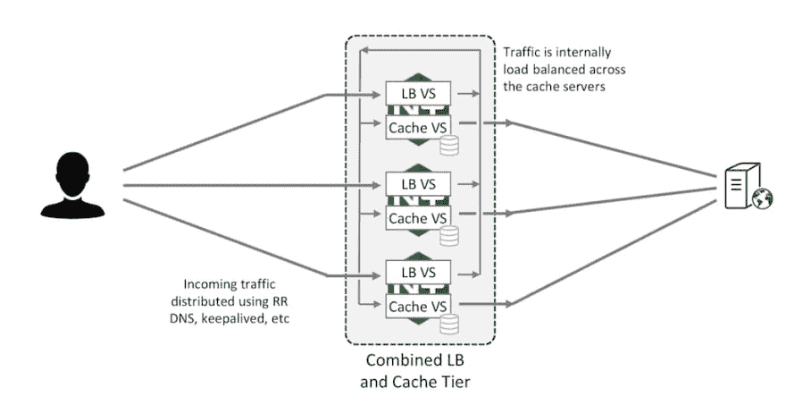

# 如何使用共享缓存设置 NGINX 反向代理集群

> 原文：<https://dev.to/satrobit/how-to-set-up-an-nginx-reverse-proxy-cluster-with-a-shared-cache-38eh>

### NGINX 是什么？

NGINX 是一个 Web 服务器/负载平衡器/反向代理，它使用事件驱动的模型来处理传入的请求，而不是那些昂贵的线程！

近年来 NGINX 的兴起使它成为许多需要性能和更多性能的人事实上的标准。

#### 什么问题？！

如果不熟悉的话，扩展边缘反向代理可能有点棘手。当您需要大量存储空间来缓存文件时，问题就出现了。纵向扩展硬件是有限制的，无论如何纵向扩展都不是一个好的解决方案。

您可能知道，NGINX 实例在使用共享存储时不能很好地协同工作(记住，还会有延迟等问题)。

因为这些是边缘服务器，所以我们不能选择使用一致哈希来将请求发送到准备好缓存的服务器。

#### 解

或者，我们可以设计一个 NGINX 乡亲们自己推荐的两级集群。看下图更好理解。

<figure> 

<figcaption>在两级 NGINX 集群中结合负载平衡器和缓存服务器</figcaption>

</figure>

在这个架构中，我们在每个服务器中有两个 NGINX 实例；一个充当简单的负载平衡器，另一个充当缓存服务器。因此，当客户端发送一个 HTTP 请求时，它首先会遇到一个负载平衡器(无论是哪一个)，然后负载平衡器会根据一个键(通常是 URI 和其他变量的混合)计算一个一致的哈希。负载平衡器每次都会使用创建的哈希将请求代理到单个缓存服务器，如果缓存未命中，缓存服务器会将请求代理到源服务器，如果命中，缓存服务器会从本地存储提供请求。

对于那些理解代码和配置文件胜过一大堆段落的人，我准备了这个由 3 个服务器组成的集群配置。

**示例配置:**